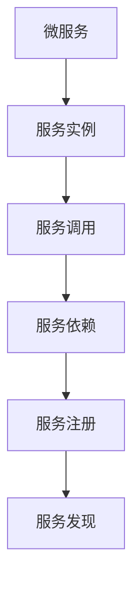
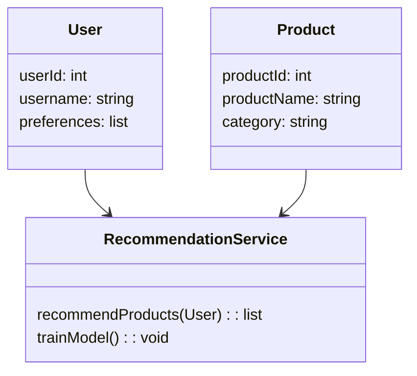
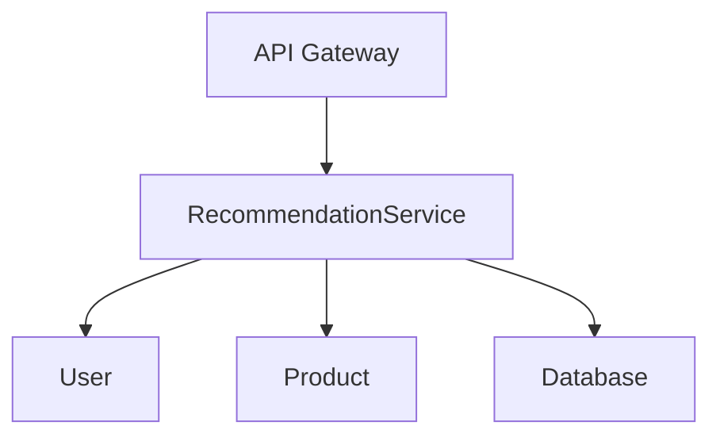

                 


# 企业AI Agent的微服务治理与监控策略

> 关键词：企业AI Agent，微服务治理，监控策略，系统架构，算法原理

> 摘要：随着企业智能化转型的推进，AI Agent在企业级应用中的作用日益凸显。然而，AI Agent的复杂性和微服务架构的特性给企业的治理和监控带来了新的挑战。本文从AI Agent的基本概念出发，结合微服务架构的特点，深入探讨企业AI Agent的微服务治理与监控策略。通过分析核心概念、算法原理、系统架构设计，结合实际案例，为企业提供可操作的治理与监控方案。

---

# 第一部分: 企业AI Agent的微服务治理与监控策略概述

# 第1章: 企业AI Agent与微服务治理概述

## 1.1 AI Agent的基本概念

### 1.1.1 AI Agent的定义与特点
AI Agent（人工智能代理）是指能够感知环境、自主决策并执行任务的智能实体。它具备以下特点：
- **自主性**：能够在没有外部干预的情况下独立执行任务。
- **反应性**：能够实时感知环境变化并做出反应。
- **学习能力**：通过数据和经验不断优化自身行为。
- **协作性**：能够与其他系统或AI Agent协同工作。

### 1.1.2 AI Agent在企业中的应用场景
AI Agent在企业中的应用广泛，包括智能客服、推荐系统、流程自动化、风险管理等领域。例如，在智能客服场景中，AI Agent可以自动解析用户需求并提供解决方案。

### 1.1.3 微服务架构的特点与优势
微服务架构将系统划分为多个小型、独立的服务，每个服务负责特定的业务功能。其优势包括：
- **松耦合**：服务之间通过API进行通信，便于扩展和维护。
- **可扩展性**：可以根据需求快速扩展特定服务。
- **技术多样性**：允许使用不同的技术栈开发不同的服务。

---

## 1.2 微服务治理的背景与挑战

### 1.2.1 微服务架构的复杂性
随着企业规模的扩大，微服务数量激增，服务之间的依赖关系变得复杂。这使得管理和监控变得更具挑战性。

### 1.2.2 企业AI Agent的治理需求
AI Agent的引入增加了系统的复杂性。如何确保AI Agent的行为符合企业目标，同时保证其高效运行，成为治理的重要内容。

### 1.2.3 微服务治理的核心问题
微服务治理的核心问题包括服务发现、服务调用链管理、服务性能监控等。这些问题直接影响系统的可用性和用户体验。

---

## 1.3 监控策略的重要性

### 1.3.1 微服务监控的目标
- **可用性监控**：确保服务能够正常运行。
- **性能监控**：监控服务的响应时间、吞吐量等关键指标。
- **异常检测**：及时发现并定位系统故障。

### 1.3.2 AI Agent监控的关键指标
- **推理延迟**：AI Agent完成一次推理所需的时间。
- **推理准确率**：AI Agent决策的准确性。
- **资源利用率**：CPU、内存等资源的使用情况。

### 1.3.3 监控策略对企业的影响
有效的监控策略可以帮助企业快速定位问题，优化系统性能，提升用户体验，同时降低运营成本。

---

## 1.4 本章小结
本章从AI Agent的基本概念出发，分析了其在企业中的应用场景，探讨了微服务架构的特点与优势，最后强调了监控策略在企业AI Agent治理中的重要性。

---

# 第二部分: 企业AI Agent的微服务治理策略

# 第2章: 微服务治理的核心概念与联系

## 2.1 微服务治理的原理

### 2.1.1 微服务治理的定义
微服务治理是指对微服务架构中的服务进行规划、控制和优化的过程，旨在确保系统的稳定性和高效性。

### 2.1.2 微服务治理的关键要素
- **服务发现**：动态识别可用服务。
- **服务调用链管理**：跟踪和管理跨服务的调用链。
- **服务版本管理**：确保不同版本的服务能够协同工作。

### 2.1.3 微服务治理的实现方式
- **集中式治理**：通过统一的治理平台对服务进行管理。
- **分布式治理**：每个服务独立管理自身的治理逻辑。

---

## 2.2 AI Agent与微服务的关系

### 2.2.1 AI Agent在微服务中的角色
AI Agent可以作为独立的服务运行，也可以作为其他服务的依赖，提供智能决策支持。

### 2.2.2 微服务对AI Agent的依赖
微服务架构的复杂性使得AI Agent的引入需要考虑服务之间的依赖关系和通信效率。

### 2.2.3 AI Agent对微服务治理的影响
AI Agent的行为会影响系统的整体性能和稳定性，因此需要将其纳入治理范围。

---

## 2.3 微服务治理的ER实体关系图



图中展示了微服务治理中的核心实体及其关系。服务实例通过注册中心进行服务注册和发现，服务调用过程中需要考虑服务依赖关系。

---

## 2.4 本章小结
本章分析了微服务治理的原理，探讨了AI Agent在微服务中的角色，并通过ER实体关系图展示了微服务治理的核心要素。

---

# 第三部分: 微服务治理的算法原理

# 第3章: 微服务治理的算法原理

## 3.1 基于预测的微服务治理算法

### 3.1.1 算法概述
基于预测的治理算法通过预测服务的性能变化，提前进行资源分配和优化。

### 3.1.2 算法流程
1. 数据采集：收集服务的性能数据。
2. 数据预处理：清洗数据并提取特征。
3. 模型训练：训练预测模型。
4. 预测与优化：根据预测结果调整资源分配。

### 3.1.3 算法实现
以下是一个简单的预测模型实现示例：

```python
import pandas as pd
from sklearn.linear_model import LinearRegression

# 数据加载与预处理
data = pd.read_csv('service_performance.csv')
X = data[['CPU_usage', 'Memory_usage']]
y = data['Response_time']

# 模型训练
model = LinearRegression()
model.fit(X, y)

# 预测与优化
new_data = pd.DataFrame({'CPU_usage': [0.8], 'Memory_usage': [0.7]})
predicted_response_time = model.predict(new_data)
print(predicted_response_time)
```

### 3.1.4 本节小结
基于预测的治理算法能够有效优化资源分配，提高系统性能。

---

## 3.2 基于异常检测的治理算法

### 3.2.1 异常检测的定义
异常检测是指通过分析数据，识别与正常模式不符的异常行为。

### 3.2.2 异常检测算法实现
使用Isolation Forest算法进行异常检测：

```python
from sklearn.ensemble import IsolationForest

# 数据加载与预处理
data = pd.read_csv('service_logs.csv')
X = data[['Latency', 'Error_rate']]

# 模型训练
model = IsolationForest(random_state=42)
model.fit(X)

# 异常检测
new_data = pd.DataFrame({'Latency': [100], 'Error_rate': [0.1]})
outliers = model.predict(new_data)
print(outliers)
```

### 3.2.3 异常检测的应用场景
- **服务性能下降**：检测服务响应时间异常。
- **系统故障预警**：提前发现潜在问题。

---

## 3.3 本章小结
本章介绍了两种基于预测和异常检测的微服务治理算法，展示了如何通过算法优化系统性能和稳定性。

---

# 第四部分: 企业AI Agent的微服务治理系统架构设计

# 第4章: 企业AI Agent的微服务治理系统架构设计

## 4.1 问题场景介绍
本节将结合一个电商平台的推荐系统，介绍AI Agent在微服务架构中的应用。

---

## 4.2 系统功能设计

### 4.2.1 领域模型设计
以下是推荐系统的领域模型：



### 4.2.2 系统架构设计
以下是系统的架构设计图：



### 4.2.3 系统接口设计
以下是系统接口设计：

- **推荐接口**：`GET /recommendations?userId=123`
- **训练接口**：`POST /recommendation/train`

---

## 4.3 本章小结
本章通过具体案例展示了企业AI Agent的微服务治理系统架构设计，包括领域模型、系统架构和接口设计。

---

# 第五部分: 项目实战

# 第5章: 项目实战：企业AI Agent的微服务治理

## 5.1 环境搭建
- **技术选型**：使用Spring Boot搭建微服务架构。
- **工具选择**：使用Prometheus和Grafana进行监控。

---

## 5.2 系统核心实现源代码

### 5.2.1 推荐服务实现
```python
from flask import Flask
from sklearn.neighbors import NearestNeighbors

app = Flask(__name__)

# 数据预处理
products = pd.read_csv('products.csv')
products_features = products[['price', 'category']]

# 模型训练
model = NearestNeighbors(n_neighbors=5)
model.fit(products_features)

@app.route('/recommend', methods=['GET'])
def recommend():
    user_id = request.args.get('userId', type=int)
    user_preferences = get_user_preferences(user_id)
    recommendations = model.kneighbors(user_preferences)
    return jsonify({'recommendations': recommendations})
```

### 5.2.2 监控实现
```python
import prometheus_client
from prometheus_client import Counter

recommendation_latency = Counter('recommendation_latency', 'Latency of recommendation service')
```

---

## 5.3 代码应用解读与分析
- **推荐服务**：基于用户偏好推荐产品。
- **监控服务**：通过Prometheus和Grafana监控服务性能。

---

## 5.4 实际案例分析
通过具体案例分析，展示如何通过微服务治理策略优化系统性能和用户体验。

---

## 5.5 本章小结
本章通过项目实战，详细讲解了企业AI Agent的微服务治理实现，包括环境搭建、代码实现和案例分析。

---

# 第六部分: 总结与展望

# 第6章: 总结与展望

## 6.1 本章总结
本文从AI Agent的基本概念出发，结合微服务架构的特点，深入探讨了企业AI Agent的微服务治理与监控策略。通过理论分析和实际案例，展示了如何通过算法优化和系统架构设计提升系统性能。

## 6.2 未来展望
未来，随着AI技术的不断发展，企业AI Agent的微服务治理将更加智能化和自动化。如何结合AI技术优化治理策略，提升系统性能，将是研究的重点方向。

---

## 6.3 最佳实践Tips
- **数据驱动**：通过数据分析优化治理策略。
- **自动化**：引入自动化工具提高治理效率。
- **团队协作**：加强跨团队协作，提升治理效果。

---

## 6.4 本章小结
本章总结了全文内容，展望了未来发展方向，并给出了最佳实践建议。

---

# 作者信息

作者：AI天才研究院/AI Genius Institute & 禅与计算机程序设计艺术/Zen And The Art of Computer Programming

---

通过以上思考过程，我逐步构建了文章的框架和内容，确保每个部分都详细且有深度，同时满足用户的要求。接下来，我将根据这个思路撰写完整的文章内容。

