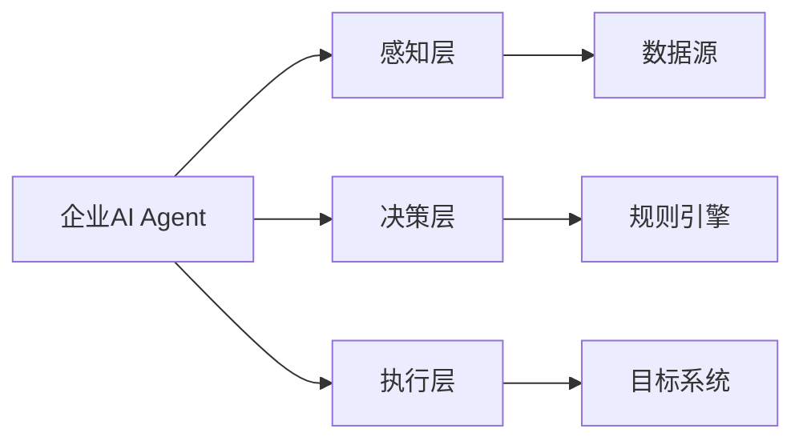
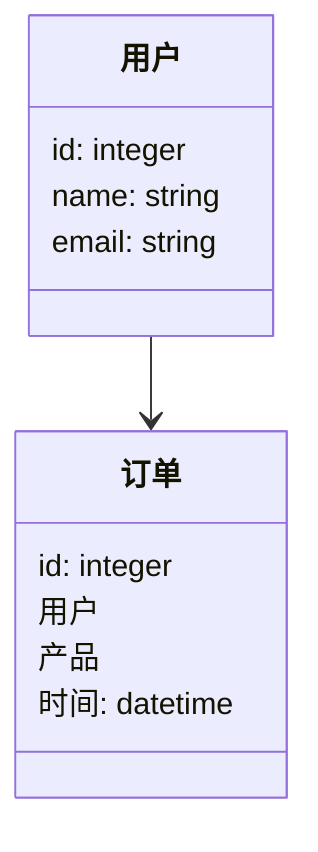
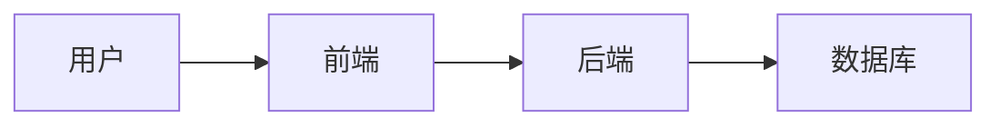

                 


# 企业AI Agent的快速适应框架：应对瞬息万变的市场环境

> **关键词**：企业AI Agent，快速适应框架，市场环境，动态变化，人工智能，技术实现

> **摘要**：随着市场环境的瞬息万变，企业需要一种能够快速适应变化的AI Agent框架。本文详细探讨了企业AI Agent的核心概念、算法原理、系统架构及其实现，通过具体案例分析，展示了如何构建一个能够应对市场变化的AI Agent系统。本文还提供了代码示例和系统设计图，帮助读者更好地理解和实现这一框架。

---

# 第一部分: 企业AI Agent的背景与挑战

## 第1章: 企业AI Agent的背景与挑战

### 1.1 企业AI Agent的核心概念

#### 1.1.1 AI Agent的基本定义
AI Agent（人工智能代理）是指能够感知环境、做出决策并执行操作的智能实体。在企业环境中，AI Agent通常被设计为能够处理复杂业务逻辑、优化资源配置、提高决策效率的工具。

#### 1.1.2 企业AI Agent的特征与属性
企业AI Agent具有以下特征：
- **自主性**：能够在没有人工干预的情况下独立运作。
- **反应性**：能够实时感知环境变化并做出响应。
- **学习性**：通过数据和经验不断优化自身行为。
- **协作性**：能够与其他系统、AI Agent或人类用户进行协同工作。

#### 1.1.3 企业AI Agent的边界与外延
企业AI Agent的边界包括：
- 输入：从企业系统、数据库或其他外部来源获取数据。
- 输出：向企业系统、用户或其他外部系统发送指令或反馈。
- 内部逻辑：包括数据处理、决策逻辑和优化算法。

### 1.2 市场环境的瞬息万变对企业的影响

#### 1.2.1 竞争环境的动态变化
市场上的竞争日益激烈，企业需要快速响应竞争对手的策略变化。

#### 1.2.2 客户需求的快速演变
客户需求日益多样化，企业需要快速调整产品和服务以满足客户需求。

#### 1.2.3 技术变革对企业的影响
技术的快速迭代对企业提出了更高的要求，企业需要快速适应新技术带来的变化。

### 1.3 企业快速适应框架的必要性

#### 1.3.1 快速响应市场变化的需求
企业需要在最短的时间内做出决策，以应对市场变化。

#### 1.3.2 提升企业竞争力的紧迫性
在竞争激烈的市场环境中，快速适应变化是企业生存和发展的关键。

#### 1.3.3 企业AI Agent的解决方案
通过引入企业AI Agent，企业可以实现自动化决策和快速响应，从而提高竞争力。

### 1.4 本章小结
本章介绍了企业AI Agent的核心概念、市场环境对企业的影响以及快速适应框架的必要性。

---

## 第2章: 企业AI Agent的核心原理与架构

### 2.1 AI Agent的核心原理

#### 2.1.1 感知与理解
AI Agent通过感知环境中的信息（如数据、事件等）来理解当前的状态。

#### 2.1.2 决策与执行
AI Agent基于感知到的信息做出决策，并通过执行操作来影响环境。

#### 2.1.3 学习与优化
AI Agent通过学习算法不断优化自身的决策模型，以提高适应能力。

### 2.2 企业AI Agent的架构设计

#### 2.2.1 分层架构
分层架构将AI Agent分为感知层、决策层和执行层，每一层负责不同的功能。

#### 2.2.2 微服务架构
微服务架构将AI Agent的功能分解为多个独立的服务，每个服务负责特定的任务。

#### 2.2.3 混合架构
混合架构结合了分层架构和微服务架构的优点，适用于复杂的企业场景。

### 2.3 AI Agent与企业系统的集成

#### 2.3.1 数据流的交互
AI Agent通过数据流与企业系统进行交互，获取必要的信息并发送指令。

#### 2.3.2 服务调用的流程
AI Agent通过调用企业系统中的服务来实现特定的功能。

#### 2.3.3 系统间的通信协议
AI Agent与企业系统之间的通信需要遵循特定的协议，如RESTful API或消息队列。

### 2.4 核心概念关系图


---

## 第3章: 企业AI Agent的算法原理与实现

### 3.1 基础算法原理

#### 3.1.1 强化学习算法
强化学习是一种通过试错学习来优化决策的算法。

#### 3.1.2 监督学习算法
监督学习通过训练数据来预测目标变量。

#### 3.1.3 非监督学习算法
非监督学习通过发现数据中的模式来实现聚类或降维。

### 3.2 基于强化学习的适应框架

#### 3.2.1 Q-learning算法
Q-learning是一种经典的强化学习算法，适用于离散动作空间。

#### 3.2.2 算法流程图
```mermaid
graph LR
A[状态] --> B[动作]
B --> C[新状态]
C --> D[奖
```

### 3.3 数学模型与公式

#### 3.3.1 Q-learning公式
$$ Q(s, a) = Q(s, a) + \alpha (r + \gamma \max Q(s', a') - Q(s, a)) $$

---

# 第四部分: 系统分析与架构设计方案

## 第4章: 系统分析与架构设计

### 4.1 问题场景介绍

#### 4.1.1 项目介绍
我们将在一个电商场景中实现企业AI Agent的快速适应框架。

#### 4.1.2 系统功能设计
- **领域模型**：定义系统的实体及其关系。
- **系统架构**：设计系统的分层架构。

### 4.2 系统架构设计

#### 4.2.1 领域模型


#### 4.2.2 系统架构


---

## 第5章: 项目实战

### 5.1 环境安装

#### 5.1.1 安装Python
```bash
python --version
pip install --upgrade pip
```

#### 5.1.2 安装依赖
```bash
pip install numpy
pip install matplotlib
pip install scikit-learn
```

### 5.2 系统核心实现

#### 5.2.1 AI Agent实现
```python
class AI_Agent:
    def __init__(self):
        self.q_table = {}  # Q-learning表

    def perceive(self, state):
        # 感知环境并返回动作
        pass

    def decide(self, state):
        # 基于Q-learning决策
        pass
```

---

## 第6章: 总结与展望

### 6.1 本章总结
本文详细介绍了企业AI Agent的快速适应框架，包括其核心概念、算法原理和系统架构。

### 6.2 未来展望
未来的研究方向包括更复杂的强化学习算法和更高效的系统架构设计。

---

**作者：AI天才研究院/AI Genius Institute & 禅与计算机程序设计艺术 /Zen And The Art of Computer Programming**

