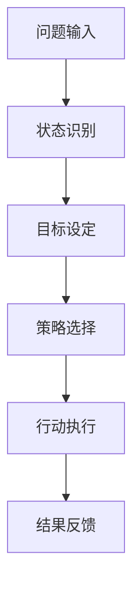
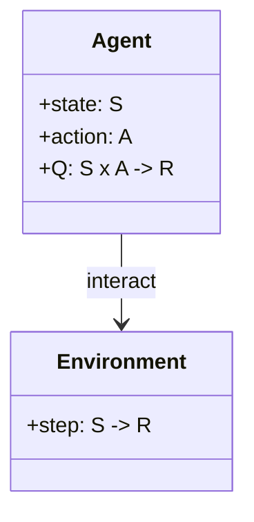
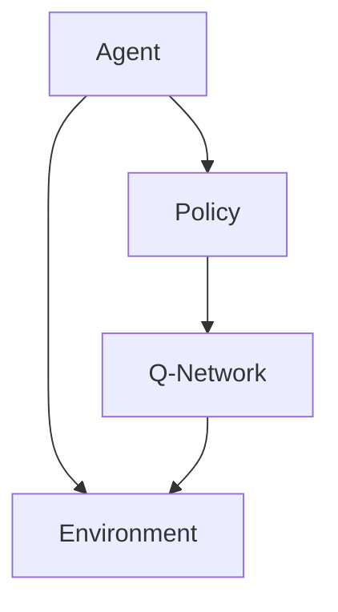
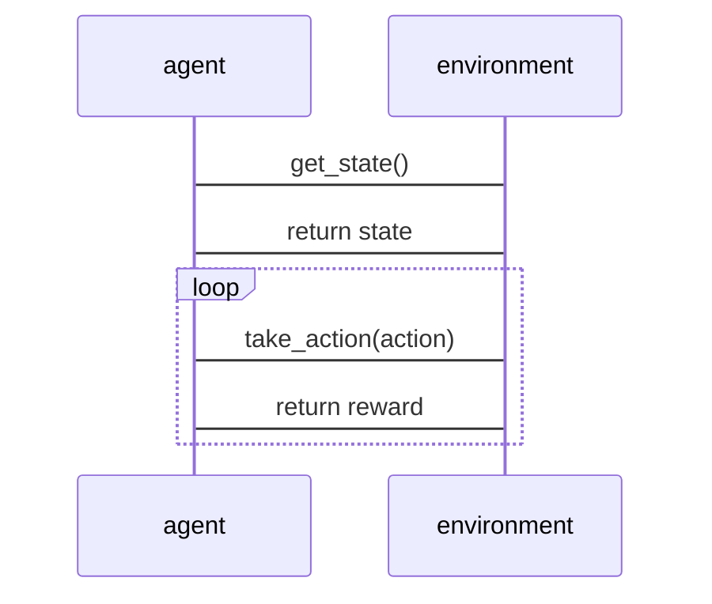

                 


# 企业AI Agent的性能优化策略

> 关键词：企业AI Agent，性能优化，算法优化，系统架构，深度学习，强化学习

> 摘要：本文从企业AI Agent的背景与概念出发，深入探讨其核心概念与原理，详细分析算法优化策略，并结合实际案例，讲解系统架构设计与性能优化方法。通过本文，读者可以全面了解企业AI Agent的性能优化策略，并掌握如何在实际应用中提升其性能。

---

## 第1章: 企业AI Agent的背景与概念

### 1.1 企业AI Agent的背景

#### 1.1.1 AI Agent的基本概念
AI Agent（人工智能代理）是一种能够感知环境、自主决策并执行任务的智能系统。它通过传感器获取信息，利用推理能力解决问题，并通过执行器与环境交互。

#### 1.1.2 企业AI Agent的定义与特点
企业AI Agent是指在企业环境中应用的AI Agent，用于优化企业流程、提高效率和决策能力。其特点包括：目标导向性、自主性、反应性、社会性。

#### 1.1.3 企业AI Agent的应用场景
- **自动化任务处理**：如自动化邮件回复、文档分类。
- **智能决策支持**：如供应链优化、客户关系管理。
- **复杂问题求解**：如金融风险评估、智能制造。

### 1.2 企业AI Agent的核心要素

#### 1.2.1 问题背景与目标
企业AI Agent的目标是通过智能化手段，解决企业中的复杂问题，提升效率和竞争力。

#### 1.2.2 核心概念与联系
企业AI Agent的核心概念包括：感知、决策、执行、反馈。

#### 1.2.3 边界与外延
企业AI Agent的边界在于其任务范围和应用场景，外延则涉及与其他系统的集成。

### 1.3 企业AI Agent与传统AI的区别

#### 1.3.1 传统AI的局限性
传统AI依赖于规则和数据，缺乏自主性和适应性。

#### 1.3.2 AI Agent的独特优势
AI Agent具备自主决策、动态适应和与环境交互的能力。

#### 1.3.3 企业级AI Agent的演进
从规则驱动的传统AI到数据驱动的深度学习，企业AI Agent逐渐向智能化、自动化方向演进。

### 1.4 本章小结
本章介绍了企业AI Agent的背景、核心概念及其与传统AI的区别，为后续内容打下基础。

---

## 第2章: AI Agent的核心概念与原理

### 2.1 AI Agent的模型结构

#### 2.1.1 决策树模型
决策树是一种树状结构，用于表示问题的决策过程。适用于分类和回归问题。

#### 2.1.2 强化学习模型
强化学习通过试错机制，学习最优策略。适用于动态环境中的决策问题。

#### 2.1.3 深度学习模型
深度学习通过多层神经网络，学习复杂特征。适用于非线性问题。

### 2.2 AI Agent的算法类型

#### 2.2.1 监督学习算法
监督学习基于标记数据，学习输入与输出的关系。

#### 2.2.2 无监督学习算法
无监督学习在无标记数据中发现模式。

#### 2.2.3 强化学习算法
强化学习通过奖励机制，学习最优策略。

### 2.3 核心概念的联系与对比

#### 2.3.1 概念属性特征对比表

| 概念 | 输入 | 输出 | 目标 |
|------|------|------|------|
| 决策树 | 数据特征 | 预测结果 | 准确性 |
| 强化学习 | 状态、动作 | 奖励 | 最大化累积奖励 |
| 深度学习 | 数据样本 | 特征表示 | 学习能力 |

#### 2.3.2 ER实体关系图


### 2.4 本章小结
本章详细介绍了AI Agent的核心概念及其之间的联系，为后续的算法优化奠定了基础。

---

## 第3章: AI Agent的算法原理与实现

### 3.1 强化学习算法

#### 3.1.1 Q-learning算法
Q-learning是一种经典的强化学习算法，通过更新Q值表来学习最优策略。

#### 3.1.2 Deep Q-Networks (DQN)
DQN通过神经网络近似Q值函数，解决高维状态空间问题。

### 3.2 算法原理的数学模型

#### 3.2.1 Q-learning的数学模型
$$ Q(s, a) = Q(s, a) + \alpha (r + \max Q(s', a') - Q(s, a)) $$
其中，$\alpha$是学习率，$r$是奖励，$s'$是下一状态。

#### 3.2.2 DQN的数学模型
$$ \text{损失函数} = \mathbb{E}[(r + \gamma \max Q(s', a') - Q(s, a))^2] $$
其中，$\gamma$是折扣因子。

### 3.3 算法实现的Python代码示例

```python
import numpy as np

class QLearning:
    def __init__(self, state_space, action_space, alpha=0.1, gamma=0.9):
        self.state_space = state_space
        self.action_space = action_space
        self.alpha = alpha
        self.gamma = gamma
        self.Q = np.zeros((state_space, action_space))

    def choose_action(self, state, epsilon=0.1):
        if np.random.random() < epsilon:
            return np.random.randint(self.action_space)
        else:
            return np.argmax(self.Q[state, :])

    def update_Q(self, state, action, reward, next_state):
        self.Q[state, action] += self.alpha * (reward + self.gamma * np.max(self.Q[next_state, :]) - self.Q[state, action])
```

### 3.4 本章小结
本章详细讲解了强化学习算法的原理与实现，为后续的性能优化提供了理论基础。

---

## 第4章: 企业AI Agent的系统架构设计

### 4.1 系统功能设计

#### 4.1.1 领域模型


#### 4.1.2 系统架构设计


### 4.2 系统接口设计

#### 4.2.1 接口定义
- `get_state()`：获取当前状态。
- `take_action(action)`：执行动作。
- `receive_reward(reward)`：接收奖励。

### 4.3 系统交互设计



### 4.4 本章小结
本章通过系统架构设计，详细讲解了企业AI Agent的实现过程，并给出了接口设计和交互流程。

---

## 第5章: 企业AI Agent的性能优化策略

### 5.1 算法优化策略

#### 5.1.1 网络结构优化
使用更深的网络结构或引入注意力机制，提升模型性能。

#### 5.1.2 参数优化
通过Adam优化器等高级优化算法，提升训练效率。

### 5.2 系统优化策略

#### 5.2.1 并行计算
利用多线程或多进程，提升计算效率。

#### 5.2.2 模型压缩
通过剪枝等技术，减少模型大小，提升推理速度。

### 5.3 项目实战

#### 5.3.1 环境安装
安装必要的库，如TensorFlow、Keras。

#### 5.3.2 核心代码实现
```python
import tensorflow as tf
from tensorflow.keras import layers

model = tf.keras.Sequential([
    layers.Dense(64, activation='relu'),
    layers.Dense(1, activation='sigmoid')
])
model.compile(optimizer='adam', loss='binary_crossentropy')
```

#### 5.3.3 案例分析
以智能制造为例，详细分析AI Agent在生产优化中的应用。

### 5.4 本章小结
本章通过算法优化和系统优化策略，结合实际案例，详细讲解了企业AI Agent的性能优化方法。

---

## 第6章: 总结与展望

### 6.1 总结
本文从企业AI Agent的背景出发，详细探讨了其核心概念、算法原理和系统架构设计，并给出了性能优化策略。

### 6.2 展望
未来，企业AI Agent将在更多领域得到应用，同时需要进一步优化算法和系统架构，以应对更复杂的挑战。

---

## 作者：AI天才研究院/AI Genius Institute & 禅与计算机程序设计艺术 /Zen And The Art of Computer Programming

---

通过本文，读者可以全面了解企业AI Agent的性能优化策略，并掌握如何在实际应用中提升其性能。

