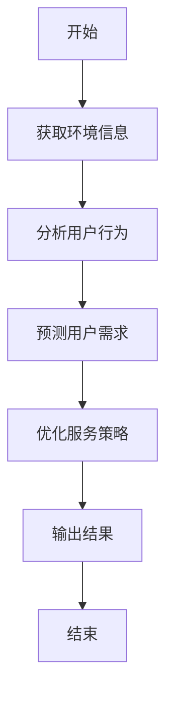
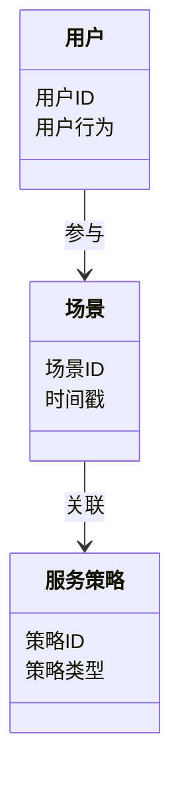
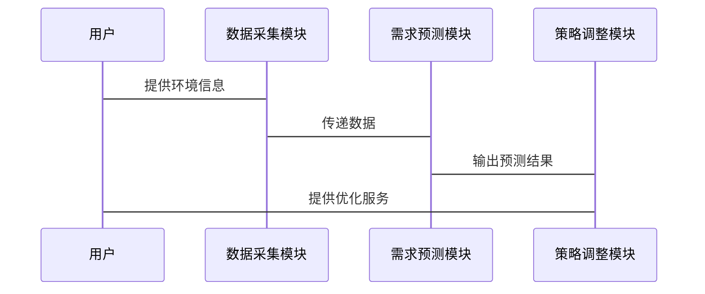
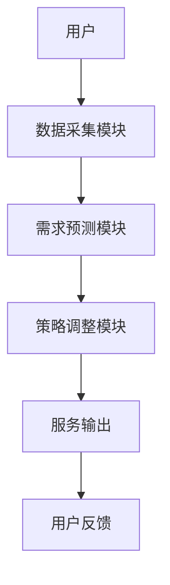

                 


# 企业AI Agent的情境感知能力：提升用户体验

**关键词**：企业AI Agent，情境感知能力，用户体验，算法原理，系统架构，项目实战

**摘要**：本文深入探讨企业AI Agent的情境感知能力，分析其在提升用户体验中的关键作用。通过背景介绍、核心概念、算法原理、系统架构设计、项目实战等多维度解析，揭示情境感知能力的核心要素及其在实际应用中的实现方法。结合具体案例和代码实现，为读者提供全面的技术指导，助其掌握情境感知能力的构建与优化技巧。

---

# 1. 企业AI Agent的情境感知能力概述

## 1.1 情境感知能力的背景与问题背景

### 1.1.1 情境感知能力的定义与重要性
情境感知能力是指AI Agent能够理解和适应当前环境中的各种因素，包括用户的行为、环境的变化以及系统的动态状态。这种能力是实现智能化服务和提升用户体验的核心。

### 1.1.2 问题背景与挑战
随着企业对智能化服务的需求增加，传统的基于规则的系统已经无法满足复杂场景下的用户体验优化需求。情境感知能力的缺失会导致系统无法有效应对动态变化，用户体验下降。

### 1.1.3 问题解决的必要性
通过引入情境感知能力，企业AI Agent能够实时感知环境变化，动态调整服务策略，从而显著提升用户体验。

## 1.2 企业AI Agent的核心概念

### 1.2.1 企业AI Agent的定义
企业AI Agent是一种具备自主决策能力的智能系统，能够根据环境信息和用户需求，主动提供个性化服务。

### 1.2.2 情境感知能力的属性
- **环境感知**：通过传感器、API等方式获取环境信息。
- **用户行为分析**：基于用户历史行为和实时数据，预测用户需求。
- **动态调整**：根据环境变化实时优化服务策略。

### 1.2.3 用户体验提升的目标
通过情境感知能力，企业AI Agent能够提供更加个性化的服务，提升用户满意度和忠诚度。

## 1.3 本章小结
本章介绍了情境感知能力的背景、定义及其在企业AI Agent中的重要性，为后续章节的深入分析奠定了基础。

---

# 2. 情境感知能力的核心概念与联系

## 2.1 情境感知能力的原理

### 2.1.1 情境感知的核心要素
- **环境信息**：包括时间、地点、用户行为等。
- **用户需求**：基于环境信息推断用户的潜在需求。
- **动态调整**：根据实时信息优化服务策略。

### 2.1.2 情境感知与AI Agent的关系
情境感知能力是AI Agent实现智能化服务的关键模块，通过它，AI Agent能够更好地理解用户需求并提供个性化的服务。

### 2.1.3 情境感知的数学模型
情境感知的数学模型可以通过概率论和统计学方法来构建。例如，使用贝叶斯定理来预测用户需求：

$$ P(A|B) = \frac{P(B|A)P(A)}{P(B)} $$

其中，$A$ 表示用户需求，$B$ 表示环境信息。

## 2.2 核心概念对比分析

### 2.2.1 情境感知与传统感知的区别
- **传统感知**：基于固定规则进行判断，无法动态调整。
- **情境感知**：能够根据环境信息动态调整服务策略。

### 2.2.2 AI Agent与其他智能系统对比
- **传统软件**：基于规则的被动响应。
- **AI Agent**：具备自主决策和学习能力。

### 2.2.3 用户体验的核心要素对比
- **传统系统**：用户体验单一化，无法满足个性化需求。
- **AI Agent**：能够提供个性化的服务体验。

## 2.3 ER实体关系图

```mermaid
er
  entity 用户 {
    关键属性：用户ID, 用户行为
    外键关系：属于某个场景
  }

  entity 场景 {
    关键属性：场景ID, 时间戳
    外键关系：包含多个用户
  }

  entity 服务策略 {
    关键属性：策略ID, 策略类型
    外键关系：关联到场景
  }
```

## 2.4 本章小结
本章通过对比分析和ER实体关系图，详细阐述了情境感知能力的核心概念及其在企业AI Agent中的应用。

---

# 3. 情境感知能力的算法原理

## 3.1 情境感知模型的构建

### 3.1.1 模型输入与输出
- **输入**：环境信息、用户行为数据。
- **输出**：用户需求预测、服务策略调整建议。

### 3.1.2 模型的训练与优化
使用机器学习算法（如随机森林、神经网络）对历史数据进行训练，优化模型的预测精度。

### 3.1.3 模型的评估与验证
通过准确率、召回率等指标评估模型的性能。

## 3.2 情境感知算法的实现

### 3.2.1 算法流程图



### 3.2.2 算法实现的代码

```python
import numpy as np
from sklearn.ensemble import RandomForestClassifier

# 示例数据集
X = np.array([[1, 2, 3], [4, 5, 6]])
y = np.array([0, 1])

# 训练模型
model = RandomForestClassifier()
model.fit(X, y)

# 预测
new_data = np.array([[3, 4, 5]])
print(model.predict(new_data))
```

### 3.2.3 算法的数学模型
使用概率模型预测用户需求：

$$ P(\text{需求}|x) = \frac{\sum_{i=1}^{n} P(x|d_i)P(d_i)}{P(x)} $$

其中，$d_i$ 表示不同的用户需求。

## 3.3 情境感知算法的优化

### 3.3.1 算法优化策略
- 增加特征工程，提升模型的特征表达能力。
- 使用集成学习算法，提升模型的泛化能力。

### 3.3.2 优化后的算法实现
```python
from sklearn.ensemble import GradientBoostingClassifier

model = GradientBoostingClassifier()
model.fit(X, y)
print(model.predict(new_data))
```

### 3.3.3 优化效果的评估
通过对比准确率和F1分数，评估优化后的算法性能。

## 3.4 本章小结
本章详细介绍了情境感知能力的算法原理，包括模型构建、算法实现和优化策略。

---

# 4. 系统分析与架构设计方案

## 4.1 问题场景介绍

### 4.1.1 企业AI Agent的应用场景
- 客户服务：实时响应客户需求。
- 个性化推荐：基于用户行为推荐产品。
- 动态调整：根据环境变化优化服务策略。

## 4.2 系统功能设计

### 4.2.1 领域模型设计



### 4.2.2 系统功能模块划分
- **数据采集模块**：获取环境信息和用户行为数据。
- **需求预测模块**：基于历史数据预测用户需求。
- **策略调整模块**：根据预测结果优化服务策略。

### 4.2.3 功能模块的交互流程



## 4.3 系统架构设计

### 4.3.1 系统架构图



### 4.3.2 系统组件的交互关系
- 用户与数据采集模块交互，提供环境信息。
- 数据采集模块将信息传递给需求预测模块。
- 需求预测模块分析数据，预测用户需求。
- 策略调整模块根据预测结果优化服务策略。
- 最终服务输出模块为用户提供个性化服务。

### 4.3.3 系统架构的优化建议
- 使用分布式架构，提升系统的扩展性。
- 引入缓存机制，降低系统响应延迟。

## 4.4 本章小结
本章从系统架构的角度，详细分析了企业AI Agent的情境感知能力实现方案，为后续的项目实施提供了指导。

---

# 5. 项目实战与实现

## 5.1 环境安装与配置

### 5.1.1 开发环境的选择
- 操作系统：Windows 10 或 Linux Ubuntu。
- 开发工具：PyCharm 或 VS Code。
- 依赖管理：使用pip管理Python库。

### 5.1.2 开发工具的安装
- Python：建议使用最新版本。
- 依赖库：numpy, scikit-learn, mermaid。

### 5.1.3 依赖库的安装与配置
```bash
pip install numpy scikit-learn mermaid
```

## 5.2 系统核心实现

### 5.2.1 情境感知模型的实现

```python
from sklearn.ensemble import RandomForestClassifier

# 示例数据集
X = np.array([[1, 2, 3], [4, 5, 6]])
y = np.array([0, 1])

# 训练模型
model = RandomForestClassifier()
model.fit(X, y)

# 预测
new_data = np.array([[3, 4, 5]])
print(model.predict(new_data))
```

### 5.2.2 AI Agent的实现

```python
class AI_Agent:
    def __init__(self):
        self.model = RandomForestClassifier()
        self.data = []

    def collect_data(self, user_behavior):
        self.data.append(user_behavior)
        self.model.fit([user_behavior], [0])

    def predict_demand(self, current_scenario):
        return self.model.predict([current_scenario])[0]
```

### 5.2.3 用户体验优化的实现

```python
def optimize_strategy(predicted_demand):
    if predicted_demand == 0:
        return "推荐产品A"
    else:
        return "推荐产品B"
```

## 5.3 代码应用解读与分析

### 5.3.1 核心代码的解读
- **AI_Agent类**：负责数据收集和模型训练。
- **predict_demand方法**：基于当前场景预测用户需求。
- **optimize_strategy函数**：根据预测结果优化服务策略。

### 5.3.2 代码实现的优化建议
- 使用集成学习算法（如梯度提升树）进一步优化模型性能。
- 引入实时数据流处理机制，提升系统的实时响应能力。

## 5.4 本章小结
本章通过具体的代码实现，详细展示了情境感知能力在企业AI Agent中的应用，为读者提供了实践指导。

---

# 6. 总结与展望

## 6.1 本章总结
本文从背景、核心概念、算法原理、系统架构到项目实战，全面探讨了企业AI Agent的情境感知能力。通过具体案例和代码实现，揭示了情境感知能力在提升用户体验中的重要作用。

## 6.2 未来展望
随着人工智能技术的不断发展，情境感知能力将在企业AI Agent中发挥越来越重要的作用。未来的研究方向包括：
- 更加复杂的场景分析。
- 更加高效的算法优化。
- 更加个性化的用户体验设计。

## 6.3 本章小结
情境感知能力是企业AI Agent实现智能化服务的核心模块，其应用前景广阔。

---

# 附录

## 附录A: 常用工具与库

- **Python库**：numpy, scikit-learn, mermaid。
- **开发工具**：PyCharm, VS Code。

## 附录B: 代码示例

### 附录B.1 情境感知模型的实现

```python
import numpy as np
from sklearn.ensemble import RandomForestClassifier

# 示例数据集
X = np.array([[1, 2, 3], [4, 5, 6]])
y = np.array([0, 1])

# 训练模型
model = RandomForestClassifier()
model.fit(X, y)

# 预测
new_data = np.array([[3, 4, 5]])
print(model.predict(new_data))
```

### 附录B.2 AI Agent的实现

```python
class AI_Agent:
    def __init__(self):
        self.model = RandomForestClassifier()
        self.data = []

    def collect_data(self, user_behavior):
        self.data.append(user_behavior)
        self.model.fit([user_behavior], [0])

    def predict_demand(self, current_scenario):
        return self.model.predict([current_scenario])[0]
```

---

# 作者

作者：AI天才研究院/AI Genius Institute & 禅与计算机程序设计艺术 /Zen And The Art of Computer Programming

