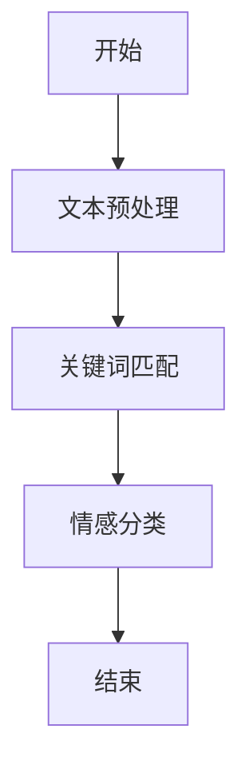
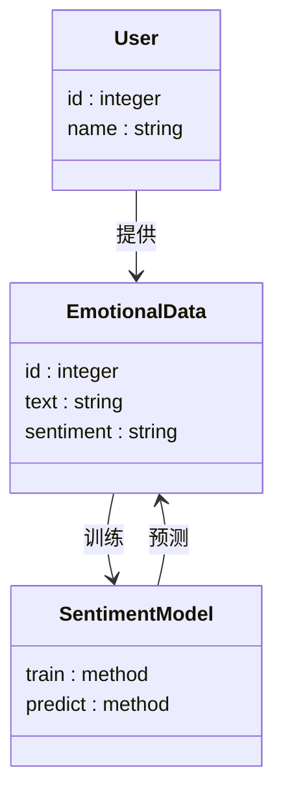

                 


# 企业AI Agent的情感计算应用：提升用户体验

## 关键词：企业AI Agent，情感计算，用户体验，机器学习，自然语言处理

## 摘要：情感计算是一种通过分析和理解人类情感信息来提升用户体验的技术。在企业AI Agent中，情感计算能够增强与用户的互动，提高服务的智能化和个性化。本文将深入探讨情感计算的核心概念、算法原理、系统架构及实际应用，为企业在AI Agent中的情感计算应用提供指导和参考。

---

## 目录

1. [企业AI Agent情感计算的背景与概念](#企业ai-agent情感计算的背景与概念)
2. [情感计算的核心概念与联系](#情感计算的核心概念与联系)
3. [情感计算的算法原理](#情感计算的算法原理)
4. [企业AI Agent情感计算的系统架构](#企业ai-agent情感计算的系统架构)
5. [情感计算在企业中的实际应用](#情感计算在企业中的实际应用)
6. [项目实战：构建企业AI Agent情感计算系统](#项目实战：构建企业ai-agent情感计算系统)
7. [最佳实践与总结](#最佳实践与总结)

---

## 1. 企业AI Agent情感计算的背景与概念

### 1.1 情感计算的定义与技术基础

情感计算（Affective Computing）是一种通过计算手段分析、识别和理解人类情感的技术。它结合了自然语言处理、机器学习和数据挖掘等技术，旨在通过分析用户的情感信息来提升交互体验。

#### 1.1.1 情感计算的定义

情感计算的核心目标是通过分析用户的情感信息（如情绪、意图、情感倾向等）来提供更智能化的服务。它不仅仅关注用户的行为，还关注用户的情感状态，从而为用户提供更个性化和贴心的服务。

#### 1.1.2 情感计算的技术基础

情感计算依赖于多种技术的支持，包括：

- **自然语言处理（NLP）**：用于分析文本中的情感信息。
- **机器学习**：用于训练情感分类模型。
- **数据挖掘**：用于从大量数据中提取情感相关特征。

### 1.2 情感计算在企业AI Agent中的应用价值

#### 1.2.1 提升用户体验

通过情感计算，企业AI Agent能够理解用户的情感状态，从而提供更符合用户需求的服务。例如，在客服系统中，AI Agent可以根据用户的情绪调整回应方式，提供更贴心的服务。

#### 1.2.2 情感计算的应用场景

- **客服系统**：通过分析用户的语言和语气，识别用户的情绪状态，提供更合适的解决方案。
- **市场分析**：通过分析用户对产品的评论，了解用户的情感倾向，帮助企业制定更精准的市场策略。
- **个性化推荐**：根据用户的情感偏好，推荐更符合用户喜好的产品或服务。

#### 1.2.3 情感计算的挑战与解决方案

- **数据获取**：情感计算需要大量的标注数据，获取高质量的数据是一个挑战。
- **模型准确性**：情感计算模型需要在不同场景下保持高准确性，特别是在处理复杂的情感信息时。

### 1.3 情感计算的研究现状与未来趋势

情感计算的研究目前主要集中在以下几个方面：

- **情感分类**：基于机器学习的情感分类模型。
- **情感强度分析**：分析情感的强烈程度。
- **情感原因分析**：分析用户产生某种情感的原因。

未来，情感计算将更加智能化和个性化，结合深度学习和边缘计算等技术，提供更精准和实时的情感分析能力。

---

## 2. 情感计算的核心概念与联系

### 2.1 情感计算的原理

情感计算的实现过程可以分为以下几个步骤：

1. **数据采集**：获取用户的情感数据，如文本、语音、面部表情等。
2. **特征提取**：从数据中提取情感相关特征。
3. **情感分析**：基于特征进行情感分类。
4. **结果应用**：根据分析结果提供相应的服务。

#### 2.1.1 情感分析模型

情感分析模型主要分为以下几种：

- **基于规则的模型**：通过预定义的规则进行情感分类。
- **基于机器学习的模型**：通过训练数据学习情感分类规则。
- **基于深度学习的模型**：使用神经网络进行情感分类。

#### 2.1.2 情感特征提取方法

情感特征提取是情感计算的关键步骤，常用的方法包括：

- **词袋模型**：将文本表示为单词的集合。
- **TF-IDF**：计算单词在文本中的重要性。
- **词嵌入（Word Embedding）**：将单词映射为向量表示。

#### 2.1.3 情感计算框架

情感计算的框架通常包括以下几个部分：

1. 数据预处理：对数据进行清洗和标注。
2. 特征提取：提取情感相关特征。
3. 模型训练：训练情感分类模型。
4. 模型评估：评估模型的性能。

### 2.2 情感计算的特征对比

#### 2.2.1 基于规则的特征提取

基于规则的特征提取方法通过预定义的规则进行情感分类，例如：

- 如果文本中包含“开心”、“满意”等词语，则判定为积极情感。
- 如果文本中包含“难过”、“不满”等词语，则判定为消极情感。

这种方法简单易实现，但可能存在误判的情况。

#### 2.2.2 基于机器学习的特征提取

基于机器学习的特征提取方法通过训练数据学习情感分类规则，例如：

- 使用支持向量机（SVM）进行情感分类。
- 使用随机森林进行特征选择。

这种方法能够更好地捕捉到情感信息的复杂性，但需要大量的标注数据。

#### 2.2.3 特征对比表格

| 方法               | 优点                     | 缺点                     |
|--------------------|--------------------------|--------------------------|
| 基于规则的方法     | 实现简单，易于解释       | 易产生误判，覆盖面有限   |
| 基于机器学习的方法 | 准确率高，能够捕捉复杂性 | 需要大量标注数据         |

### 2.3 情感计算的ER实体关系图

以下是情感计算的ER实体关系图：

```mermaid
erDiagram
    actor User {
        uuid      string
        name      string
    }
    role EmotionalData {
        id          int
        text        string
        sentiment   string
    }
    action AnalyzeSentiment {
        id          int
        timestamp   datetime
        result      string
    }
    User --> EmotionalData : 提供
    EmotionalData --> AnalyzeSentiment : 分析
    AnalyzeSentiment --> Action : 引发
```

---

## 3. 情感计算的算法原理

### 3.1 基于规则的情感计算算法

#### 3.1.1 算法原理

基于规则的情感计算算法通过预定义的规则进行情感分类。例如：

- 如果文本中包含“满意”、“开心”等关键词，则判定为积极情感。
- 如果文本中包含“不满”、“生气”等关键词，则判定为消极情感。

#### 3.1.2 算法流程图



#### 3.1.3 代码实现

以下是一个基于规则的情感计算算法的Python代码示例：

```python
def rule_based_sentiment_analysis(text):
    positive_words = {'happy', 'joy', 'satisfied', 'good'}
    negative_words = {'sad', 'angry', 'unhappy', 'bad'}
    
    sentiment = 'neutral'
    words = text.lower().split()
    
    for word in words:
        if word in positive_words:
            sentiment = 'positive'
            break
        elif word in negative_words:
            sentiment = 'negative'
            break
    return sentiment
```

---

## 4. 企业AI Agent情感计算的系统架构

### 4.1 系统功能设计

企业AI Agent情感计算系统的功能模块包括：

- **数据采集模块**：采集用户的情感数据。
- **数据预处理模块**：对数据进行清洗和标注。
- **模型训练模块**：训练情感分类模型。
- **结果应用模块**：根据分析结果提供相应的服务。

#### 4.1.1 领域模型Mermaid类图



---

## 5. 情感计算在企业中的实际应用

### 5.1 客服系统中的应用

在客服系统中，情感计算可以帮助AI Agent识别用户的情绪状态，提供更贴心的服务。例如：

- 如果用户表现出愤怒或不满，AI Agent可以自动升级到人工客服。
- 如果用户表现出满意或愉快，AI Agent可以提供额外的服务。

### 5.2 市场分析中的应用

在市场分析中，情感计算可以帮助企业分析用户对产品的评论，了解用户的情感倾向。例如：

- 如果大多数用户对产品感到满意，企业可以继续推广该产品。
- 如果大多数用户对产品感到不满，企业可以考虑改进产品设计。

---

## 6. 项目实战：构建企业AI Agent情感计算系统

### 6.1 环境安装

以下是一些常用的Python库：

- `numpy`
- `pandas`
- `scikit-learn`
- `tensorflow`

### 6.2 核心代码实现

以下是一个情感计算系统的Python代码示例：

```python
import numpy as np
from sklearn.feature_extraction.text import TfidfVectorizer
from sklearn.svm import SVC

# 数据预处理
def preprocess(text):
    return text.lower().strip()

# 特征提取
vectorizer = TfidfVectorizer()
X = vectorizer.fit_transform(corpus)

# 模型训练
model = SVC()
model.fit(X, labels)

# 预测
test_text = preprocess("I love this product")
test_X = vectorizer.transform([test_text])
predicted = model.predict(test_X)
print(predicted)
```

---

## 7. 最佳实践与总结

### 7.1 注意事项

- 数据质量：确保数据的标注准确无误。
- 模型选择：根据实际需求选择合适的模型。
- 结果解释：确保情感计算的结果能够被业务理解。

### 7.2 总结

情感计算是一种通过分析和理解人类情感信息来提升用户体验的技术。在企业AI Agent中，情感计算能够增强与用户的互动，提高服务的智能化和个性化。未来，情感计算将更加智能化和个性化，结合深度学习和边缘计算等技术，提供更精准和实时的情感分析能力。

### 7.3 拓展阅读

- 《情感计算入门》
- 《机器学习实战》
- 《自然语言处理的原理与实践》

---

作者：AI天才研究院/AI Genius Institute & 禅与计算机程序设计艺术 /Zen And The Art of Computer Programming

