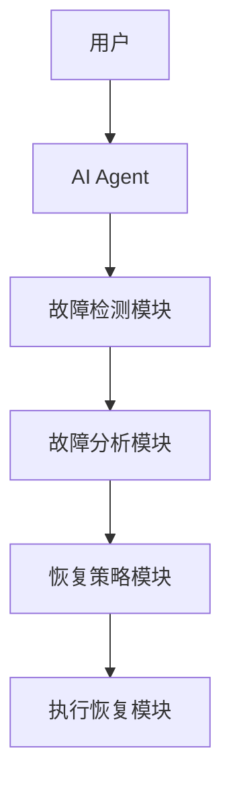
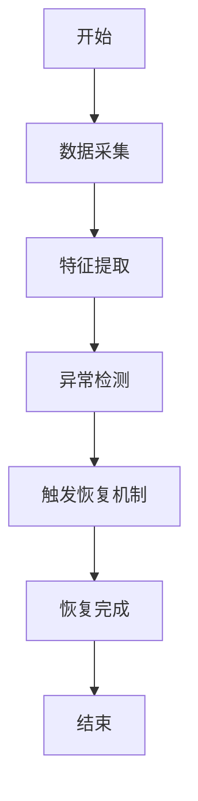

                 


# 企业AI Agent的故障恢复机制

> 关键词：AI Agent、故障恢复、企业应用、算法原理、系统架构

> 摘要：本文深入探讨了企业AI Agent的故障恢复机制，从核心概念到算法原理，再到系统架构和项目实战，全面解析了故障恢复机制的设计与实现。文章结合实际案例，分析了故障恢复机制在企业中的应用场景，并提出了优化建议。

---

# 第一部分: 企业AI Agent的故障恢复机制概述

## 第1章: AI Agent与故障恢复机制概述

### 1.1 AI Agent的基本概念

#### 1.1.1 AI Agent的定义与特点
AI Agent（人工智能代理）是一种能够感知环境、自主决策并执行任务的智能实体。它通过传感器获取信息，利用推理能力分析信息，并通过执行器与环境交互。企业AI Agent的特点包括智能化、自主性、反应性、社交能力等。

#### 1.1.2 企业AI Agent的应用场景
企业AI Agent广泛应用于客服、供应链管理、数据分析、智能助手等领域。例如，在客服系统中，AI Agent可以自动响应客户查询；在供应链管理中，AI Agent可以实时监控库存并优化物流。

#### 1.1.3 故障恢复机制的重要性
在企业AI Agent运行过程中，由于网络中断、数据错误或系统故障等原因，可能会导致服务中断或决策失误。故障恢复机制能够快速检测并修复这些问题，确保系统稳定运行。

### 1.2 故障恢复机制的核心概念

#### 1.2.1 故障恢复机制的定义
故障恢复机制是指在AI Agent发生故障时，系统能够自动检测问题、分析原因，并采取相应措施恢复服务的能力。

#### 1.2.2 故障恢复机制的关键要素
故障恢复机制的关键要素包括故障检测、故障分析、恢复策略和执行恢复。这些要素共同确保系统能够在故障发生时快速响应并恢复正常。

#### 1.2.3 企业AI Agent故障恢复机制的边界与外延
故障恢复机制的边界在于其能够检测和恢复的故障类型。外延则包括与系统其他部分的协同工作，例如与监控系统、日志系统等的集成。

---

## 第2章: 企业AI Agent故障恢复机制的背景与挑战

### 2.1 企业AI Agent的应用现状

#### 2.1.1 当前企业AI Agent的应用领域
当前，企业AI Agent主要应用于智能客服、供应链优化、数据处理和自动化运维等领域。例如，智能客服中的AI Agent可以自动处理客户咨询。

#### 2.1.2 企业AI Agent故障恢复机制的必要性
在企业AI Agent的应用中，故障恢复机制是确保系统稳定运行的关键。例如，在供应链管理中，AI Agent的故障可能导致订单延迟或库存错误。

### 2.2 故障恢复机制在企业AI Agent中的挑战

#### 2.2.1 故障检测的复杂性
故障检测需要考虑多种因素，例如数据的噪声、系统的动态变化等。如何在复杂环境中准确检测故障是主要挑战。

#### 2.2.2 故障恢复的不确定性
故障恢复可能涉及多个系统的协同工作，恢复策略的选择需要考虑系统的状态和可能的副作用。

#### 2.2.3 多系统协同的复杂性
企业AI Agent通常与其他系统（如数据库、第三方服务）协同工作。故障恢复需要考虑这些系统的依赖关系，增加了复杂性。

---

# 第二部分: 企业AI Agent故障恢复机制的核心原理

## 第3章: 故障恢复机制的核心概念与联系

### 3.1 故障恢复机制的核心原理

#### 3.1.1 基于状态监测的故障检测
基于状态监测的故障检测通过实时监控系统状态，识别异常情况。例如，通过分析系统日志来检测潜在故障。

#### 3.1.2 基于异常检测的故障识别
基于异常检测的故障识别利用机器学习算法，识别数据中的异常模式。例如，使用Isolation Forest算法检测异常行为。

#### 3.1.3 基于自适应策略的故障恢复
基于自适应策略的故障恢复根据故障类型和系统状态动态调整恢复策略。例如，针对网络故障，系统可以尝试重新连接或切换到备用网络。

### 3.2 核心概念对比分析

#### 3.2.1 不同故障恢复机制的对比分析
下表对比了基于状态监测和基于异常检测的故障恢复机制。

| 对比维度 | 基于状态监测 | 基于异常检测 |
|----------|--------------|---------------|
| 检测方式 | 实时监控系统状态 | 分析数据中的异常模式 |
| 适用场景 | 系统运行状态明确 | 数据复杂且可能有噪声 |
| 优缺点   | 简单易实现，但可能漏检复杂故障 | 精度高，但实现复杂 |

#### 3.2.2 基于表格的核心概念属性特征对比
下表对比了故障恢复机制的核心属性。

| 属性     | 故障检测 | 故障分析 | 恢复策略 | 执行恢复 |
|----------|----------|----------|----------|----------|
| 输入     | 系统状态 | 故障原因 | 恢复方案 | 恢复操作 |
| 输出     | 故障信号 | 原因分析 | 恢复方案 | 恢复完成 |
| 关键技术 | 状态监测 | 数据分析 | 策略制定 | 调用API |

#### 3.2.3 基于Mermaid的实体关系图架构



---

## 第4章: 故障恢复机制的算法原理

### 4.1 基于异常检测的故障恢复机制

#### 4.1.1 算法流程图



#### 4.1.2 算法实现代码

```python
import pandas as pd
from sklearn.ensemble import IsolationForest

def detect_anomaly(data):
    # 特征提取
    features = data[['feature1', 'feature2', 'feature3']]
    # 模型训练
    model = IsolationForest(random_state=42)
    model.fit(features)
    # 预测异常
    outliers = model.predict(features)
    return outliers
```

#### 4.1.3 数学模型与公式

异常检测算法Isolation Forest的数学模型如下：

$$
\text{score}(x) = \frac{1}{\text{depth}(x) + 1}
$$

其中，$\text{depth}(x)$ 是样本$x$在随机森林中的深度。

---

## 第5章: 系统分析与架构设计

### 5.1 系统架构设计


### 5.2 系统接口设计

系统接口包括：

1. 故障检测接口：`detect_fault(system_state)`
2. 故障分析接口：`analyze_fault(fault_info)`
3. 恢复策略接口：`get_recovery_strategy(fault_info)`
4. 执行恢复接口：`execute_recovery(action)`

---

# 第三部分: 项目实战与案例分析

## 第6章: 项目实战

### 6.1 环境安装

安装所需库：

```bash
pip install pandas scikit-learn
```

### 6.2 核心代码实现

实现故障恢复机制的核心代码：

```python
def detect_anomaly(data):
    # 数据预处理
    features = data[['feature1', 'feature2', 'feature3']]
    # 异常检测
    model = IsolationForest(random_state=42)
    model.fit(features)
    # 返回异常标志
    return model.predict(features)
```

### 6.3 案例分析

以一个电商系统为例，分析故障恢复机制的应用。假设系统中订单处理出现异常，AI Agent检测到故障后，触发恢复机制，尝试重新提交订单或回滚事务。

---

## 第7章: 总结与展望

### 7.1 总结

企业AI Agent的故障恢复机制是确保系统稳定运行的关键。通过实时监测、异常检测和自适应恢复策略，能够有效应对各种故障。

### 7.2 展望

未来，故障恢复机制将更加智能化，基于强化学习和自适应算法，进一步提升恢复效率和准确性。

---

作者：AI天才研究院 & 禅与计算机程序设计艺术

