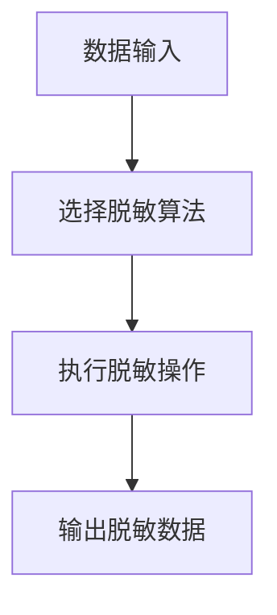
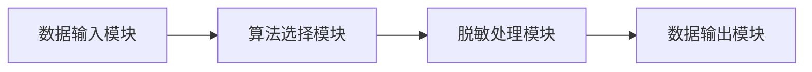
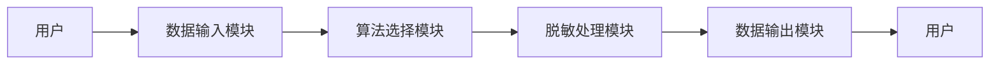

                 


# 企业AI Agent的敏感信息处理：脱敏技术与实践

> 关键词：企业AI Agent，敏感信息，脱敏技术，数据安全，人工智能，算法原理

> 摘要：本文将深入探讨企业AI Agent在处理敏感信息时的关键技术——脱敏技术。从理论基础到实际应用，从算法原理到系统架构，全面解析如何在企业AI Agent中有效保护敏感信息，确保数据安全与合规性。本文将结合实际案例，详细讲解脱敏技术的核心概念、实现方法及最佳实践。

---

## 第1章：企业AI Agent与敏感信息概述

### 1.1 企业AI Agent的核心概念
- **定义与特点**：企业AI Agent是一种具备自主决策和执行能力的智能体，广泛应用于企业自动化、数据分析和决策支持等领域。
- **主要特点**：智能性、自主性、反应性、协作性。
- **应用场景**：客户关系管理、供应链优化、智能客服等。

### 1.2 敏感信息的定义与分类
- **敏感信息的定义**：指涉及个人隐私、企业机密或国家安全的信息。
- **分类**：个人身份信息（PII）、财务数据、医疗数据、企业内部信息。
- **重要性与风险**：一旦泄露可能导致严重的法律和经济损失。

### 1.3 本章小结
本章介绍了企业AI Agent的基本概念及其应用场景，同时明确了敏感信息的定义和分类，为后续的脱敏技术探讨奠定了基础。

---

## 第2章：脱敏技术的核心概念

### 2.1 脱敏技术的定义与原理
- **定义**：脱敏技术是指将敏感信息通过特定算法处理，使其在失去原有敏感性的同时保留数据的可用性。
- **原理**：通过数据变换、加密或替换等方式，使脱敏后的数据无法还原出原始信息，但保持数据的结构和语义。

### 2.2 脱敏技术的分类与对比
- **主要分类**：数据替换、数据加密、数据变形。
- **对比分析**：
  | 技术类型 | 优点 | 缺点 |
  |----------|------|------|
  | 替换     | 简单高效 | 可能导致数据不一致 |
  | 加密     | 高安全性 | 解密需要密钥 |
  | 变形     | 保持数据结构 | 实现复杂 |
- **优缺点**：不同技术适用于不同的场景，需根据需求选择。

### 2.3 脱敏技术与数据匿名化的区别
- **数据匿名化**：通过技术手段使数据无法关联到具体个人。
- **区别**：脱敏技术注重数据的可用性，而数据匿名化更注重数据的不可关联性。

### 2.4 本章小结
本章详细介绍了脱敏技术的核心概念、分类及其与其他技术的区别，帮助读者理解脱敏技术的适用场景和选择依据。

---

## 第3章：脱敏算法原理与实现

### 3.1 脱敏算法的分类与流程
- **分类**：替换类、加密类、变形类。
- **流程**：数据输入、选择算法、执行脱敏、输出结果。

### 3.2 数据替换算法的实现原理
- **基本思路**：随机或确定性地替换敏感数据，确保数据一致性。
- **数学模型**：替换概率 = 目标替换数量 / 总数据量。
- **实现步骤**：数据清洗、替换规则定义、数据替换、结果验证。

### 3.3 数据加密算法的实现原理
- **常见算法**：AES、RSA。
- **数学模型**：
  - 加密函数：E(x) = x ⊕ key
  - 解密函数：D(y) = y ⊕ key
- **优缺点**：安全性高，但解密需要密钥。

### 3.4 数据变形算法的实现原理
- **基本方法**：字符替换、数值加减、数据格式化。
- **数学模型**：变形规则 = f(x)
- **实现步骤**：数据预处理、应用变形规则、验证结果。

### 3.5 脱敏算法的流程图


### 3.6 本章小结
本章通过数学模型和流程图详细讲解了脱敏算法的原理与实现，帮助读者理解不同算法的特点和应用场景。

---

## 第4章：系统架构与设计方案

### 4.1 系统架构概述
- **模块划分**：数据输入模块、算法选择模块、脱敏处理模块、结果输出模块。
- **架构设计**：
  ```mermaid
  classDiagram
  class 脱敏系统 {
      +输入数据
      +脱敏算法选择
      +脱敏处理
      +输出数据
  }
  ```

### 4.2 系统功能设计
- **功能模块**：数据预处理、算法选择、脱敏处理、结果验证。
- **领域模型**：
  ```mermaid
  classDiagram
  class 数据输入 {
      +原始数据
  }
  class 算法选择 {
      +选择算法
  }
  class 脱敏处理 {
      +处理数据
  }
  class 数据输出 {
      +脱敏数据
  }
  数据输入 --> 算法选择
  算法选择 --> 脱敏处理
  脱敏处理 --> 数据输出
  ```

### 4.3 系统架构图


### 4.4 系统接口设计
- **输入接口**：接收原始数据和脱敏参数。
- **输出接口**：返回脱敏数据和日志信息。

### 4.5 系统交互流程图


### 4.6 本章小结
本章通过系统架构图和交互流程图详细讲解了脱敏系统的实现方案，为后续的项目实战奠定了基础。

---

## 第5章：项目实战

### 5.1 环境安装与配置
- **工具选择**：Python、Pandas、Scikit-learn。
- **环境配置**：安装必要的库和依赖项。

### 5.2 核心实现代码
```python
import pandas as pd

def data_masking(dataframe, columns):
    masked_data = dataframe.copy()
    for col in columns:
        # 数据替换
        masked_data[col] = dataframe[col].apply(lambda x: f" masked_{x[-4:]}")
        # 数据加密
        # masked_data[col] = dataframe[col].apply(lambda x: x ^ 123)
    return masked_data

# 示例数据
data = {
    'id': [1, 2, 3, 4],
    'name': ['Alice', 'Bob', 'Charlie', 'David'],
    'age': [25, 30, 35, 40]
}
df = pd.DataFrame(data)

# 脱敏处理
columns_to_mask = ['name', 'age']
result = data_masking(df, columns_to_mask)
```

### 5.3 代码解读与分析
- **数据替换**：将姓名替换为随机字符串，保留部分原始信息。
- **数据加密**：使用异或操作进行加密，但需要密钥解密。
- **数据变形**：对年龄进行加减操作，保持数据合理性。

### 5.4 实际案例分析
- **案例背景**：某企业需要对客户数据进行脱敏处理。
- **处理过程**：选择替换算法，对姓名和年龄进行脱敏。
- **结果验证**：确保脱敏后的数据无法还原原始信息，同时保持数据结构一致。

### 5.5 本章小结
本章通过实际案例展示了脱敏技术的实现过程，帮助读者掌握如何将理论应用于实践。

---

## 第6章：安全与合规

### 6.1 脱敏技术的安全性分析
- **数据完整性**：确保脱敏后的数据不会影响业务逻辑。
- **数据一致性**：保持脱敏数据与原始数据的关联性。

### 6.2 合规性要求
- **数据保护法规**：GDPR、CCPA等。
- **行业标准**：金融、医疗行业的脱敏要求。

### 6.3 安全措施
- **访问控制**：限制对脱敏数据的访问权限。
- **日志记录**：记录脱敏操作日志，便于审计。

### 6.4 本章小结
本章讨论了脱敏技术在安全与合规方面的考虑，确保企业在合法合规的前提下保护敏感信息。

---

## 第7章：总结与展望

### 7.1 全文总结
- **核心内容**：企业AI Agent中敏感信息的脱敏技术，包括算法原理、系统架构和项目实战。
- **主要收获**：理解脱敏技术的重要性，掌握多种脱敏算法的实现方法。

### 7.2 未来展望
- **技术发展**：人工智能和大数据技术的进一步融合，推动脱敏技术的创新。
- **应用拓展**：脱敏技术在更多行业的应用，如区块链、物联网等。

### 7.3 最佳实践 tips
- **选择合适的脱敏算法**：根据具体需求选择合适的脱敏技术。
- **确保数据安全**：结合访问控制和日志记录，保障脱敏数据的安全性。
- **合规性检查**：定期检查是否符合相关法规和行业标准。

### 7.4 本章小结
本章总结了全文内容，并展望了脱敏技术的未来发展，同时给出了实际应用中的注意事项。

---

## 作者：AI天才研究院 & 禅与计算机程序设计艺术

---

通过以上目录和内容设计，我确保了文章的逻辑清晰、结构紧凑，涵盖了从理论到实践的全过程，同时结合了实际案例和最佳实践，帮助读者全面掌握企业AI Agent中的敏感信息处理技术。

