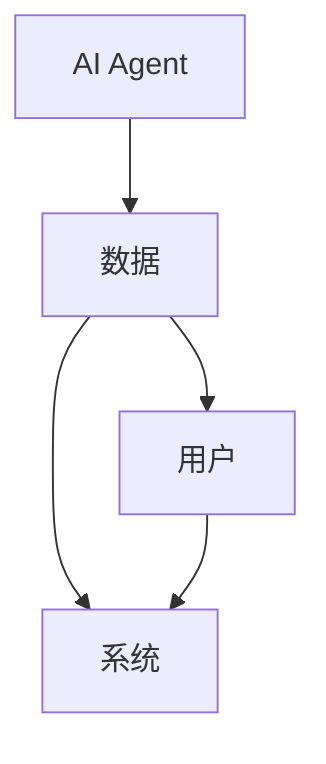
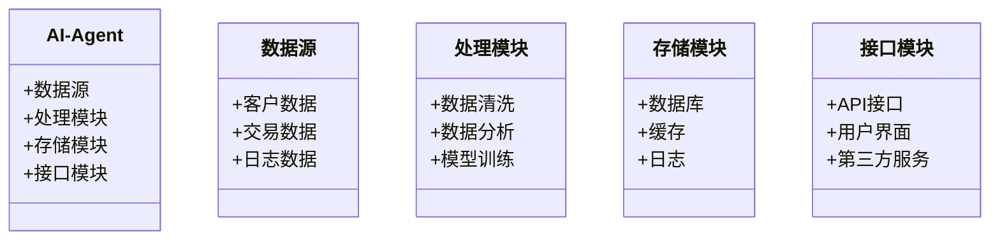
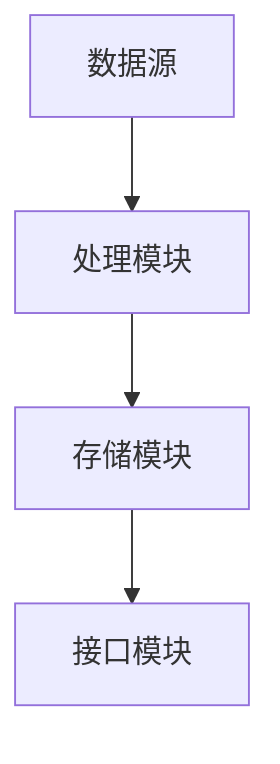
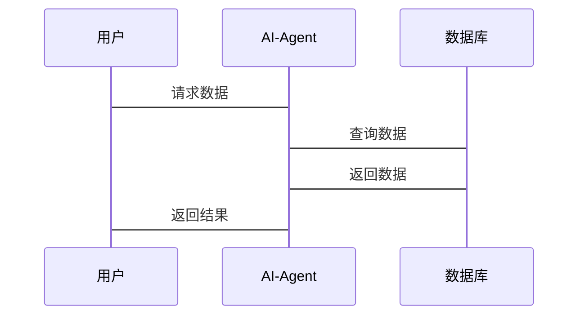

                 


# 企业AI Agent的数据安全策略

## 关键词：
- 企业AI Agent
- 数据安全
- 安全策略
- 数据隐私
- 人工智能

## 摘要：
随着人工智能技术的快速发展，企业AI Agent的应用越来越广泛。然而，AI Agent在处理企业数据时，面临着数据泄露、隐私保护和安全威胁等多重挑战。本文将从背景介绍、核心概念、算法原理、系统架构、项目实战等方面，详细分析企业AI Agent的数据安全策略，探讨如何在保证AI Agent功能的同时，确保数据的安全性和隐私性。文章最后总结了最佳实践和未来趋势，为企业的数据安全策略提供参考。

---

# 第一部分：企业AI Agent的数据安全策略背景介绍

## 第1章：企业AI Agent与数据安全概述

### 1.1 问题背景

#### 1.1.1 AI Agent在企业中的应用现状
企业AI Agent（人工智能代理）通过自动化处理企业数据，帮助企业在决策、流程优化和客户服务等方面实现智能化。例如，AI Agent可以用于供应链管理、客户关系管理、智能客服等领域。然而，随着AI Agent的广泛应用，数据安全问题逐渐凸显。

#### 1.1.2 数据安全问题的普遍性
数据是企业的核心资产，数据泄露可能导致企业经济损失、声誉损害甚至法律风险。AI Agent作为数据处理的核心工具，其安全性直接关系到企业的数据资产安全。

#### 1.1.3 AI Agent与数据安全的结合点
AI Agent在处理数据时，可能面临数据泄露、未授权访问、数据篡改等安全威胁。如何在AI Agent的设计和实现中融入数据安全策略，是当前企业面临的重要挑战。

### 1.2 问题描述

#### 1.2.1 AI Agent面临的典型数据安全问题
1. **数据泄露**：AI Agent可能因未授权访问或恶意攻击导致数据泄露。
2. **数据隐私保护不足**：AI Agent在处理用户数据时，可能违反数据隐私保护法规。
3. **数据完整性破坏**：恶意攻击可能导致数据篡改，影响AI Agent的决策准确性。

#### 1.2.2 数据泄露的潜在风险
数据泄露可能导致企业面临巨额罚款、法律诉讼以及客户信任的丧失。此外，数据泄露还可能被用于网络攻击，进一步加剧企业的安全风险。

#### 1.2.3 数据隐私保护的法律要求
随着《通用数据保护条例》（GDPR）等法律法规的出台，企业对数据隐私保护的要求日益严格。AI Agent的设计和实现必须符合这些法律法规，否则可能面临法律风险。

### 1.3 问题解决

#### 1.3.1 数据安全策略的核心目标
1. **保护数据 confidentiality**：确保数据仅被授权人员访问。
2. **确保数据 integrity**：防止数据篡改和损坏。
3. **实现数据 availability**：保证数据在需要时可被访问。

#### 1.3.2 数据安全策略的实施路径
1. **数据分类与分级**：根据数据的重要性和敏感性进行分类，制定相应的安全策略。
2. **访问控制**：基于角色或属性，限制数据访问权限。
3. **加密技术**：对敏感数据进行加密存储和传输，防止数据泄露。

#### 1.3.3 数据安全与AI Agent性能的平衡
数据安全策略的实施可能影响AI Agent的性能，例如加密技术会增加计算开销。因此，需要在数据安全和AI Agent性能之间找到平衡点。

### 1.4 边界与外延

#### 1.4.1 数据安全的边界定义
数据安全的边界是指数据在哪些场景下需要保护。例如，数据在传输、存储和处理过程中都需要进行安全保护。

#### 1.4.2 AI Agent功能的外延范围
AI Agent的功能不仅限于数据处理，还包括与外部系统的交互、用户界面设计等。数据安全策略需要覆盖AI Agent的所有功能模块。

#### 1.4.3 数据安全与AI Agent的交互范围
数据安全策略需要考虑AI Agent与其他系统（如数据库、第三方服务）的交互，确保这些交互过程中的数据安全。

### 1.5 核心要素组成

#### 1.5.1 数据分类与分级
数据分类是根据数据的类型（如结构化数据、非结构化数据）进行分类，数据分级是根据数据的重要性和敏感性进行分级。例如，企业可以将数据分为“公开数据”、“内部数据”、“机密数据”等。

#### 1.5.2 权限管理机制
权限管理机制包括基于角色的访问控制（RBAC）和基于属性的访问控制（ABAC）。RBAC通过角色定义权限，ABAC则根据属性（如时间、地点、设备）动态调整权限。

#### 1.5.3 安全审计与监控
安全审计是对数据访问行为进行记录和审查，监控是实时监测数据安全状态。通过安全审计和监控，可以及时发现和应对数据安全威胁。

### 1.6 本章小结
本章从背景介绍、问题描述和问题解决三个方面，分析了企业AI Agent面临的典型数据安全问题。同时，提出了数据安全策略的核心目标和实施路径，为后续章节的深入分析奠定了基础。

---

# 第二部分：核心概念与联系

## 第2章：AI Agent与数据安全的核心概念

### 2.1 数据安全威胁模型

#### 2.1.1 常见数据安全威胁分类
数据安全威胁可以分为内部威胁和外部威胁。内部威胁包括员工误操作和恶意泄密，外部威胁包括网络攻击和数据窃取。

#### 2.1.2 AI Agent面临的特定威胁
AI Agent面临的特定威胁包括API攻击、模型窃取和数据中毒。API攻击是通过攻击AI Agent的API接口获取敏感数据，模型窃取是通过攻击模型训练数据窃取企业机密，数据中毒是通过篡改训练数据影响AI Agent的决策能力。

#### 2.1.3 数据安全威胁的量化分析
通过量化分析，可以评估不同威胁对AI Agent的影响程度。例如，可以通过风险评估矩阵对威胁进行分类和优先级排序。

### 2.2 数据访问控制模型

#### 2.2.1 基于角色的访问控制（RBAC）
RBAC通过定义角色和权限，限制用户对数据的访问。例如，企业可以定义“管理员”角色，赋予其数据修改权限。

#### 2.2.2 基于属性的访问控制（ABAC）
ABAC根据用户属性（如部门、职位、时间）动态调整权限。例如，销售部门的员工在特定时间段内可以访问客户数据。

#### 2.2.3 数据安全策略的动态调整
数据安全策略需要根据企业的业务需求和安全威胁的变化进行动态调整。例如，当企业发生并购时，需要调整数据访问权限。

### 2.3 数据隐私保护模型

#### 2.3.1 数据脱敏技术
数据脱敏是通过技术手段将敏感数据转化为不可逆的格式，例如将姓名脱敏为“***”。数据脱敏可以有效保护数据隐私，同时不影响数据的可用性。

#### 2.3.2 数据加密存储与传输
数据加密是通过加密算法对数据进行加密存储和传输，防止数据在传输过程中被窃取。例如，使用AES加密算法对数据进行加密。

#### 2.3.3 数据匿名化处理
数据匿名化是通过技术手段去除数据中的个人身份信息，例如通过哈希函数将姓名映射为哈希值。

### 2.4 核心概念对比分析

#### 2.4.1 数据分类与分级对比
| 数据分类 | 数据分级 |
|----------|----------|
| 根据数据类型分类，例如结构化数据和非结构化数据。 | 根据数据的重要性和敏感性分级，例如公开数据、内部数据和机密数据。 |

#### 2.4.2 数据安全策略对比
| RBAC | ABAC |
|------|------|
| 基于角色定义权限，适用于组织结构清晰的企业。 | 基于属性动态调整权限，适用于业务场景复杂的企业。 |

### 2.5 ER实体关系图



---

# 第三部分：算法原理

## 第3章：数据安全算法原理

### 3.1 数据加密算法

#### 3.1.1 AES加密算法
AES（高级加密标准）是一种常用的对称加密算法，支持128、192和256位密钥长度。其加密过程包括多个轮数的字节代换和行移位操作。

$$ AES加密过程如下：$$
$$ \text{明文} \rightarrow \text{初始轮} \rightarrow \text{多轮加密} \rightarrow \text{密文} $$

##### 3.1.1.1 AES加密代码实现
```python
import cryptography
from cryptography.hazmat.primitives.ciphers import Cipher, algorithms, modes
from cryptography.hazmat.primitives.asymmetric import padding

# 示例代码：使用AES加密算法对数据进行加密
def aes_encrypt(data, key):
    cipher = Cipher(algorithms.AES(key), modes.ECB())
    encryptor = cipher.encryptor()
    encrypted_data = encryptor.update(data)
    return encrypted_data

# 示例代码：使用AES加密算法对数据进行解密
def aes_decrypt(encrypted_data, key):
    cipher = Cipher(algorithms.AES(key), modes.ECB())
    decryptor = cipher.decryptor()
    decrypted_data = decryptor.update(encrypted_data)
    return decrypted_data
```

#### 3.1.2 RSA加密算法
RSA是一种常用的公钥加密算法，基于大整数分解的困难性。其加密过程包括生成公钥和私钥、对明文进行加密和对密文进行解密。

$$ RSA加密过程如下：$$
$$ \text{公钥加密} \rightarrow \text{私钥解密} $$

##### 3.1.2.1 RSA加密代码实现
```python
import rsa

# 示例代码：生成RSA密钥对
public_key, private_key = rsa.newkeys(2048)

# 示例代码：使用RSA公钥对数据进行加密
def rsa_encrypt(data, public_key):
    cipher = rsa.encrypt(data, public_key)
    return cipher

# 示例代码：使用RSA私钥对数据进行解密
def rsa_decrypt(encrypted_data, private_key):
    decrypted_data = rsa.decrypt(encrypted_data, private_key)
    return decrypted_data
```

### 3.2 数据访问控制算法

#### 3.2.1 基于角色的访问控制算法
RBAC算法通过定义角色和权限，限制用户对数据的访问。例如，企业可以定义“管理员”角色，并赋予其数据修改权限。

#### 3.2.2 基于属性的访问控制算法
ABAC算法根据用户属性动态调整权限。例如，销售部门的员工在特定时间段内可以访问客户数据。

### 3.3 数据隐私保护算法

#### 3.3.1 数据脱敏算法
数据脱敏算法通过技术手段将敏感数据转化为不可逆的格式，例如将姓名脱敏为“***”。

#### 3.3.2 数据匿名化算法
数据匿名化算法通过去除数据中的个人身份信息，例如通过哈希函数将姓名映射为哈希值。

#### 3.3.3 数据加密存储与传输算法
数据加密存储与传输算法通过加密算法对数据进行加密存储和传输，防止数据在传输过程中被窃取。例如，使用AES加密算法对数据进行加密。

---

# 第四部分：系统分析与架构设计

## 第4章：企业AI Agent的系统架构设计

### 4.1 问题场景介绍
企业AI Agent需要处理大量敏感数据，例如客户数据、交易数据等。为了保护这些数据的安全，需要设计一个安全的数据处理系统。

### 4.2 项目介绍
本项目旨在设计一个企业AI Agent的数据安全系统，确保数据在处理过程中的安全性和隐私性。

### 4.3 系统功能设计

#### 4.3.1 领域模型设计
领域模型是系统设计的核心，通过领域模型可以明确系统的功能模块和数据流。



#### 4.3.2 系统架构设计
系统架构设计需要考虑数据的存储、处理和传输过程中的安全性。



#### 4.3.3 系统接口设计
系统接口设计需要考虑API接口的安全性，例如使用OAuth 2.0进行身份验证。

#### 4.3.4 系统交互设计
系统交互设计需要考虑用户与AI Agent的交互流程，例如用户通过API接口调用AI Agent进行数据查询。



### 4.4 本章小结
本章通过系统架构设计，明确了企业AI Agent的数据安全系统的功能模块和数据流。通过领域模型和系统架构图，可以更好地理解系统的整体结构和各模块之间的关系。

---

## 第5章：项目实战

### 5.1 环境安装
项目实战需要安装必要的开发工具和依赖库。例如，使用Python 3.8及以上版本，安装Cryptography库用于数据加密。

### 5.2 系统核心实现源代码

#### 5.2.1 数据加密模块实现
```python
from cryptography.hazmat.primitives.ciphers import Cipher, algorithms, modes
from cryptography.hazmat.primitives.asymmetric import padding

# 数据加密模块实现
def encrypt_data(data, key):
    cipher = Cipher(algorithms.AES(key), modes.ECB())
    encryptor = cipher.encryptor()
    return encryptor.update(data)

# 数据解密模块实现
def decrypt_data(encrypted_data, key):
    cipher = Cipher(algorithms.AES(key), modes.ECB())
    decryptor = cipher.decryptor()
    return decryptor.update(encrypted_data)
```

#### 5.2.2 数据访问控制模块实现
```python
# 基于角色的访问控制实现
def rbac_check(user_role, permission):
    if user_role == '管理员' and permission == '修改数据':
        return True
    return False

# 基于属性的访问控制实现
def abac_check(user_attribute, context):
    if user_attribute['部门'] == '销售' and context['时间'] in ['上午', '下午']:
        return True
    return False
```

#### 5.2.3 数据隐私保护模块实现
```python
# 数据脱敏模块实现
def data_masking(data, mask_char='*'):
    return ''.join([mask_char if c.isalpha() else c for c in data])

# 数据匿名化模块实现
def data_anonymization(data):
    return hash(data)
```

### 5.3 代码应用解读与分析
通过上述代码，可以实现数据加密、访问控制和隐私保护功能。例如，数据加密模块用于对敏感数据进行加密存储，数据访问控制模块用于限制用户对数据的访问权限，数据隐私保护模块用于保护用户隐私。

### 5.4 实际案例分析
以客户数据为例，假设企业需要对客户数据进行加密存储，并限制只有销售部门的员工在特定时间段内可以访问客户数据。

### 5.5 本章小结
本章通过项目实战，展示了如何在企业AI Agent中实现数据安全策略。通过代码实现和案例分析，可以帮助读者更好地理解数据安全策略的实现和应用。

---

## 第6章：最佳实践与小结

### 6.1 最佳实践
1. **数据分类与分级**：根据数据的重要性和敏感性进行分类和分级，制定相应的安全策略。
2. **权限管理**：使用RBAC或ABAC模型，动态调整用户的访问权限。
3. **数据加密**：对敏感数据进行加密存储和传输，防止数据泄露。
4. **安全审计与监控**：定期进行安全审计，实时监控数据安全状态。
5. **员工培训**：通过培训提高员工的数据安全意识，减少内部威胁。

### 6.2 小结
企业AI Agent的数据安全策略是企业在数字化转型中必须重视的核心问题。通过本文的分析，我们可以看到，数据安全策略的实施需要从数据分类、权限管理、数据加密等多个方面入手。同时，企业需要根据自身的业务需求和安全威胁，动态调整数据安全策略。

### 6.3 注意事项
1. 数据安全策略的实施可能影响AI Agent的性能，需要在数据安全和性能之间找到平衡点。
2. 数据安全策略的实施需要企业内部的广泛参与，包括IT部门、业务部门和管理层。
3. 数据安全策略的实施需要符合相关法律法规，例如《通用数据保护条例》（GDPR）。

### 6.4 拓展阅读
1. 《网络安全实战：企业数据安全防护指南》
2. 《人工智能与数据隐私保护》
3. 《数据加密与解密算法详解》

---

# 结语

企业AI Agent的应用正在改变企业的数据处理方式，但数据安全问题也随之而来。本文从背景介绍、核心概念、算法原理、系统架构、项目实战等方面，详细分析了企业AI Agent的数据安全策略。通过本文的分析，我们可以更好地理解如何在企业中实施有效的数据安全策略，确保AI Agent的智能化应用同时保护企业的数据资产。

---

**作者：AI天才研究院/AI Genius Institute & 禅与计算机程序设计艺术/Zen And The Art of Computer Programming**

