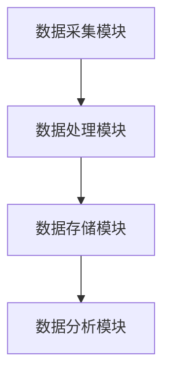
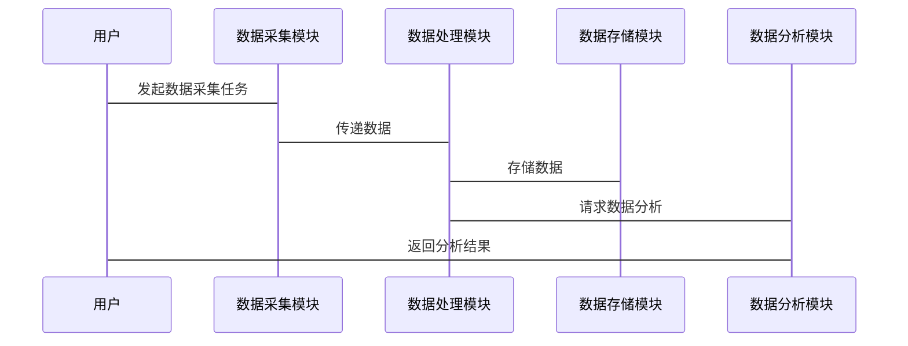

                 


# 企业AI Agent的数据治理框架

> 关键词：企业AI Agent、数据治理、知识图谱、自然语言处理、数据清洗、数据安全

> 摘要：本文详细探讨了企业AI Agent在数据治理中的应用，从数据治理的背景、核心概念、算法实现到系统架构设计，再到项目实战和最佳实践，系统地介绍了如何利用AI Agent构建高效的数据治理框架。文章结合实际案例，深入分析了知识图谱、自然语言处理等技术在数据治理中的应用，为企业的数据管理提供了理论与实践的双重指导。

---

## 第一部分: 企业AI Agent与数据治理概述

### 第1章: 企业AI Agent与数据治理概述

#### 1.1 企业AI Agent的定义与背景
##### 1.1.1 AI Agent的基本概念
AI Agent（人工智能代理）是指能够感知环境、自主决策并执行任务的智能实体。它通过传感器获取信息，利用推理引擎进行分析，并通过执行器采取行动。AI Agent在企业中的应用广泛，包括自动化决策、智能客服、数据治理等。

##### 1.1.2 企业数据治理的挑战
企业在数据治理中面临的主要挑战包括数据孤岛、数据不一致、数据安全与隐私保护、数据质量和数据价值挖掘等问题。这些问题直接影响企业的数据利用效率和决策能力。

##### 1.1.3 AI Agent在数据治理中的作用
AI Agent通过智能感知、自主决策和自动化执行，能够有效解决数据治理中的复杂问题。例如，AI Agent可以自动识别数据中的异常值，进行数据清洗，并通过自然语言处理技术理解数据内容，从而实现数据的智能化管理。

#### 1.2 数据治理框架的核心要素
##### 1.2.1 数据治理的目标与范围
数据治理的目标是确保数据的完整性、一致性、准确性和安全性。其范围涵盖数据的采集、存储、处理、分析和应用等全生命周期。

##### 1.2.2 数据治理的关键流程
数据治理的关键流程包括数据清洗、数据关联分析、数据安全与隐私保护、数据质量管理等。

##### 1.2.3 数据治理的组织架构
数据治理的组织架构通常包括数据治理委员会、数据管理团队、数据安全团队和技术支持团队。这些团队协同合作，确保数据治理目标的实现。

#### 1.3 企业AI Agent数据治理的必要性
##### 1.3.1 数据孤岛与不一致的问题
企业内部通常存在多个数据源，由于缺乏统一的数据标准，导致数据孤岛和不一致。AI Agent可以通过知识图谱技术将分散的数据进行整合，消除数据孤岛。

##### 1.3.2 数据安全与隐私保护
随着数据量的增加，数据安全和隐私保护变得尤为重要。AI Agent可以通过智能监控和异常检测，实时发现并阻止数据泄露行为。

##### 1.3.3 数据质量与价值挖掘
数据质量直接影响企业的决策能力。AI Agent可以通过数据清洗和关联分析，提高数据质量，并挖掘数据的潜在价值。

#### 1.4 本章小结
本章从AI Agent的基本概念出发，分析了企业数据治理的挑战，并阐述了AI Agent在数据治理中的重要作用。通过介绍数据治理框架的核心要素，为后续章节的展开奠定了基础。

---

## 第二部分: 数据治理框架的核心概念与技术基础

### 第2章: 数据治理框架的结构与原理

#### 2.1 数据治理框架的组成
##### 2.1.1 数据生命周期模型
数据生命周期包括数据的生成、存储、处理、分析、共享和销毁。数据治理需要覆盖数据生命周期的每一个阶段。

##### 2.1.2 数据治理的层次结构
数据治理的层次结构通常包括战略层、执行层、操作层和技术层。不同层次的治理目标和方法有所不同。

##### 2.1.3 数据治理框架的标准化
数据治理的标准化是确保数据一致性的重要手段。通过制定统一的数据标准，可以实现数据的高效共享和利用。

#### 2.2 AI Agent在数据治理中的角色
##### 2.2.1 AI Agent的智能决策能力
AI Agent通过机器学习和自然语言处理技术，能够智能识别数据中的异常和关联关系，为数据治理提供决策支持。

##### 2.2.2 AI Agent的自动化执行能力
AI Agent可以自动化执行数据清洗、数据关联分析等任务，减少人工干预，提高数据治理的效率。

##### 2.2.3 AI Agent的可扩展性与灵活性
AI Agent的设计需要具备可扩展性和灵活性，以适应不同企业的需求和数据环境的变化。

#### 2.3 数据治理框架的核心技术
##### 2.3.1 知识图谱构建与应用
知识图谱是一种用于表示知识的数据结构，通过构建知识图谱，可以实现对数据的语义理解和关联分析。

##### 2.3.2 自然语言处理与数据理解
自然语言处理技术可以帮助AI Agent理解非结构化数据，如文本、语音等，从而实现对数据的智能分析。

##### 2.3.3 数据清洗与标准化技术
数据清洗和标准化是数据治理的重要步骤，通过消除数据中的噪声和不一致，确保数据的准确性和一致性。

#### 2.4 本章小结
本章详细介绍了数据治理框架的组成和AI Agent在其中的作用，重点分析了知识图谱、自然语言处理等核心技术。这些技术为后续章节的算法实现和系统设计奠定了基础。

---

## 第三部分: 数据治理框架的算法与数学模型

### 第3章: 数据清洗与标准化算法

#### 3.1 数据清洗的必要性
##### 3.1.1 数据清洗
数据清洗是数据治理的重要步骤，旨在消除数据中的噪声和不一致，确保数据的准确性和一致性。

##### 3.1.2 数据清洗算法
常用的数据清洗算法包括基于规则的清洗、基于统计的清洗和基于机器学习的清洗。

##### 3.1.3 数据清洗的流程
数据清洗的流程通常包括数据预处理、数据去重、数据填补和数据转换等步骤。

#### 3.2 数据关联分析算法
##### 3.2.1 数据关联分析的定义
数据关联分析是指通过分析数据之间的关联关系，发现数据中的潜在模式和关联性。

##### 3.2.2 基于关联规则的学习算法
关联规则学习算法是数据关联分析的重要方法，常用算法包括Apriori算法和FP-Growth算法。

##### 3.2.3 数据关联分析的流程
数据关联分析的流程包括数据预处理、关联规则挖掘和规则筛选等步骤。

#### 3.3 数据清洗与标准化的数学模型
##### 3.3.1 数据清洗的数学模型
数据清洗可以通过基于统计的模型进行，例如使用均值、中位数等方法填补缺失值。

##### 3.3.2 数据标准化的数学模型
数据标准化通常采用归一化或标准化方法，例如Z-score标准化和Min-Max标准化。

##### 3.3.3 数据清洗与标准化的Python代码示例
```python
import pandas as pd
from sklearn.preprocessing import StandardScaler

# 示例数据
data = pd.DataFrame({
    'A': [1, 2, 3, 4, 5],
    'B': [2, 3, 4, 5, 6]
})

# 数据清洗：填补缺失值
data_clean = data.dropna()

# 数据标准化
scaler = StandardScaler()
data_normalized = scaler.fit_transform(data_clean)
```

#### 3.4 本章小结
本章详细介绍了数据清洗和数据关联分析的算法，并通过Python代码示例展示了数据清洗和标准化的具体实现。这些算法和数学模型为数据治理提供了技术支撑。

---

## 第四部分: 数据治理框架的系统架构设计

### 第4章: 数据治理系统的架构设计

#### 4.1 数据治理系统的组成
##### 4.1.1 数据采集模块
数据采集模块负责从各种数据源中采集数据，包括数据库、文件和API接口等。

##### 4.1.2 数据处理模块
数据处理模块负责对采集到的数据进行清洗、转换和标准化处理，确保数据的准确性和一致性。

##### 4.1.3 数据存储模块
数据存储模块负责将处理后的数据存储到数据库或其他存储系统中，便于后续的分析和应用。

##### 4.1.4 数据分析模块
数据分析模块负责对存储的数据进行关联分析、预测分析和数据可视化，挖掘数据的潜在价值。

#### 4.2 系统功能设计
##### 4.2.1 数据采集功能
数据采集功能包括数据源管理、数据格式转换和数据采集任务调度等功能。

##### 4.2.2 数据处理功能
数据处理功能包括数据清洗、数据关联分析和数据标准化等功能。

##### 4.2.3 数据存储功能
数据存储功能包括数据仓库管理、数据索引建设和数据版本控制等功能。

##### 4.2.4 数据分析功能
数据分析功能包括数据可视化、数据预测分析和数据挖掘等功能。

#### 4.3 系统架构设计
##### 4.3.1 系统模块划分
数据治理系统可以划分为数据采集模块、数据处理模块、数据存储模块和数据分析模块。

##### 4.3.2 系统架构图


##### 4.3.3 系统接口设计
系统接口设计包括数据采集接口、数据处理接口、数据存储接口和数据分析接口。

##### 4.3.4 系统交互流程


#### 4.4 本章小结
本章详细介绍了数据治理系统的组成和功能设计，并通过系统架构图和交互流程图展示了系统的整体架构。这些设计为后续的项目实施提供了指导。

---

## 第五部分: 数据治理框架的项目实战

### 第5章: 数据治理项目的实施

#### 5.1 项目背景与目标
##### 5.1.1 项目背景
本项目旨在通过AI Agent构建一个高效的数据治理框架，解决企业数据孤岛、数据不一致和数据安全等问题。

##### 5.1.2 项目目标
项目目标包括实现数据的统一管理、数据的智能分析和数据的安全保护。

#### 5.2 项目环境与工具
##### 5.2.1 环境配置
项目需要配置Python、Jupyter Notebook、TensorFlow和数据库等工具。

##### 5.2.2 工具选择
选择合适的工具和框架，例如使用Kafka进行数据采集，使用Elasticsearch进行数据存储和检索。

#### 5.3 核心代码实现
##### 5.3.1 数据采集与处理
```python
import kafka
from kafka import KafkaProducer

# 数据采集代码
producer = KafkaProducer(bootstrap_servers='localhost:9092')
producer.send('data_source', 'example_data')
```

##### 5.3.2 数据清洗与关联分析
```python
from sklearn.preprocessing import StandardScaler

# 数据清洗代码
data_clean = data.dropna()

# 数据关联分析代码
from mlxtend.frequent_patterns import apriori
frequent_items = apriori(data_clean, min_support=0.2)
```

##### 5.3.3 数据存储与分析
```python
from elasticsearch import Elasticsearch

# 数据存储代码
es = Elasticsearch()
es.indices.create(index='data_index')
```

#### 5.4 项目案例分析
##### 5.4.1 案例背景
通过一个零售企业的案例，展示如何利用AI Agent进行数据治理。

##### 5.4.2 数据治理过程
从数据采集到数据清洗，再到数据关联分析和数据存储，详细分析每个步骤的具体实施。

##### 5.4.3 实施效果
通过实施数据治理框架，企业实现了数据的统一管理，提高了数据质量，挖掘了数据的潜在价值。

#### 5.5 本章小结
本章通过一个具体的项目案例，详细展示了数据治理框架的实施过程和效果。这些经验对于其他企业具有重要的借鉴意义。

---

## 第六部分: 数据治理框架的最佳实践与总结

### 第6章: 最佳实践与总结

#### 6.1 最佳实践
##### 6.1.1 数据治理的组织架构
建议企业建立专门的数据治理团队，明确各团队的职责和协作方式。

##### 6.1.2 数据治理的技术选型
根据企业需求选择合适的技术和工具，确保数据治理的高效实施。

##### 6.1.3 数据治理的持续优化
数据治理是一个持续的过程，需要不断优化和改进。

#### 6.2 总结与展望
##### 6.2.1 本文总结
本文详细探讨了企业AI Agent在数据治理中的应用，从理论到实践，系统地介绍了数据治理框架的设计与实施。

##### 6.2.2 未来展望
随着AI技术的不断发展，AI Agent在数据治理中的应用将更加广泛和深入，数据治理的智能化和自动化将成为未来的发展趋势。

#### 6.3 注意事项
##### 6.3.1 数据安全与隐私保护
在数据治理过程中，必须高度重视数据安全和隐私保护，确保数据的合法合规使用。

##### 6.3.2 数据治理的可扩展性
数据治理框架需要具备良好的可扩展性，以适应企业未来发展的需求。

##### 6.3.3 数据治理的团队协作
数据治理需要多部门、多团队的协作，必须建立良好的沟通与协作机制。

#### 6.4 拓展阅读
##### 6.4.1 推荐书籍
- 《数据治理：从战略到实践》
- 《人工智能：一种现代的方法》

##### 6.4.2 推荐博客
- 数据治理博客
- 人工智能博客

#### 6.5 本章小结
本章总结了数据治理的最佳实践，并对未来的发展趋势进行了展望。通过注意事项和拓展阅读，为读者提供了进一步学习和实践的指导。

---

## 作者：AI天才研究院/AI Genius Institute & 禅与计算机程序设计艺术 /Zen And The Art of Computer Programming

