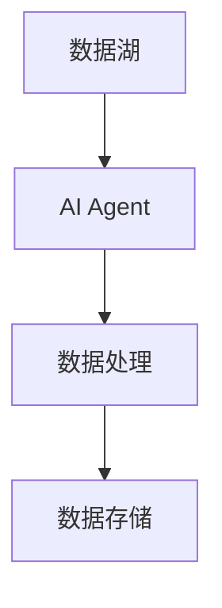
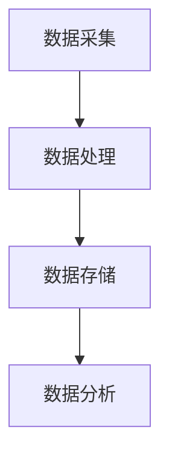

                 


# 企业AI Agent的数据湖架构设计

> 关键词：数据湖架构，AI Agent，企业智能，数据存储，智能分析，系统架构

> 摘要：本文将深入探讨企业AI Agent在数据湖架构中的设计与实现。通过系统化的分析和设计，结合实际案例，详细讲解数据湖架构的核心概念、算法原理、系统架构设计及项目实战。旨在为企业AI Agent的开发与应用提供理论支持和实践指导。

---

# 第1章: 数据湖与AI Agent概述

## 1.1 数据湖的概念与特点

### 1.1.1 数据湖的定义
数据湖是一种集中存储企业数据的平台，支持结构化数据、半结构化数据和非结构化数据的存储与管理。数据湖的特点是数据多样性、灵活性和可扩展性。

### 1.1.2 数据湖的核心特点
- **数据多样性**：支持多种数据类型（如文本、图像、音频等）。
- **灵活性**：数据存储与处理分离，支持多种分析工具。
- **可扩展性**：支持大规模数据存储和处理。

### 1.1.3 数据湖与数据仓库的区别
| 特性         | 数据湖                 | 数据仓库               |
|--------------|-----------------------|------------------------|
| 数据结构     | 支持多种数据结构       | 以结构化数据为主         |
| 存储方式     | 原始数据存储           | 经过处理后的数据存储     |
| 查询复杂度   | 支持复杂查询           | 优化查询性能             |
| 使用场景     | 数据探索、实验         | 固定报表、分析           |

## 1.2 AI Agent的定义与特点

### 1.2.1 AI Agent的定义
AI Agent（人工智能代理）是一种能够感知环境、执行任务并做出决策的智能实体。它能够通过与用户或系统的交互，自动完成复杂任务。

### 1.2.2 AI Agent的核心特点
- **智能性**：基于AI算法，能够进行推理、学习和决策。
- **自主性**：能够在没有人工干预的情况下自主运行。
- **交互性**：支持与用户或其他系统的交互。

### 1.2.3 AI Agent与传统AI的区别
| 特性         | AI Agent               | 传统AI                 |
|--------------|-----------------------|------------------------|
| 智能性       | 强化学习、自主决策       | 基于规则或特定任务         |
| 自主性       | 高                     | 低                     |
| 交互性       | 支持人机交互             | 仅限于特定任务执行         |

## 1.3 数据湖与AI Agent的结合

### 1.3.1 数据湖在AI Agent中的作用
数据湖为AI Agent提供了丰富的数据源，支持其进行数据处理、分析和决策。

### 1.3.2 AI Agent如何利用数据湖
- **数据存储**：AI Agent将收集到的数据存储在数据湖中。
- **数据处理**：AI Agent从数据湖中提取数据，进行清洗、转换和分析。
- **智能决策**：基于数据湖中的数据，AI Agent生成决策并反馈给用户。

### 1.3.3 数据湖与AI Agent的结合优势
- **数据丰富性**：数据湖存储了大量数据，为AI Agent提供了丰富的数据源。
- **灵活性**：数据湖支持多种数据类型和分析工具，适合AI Agent的多样化需求。
- **可扩展性**：数据湖能够扩展存储和计算能力，适应AI Agent的复杂任务需求。

## 1.4 本章小结
本章介绍了数据湖和AI Agent的基本概念、特点以及它们的结合方式。数据湖为AI Agent提供了数据支持，AI Agent则利用数据湖进行智能分析和决策。

---

# 第2章: 数据湖架构的核心概念与联系

## 2.1 数据湖架构的核心要素

### 2.1.1 数据源的多样性
数据湖支持多种数据源（如数据库、文件、API等），能够存储结构化、半结构化和非结构化数据。

### 2.1.2 数据存储的灵活性
数据湖支持多种存储格式（如CSV、JSON、Parquet等），并能够根据需求动态调整存储结构。

### 2.1.3 数据处理的高效性
数据湖支持分布式计算框架（如Hadoop、Spark），能够高效处理大规模数据。

## 2.2 AI Agent与数据湖的实体关系

### 2.2.1 实体关系图


## 2.3 数据湖与AI Agent的关系

### 2.3.1 数据湖为AI Agent提供数据支持
数据湖存储和管理企业数据，AI Agent从数据湖中获取数据进行分析和决策。

### 2.3.2 AI Agent为数据湖提供智能分析
AI Agent能够对数据湖中的数据进行深度分析，发现数据中的规律和价值。

## 2.4 本章小结
本章分析了数据湖架构的核心要素，并通过实体关系图展示了AI Agent与数据湖的关系。数据湖为AI Agent提供了数据支持，AI Agent则通过智能分析为数据湖提供价值。

---

# 第3章: 数据湖架构的算法原理讲解

## 3.1 数据湖中的数据处理流程

### 3.1.1 数据清洗
数据清洗是去除数据中的噪声和冗余数据，提高数据质量。

### 3.1.2 数据转换
数据转换是将数据从一种格式转换为另一种格式，以便于后续分析。

### 3.1.3 数据存储
数据存储是将处理后的数据存储到数据湖中，以便后续使用。

## 3.2 数据湖架构的算法流程

### 3.2.1 数据采集
数据采集是从多种数据源中获取数据，包括数据库、文件、API等。

### 3.2.2 数据分析
数据分析是对数据进行统计分析、机器学习分析等，发现数据中的规律。

### 3.2.3 数据可视化
数据可视化是将分析结果以图表、仪表盘等形式展示出来，帮助用户更好地理解数据。

## 3.3 数据湖架构的数学模型

### 3.3.1 数据清洗公式
$$ \text{清洗后数据量} = \text{原始数据量} \times \text{清洗率} $$

### 3.3.2 数据转换公式
$$ \text{转换后数据维度} = \text{原始数据维度} \times \text{转换因子} $$

## 3.4 本章小结
本章详细讲解了数据湖中的数据处理流程和算法原理，包括数据清洗、转换和存储。并通过数学公式展示了数据处理的效果。

---

# 第4章: 数据湖架构的系统分析与架构设计方案

## 4.1 问题场景介绍

### 4.1.1 数据湖的构建需求
企业需要构建一个支持多种数据类型、灵活存储和高效处理的数据湖。

### 4.1.2 AI Agent的功能需求
AI Agent需要能够从数据湖中获取数据，进行智能分析和决策。

### 4.1.3 系统的边界与外延
数据湖的边界是企业内部数据，AI Agent的边界是企业智能应用。

## 4.2 系统功能设计

### 4.2.1 数据采集模块
数据采集模块负责从多种数据源中获取数据，包括数据库、文件、API等。

### 4.2.2 数据处理模块
数据处理模块负责对数据进行清洗、转换和存储。

### 4.2.3 数据分析模块
数据分析模块负责对数据湖中的数据进行统计分析和机器学习分析。

## 4.3 系统架构设计

### 4.3.1 分层架构设计


## 4.4 系统接口设计

### 4.4.1 数据接口
数据接口用于数据湖与AI Agent之间的数据交互。

### 4.4.2 API接口
API接口用于数据湖与其他系统的数据交互。

### 4.4.3 用户接口
用户接口用于用户与数据湖的交互。

## 4.5 系统交互设计

### 4.5.1 数据采集流程
1. AI Agent向数据湖发送数据采集请求。
2. 数据湖从多种数据源中获取数据。
3. 数据湖将数据传输给AI Agent。

### 4.5.2 数据处理流程
1. AI Agent将数据传输给数据湖。
2. 数据湖对数据进行清洗和转换。
3. 数据湖将处理后的数据存储起来。

### 4.5.3 数据分析流程
1. AI Agent向数据湖发送数据分析请求。
2. 数据湖从存储中获取数据。
3. 数据湖对数据进行分析并返回结果。

## 4.6 本章小结
本章通过系统分析和架构设计，展示了数据湖与AI Agent的结合方式。分层架构和模块化设计确保了系统的灵活性和可扩展性。

---

# 第5章: 数据湖架构的项目实战

## 5.1 环境安装与配置

### 5.1.1 数据湖构建工具安装
安装Hadoop、Hive等数据湖构建工具。

### 5.1.2 AI Agent开发环境配置
安装Python、TensorFlow等AI开发工具。

## 5.2 核心代码实现

### 5.2.1 数据采集代码
```python
import requests

def fetch_data(url):
    response = requests.get(url)
    return response.json()
```

### 5.2.2 数据处理代码
```python
import pandas as pd

def clean_data(df):
    df.dropna(inplace=True)
    df['date'] = pd.to_datetime(df['date'])
    return df
```

### 5.2.3 数据分析代码
```python
from sklearn import linear_model

def predict_sales(data):
    model = linear_model.LinearRegression()
    model.fit(data[['price', 'quantity']], data['revenue'])
    return model.predict(data[['price', 'quantity']])
```

## 5.3 案例分析与解读

### 5.3.1 案例背景
某企业希望通过AI Agent分析销售数据，预测未来销售额。

### 5.3.2 数据处理流程
1. 从数据湖中获取销售数据。
2. 对数据进行清洗和转换。
3. 使用机器学习模型预测销售额。

### 5.3.3 代码实现与结果
```python
data = fetch_data('http://sales-data.com/api')
cleaned_data = clean_data(data)
predictions = predict_sales(cleaned_data)
print(predictions)
```

## 5.4 本章小结
本章通过实际案例展示了数据湖架构在AI Agent中的应用。从环境配置到代码实现，详细讲解了如何利用数据湖进行数据分析和预测。

---

# 作者：AI天才研究院/AI Genius Institute & 禅与计算机程序设计艺术 /Zen And The Art of Computer Programming

---

以上是《企业AI Agent的数据湖架构设计》的文章结构和内容框架。

