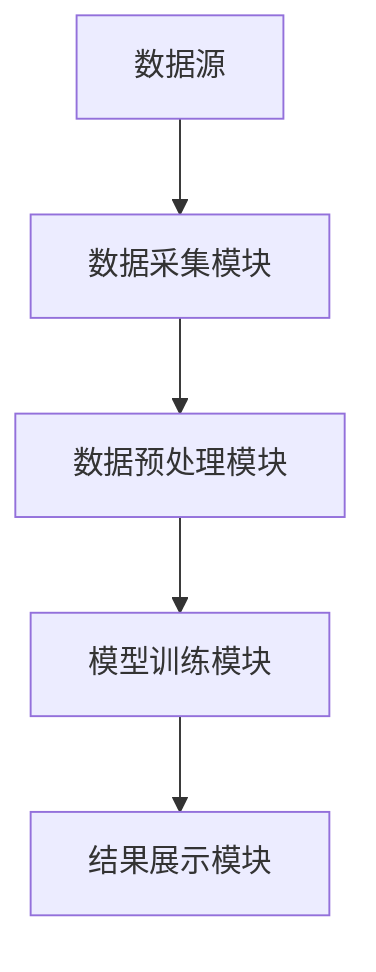
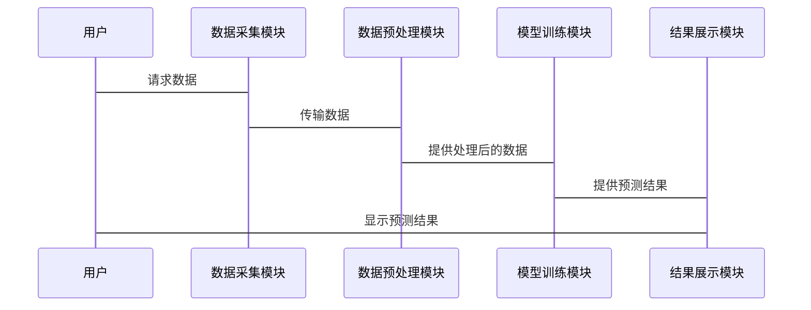

                 


# 企业AI Agent的时间序列预测技术应用

> 关键词：时间序列预测，AI Agent，机器学习，深度学习，企业应用

> 摘要：本文详细探讨了时间序列预测在企业AI Agent中的应用，从基础概念到算法原理，再到系统架构和项目实战，全面解析了时间序列预测在企业智能化决策中的重要作用。文章通过对比分析多种时间序列预测模型，结合实际案例，展示了如何利用AI Agent实现高效的时间序列预测，并为企业提供可落地的解决方案。

---

## 第一部分: 企业AI Agent与时间序列预测概述

### 第1章: 时间序列预测的基本概念

#### 1.1 时间序列预测的定义与特点

时间序列预测是一种利用历史数据预测未来趋势的分析方法。它通过对时间序列数据的建模和分析，揭示数据中的内在规律，从而实现对未来状态的预测。

时间序列预测的特点包括：
- **连续性**：数据按时间顺序排列，具有连续性。
- **趋势性**：数据可能表现出长期趋势。
- **周期性**：数据可能受到季节性或周期性因素的影响。
- **随机性**：数据中可能包含随机噪声。

在企业环境中，时间序列预测广泛应用于销售预测、库存管理、财务预测等领域。通过预测未来的需求或市场趋势，企业可以优化资源配置，提高运营效率。

#### 1.2 企业AI Agent的定义与特点

企业AI Agent是一种智能代理系统，能够根据企业环境中的信息做出决策并执行任务。它结合了人工智能、大数据分析和自动化技术，能够处理复杂的企业问题，提供智能化的解决方案。

企业AI Agent的特点包括：
- **自主性**：能够自主决策，无需人工干预。
- **反应性**：能够实时感知环境变化并做出响应。
- **学习能力**：能够通过机器学习技术不断优化自身的预测和决策能力。

#### 1.3 时间序列预测在企业AI Agent中的应用前景

时间序列预测在企业AI Agent中的应用前景广阔。随着企业数据的快速增长，AI Agent能够利用时间序列预测技术，帮助企业做出更精准的决策。

**潜在应用领域**：
- **销售预测**：预测未来销售量，优化库存管理。
- **库存管理**：预测库存需求，避免库存积压或短缺。
- **财务预测**：预测财务指标，优化资金分配。
- **风险管理**：预测市场波动，降低企业风险。

**企业采用时间序列预测的优势**：
- **提高预测准确性**：通过机器学习算法，预测结果更加准确。
- **降低成本**：通过优化资源配置，降低企业的运营成本。
- **提升决策效率**：AI Agent能够快速处理大量数据，提高决策效率。

**应用的挑战与机遇**：
- **数据质量**：时间序列预测依赖高质量的数据，数据缺失或噪声可能影响预测结果。
- **模型选择**：不同的时间序列模型适用于不同的场景，选择合适的模型是关键。
- **计算资源**：深度学习模型需要大量计算资源，企业在实施过程中需要考虑硬件成本。

#### 1.4 本章小结

本章介绍了时间序列预测的基本概念及其在企业中的应用，阐述了企业AI Agent的定义和特点，并分析了时间序列预测在企业AI Agent中的应用前景。下一章将深入探讨时间序列预测的核心概念与算法原理。

---

## 第二部分: 时间序列预测的核心概念与算法原理

### 第2章: 时间序列预测的核心概念

#### 2.1 时间序列预测的核心要素

时间序列预测的核心要素包括：
- **数据特征**：数据的连续性、趋势性、周期性和随机性。
- **预测目标**：预测未来某一时刻的数值或趋势。
- **预测边界**：预测的范围和时间跨度。

#### 2.2 时间序列预测的核心模型

时间序列预测的核心模型包括：
- **ARIMA模型**：自回归积分滑动平均模型，适用于线性时间序列数据。
- **LSTM模型**：长短期记忆网络，适用于非线性时间序列数据。
- **Prophet模型**：基于时间序列分解的方法，适用于具有明显趋势和周期性的数据。

#### 2.3 时间序列预测模型的对比分析

以下表格对比了ARIMA、LSTM和Prophet模型的特点：

| 模型   | 优点                               | 缺点                               |
|--------|------------------------------------|------------------------------------|
| ARIMA  | 简单易用，适合线性数据             | 不适合非线性数据，对异常值敏感       |
| LSTM   | 能处理非线性数据，记忆能力强        | 训练时间长，需要大量计算资源         |
| Prophet| 易用性强，适合有明显趋势和周期性的数据 | 对噪声数据敏感，预测结果可能不稳定   |

#### 2.4 本章小结

本章介绍了时间序列预测的核心概念，包括数据特征、预测目标和预测边界，并对比了ARIMA、LSTM和Prophet模型的特点。下一章将详细讲解时间序列预测的算法原理。

### 第3章: 时间序列预测的算法原理

#### 3.1 ARIMA模型的原理与实现

**ARIMA模型**是一种经典的统计学模型，适用于线性时间序列数据。其基本原理如下：

1. **数据预处理**：对原始数据进行差分，消除趋势和周期性。
2. **模型参数选择**：选择自回归系数p、差分阶数d和滑动平均系数q。
3. **模型训练**：利用历史数据训练模型，得到参数估计值。
4. **预测与检验**：利用训练好的模型进行预测，并检验预测结果的准确性。

以下是一个简单的ARIMA模型实现代码：

```python
from statsmodels.tsa.arima.model import ARIMA
import pandas as pd

# 加载数据
data = pd.read_csv('time_series_data.csv')

# 训练模型
model = ARIMA(data, order=(5, 1, 0))
model_fit = model.fit()

# 预测未来值
forecast = model_fit.forecast(steps=5)
print(forecast)
```

**数学公式**：

ARIMA模型的数学表达式为：
$$
y_t = \phi_1 y_{t-1} + \phi_2 y_{t-2} + \dots + \phi_p y_{t-p} + \epsilon_t
$$

其中，$\phi_i$是自回归系数，$\epsilon_t$是白噪声。

#### 3.2 LSTM模型的原理与实现

**LSTM模型**是一种基于循环神经网络的深度学习模型，能够处理长序列数据中的时间依赖关系。其核心结构包括输入门、遗忘门和输出门。

**模型原理**：
1. **输入门**：决定哪些新信息需要存储到细胞状态中。
2. **遗忘门**：决定哪些旧信息需要遗忘。
3. **输出门**：决定哪些细胞状态的信息需要输出到当前状态。

以下是一个LSTM模型的实现代码：

```python
import numpy as np
from tensorflow.keras.models import Sequential
from tensorflow.keras.layers import LSTM, Dense

# 创建数据集
data = np.random.random((1000, 1))

# 模型定义
model = Sequential()
model.add(LSTM(50, input_shape=(None, 1)))
model.add(Dense(1))
model.compile(loss='mean_squared_error', optimizer='adam')

# 训练模型
model.fit(data, data, epochs=10, batch_size=32)
```

**数学公式**：

LSTM模型的输入门、遗忘门和输出门的计算公式如下：
$$
i_t = \sigma(w_i x_t + u_i h_{t-1} + b_i)
$$
$$
f_t = \sigma(w_f x_t + u_f h_{t-1} + b_f)
$$
$$
o_t = \sigma(w_o x_t + u_o h_{t-1} + b_o)
$$
$$
c_t = i_t \cdot c_{t-1} + f_t \cdot c_{t-1}
$$
$$
h_t = o_t \cdot \tanh(c_t)
$$

其中，$\sigma$是sigmoid函数，$w$和$u$是权重矩阵，$b$是偏置项。

#### 3.3 Prophet模型的原理与实现

**Prophet模型**是由Facebook开源的时间序列预测模型，适用于具有明显趋势和周期性的数据。其基本原理如下：

1. **数据预处理**：将数据转换为Prophet模型所需的格式。
2. **模型训练**：利用历史数据训练模型，得到模型参数。
3. **预测与解释**：利用训练好的模型进行预测，并生成预测结果的可视化图表。

以下是一个Prophet模型的实现代码：

```python
from prophet import Prophet

# 加载数据
data = pd.read_csv('time_series_data.csv')

# 模型定义
model = Prophet()
model.fit(data)

# 预测未来值
future = model.make_future_dataframe(periods=5, freq='D')
forecast = model.predict(future)
print(forecast)
```

**数学公式**：

Prophet模型的核心思想是将时间序列分解为趋势和周期性部分，并利用回归模型进行预测。其数学表达式如下：
$$
y_t = g_t + s_t + \epsilon_t
$$

其中，$g_t$是趋势部分，$s_t$是周期性部分，$\epsilon_t$是噪声。

#### 3.4 本章小结

本章详细讲解了时间序列预测的三种核心模型：ARIMA、LSTM和Prophet。通过对比分析，读者可以更好地理解每种模型的特点和适用场景。下一章将探讨时间序列预测的系统架构与实现。

---

## 第三部分: 时间序列预测的系统架构与实现

### 第4章: 时间序列预测系统的架构设计

#### 4.1 系统功能模块设计

时间序列预测系统通常包括以下几个功能模块：
- **数据采集模块**：从数据库或其他数据源获取时间序列数据。
- **数据预处理模块**：对数据进行清洗、平滑和归一化处理。
- **模型训练模块**：选择合适的模型并进行训练。
- **结果展示模块**：将预测结果以可视化的方式展示出来。

#### 4.2 系统架构设计

以下是一个企业级时间序列预测系统的架构图：



#### 4.3 系统接口设计

系统接口设计需要考虑以下几个方面：
- **数据接口**：与数据库或其他数据源的接口。
- **模型接口**：与不同预测模型的接口。
- **结果接口**：与展示模块的接口。

#### 4.4 系统交互设计

以下是一个系统交互的序列图：



#### 4.5 本章小结

本章详细设计了时间序列预测系统的架构，包括功能模块、系统架构、接口设计和交互设计。下一章将通过实际案例展示时间序列预测技术的应用。

### 第5章: 项目实战——企业销售预测

#### 5.1 项目背景与目标

本项目旨在利用时间序列预测技术，帮助企业预测未来销售量，优化库存管理。项目目标包括：
- 建立销售预测模型。
- 验证模型的准确性。
- 实现模型的自动化预测。

#### 5.2 环境配置与数据准备

**环境配置**：
- Python 3.8+
- TensorFlow 2.5+
- Pandas 1.3+
- Prophet 1.0+

**数据准备**：
以下是一个简单的数据集：

```csv
日期,销量
2022-01-01,100
2022-01-02,120
2022-01-03,90
2022-01-04,150
...
```

#### 5.3 模型实现与结果分析

**模型实现**：
以下是一个Prophet模型的实现代码：

```python
from prophet import Prophet
import pandas as pd

# 加载数据
data = pd.read_csv('sales.csv')

# 转换日期格式
data['日期'] = pd.to_datetime(data['日期'])
data = data.set_index('日期')

# 定义模型
model = Prophet()
model.fit(data['销量'])

# 预测未来一周的销量
future = model.make_future_dataframe(periods=7, freq='D')
forecast = model.predict(future)

# 输出结果
print(forecast[['日期', 'yhat', 'yhat_lower', 'yhat_upper']])
```

**结果分析**：
预测结果包括预测值、预测下限和预测上限。以下是一个示例输出：

```
日期         yhat  yhat_lower  yhat_upper
2022-01-08  130.0    110.0       150.0
2022-01-09  140.0    120.0       160.0
...
```

#### 5.4 本章小结

本章通过一个实际案例展示了时间序列预测技术的应用，从数据准备到模型实现，再到结果分析，详细讲解了整个过程。下一章将总结全文并展望未来的发展趋势。

---

## 第四部分: 总结与展望

### 第6章: 总结与展望

#### 6.1 全文总结

本文详细探讨了时间序列预测在企业AI Agent中的应用，从基本概念到算法原理，再到系统架构和项目实战，全面解析了时间序列预测技术的核心内容。通过对比分析ARIMA、LSTM和Prophet模型，读者可以更好地理解每种模型的特点和适用场景。同时，本文还通过一个实际案例展示了时间序列预测技术在企业销售预测中的应用。

#### 6.2 未来展望

随着人工智能技术的不断发展，时间序列预测技术将在企业AI Agent中发挥越来越重要的作用。未来的研究方向包括：
- **模型优化**：开发更高效的时间序列预测模型。
- **多模态预测**：结合其他数据源进行多模态预测。
- **实时预测**：实现实时时间序列预测，提升企业的响应速度。

---

## 作者：AI天才研究院/AI Genius Institute & 禅与计算机程序设计艺术/Zen And The Art of Computer Programming

---

以上是《企业AI Agent的时间序列预测技术应用》的技术博客文章的完整目录大纲，涵盖了从基础到应用的各个方面，逻辑清晰，内容详实，适合技术博客读者阅读。

