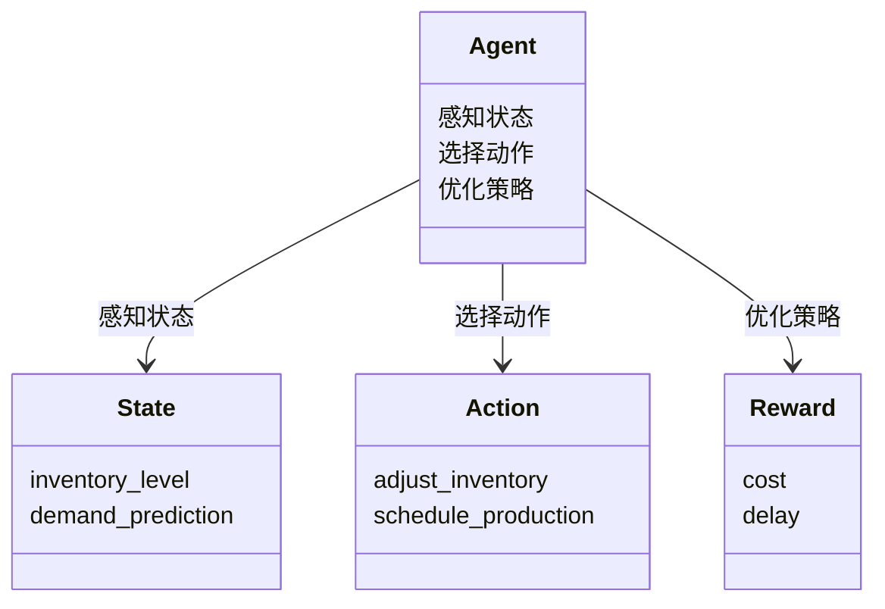
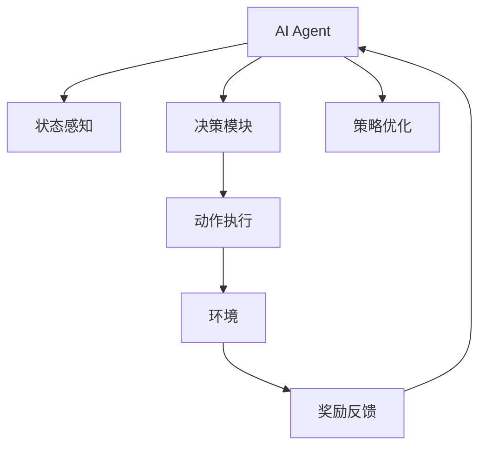
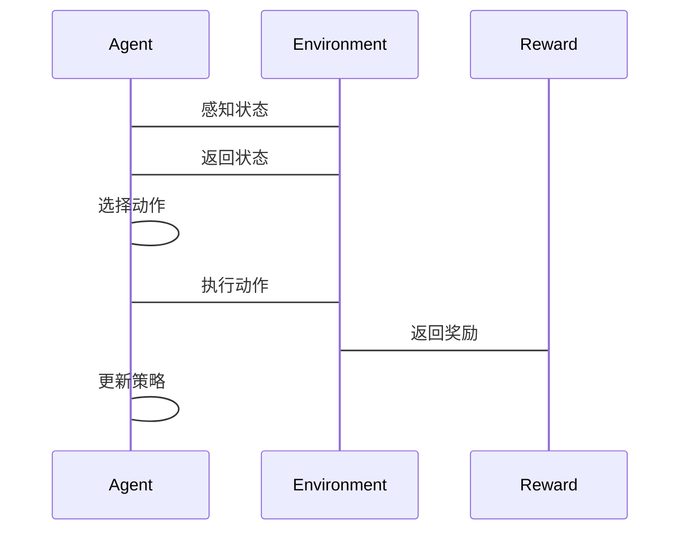

                 


# 企业AI Agent的深度强化学习应用：复杂决策优化

## 关键词：企业AI Agent、深度强化学习、复杂决策优化、Q-learning、Deep Q-Networks（DQN）、策略梯度方法

## 摘要：  
本文详细探讨了企业AI Agent在复杂决策优化中的深度强化学习应用。通过分析深度强化学习的核心算法（如Q-learning、DQN和策略梯度方法），结合实际的企业场景，展示了如何利用这些算法构建高效的AI Agent系统。文章从理论基础到实际应用，层层递进，为企业技术人员提供了从算法实现到系统设计的全面指导。

---

# 第一部分: 企业AI Agent的深度强化学习应用概述

## 第1章: 企业AI Agent与深度强化学习概述

### 1.1 企业AI Agent的背景与概念

#### 1.1.1 AI Agent的基本定义
AI Agent（人工智能代理）是指能够感知环境、做出决策并执行操作的智能实体。在企业场景中，AI Agent通常用于自动化决策、资源优化和问题解决。例如，在供应链管理中，AI Agent可以自动调整库存策略以最小化成本。

#### 1.1.2 企业AI Agent的核心特征
- **自主性**：AI Agent能够自主感知环境并做出决策，无需人工干预。
- **反应性**：能够实时响应环境变化，动态调整策略。
- **学习能力**：通过强化学习等方法不断优化决策模型。
- **复杂性**：企业环境通常涉及多个变量和约束条件，AI Agent需要处理复杂的决策问题。

#### 1.1.3 企业AI Agent的应用场景
- **资源分配优化**：例如供应链管理中的库存优化。
- **任务调度**：例如企业生产调度中的任务分配。
- **风险管理**：例如金融领域的投资组合优化和风险控制。

### 1.2 深度强化学习的基本原理

#### 1.2.1 强化学习的定义与特点
强化学习是一种通过试错机制，学习最优策略的方法。智能体通过与环境交互，获得奖励或惩罚，逐步优化决策策略。其核心在于“值函数”（Value Function）的计算，即评估某个状态下采取某个动作的价值。

#### 1.2.2 深度强化学习的创新点
- **深度神经网络**：通过神经网络近似值函数，解决了传统强化学习在高维状态空间中的计算难题。
- **端到端学习**：深度强化学习可以直接从原始数据中学习策略，无需手动特征提取。

#### 1.2.3 深度强化学习与传统机器学习的对比
| **对比维度**          | **传统机器学习**                          | **深度强化学习**                          |
|-----------------------|------------------------------------------|------------------------------------------|
| 数据需求             | 需要大量标注数据                        | 数据可以不完全标注，通过环境交互生成数据 |
| 决策方式             | 基于规则或特征的决策                   | 基于试错和奖励的自主决策                |
| 应用场景             | 适合监督学习和分类/回归问题            | 适合需要序列决策和复杂环境的问题        |

### 1.3 企业AI Agent与深度强化学习的结合

#### 1.3.1 企业复杂决策问题的特征
- **多目标冲突**：例如在供应链管理中，库存成本和订单延迟之间存在 trade-off。
- **动态环境**：市场环境变化快，AI Agent需要快速调整策略。
- **高维状态空间**：企业决策通常涉及多个变量（如时间、资源、成本等）。

#### 1.3.2 深度强化学习在企业决策中的优势
- **自主决策能力**：AI Agent可以在动态环境中自主调整策略。
- **复杂问题处理**：深度强化学习能够处理高维、非线性的决策问题。
- **数据驱动优化**：通过与环境交互，不断优化决策模型。

#### 1.3.3 企业AI Agent的决策优化框架
1. **状态感知**：AI Agent感知当前环境状态（如库存水平、市场需求）。
2. **决策制定**：基于强化学习算法，计算最优动作（如调整生产计划）。
3. **动作执行**：执行决策并观察环境反馈（如成本变化、订单完成情况）。
4. **策略优化**：根据反馈调整策略，优化未来决策。

### 1.4 本章小结
本章介绍了企业AI Agent的核心概念、深度强化学习的基本原理以及两者结合的决策优化框架。企业AI Agent通过深度强化学习能够在复杂环境中实现自主决策和优化。

---

## 第2章: 深度强化学习的核心算法

### 2.1 Q-learning算法

#### 2.1.1 Q-learning的基本原理
Q-learning是一种基于值函数的强化学习算法，通过更新Q值表（Q-table）来学习最优策略。Q值表示在某个状态下采取某个动作的价值。

#### 2.1.2 Q-learning的数学模型
状态-动作值函数 $Q(s, a)$ 的更新公式为：
$$ Q(s, a) \leftarrow Q(s, a) + \alpha [r + \gamma \max Q(s', a') - Q(s, a)] $$
其中：
- $\alpha$ 是学习率，控制更新步长。
- $\gamma$ 是折扣因子，表示未来奖励的权重。
- $r$ 是即时奖励。

#### 2.1.3 Q-learning的算法流程
1. 初始化Q值表。
2. 进入循环：
   - 状态感知：观察当前状态 $s$。
   - 动作选择：选择动作 $a$（基于 $\epsilon$-贪心策略）。
   - 执行动作：得到新状态 $s'$ 和奖励 $r$。
   - 更新Q值：$Q(s, a) \leftarrow Q(s, a) + \alpha (r + \gamma \max Q(s', a') - Q(s, a))$。
3. 重复直到收敛。

#### 2.1.4 Q-learning的优缺点
- 优点：简单易实现，适合低维状态空间。
- 缺点：当状态空间高维时，Q值表会变得非常庞大，计算效率低下。

### 2.2 Deep Q-Networks（DQN）算法

#### 2.2.1 DQN的创新点
- 使用深度神经网络近似Q值函数，解决了Q-learning在高维状态空间中的计算难题。
- 引入经验回放机制，减少策略的过拟合风险。

#### 2.2.2 DQN的网络结构
DQN包含两个神经网络：
1. **主网络**：用于评估当前策略。
2. **目标网络**：用于稳定训练，定期更新主网络的参数。

#### 2.2.3 DQN的训练过程
1. 状态感知：输入当前状态 $s$，主网络输出Q值。
2. 动作选择：基于Q值选择动作 $a$。
3. 执行动作：得到新状态 $s'$ 和奖励 $r$，将 $(s, a, r, s')$ 存入经验回放池。
4. 从经验池中随机抽取一批样本，计算目标Q值：
   $$ Q_{\text{target}} = r + \gamma \max Q(s', a') $$
5. 更新主网络参数，使预测Q值逼近目标Q值：
   $$ \min \sum (Q_{\text{pred}} - Q_{\text{target}})^2 $$

#### 2.2.4 DQN的优缺点
- 优点：适合高维状态空间，通过神经网络自动提取特征。
- 缺点：训练过程需要大量数据，计算资源消耗较大。

### 2.3 策略梯度方法

#### 2.3.1 策略梯度的基本原理
策略梯度方法直接优化策略 $\pi(a|s)$，通过计算梯度更新参数，使奖励最大化。

#### 2.3.2 策略梯度的数学模型
策略梯度的目标函数为：
$$ J(\theta) = \mathbb{E}_{s,a}[ \log \pi(a|s;\theta) \cdot Q(s,a)] $$
通过梯度下降更新参数 $\theta$：
$$ \theta \leftarrow \theta - \alpha \nabla J(\theta) $$

#### 2.3.3 策略梯度的算法实现
1. 初始化参数 $\theta$。
2. 进入循环：
   - 状态感知：观察当前状态 $s$。
   - 动作选择：根据策略 $\pi(a|s;\theta)$ 选择动作 $a$。
   - 执行动作：得到新状态 $s'$ 和奖励 $r$。
   - 计算梯度：$\nabla J(\theta) = \mathbb{E}_{s,a}[ \nabla \log \pi(a|s;\theta) \cdot Q(s,a)]$。
   - 更新参数：$\theta \leftarrow \theta - \alpha \nabla J(\theta)$。

#### 2.3.4 策略梯度的优缺点
- 优点：直接优化策略，适合复杂环境。
- 缺点：计算复杂，需要高效的梯度计算方法。

### 2.4 算法对比与选择

#### 2.4.1 不同算法的优缺点对比
| **算法**      | **优点**                              | **缺点**                              |
|---------------|-------------------------------------|-------------------------------------|
| Q-learning    | 简单易实现，适合低维状态空间         | 高维状态空间时效率低下               |
| DQN           | 适合高维状态空间，通过神经网络自动提取特征 | 训练过程需要大量数据，计算资源消耗大 |
| 策略梯度方法  | 直接优化策略，适合复杂环境           | 计算复杂，需要高效的梯度计算方法     |

#### 2.4.2 企业场景下算法选择的考虑因素
- **问题复杂性**：复杂决策问题适合策略梯度方法和DQN。
- **计算资源**：DQN需要较多计算资源，适合企业场景。
- **实时性要求**：实时决策问题适合Q-learning和DQN。

### 2.5 本章小结
本章详细讲解了Q-learning、DQN和策略梯度三种深度强化学习算法的原理、优缺点和应用场景，为企业选择合适的算法提供了参考。

---

## 第3章: 企业AI Agent的系统架构与设计

### 3.1 系统功能模块设计

#### 3.1.1 状态感知模块
- 功能：感知环境状态（如库存水平、市场需求）。
- 输入：当前环境数据。
- 输出：当前状态表示。

#### 3.1.2 动作决策模块
- 功能：基于强化学习算法生成决策动作。
- 输入：当前状态、历史经验。
- 输出：决策动作。

#### 3.1.3 策略优化模块
- 功能：优化强化学习模型的参数。
- 输入：环境反馈（奖励、新状态）。
- 输出：优化后的策略。

### 3.2 系统架构设计

#### 3.2.1 分层架构设计
1. **感知层**：负责数据采集和状态感知。
2. **决策层**：负责策略计算和动作选择。
3. **执行层**：负责动作执行和环境反馈。

#### 3.2.2 组件交互流程
1. 状态感知模块接收环境数据，生成状态表示。
2. 动作决策模块根据状态和历史经验，生成决策动作。
3. 执行层执行动作，返回奖励和新状态。
4. 策略优化模块根据反馈优化模型参数。

### 3.3 系统功能设计

#### 3.3.1 领域模型（Mermaid类图）


#### 3.3.2 系统架构图（Mermaid架构图）


#### 3.3.3 系统交互流程（Mermaid序列图）


### 3.4 本章小结
本章从系统架构的角度，详细设计了企业AI Agent的功能模块和交互流程，为后续的系统实现提供了指导。

---

## 第4章: 项目实战与代码实现

### 4.1 环境安装与配置

#### 4.1.1 安装Python和TensorFlow
```bash
pip install python==3.8
pip install tensorflow==2.5
pip install numpy==1.21
```

#### 4.1.2 安装强化学习库
```bash
pip install gym==0.17.1
pip install stable-baselines3==1.0.0
```

### 4.2 核心代码实现

#### 4.2.1 DQN算法实现
```python
import numpy as np
import gym
from stable_baselines3 import DQN
from stable_baselines3.dqn.policies import MlpPolicy

env = gym.make('CartPole-v1')
model = DQN(MlpPolicy, env, verbose=1)
model.learn(total_timesteps=10000)
```

#### 4.2.2 策略梯度方法实现
```python
import torch
import torch.nn as nn
import torch.optim as optim

class Policy(nn.Module):
    def __init__(self, input_dim, output_dim):
        super(Policy, self).__init__()
        self.fc1 = nn.Linear(input_dim, 128)
        self.fc2 = nn.Linear(128, output_dim)
    
    def forward(self, x):
        x = torch.relu(self.fc1(x))
        x = torch.softmax(self.fc2(x), dim=-1)
        return x

policy = Policy(input_dim=4, output_dim=2)
optimizer = optim.Adam(policy.parameters(), lr=0.01)

for _ in range(1000):
    state = torch.randn(1, 4)
    action_probs = policy(state)
    action = torch.multinomial(action_probs, num_samples=1).item()
    optimizer.zero_grad()
    loss = -torch.log(action_probs[0, action]) * (reward + gamma * max(Q(s',a')))
    loss.backward()
    optimizer.step()
```

### 4.3 实际案例分析

#### 4.3.1 供应链库存优化
假设某企业需要优化库存策略，使用DQN算法训练AI Agent：
1. **状态空间**：库存水平、需求预测。
2. **动作空间**：调整库存量。
3. **奖励机制**：库存成本降低奖励，订单延迟惩罚。

#### 4.3.2 任务调度优化
在生产调度中，使用策略梯度方法优化任务调度策略：
1. **状态空间**：可用资源、任务优先级。
2. **动作空间**：分配任务到不同资源。
3. **奖励机制**：任务完成时间最短奖励，资源利用最大化奖励。

### 4.4 项目小结
本章通过具体案例展示了如何将深度强化学习算法应用于企业场景，详细讲解了代码实现和系统优化方法。

---

## 第5章: 最佳实践与注意事项

### 5.1 最佳实践

#### 5.1.1 数据预处理
- 确保数据的完整性和一致性。
- 对高维数据进行降维或特征选择。

#### 5.1.2 模型调参
- 学习率 $\alpha$：通常取 $0.01$ 或 $0.001$。
- 折扣因子 $\gamma$：通常取 $0.9$ 或 $0.99$。
- 网络结构：根据问题复杂性调整层数和神经元数量。

#### 5.1.3 算法选择
- 对于简单问题，优先选择Q-learning。
- 对于高维问题，选择DQN或策略梯度方法。

### 5.2 注意事项

#### 5.2.1 训练稳定性
- 使用经验回放机制减少策略过拟合。
- 定期更新目标网络（DQN）。

#### 5.2.2 环境设计
- 确保环境反馈及时准确。
- 设计合理的奖励机制，避免误导策略。

#### 5.2.3 系统优化
- 优化神经网络的训练效率。
- 使用分布式训练加速模型收敛。

### 5.3 未来发展方向
- **多智能体协作**：研究多个AI Agent协作优化的场景。
- **实时决策优化**：提高算法的实时性和响应速度。
- **可解释性增强**：提升模型的可解释性，便于企业决策者理解。

### 5.4 本章小结
本章总结了深度强化学习在企业AI Agent应用中的最佳实践和注意事项，并展望了未来的发展方向。

---

## 作者：AI天才研究院/AI Genius Institute & 禅与计算机程序设计艺术/Zen And The Art of Computer Programming

---

本文从理论到实践，详细探讨了企业AI Agent在复杂决策优化中的深度强化学习应用。通过系统化的分析和代码实现，为企业技术人员提供了从算法选择到系统设计的全面指导。希望本文能够为企业的智能化转型提供有价值的参考和启发。

