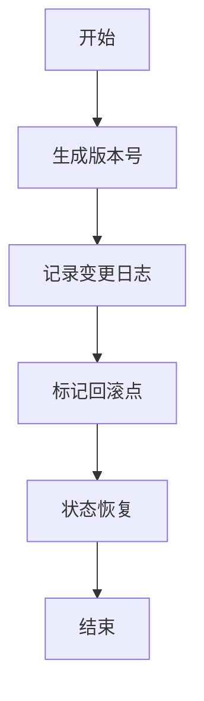
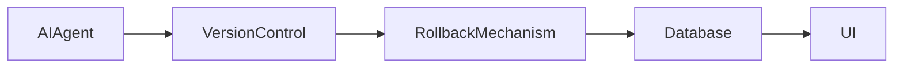

                 


# 企业AI Agent的版本控制与回滚机制

## 关键词

- 企业AI Agent
- 版本控制
- 回滚机制
- 系统架构
- 算法原理
- 项目实战

## 摘要

企业AI Agent的版本控制与回滚机制是当前人工智能领域中的一个重要研究方向。随着企业中AI Agent的广泛应用，如何有效地管理和控制AI Agent的版本，以及在出现问题时能够快速回滚到之前的稳定版本，成为了企业技术团队面临的重要挑战。本文将从问题背景、核心概念、算法原理、系统架构设计、项目实战等多个方面进行详细阐述，深入分析企业AI Agent版本控制与回滚机制的关键技术和实现方法，为企业技术团队提供理论支持和实践指导。

## 第一部分: 企业AI Agent的背景与概念

### 第1章: 问题背景与描述

#### 1.1 问题背景

随着企业数字化转型的不断深入，AI Agent（人工智能代理）在企业中的应用越来越广泛。AI Agent是一种能够感知环境、自主决策并执行任务的智能实体，它可以广泛应用于客服、推荐系统、自动化运维等领域。然而，AI Agent的复杂性和动态性使得其版本管理和回滚机制变得尤为重要。

在企业AI Agent的开发和部署过程中，版本控制是确保系统稳定性和可追溯性的关键环节。由于AI Agent的更新可能涉及算法、模型和业务逻辑的调整，任何一次更新都可能带来不可预知的风险。因此，如何在出现问题时快速回滚到之前的稳定版本，成为了企业技术团队必须解决的核心问题。

#### 1.2 问题描述

企业AI Agent的版本控制与回滚机制涉及以下几个核心问题：

1. **版本控制的核心问题**：如何有效管理AI Agent的版本，确保每次更新都能准确记录和可追溯。
2. **回滚机制的重要性**：当AI Agent的最新版本出现问题时，如何快速回滚到之前的稳定版本，减少对企业业务的影响。
3. **边界与外延**：明确版本控制和回滚机制的适用范围，以及与企业其他系统的交互和依赖关系。

通过这些问题的分析，我们可以得出企业AI Agent版本控制与回滚机制的核心目标是实现高效、可靠的版本管理和快速响应的回滚能力。

### 第2章: 核心概念与联系

#### 2.1 核心概念原理

企业AI Agent的版本控制与回滚机制主要涉及以下几个核心概念：

1. **版本控制原理**：
   - **版本号生成与管理**：通过生成唯一的版本号来标识每一个AI Agent的更新版本。
   - **变更日志管理**：记录每一次版本更新的变更日志，包括修改的内容、修改人、修改时间等信息。
   - **状态跟踪**：实时跟踪AI Agent在不同版本下的运行状态，确保在回滚时能够准确恢复到目标版本的状态。

2. **回滚机制原理**：
   - **回滚点标记**：在AI Agent的版本更新过程中，标记重要的回滚点，以便在出现问题时能够快速定位到最近的稳定版本。
   - **状态恢复**：在回滚时，能够准确恢复到目标版本的所有相关状态，包括模型参数、业务逻辑、数据等。

#### 2.2 核心概念对比

为了更好地理解企业AI Agent版本控制与回滚机制的核心概念，我们可以通过对比不同的版本控制方法和回滚机制来分析其优缺点。

| 对比维度 | 版本控制方法 | 回滚机制 |
|----------|--------------|----------|
| **核心目标** | 管理不同版本，确保可追溯性 | 快速恢复到稳定版本 |
| **实现方式** | 通过版本号和变更日志实现 | 通过回滚点和状态恢复实现 |
| **优缺点** | 优点：可追溯性强；缺点：可能增加管理复杂度 | 优点：快速响应问题；缺点：需要准确的状态恢复 |

### 第3章: 核心概念与联系

企业AI Agent的版本控制与回滚机制是一个复杂的系统工程，涉及多个核心概念的相互关联和协同工作。以下是一个简化的ER实体关系图，展示了核心概念之间的关系：

```mermaid
erDiagram
    class VersionControl {
        id
        version_number
        change_log
        status
    }
    class RollbackMechanism {
        id
        rollback_point
        recovery_status
    }
    class AIAgent {
        id
        agent_name
        current_version
    }
    VersionControl o- RollbackMechanism : 管理回滚点
    VersionControl o- AIAgent : 版本控制
```

## 第二部分: 算法原理与数学模型

### 第3章: 算法原理讲解

#### 3.1 版本控制算法

企业AI Agent的版本控制算法主要涉及以下几个关键步骤：

1. **版本号生成**：通过唯一标识符生成版本号，可以采用时间戳、哈希值或递增计数等方式。
2. **变更日志管理**：记录每一次版本更新的详细信息，包括修改的内容、修改人、修改时间等。
3. **状态跟踪**：实时跟踪AI Agent在不同版本下的运行状态，确保在回滚时能够准确恢复。

#### 3.2 回滚算法

回滚算法的核心在于快速定位到最近的稳定版本，并准确恢复其运行状态。以下是回滚算法的主要步骤：

1. **定位回滚点**：根据当前版本号或问题描述，快速定位到最近的稳定版本。
2. **状态恢复**：通过回滚点标记，恢复目标版本的所有相关状态，包括模型参数、业务逻辑、数据等。

#### 3.3 算法流程图

以下是一个简化的算法流程图，展示了企业AI Agent版本控制与回滚机制的主要流程：



### 第4章: 数学模型与公式

#### 4.1 版本号生成

版本号生成是一个重要的数学问题，常用的方法包括递增计数、时间戳和哈希值生成等。以下是递增计数方法的示例：

$$ version\_number = version\_number + 1 $$

#### 4.2 变更日志管理

变更日志的管理涉及到对变更信息的记录和查询。以下是变更日志记录的示例：

$$ change\_log = (version\_number, change\_description, change\_time) $$

#### 4.3 回滚点标记

回滚点标记需要确保在出现问题时能够快速定位到最近的稳定版本。以下是回滚点标记的示例：

$$ rollback\_point = current\_version\_number $$

## 第三部分: 系统分析与架构设计

### 第4章: 系统分析与架构设计

#### 4.1 问题场景介绍

企业AI Agent的版本控制与回滚机制需要在复杂的业务场景中运行，例如：

- **模型更新**：AI Agent的模型参数需要定期更新以适应业务变化。
- **算法优化**：AI Agent的算法需要不断优化以提高性能和准确性。
- **故障恢复**：当AI Agent出现故障时，能够快速回滚到之前的稳定版本。

#### 4.2 项目介绍

本项目旨在设计和实现一个高效的企业AI Agent版本控制与回滚机制，主要功能包括：

- **版本管理**：支持AI Agent的版本生成、记录和查询。
- **回滚机制**：提供快速的回滚功能，能够在出现问题时快速恢复到稳定版本。
- **状态跟踪**：实时跟踪AI Agent在不同版本下的运行状态，确保回滚时能够准确恢复。

#### 4.3 系统功能设计

以下是系统功能设计的领域模型类图：

```mermaid
classDiagram
    class VersionControl {
        +version_number: string
        +change_log: list
        +status: string
        -generateVersion(): void
        -recordChangeLog(change_description: string): void
        -getStatus(version: string): string
    }
    class RollbackMechanism {
        +rollback_point: string
        +recovery_status: string
        -markRollbackPoint(version: string): void
        -recoverToVersion(version: string): void
    }
    class AIAgent {
        +agent_name: string
        +current_version: string
        -updateVersion(new_version: string): void
        -rollbackToVersion(target_version: string): void
    }
    VersionControl o- RollbackMechanism
    VersionControl o- AIAgent
```

#### 4.4 系统架构设计

以下是系统架构设计的架构图：



## 第四部分: 项目实战

### 第5章: 项目实战

#### 5.1 环境安装

为了实现企业AI Agent的版本控制与回滚机制，我们需要以下环境：

- **操作系统**：Linux/Windows/macOS
- **编程语言**：Python
- **开发工具**：IDE（如PyCharm、VS Code）
- **依赖库**：Git、数据库（如MySQL、MongoDB）

#### 5.2 核心代码实现

以下是核心代码实现：

```python
class VersionControl:
    def __init__(self):
        self.version_number = ""
        self.change_log = []
        self.status = ""

    def generate_version(self):
        import time
        self.version_number = f"v{time.time()}"
        return self.version_number

    def record_change_log(self, change_description):
        import datetime
        self.change_log.append({
            "version": self.version_number,
            "description": change_description,
            "time": datetime.datetime.now().isoformat()
        })

    def get_status(self):
        return self.status

class RollbackMechanism:
    def __init__(self):
        self.rollback_point = ""
        self.recovery_status = ""

    def mark_rollback_point(self, version):
        self.rollback_point = version

    def recover_to_version(self, version):
        self.recovery_status = f"Recovering to version {version}"

class AIAgent:
    def __init__(self, name):
        self.agent_name = name
        self.current_version = ""

    def update_version(self, new_version):
        self.current_version = new_version
        print(f"{self.agent_name} updated to version {new_version}")

    def rollback_to_version(self, target_version):
        self.current_version = target_version
        print(f"{self.agent_name} rolled back to version {target_version}")
```

#### 5.3 代码解读与分析

1. **VersionControl类**：负责生成版本号、记录变更日志和获取当前状态。
2. **RollbackMechanism类**：负责标记回滚点和状态恢复。
3. **AIAgent类**：负责版本更新和回滚操作。

#### 5.4 案例分析与详细解读

以下是一个具体的案例分析：

1. **版本更新**：
   - AI Agent生成新版本：`new_version = version_control.generate_version()`
   - 记录变更日志：`version_control.record_change_log("Updated model parameters")`
   - 更新当前版本：`agent.update_version(new_version)`

2. **版本回滚**：
   - 标记回滚点：`rollback_mechanism.mark_rollback_point(new_version)`
   - 发现问题：假设新版本出现问题，需要回滚到之前的版本。
   - 执行回滚：`agent.rollback_to_version(previous_version)`

## 第五部分: 最佳实践与小结

### 第6章: 最佳实践 tips

1. **版本控制的频率**：根据业务需求和风险评估，合理安排版本更新的频率。
2. **回滚机制的测试**：定期进行回滚机制的测试，确保在出现问题时能够快速响应。
3. **日志管理**：确保变更日志的完整性和可追溯性，为问题分析和回滚提供依据。
4. **团队协作**：建立高效的团队协作机制，确保版本控制和回滚机制的顺利实施。

### 6.2 小结

企业AI Agent的版本控制与回滚机制是一个复杂但重要的系统工程。通过合理的版本管理和高效的回滚机制，可以确保AI Agent的稳定运行和快速恢复，减少对企业业务的影响。本文从背景、核心概念、算法原理、系统架构设计到项目实战，全面详细地阐述了企业AI Agent版本控制与回滚机制的实现方法，为企业技术团队提供了理论支持和实践指导。

### 6.3 注意事项

- **版本控制的粒度**：根据业务需求，合理确定版本控制的粒度，避免过于频繁的版本更新。
- **回滚点的标记**：确保回滚点标记的准确性和及时性，避免因标记错误导致回滚失败。
- **状态恢复的完整性**：在回滚时，确保所有相关状态的完整恢复，避免因部分恢复导致系统异常。

### 6.4 拓展阅读

1. **版本控制工具**：学习使用Git等版本控制工具，了解其在AI Agent开发中的应用。
2. **分布式系统设计**：研究分布式系统的版本控制和回滚机制，了解其在企业AI Agent中的应用。
3. **AI模型管理**：深入学习AI模型的管理方法，了解模型版本控制的最佳实践。

## 结语

企业AI Agent的版本控制与回滚机制是确保系统稳定性和可靠性的重要保障。通过本文的详细讲解，我们可以看到，实现一个高效、可靠的版本控制与回滚机制需要综合考虑多个方面的因素，包括版本号生成、变更日志管理、回滚点标记、状态恢复等。希望本文能够为企业的技术团队提供有价值的参考和指导，帮助企业更好地管理和优化AI Agent的版本控制与回滚机制。

## 作者

作者：AI天才研究院/AI Genius Institute & 禅与计算机程序设计艺术/Zen And The Art of Computer Programming

