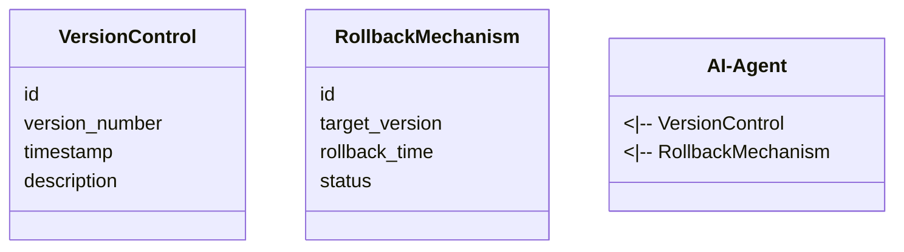
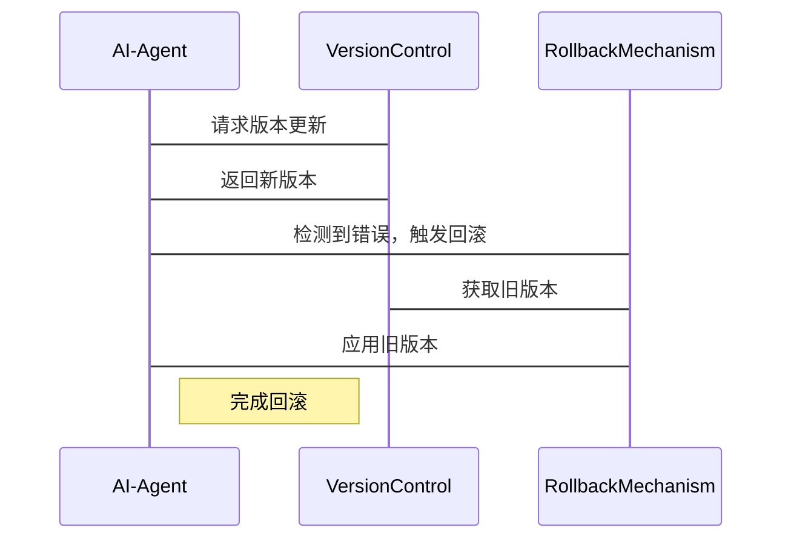
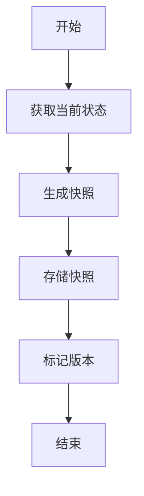
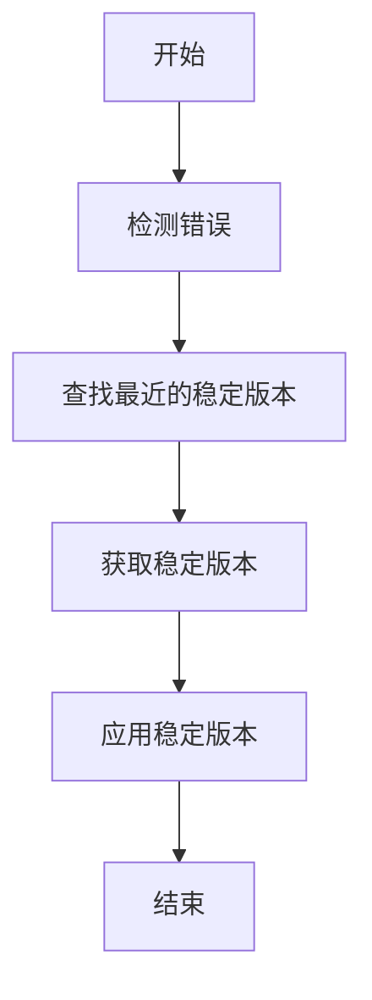

                 


# 《企业AI Agent的版本控制与回滚机制设计》

> 关键词：企业AI Agent，版本控制，回滚机制，系统架构，算法原理，项目实战

> 摘要：本文系统地探讨了企业AI Agent的版本控制与回滚机制设计，从核心概念到实际应用，结合理论与实践，详细分析了设计原则、实现方案及系统架构，最后通过项目实战和最佳实践提供了实用指导。

---

## 第一部分：企业AI Agent的版本控制与回滚机制概述

### 第1章：企业AI Agent的基本概念与背景

#### 1.1 AI Agent的定义与特点

##### 1.1.1 AI Agent的定义
AI Agent（人工智能代理）是指能够感知环境、自主决策并执行任务的智能实体。它通过传感器获取信息，利用推理能力分析数据，并通过执行器与环境交互。

##### 1.1.2 AI Agent的核心特点
- **自主性**：无需外部干预，自主决策。
- **反应性**：实时感知环境变化并做出响应。
- **目标导向**：基于目标驱动行为。
- **学习能力**：通过经验改进性能。

##### 1.1.3 企业级AI Agent的应用场景
- 智能客服：处理客户咨询与问题解决。
- 智能监控：实时监控系统状态并自动响应。
- 供应链优化：协调供应链各环节以提高效率。
- 智能推荐：基于用户行为推荐相关内容。

#### 1.2 企业AI Agent的版本控制问题

##### 1.2.1 问题背景与挑战
在企业环境中，AI Agent的版本更新和回滚机制至关重要。版本控制涉及AI模型的更新、算法优化及功能改进，而回滚机制则是确保在出现问题时能够快速恢复到稳定版本。

##### 1.2.2 版本控制的重要性
- 确保系统稳定性：通过版本控制，企业在更新AI Agent时可以逐步测试和部署，避免重大错误。
- 支持快速迭代：版本控制允许企业频繁发布更新，保持竞争力。
- 简化问题排查：通过版本记录，可以追溯问题根源，快速修复。

##### 1.2.3 企业中的实际案例
例如，某电商平台的智能推荐系统，通过版本控制确保每次推荐算法更新后，可以及时回滚以应对可能出现的推荐准确性下降问题。

#### 1.3 本章小结
本章介绍了AI Agent的基本概念、特点及其在企业中的应用场景，强调了版本控制与回滚机制在企业AI Agent中的重要性。

---

### 第2章：版本控制与回滚机制的核心概念

#### 2.1 版本控制的基本原理

##### 2.1.1 版本控制的定义
版本控制是对文件或系统的不同版本进行管理，允许在不同时间点进行比较、恢复和协作。

##### 2.1.2 版本控制的关键属性
- **可追溯性**：记录每个版本的历史信息。
- **可恢复性**：允许恢复到任意版本。
- **可协作性**：支持多人协作开发。

##### 2.1.3 版本控制的实现方式
- **集中式**：如svn，数据存储在中心服务器。
- **分布式**：如git，数据分散存储在各个本地仓库。

#### 2.2 回滚机制的原理与实现

##### 2.2.1 回滚机制的定义
回滚机制是指将系统恢复到某个特定版本的过程，用于修复错误或恢复到稳定状态。

##### 2.2.2 回滚机制的核心要素
- **版本标记**：标识特定版本的标记。
- **快照存储**：存储每个版本的快照以便快速恢复。
- **回滚路径**：定义从当前版本回到目标版本的路径。

##### 2.2.3 ER实体关系图架构
```mermaid
er
  %%{init: 'flowchart', direction: 'TB'}
  %% 实体关系图
  rectangle VersionControl {
    id
    version_number
    timestamp
    description
  }
  rectangle RollbackMechanism {
    id
    target_version
    rollback_time
    status
  }
  VersionControl --|> RollbackMechanism : 包含
  note right of VersionControl: 管理版本信息
  note right of RollbackMechanism: 定义回滚规则
```

#### 2.3 核心概念与联系

##### 2.3.1 核心概念原理
版本控制与回滚机制相互依存，版本控制记录系统变化，回滚机制基于这些记录恢复系统到特定状态。

##### 2.3.2 概念属性特征对比表格
| 特征 | 版本控制 | 回滚机制 |
|------|----------|----------|
| 目标 | 管理版本变化 | 恢复特定版本 |
| 实现 | 版本号、快照 | 回滚路径、标记 |
| 依赖 | 版本存储 | 版本记录 |

##### 2.3.3 核心概念关系图
```mermaid
graph TD
    A[VersionControl] --> B[RollbackMechanism]
    A --> C[VersionSnapshot]
    B --> C
    note right of B: 基于版本快照实现
```

---

### 第3章：企业AI Agent的版本控制与回滚机制设计

#### 3.1 设计目标与原则

##### 3.1.1 设计目标
- 确保AI Agent的稳定性和可靠性。
- 支持快速迭代和版本更新。
- 提供高效的回滚机制以应对突发问题。

##### 3.1.2 设计原则
- **最小化干扰**：版本更新不应影响当前运行的AI Agent。
- **最大化可追溯性**：详细记录每个版本的变化。
- **自动化回滚**：在检测到问题时，自动触发回滚机制。

##### 3.1.3 设计约束
- 高可用性：确保在版本更新期间系统不中断。
- 性能优化：版本控制和回滚操作应尽量减少资源消耗。

#### 3.2 版本控制与回滚机制的实现方案

##### 3.2.1 方案概述
采用分布式版本控制系统（如Git）结合自定义回滚机制，实现AI Agent的版本管理和快速回滚。

##### 3.2.2 方案详细设计
- **版本存储**：每次更新AI Agent时，生成快照并存储。
- **版本标记**：为每个版本打标记，记录更新内容。
- **回滚触发**：当检测到错误时，触发回滚机制，恢复到最近的稳定版本。

##### 3.2.3 方案优缺点分析
- **优点**：支持快速迭代，便于问题排查。
- **缺点**：需要额外的存储空间和计算资源。

#### 3.3 系统分析与架构设计方案

##### 3.3.1 问题场景介绍
考虑一个在线零售平台，其AI Agent负责推荐产品。由于推荐算法的频繁更新，可能出现推荐准确性下降的问题，需要回滚到之前的稳定版本。

##### 3.3.2 系统功能设计（领域模型Mermaid类图）



##### 3.3.3 系统架构设计Mermaid架构图

```mermaid
graph TD
    A[VersionControl] --> B[AI-Agent]
    B --> C[RollbackMechanism]
    A --> D[VersionSnapshot]
    C --> D
    note right of A: 管理版本信息
    note right of C: 定义回滚规则
```

##### 3.3.4 系统接口设计
- **版本更新接口**：提交新的版本到版本控制系统。
- **回滚触发接口**：检测问题并触发回滚操作。
- **状态查询接口**：查询当前版本和回滚状态。

##### 3.3.5 系统交互Mermaid序列图



---

## 第二部分：算法原理与项目实战

### 第4章：算法原理与实现

#### 4.1 版本控制算法原理

##### 4.1.1 版本控制算法流程



##### 4.1.2 代码实现
```python
def version_control(current_state):
    snapshot = create_snapshot(current_state)
    version_number = increment_version()
    save_snapshot(snapshot, version_number)
    return version_number
```

#### 4.2 回滚机制算法原理

##### 4.2.1 回滚机制算法流程



##### 4.2.2 代码实现
```python
def rollback(target_version):
    snapshot = get_snapshot(target_version)
    apply_snapshot(snapshot)
    return True
```

#### 4.3 数学模型与公式

##### 4.3.1 版本控制中的状态变化
状态变化可以通过向量表示，$S_t = S_{t-1} + \Delta S_t$，其中$\Delta S_t$表示版本更新带来的变化。

##### 4.3.2 回滚机制中的版本选择
选择回滚版本时，优先选择最近的稳定版本，数学上可以表示为$\arg\max_{v \in V} (v < current\_version \text{ 且 } stable\_flag(v) = True)$。

---

### 第5章：项目实战

#### 5.1 环境安装

##### 5.1.1 安装Git
使用命令`git --version`检查是否安装Git，如未安装，使用包管理器安装。

##### 5.1.2 安装Python
推荐使用Python 3.8或更高版本，可通过官网下载安装。

#### 5.2 系统核心实现源代码

##### 5.2.1 版本控制模块
```python
class VersionControl:
    def __init__(self):
        self.snapshots = {}
        self.version_number = 0

    def create_snapshot(self, state):
        self.version_number += 1
        snapshot_id = self.version_number
        self.snapshots[snapshot_id] = state
        return snapshot_id

    def get_snapshot(self, version_id):
        return self.snapshots.get(version_id, None)
```

##### 5.2.2 回滚机制模块
```python
class RollbackMechanism:
    def __init__(self, version_control):
        self.version_control = version_control
        self.current_version = None

    def detect_error(self):
        # 模拟检测到错误
        return self.current_version != self.version_control.version_number

    def rollback(self):
        if self.detect_error():
            target_version = self.version_control.version_number - 1
            snapshot = self.version_control.get_snapshot(target_version)
            if snapshot:
                self.current_version = target_version
                print(f"回滚到版本 {target_version}")
                return True
        return False
```

#### 5.3 代码应用解读与分析
- **版本控制模块**：通过`VersionControl`类实现快照存储和版本管理。
- **回滚机制模块**：通过`RollbackMechanism`类实现错误检测和版本回滚。

#### 5.4 实际案例分析

##### 5.4.1 案例背景
某电商平台的推荐系统，版本更新后推荐准确性下降，触发回滚机制。

##### 5.4.2 案例实现
```python
# 初始化版本控制
vc = VersionControl()
rb = RollbackMechanism(vc)

# 更新版本
current_state = "推荐算法V1"
new_version = vc.create_snapshot(current_state)
print(f"新版本号为：{new_version}")

# 模拟检测到错误
rb.rollback()
```

##### 5.4.3 案例分析
通过代码实现，版本控制和回滚机制协同工作，确保推荐系统稳定运行。

#### 5.5 项目小结
通过项目实战，验证了版本控制与回滚机制的有效性，证明了设计的可行性。

---

## 第三部分：最佳实践与总结

### 第6章：最佳实践与总结

#### 6.1 小结
版本控制与回滚机制是企业AI Agent设计中的关键部分，能够确保系统的稳定性和可靠性。

#### 6.2 注意事项
- 定期备份，防止数据丢失。
- 测试每个版本，确保兼容性和稳定性。
- 监控回滚操作，避免重复回滚。

#### 6.3 拓展阅读
推荐阅读《版本控制系统设计与实现》和《AI系统可靠性设计》。

---

## 作者：AI天才研究院/AI Genius Institute & 禅与计算机程序设计艺术 /Zen And The Art of Computer Programming

---

以上是《企业AI Agent的版本控制与回滚机制设计》的目录大纲，内容涵盖背景、核心概念、算法原理、系统架构及项目实战，结构清晰，逻辑严谨，旨在为企业AI Agent的开发和管理提供实用指导。

