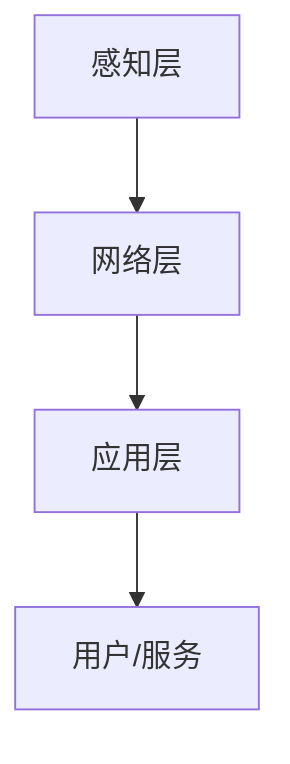
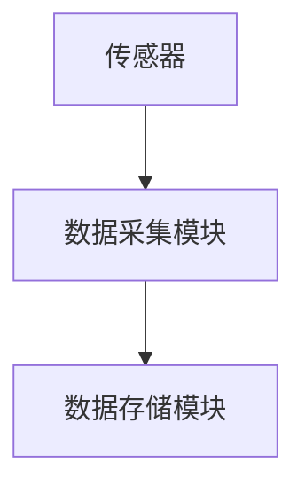
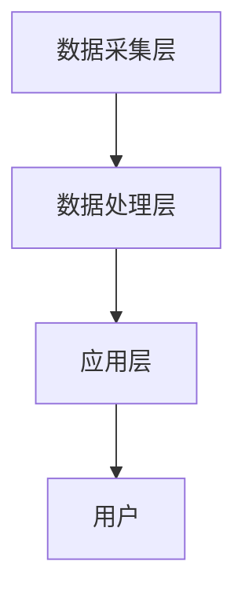
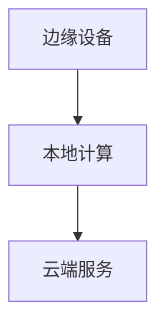

                 


# 《企业AI Agent的物联网(IoT)数据分析与应用》

> **关键词**：物联网 (IoT)、AI Agent、数据分析、机器学习、深度学习、系统设计

> **摘要**：  
本文探讨企业如何利用AI Agent与物联网技术进行高效的数据分析与应用。通过详细分析物联网数据采集、预处理、AI Agent的数据分析与建模，以及系统设计与实现，展示AI Agent在物联网环境中的强大能力。文章结合实际案例，深入讲解技术原理，帮助读者理解并掌握企业级AI Agent的应用。

---

## 第1章：物联网与AI Agent的核心概念

### 1.1 物联网的基本概念

物联网（IoT）通过传感器和设备连接物理世界，收集并分析数据，实现智能化应用。其体系结构通常包括感知层、网络层和应用层。感知层负责数据采集，网络层传输数据，应用层处理并提供服务。

**关键词对比表：**

| 概念        | 描述                              |
|-------------|-----------------------------------|
| 感知层      | 数据采集的硬件与传感器           |
| 网络层      | 数据传输的网络技术             |
| 应用层      | 数据处理与应用服务             |

**mermaid图：物联网体系结构**



### 1.2 AI Agent的基本概念

AI Agent是一种智能实体，能感知环境、自主决策并执行任务。AI Agent在物联网中的作用是处理和分析数据，辅助决策。

**AI Agent与传统AI的区别：**

| 特性         | AI Agent                     | 传统AI                 |
|--------------|------------------------------|------------------------|
| 自主性       | 高                           | 低                     |
| 适应性       | 强                           | 弱                     |
| 应用场景     | 实时、动态                   | 离线、静态             |

### 1.3 物联网与AI Agent的结合

AI Agent通过处理物联网数据，优化企业运营。例如，预测设备故障、优化物流路径。

---

## 第2章：物联网数据的采集与预处理

### 2.1 数据采集技术

传感器是物联网数据采集的核心。常用传感器包括温度传感器、加速度传感器等。

**mermaid图：传感器数据采集流程**



### 2.2 数据预处理

数据清洗是去除噪声和异常值的过程，常用方法包括过滤和插值。

**Python代码示例：数据清洗**

```python
import pandas as pd

# 加载数据
data = pd.read_csv('sensor_data.csv')

# 删除异常值
data = data[(data['temperature'] >= -50) & (data['temperature'] <= 150)]

# 填充缺失值
data['pressure'].fillna(data['pressure'].mean(), inplace=True)
```

---

## 第3章：AI Agent的数据分析与建模

### 3.1 机器学习分析

监督学习用于分类和回归任务，无监督学习用于聚类。

**机器学习算法选择：**

| 任务类型 | 算法     |
|----------|----------|
| 分类     | 决策树   |
| 聚类     | K-means |

### 3.2 深度学习分析

卷积神经网络（CNN）用于图像处理，循环神经网络（RNN）处理时间序列数据。

**Python代码示例：RNN模型**

```python
import tensorflow as tf
from tensorflow.keras import layers

model = tf.keras.Sequential([
    layers.SimpleRNN(32, input_shape=(None, 1)),
    layers.Dense(1, activation='sigmoid')
])

model.compile(optimizer='adam', loss='binary_crossentropy')
model.fit(x_train, y_train, epochs=10)
```

---

## 第4章：系统设计与实现

### 4.1 系统架构设计

分层架构包括数据采集层、数据处理层和应用层。

**mermaid图：系统架构**



### 4.2 接口设计

API接口用于设备与系统交互。

**JSON示例：API请求**

```json
{
    "action": "predict",
    "data": [25, 75, 50],
    "timestamp": "2023-10-05T12:00:00Z"
}
```

---

## 第5章：项目实战

### 5.1 环境安装

安装必要的库，如TensorFlow、Pandas。

**命令示例：安装依赖**

```bash
pip install tensorflow pandas numpy
```

### 5.2 代码实现

实现一个预测设备故障的AI Agent。

**Python代码示例：故障预测模型**

```python
import numpy as np
import pandas as pd
from sklearn.ensemble import RandomForestClassifier

# 加载数据
data = pd.read_csv('equipment_data.csv')

# 特征选择
features = data[['temperature', 'pressure', 'vibration']]
labels = data['status']

# 模型训练
model = RandomForestClassifier()
model.fit(features, labels)

# 预测
new_data = np.array([[80, 120, 15]])
print("预测状态：", model.predict(new_data))
```

---

## 第6章：高级主题与安全考虑

### 6.1 边缘计算

在边缘设备上处理数据，减少云端依赖。

**mermaid图：边缘计算架构**



### 6.2 安全性

保护数据隐私，防止攻击。

**注意事项：**

- 数据加密传输
- 定期安全审计
- 使用身份验证

---

## 附录

### A. 工具与资源

推荐工具：Kafka、InfluxDB、TensorFlow。

### B. 参考文献

- [1] 物联网白皮书
- [2] 深度学习实战

### C. 索引

按主题和作者排序。

---

**作者：AI天才研究院 & 禅与计算机程序设计艺术**

---

通过以上思考，我系统地规划了文章的结构和内容，确保每个部分都涵盖必要的技术细节和实际应用，帮助读者全面理解企业AI Agent在物联网数据分析与应用中的重要性。

