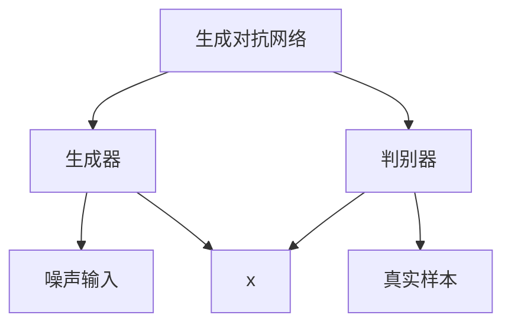
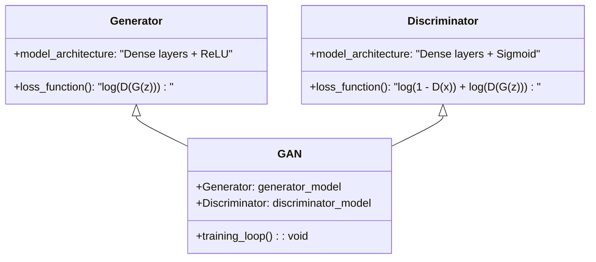
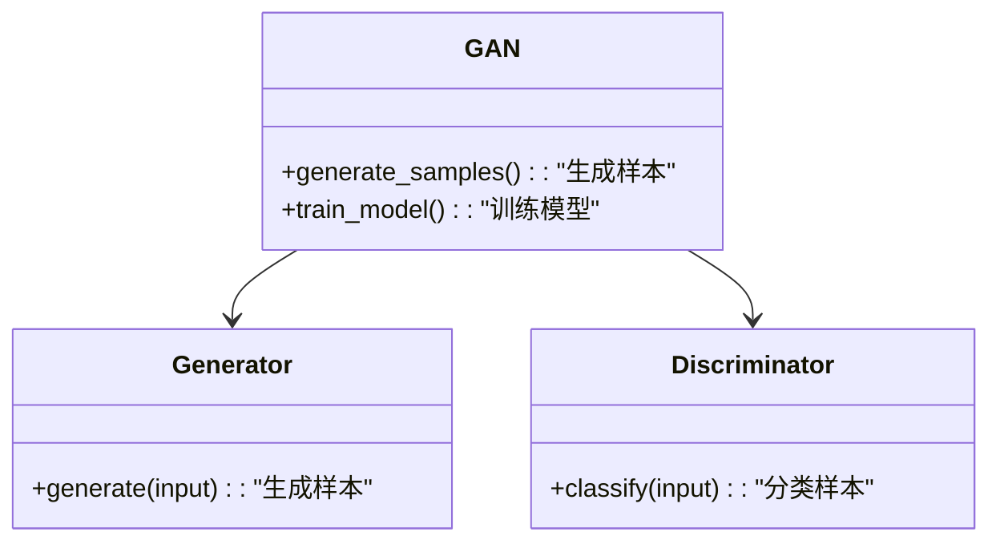
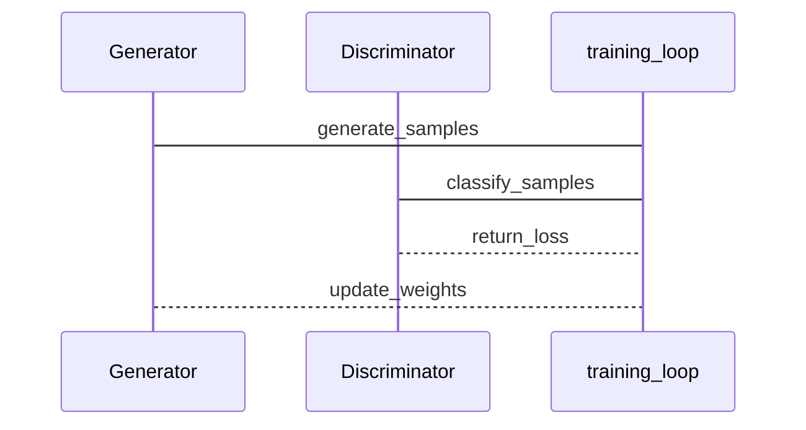
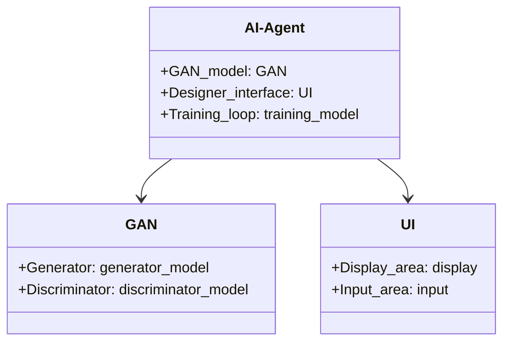

                 


# 企业AI Agent的生成对抗网络在产品设计创新中的前沿应用

> 关键词：生成对抗网络（GANs）、企业AI Agent、产品设计创新、机器学习、深度学习

> 摘要：本文深入探讨了生成对抗网络（GANs）在企业AI Agent中的应用，特别是在产品设计创新中的前沿应用。通过分析GANs的核心概念、算法原理、系统架构以及实际案例，本文为技术从业者和企业决策者提供了关于如何利用GANs推动产品设计创新的详细指导。文章内容涵盖从理论到实践的全链条，旨在帮助企业更好地理解和应用这一技术。

---

# 第1章: 生成对抗网络（GANs）基础

## 1.1 生成对抗网络的定义与背景

### 1.1.1 生成对抗网络的起源与发展
生成对抗网络（Generative Adversarial Networks，GANs）是由Ian Goodfellow等人在2014年提出的一种生成模型。GANs的核心思想是通过两个神经网络——生成器（Generator）和判别器（Discriminator）的对抗训练，生成逼真的数据样本。GANs的提出彻底改变了生成模型的领域，并迅速在图像生成、语音合成、文本生成等领域取得了突破性进展。

### 1.1.2 GANs的核心概念与原理
GANs的核心在于生成器和判别器的对抗过程：
1. **生成器**：负责生成样本数据，目标是让生成的样本尽可能接近真实数据分布。
2. **判别器**：负责区分生成样本和真实样本，目标是最大化区分能力。
3. **对抗训练**：通过不断优化生成器和判别器的参数，使得生成器生成的样本越来越逼真，判别器越来越难以区分生成样本和真实样本。

### 1.1.3 GANs在企业AI Agent中的应用潜力
在企业AI Agent中，GANs可以用于生成多样化的产品设计方案、优化用户体验、提高设计效率等。例如，AI Agent可以通过GANs生成多个产品原型，供设计师选择和优化，从而加速产品开发周期。

---

## 1.2 生成对抗网络的优势与挑战

### 1.2.1 GANs的主要优势
1. **强大的生成能力**：GANs能够生成高质量的样本，接近真实数据分布。
2. **无需大量标注数据**：GANs的训练过程可以利用未标注数据，降低数据标注成本。
3. **灵活性高**：GANs可以应用于多种数据类型，如图像、文本、音频等。

### 1.2.2 GANs的主要挑战
1. **训练不稳定**：GANs的训练过程容易陷入振荡或生成质量不稳定。
2. **计算资源需求高**：训练GANs需要大量的计算资源，尤其是对于复杂的模型。
3. **模型解释性差**：GANs的黑箱特性使得模型的决策过程难以解释。

### 1.2.3 企业应用中的权衡与解决方案
在企业应用中，需要权衡模型的生成质量、训练成本和解释性。解决方案包括使用预训练模型、优化训练参数以及结合其他技术（如强化学习）来提高模型的稳定性和生成质量。

---

## 1.3 生成对抗网络与产品设计创新的结合

### 1.3.1 产品设计创新的核心要素
产品设计创新的核心在于满足用户需求、提供独特的用户体验以及实现高效的设计流程。传统设计过程中，设计师需要反复迭代多个方案，耗时且效率低下。

### 1.3.2 GANs在产品设计中的应用场景
1. **生成多样化设计方案**：通过GANs生成多个产品原型，供设计师选择和优化。
2. **优化用户体验**：通过GANs生成用户反馈，帮助设计师优化产品界面。
3. **加速设计流程**：利用GANs快速生成设计草图，缩短设计周期。

### 1.3.3 企业AI Agent的角色与价值
企业AI Agent通过整合GANs技术，可以成为设计师的得力助手，提供实时的设计建议和优化方案。这种智能化的设计辅助工具能够显著提高设计效率，降低设计成本。

---

# 第2章: 生成对抗网络的核心概念与联系

## 2.1 GANs的原理与数学模型

### 2.1.1 GANs的数学模型
GANs的损失函数由生成器和判别器两部分组成：
$$ \mathcal{L}_G = \mathbb{E}_{z \sim p_z} [\log D(G(z))] $$
$$ \mathcal{L}_D = \mathbb{E}_{x \sim p_{data}} [\log(1 - D(x))] + \mathbb{E}_{z \sim p_z} [\log D(G(z))] $$
总损失函数为：
$$ \mathcal{L} = \mathcal{L}_G + \mathcal{L}_D $$

### 2.1.2 GANs的改进方法
为了提高GANs的生成质量，研究者提出了多种改进方法，如Wasserstein GAN（WGAN）、StyleGAN等。这些方法通过优化损失函数或改进网络结构，显著提高了生成样本的质量。

### 2.1.3 GANs的实体关系架构
通过Mermaid图可以清晰地展示GANs的实体关系：


---

## 2.2 GANs的核心要素对比分析

### 2.2.1 GANs与其他生成模型的对比
通过对比分析，可以更好地理解GANs的优势和不足：
| 模型 | 生成能力 | 训练稳定性 | 应用场景 |
|------|----------|-----------|----------|
| GANs | 强大      | 不稳定     | 图像生成、文本生成等 |
| VAE  | 较弱      | 稳定       | 适用于概率建模 |

### 2.2.2 GANs的变体与改进方法
常见的GANs变体包括：
1. **Wasserstein GAN (WGAN)**：通过 Wasserstein 距离优化损失函数，提高生成质量。
2. **Generative Adversarial Training (GAT)**：通过对抗训练改进生成器和判别器的协调性。

### 2.2.3 GANs的系统架构设计
通过Mermaid图可以展示GANs的系统架构：


---

## 2.3 GANs的系统分析与架构设计

### 2.3.1 GANs的系统功能设计
通过Mermaid类图可以展示GANs的系统功能：


### 2.3.2 GANs的系统架构设计
通过Mermaid架构图可以展示GANs的系统架构：


### 2.3.3 GANs的系统交互设计
通过Mermaid序列图可以展示GANs的系统交互：


---

## 2.4 GANs的实现与代码示例

### 2.4.1 环境安装与配置
安装必要的库：
```bash
pip install numpy matplotlib tensorflow-gpu
```

### 2.4.2 生成器与判别器的代码实现
```python
import tensorflow as tf
from tensorflow.keras import layers

def make_generator_model():
    model = tf.keras.Sequential()
    model.add(layers.Dense(256, activation='relu', input_shape=(100,)))
    model.add(layers.Dense(512, activation='relu'))
    model.add(layers.Dense(28*28, activation='sigmoid'))
    return model

def make_discriminator_model():
    model = tf.keras.Sequential()
    model.add(layers.Dense(256, activation='relu', input_shape=(28*28,)))
    model.add(layers.Dense(128, activation='relu'))
    model.add(layers.Dense(1, activation='sigmoid'))
    return model
```

### 2.4.3 模型训练与结果展示
```python
def train_gan(generator, discriminator, epochs=100):
    generator.compile(loss='binary_crossentropy', optimizer='adam')
    discriminator.compile(loss='binary_crossentropy', optimizer='adam')
    
    for epoch in range(epochs):
        # 生成假样本
        noise = np.random.randn(100, 100)
        generated_images = generator.predict(noise)
        
        # 训练判别器
        real_images = # 加载真实图像
        real_labels = np.ones((len(real_images), 1))
        fake_labels = np.zeros((len(generated_images), 1))
        d_loss = discriminator.train_on_batch(np.concatenate([real_images, generated_images]), np.concatenate([real_labels, fake_labels]))
        
        # 训练生成器
        noise = np.random.randn(100, 100)
        g_loss = generator.train_on_batch(noise, np.ones((100, 1)))
        
        print(f"Epoch {epoch}, D loss: {d_loss}, G loss: {g_loss}")
```

---

## 2.5 项目实战：GANs在产品设计中的应用

### 2.5.1 项目背景
假设我们是一家科技公司，希望通过GANs生成多种产品设计方案，以提高设计效率。

### 2.5.2 系统功能设计
1. **生成器**：生成多种产品原型。
2. **判别器**：评估生成的原型与真实设计的相似性。
3. **训练模块**：优化生成器和判别器的参数。
4. **用户界面**：展示生成的设计方案供设计师选择。

### 2.5.3 系统架构设计
通过Mermaid图展示系统架构：


### 2.5.4 项目小结
通过本项目，我们可以看到GANs在产品设计中的巨大潜力。生成器可以快速生成多种设计方案，判别器可以帮助设计师优化设计质量，从而显著提高设计效率。

---

## 2.6 最佳实践与注意事项

### 2.6.1 小结
- GANs是一种强大的生成模型，可以在产品设计中提供多样化的方案。
- 企业AI Agent通过整合GANs技术，可以显著提高设计效率和质量。

### 2.6.2 注意事项
- 训练GANs需要大量的计算资源，企业需要投入一定的硬件成本。
- 模型的解释性较差，需要结合其他技术进行优化。

### 2.6.3 拓展阅读
- 《Generative Adversarial Nets》（Ian Goodfellow等）
- 《Wasserstein GAN》（Marc Arjovsky等）

---

## 2.7 总结
通过本章的学习，我们深入理解了GANs的核心概念、算法原理以及系统架构。接下来，我们将通过实际案例进一步探讨GANs在企业AI Agent中的应用。

---

作者：AI天才研究院/AI Genius Institute & 禅与计算机程序设计艺术 /Zen And The Art of Computer Programming

