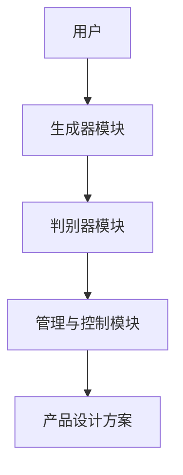
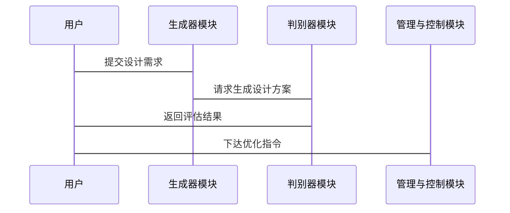

                 


---

# 《企业AI Agent的生成对抗网络在产品设计创新中的应用》

---

## 关键词：
企业AI Agent, 生成对抗网络, 产品设计创新, AI驱动设计, GAN算法, 产品创新, 智能设计

---

## 摘要：
本文深入探讨了生成对抗网络（GAN）在企业AI Agent中的应用，特别是在产品设计创新中的潜力。通过分析GAN的核心原理、企业AI Agent的体系结构以及其在产品设计中的具体应用，本文揭示了如何利用GAN技术推动产品设计的智能化与创新化。同时，结合实际案例和系统设计，本文详细讲解了GAN在产品设计中的实现过程，并展望了未来的发展方向。

---

# 目录大纲

---

## 第一章：生成对抗网络（GAN）与企业AI Agent概述

### 1.1 生成对抗网络（GAN）的基本概念
- 1.1.1 生成对抗网络的定义与核心原理
- 1.1.2 GAN在企业AI Agent中的应用潜力
- 1.1.3 企业AI Agent的基本概念与特点

### 1.2 生成对抗网络与产品设计创新的关系
- 1.2.1 生成对抗网络在产品设计中的优势
- 1.2.2 企业AI Agent如何推动产品设计创新
- 1.2.3 生成对抗网络与产品设计创新的结合案例

### 1.3 本章小结

---

## 第二章：生成对抗网络的核心原理与数学模型

### 2.1 GAN的生成器与判别器结构
- 2.1.1 生成器的网络结构与功能
- 2.1.2 判别器的网络结构与功能
- 2.1.3 GAN的对抗训练过程

### 2.2 GAN的损失函数与优化方法
- 2.2.1 GAN的损失函数公式
  $$\mathcal{L} = \mathbb{E}_{z \sim p_z}[\log D(G(z))] + \mathbb{E}_{x \sim p_x}[\log(1 - D(x))]$$
- 2.2.2 GAN的优化算法（如Adam优化器）

### 2.3 GAN的训练过程与挑战
- 2.3.1 GAN的训练过程步骤
- 2.3.2 GAN训练中的主要挑战（如模式崩溃、梯度消失）

### 2.4 本章小结

---

## 第三章：企业AI Agent的体系结构与功能设计

### 3.1 企业AI Agent的组件构成
- 3.1.1 生成器模块
- 3.1.2 判别器模块
- 3.1.3 管理与控制模块

### 3.2 企业AI Agent的交互流程
- 3.2.1 用户需求输入
- 3.2.2 生成器生成设计方案
- 3.2.3 判别器评估方案质量
- 3.2.4 反馈与优化

### 3.3 企业AI Agent的实体关系图



### 3.4 本章小结

---

## 第四章：生成对抗网络在产品设计创新中的应用

### 4.1 产品设计创新的背景与挑战
- 4.1.1 传统产品设计的局限性
- 4.1.2 创新设计的需求与挑战

### 4.2 GAN在产品设计创新中的具体应用
- 4.2.1 生成对抗网络在设计概念生成中的应用
- 4.2.2 GAN在设计优化与改进中的应用
- 4.2.3 GAN在设计风格迁移中的应用

### 4.3 实际案例分析
- 4.3.1 某企业AI Agent在产品设计中的成功案例
- 4.3.2 案例分析与经验总结

### 4.4 本章小结

---

## 第五章：企业AI Agent的系统分析与架构设计

### 5.1 系统功能设计
- 5.1.1 生成器模块的功能设计
- 5.1.2 判别器模块的功能设计
- 5.1.3 管理与控制模块的功能设计

### 5.2 系统架构设计
- 5.2.1 系统架构图


### 5.3 系统接口设计
- 5.3.1 生成器与判别器之间的接口
- 5.3.2 判别器与管理模块之间的接口
- 5.3.3 用户与系统之间的接口

### 5.4 系统交互流程图


### 5.5 本章小结

---

## 第六章：项目实战：基于GAN的企业AI Agent设计与实现

### 6.1 环境安装与配置
- 6.1.1 操作系统与硬件要求
- 6.1.2 软件工具的安装（如Python、TensorFlow、Keras）

### 6.2 系统核心实现
- 6.2.1 生成器模块的代码实现
  ```python
  import tensorflow as tf
  from tensorflow.keras import layers

  def make_generator_model():
      model = tf.keras.Sequential()
      model.add(layers.Dense(256, activation='relu', input_shape=(100,)))
      model.add(layers.Dense(512, activation='relu'))
      model.add(layers.Dense(784, activation='sigmoid'))
      return model
  ```

- 6.2.2 判别器模块的代码实现
  ```python
  def make_discriminator_model():
      model = tf.keras.Sequential()
      model.add(layers.Dense(256, activation='relu', input_shape=(784,)))
      model.add(layers.Dense(128, activation='relu'))
      model.add(layers.Dense(1, activation='sigmoid'))
      return model
  ```

### 6.3 代码实现与解读
- 6.3.1 GAN模型的训练过程
  ```python
  generator = make_generator_model()
  discriminator = make_discriminator_model()

  cross_entropy = tf.keras.losses.BinaryCrossentropy()
  loss = tf.keras.losses.BinaryCrossentropy()

  optimizer = tf.keras.optimizers.Adam(0.0002)

  for epoch in range(num_epochs):
      for _ in range(iterations):
          # 生成假数据
          noise = tf.random.normal([batch_size, 100])
          generated_images = generator(noise)

          # 判别器训练（真实数据）
          real_images = next(iterator)
          d_loss_real = cross_entropy(discriminator(real_images), tf.ones_like(discriminator(real_images)))

          # 判别器训练（生成数据）
          d_loss_fake = cross_entropy(discriminator(generated_images), tf.zeros_like(discriminator(generated_images)))

          # 计算判别器的总损失
          d_loss = d_loss_real + d_loss_fake

          # 优化判别器
          discriminator_gradients = tape.gradient(d_loss, discriminator.trainable_weights)
          discriminator_optimizer.apply_gradients(zip(discriminator_gradients, discriminator.trainable_weights))

          # 优化生成器
          g_loss = loss(discriminator(generated_images), tf.ones_like(discriminator(generated_images)))
          generator_gradients = tape.gradient(g_loss, generator.trainable_weights)
          generator_optimizer.apply_gradients(zip(generator_gradients, generator.trainable_weights))
  ```

### 6.4 案例分析与结果展示
- 6.4.1 生成设计概念的展示与评估
- 6.4.2 设计优化结果的展示与分析

### 6.5 本章小结

---

## 第七章：结论与展望

### 7.1 全文总结
- 7.1.1 生成对抗网络在企业AI Agent中的应用总结
- 7.1.2 产品设计创新中的应用总结

### 7.2 未来研究方向
- 7.2.1 更高效的GAN算法研究
- 7.2.2 多模态GAN在产品设计中的应用探索
- 7.2.3 GAN在产品设计创新中的更广泛应用场景

### 7.3 本章小结

---

## 附录：工具与技术参考资料

### 附录A：相关工具安装与配置

### 附录B：常用代码库与框架

### 附录C：术语表与缩写说明

---

## 参考文献

---

## 作者：AI天才研究院/AI Genius Institute & 禅与计算机程序设计艺术/Zen And The Art of Computer Programming

