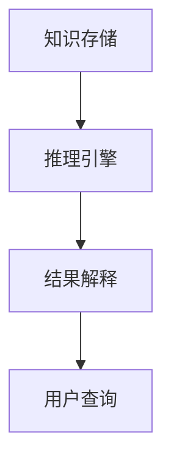
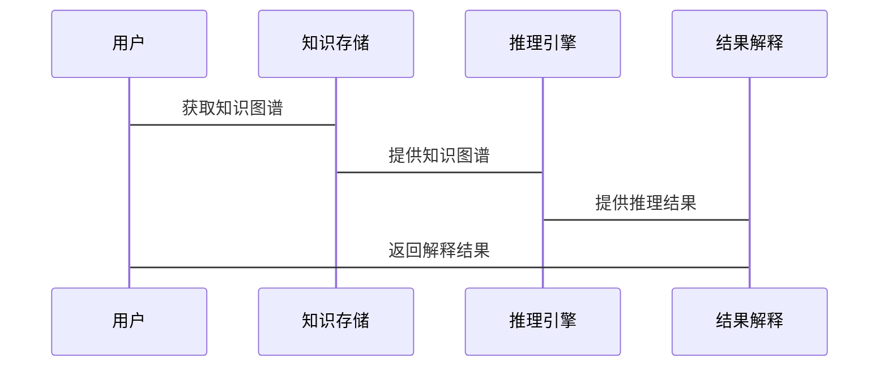

                 


# 企业AI Agent的知识图谱推理引擎

> 关键词：企业AI Agent，知识图谱，推理引擎，符号逻辑，概率推理，系统架构，项目实战

> 摘要：本文系统地介绍了企业AI Agent的知识图谱推理引擎的背景、核心概念、算法原理、系统架构、项目实战等内容。通过理论与实践相结合的方式，深入分析了知识图谱推理引擎在企业AI Agent中的应用及其重要性，帮助读者全面理解这一技术的核心原理和实际应用。

---

## 第1章: 知识图谱与AI Agent概述

### 1.1 知识图谱的定义与特点
知识图谱是一种以结构化方式表示知识的图数据库，节点表示实体或概念，边表示实体之间的关系。其特点包括：

- **结构化**：知识以节点和边的形式组织，便于计算机理解和推理。
- **语义化**：节点和边都有明确的语义标签，支持语义搜索和推理。
- **动态性**：知识图谱可以实时更新，支持增量式推理。

### 1.2 AI Agent的定义与特点
AI Agent（智能体）是一种能够感知环境、自主决策并执行任务的实体。其特点包括：

- **自主性**：无需外部干预，自主完成任务。
- **反应性**：能够实时感知环境并做出反应。
- **推理能力**：具备逻辑推理能力，能够根据知识库进行推理。

### 1.3 企业AI Agent的应用背景
企业智能化转型的需求推动了AI Agent的应用，知识图谱为其提供了丰富的知识库支持。AI Agent在企业中的潜力巨大，可以应用于智能客服、智能推荐、智能决策等领域。

---

## 第2章: 知识图谱推理引擎的原理与架构

### 2.1 知识图谱推理引擎的核心原理
知识图谱推理引擎通过推理算法，从知识图谱中推导出新的事实或关系。常见的推理算法包括符号逻辑推理和概率推理。

- **符号逻辑推理**：基于一阶逻辑，通过规则进行推理。
- **概率推理**：基于贝叶斯网络，通过概率计算进行推理。

### 2.2 知识图谱推理引擎的架构设计
知识图谱推理引擎的架构通常包括知识存储、推理算法、结果解释等组件。

- **知识存储**：存储知识图谱的节点和边。
- **推理算法**：实现具体的推理逻辑。
- **结果解释**：将推理结果转换为可理解的形式。

### 2.3 知识图谱与AI Agent的结合
知识图谱作为AI Agent的知识库，AI Agent作为推理引擎的驱动，二者结合可以实现智能决策和推理。

---

## 第3章: 知识图谱推理引擎的算法原理

### 3.1 知识图谱推理算法的实现
知识图谱推理算法包括符号逻辑推理和概率推理。

- **符号逻辑推理**：基于谓词逻辑，通过规则进行推理。
- **概率推理**：基于贝叶斯网络，通过概率计算进行推理。

### 3.2 符号逻辑推理的Python实现
```python
def inference(rules, facts):
    inferred = set(facts)
    while True:
        new_inferred = set()
        for rule in rules:
            premise, conclusion = rule
            if all(p in inferred for p in premise):
                new_inferred.add(conclusion)
        if not new_inferred:
            break
        inferred.update(new_inferred)
    return inferred
```

### 3.3 概率推理的数学模型
概率推理基于贝叶斯定理：
$$ P(B|A) = \frac{P(A|B)P(B)}{P(A)} $$

### 3.4 算法实现的数学模型与公式
符号逻辑推理的数学模型：
$$ P(A) = 1 \quad \text{如果} \quad A \text{是定理} $$

---

## 第4章: 系统分析与架构设计方案

### 4.1 问题场景介绍
企业AI Agent需要处理复杂的问题，例如智能客服中的多轮对话和推理。

### 4.2 系统功能设计
系统功能包括知识存储、推理引擎、结果解释等。

### 4.3 系统架构设计
使用Mermaid生成系统架构图：



### 4.4 系统接口设计
系统接口包括知识存储接口、推理引擎接口和结果解释接口。

### 4.5 系统交互流程图
使用Mermaid生成交互流程图：



---

## 第5章: 项目实战

### 5.1 环境安装
安装必要的依赖：
```bash
pip install py2neo
```

### 5.2 系统核心实现
实现知识图谱推理引擎的核心功能：

```python
from py2neo import Graph, Node, Relationship

graph = Graph("http://localhost:7474", auth=("username", "password"))

def add_knowledge(graph, nodes, relationships):
    for node in nodes:
        Node(label=node['label'], properties=node['properties'])
    for rel in relationships:
        start = graph.nodes.find(rel['start'])
        end = graph.nodes.find(rel['end'])
        Relationship(start, rel['type'], end)

add_knowledge(graph, nodes, relationships)
```

### 5.3 代码应用解读与分析
通过案例分析，展示知识图谱推理引擎的实际应用。

### 5.4 项目小结
总结项目实现的关键点和经验教训。

---

## 第6章: 最佳实践与小结

### 6.1 最佳实践 tips
- 定期更新知识图谱，保持知识库的准确性。
- 选择适合的推理算法，根据具体场景调整参数。

### 6.2 小结
企业AI Agent的知识图谱推理引擎是智能化转型的关键技术，通过本文的学习，读者可以深入了解其原理和应用。

### 6.3 注意事项
- 确保知识图谱的安全性和隐私性。
- 注意推理算法的计算效率，避免性能瓶颈。

### 6.4 拓展阅读
推荐相关书籍和论文，供读者深入学习。

---

作者：AI天才研究院/AI Genius Institute & 禅与计算机程序设计艺术 /Zen And The Art of Computer Programming

