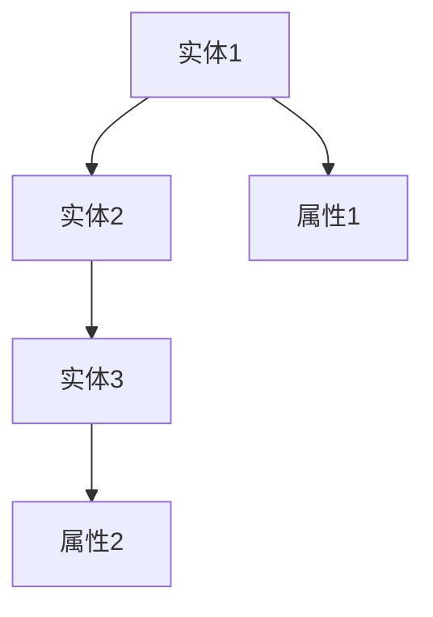
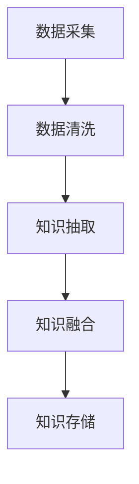
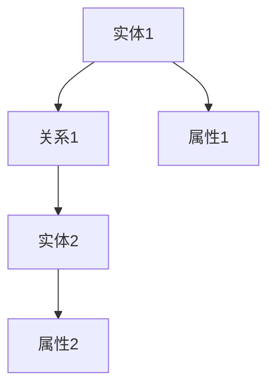
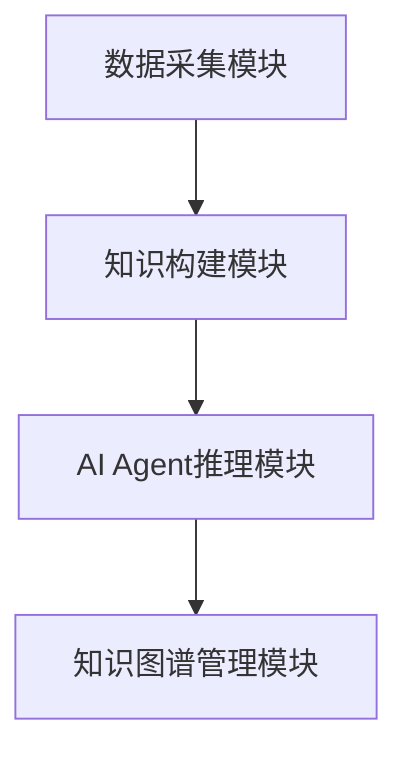
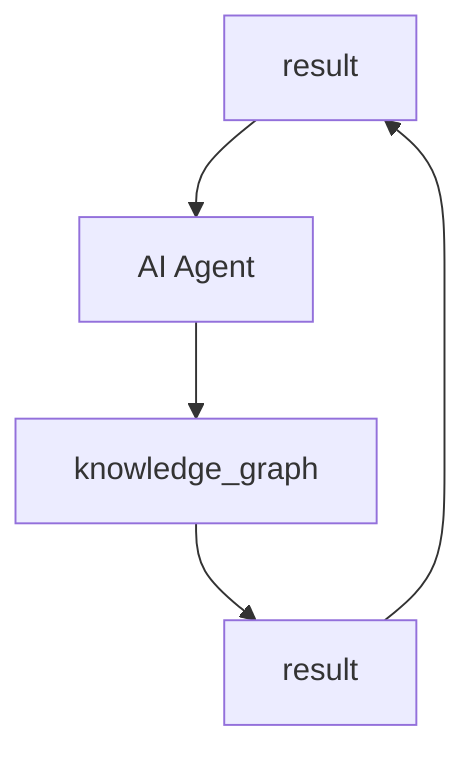

                 


# 企业AI Agent的知识图谱构建与应用

> 关键词：企业AI Agent、知识图谱、构建、应用、算法、系统架构、技术实现

> 摘要：本文系统地探讨了企业AI Agent的知识图谱构建与应用的关键技术，从知识图谱和AI Agent的基本概念出发，深入分析了知识图谱的构建流程、AI Agent的知识推理算法，以及企业级知识图谱的系统架构设计。文章结合实际案例，详细介绍了知识图谱在企业AI Agent中的应用，并给出了具体的实现方案和技术建议。

---

# 第一部分: 企业AI Agent的知识图谱构建基础

---

# 第1章: 知识图谱与AI Agent概述

## 1.1 知识图谱的定义与特点

### 1.1.1 知识图谱的定义
知识图谱是一种以图结构形式表示知识的语义网络，节点代表实体或概念，边表示实体之间的关系。知识图谱通过结构化的形式描述数据之间的语义关联，能够支持复杂的语义推理和智能应用。

### 1.1.2 知识图谱的核心特点
- **结构化**：通过节点和边的组合，以图的形式表示知识。
- **语义化**：节点和边的语义通过元数据或标签明确标注。
- **动态性**：能够实时更新和扩展，适应数据的变化。
- **可推理性**：支持基于知识图谱的语义推理。

### 1.1.3 知识图谱与传统数据库的区别
| 特性         | 知识图谱           | 传统数据库       |
|--------------|--------------------|------------------|
| 数据结构     | 图结构             | 行列结构         |
| 表达能力     | 高语义             | 低语义           |
| 查询能力     | 支持语义查询       | 支持简单查询     |
| 应用场景     | 智能应用           | 事务处理         |

---

## 1.2 AI Agent的定义与特点

### 1.2.1 AI Agent的定义
AI Agent（人工智能代理）是指能够感知环境、自主决策并执行任务的智能实体。AI Agent可以是软件程序、机器人或其他智能系统，具备学习、推理、规划和自适应能力。

### 1.2.2 AI Agent的核心特点
- **自主性**：能够自主决策和行动。
- **反应性**：能够实时感知环境并做出反应。
- **目标导向性**：具备明确的目标导向性。
- **可扩展性**：能够适应不同复杂场景。

### 1.2.3 AI Agent与传统软件的区别
| 特性         | AI Agent           | 传统软件         |
|--------------|--------------------|------------------|
| 智能性       | 高度智能           | 低智能           |
| 自主性       | 高度自主           | 无自主性         |
| 学习能力     | 具备学习能力       | 无学习能力       |
| 适应性       | 具备自适应能力     | 无自适应能力     |

---

## 1.3 企业AI Agent的应用场景

### 1.3.1 企业智能化转型的需求
企业智能化转型的核心需求包括：自动化决策、智能客服、智能推荐、知识管理与共享。

### 1.3.2 AI Agent在企业中的潜在应用领域
- **智能客服**：通过自然语言处理技术，提供智能问答服务。
- **智能推荐**：基于知识图谱进行个性化推荐。
- **知识管理**：通过知识图谱实现企业知识的结构化管理。
- **智能决策支持**：基于知识图谱的语义推理提供决策支持。

### 1.3.3 企业采用AI Agent的优势与挑战

#### 优势
- 提高效率：AI Agent能够快速处理大量数据并提供决策支持。
- 降低成本：通过自动化减少人工干预。
- 增强用户体验：提供个性化的服务。

#### 挑战
- 数据复杂性：企业数据多样且复杂，构建知识图谱的难度较大。
- 技术门槛高：知识图谱构建和AI Agent开发需要较高的技术能力。
- 高昂成本：知识图谱构建和维护需要大量资源投入。

---

## 1.4 本章小结

---

# 第2章: 知识图谱构建的核心概念

## 2.1 知识图谱的构建流程

### 2.1.1 数据采集与预处理
- 数据来源：结构化数据、半结构化数据、非结构化数据。
- 数据清洗：去重、去噪、标准化处理。

### 2.1.2 知识抽取与融合
- 知识抽取：实体识别、关系抽取、属性抽取。
- 知识融合：实体对齐、关系融合、属性整合。

### 2.1.3 知识存储与管理
- 数据库选择：图数据库（Neo4j、AllegroGraph）。
- 数据建模：设计知识图谱的实体、关系、属性。

#### Mermaid 实体关系图


---

## 2.2 知识图谱的表示与推理

### 2.2.1 知识表示的基本方法
- 基于符号的表示：使用符号逻辑表示知识。
- 基于向量的表示：使用向量空间模型表示知识。

### 2.2.2 知识推理的原理与算法
- 前向推理：从已知事实推导新事实。
- 后向推理：从目标事实反向推导已知事实。
- 类比推理：通过类比关系进行推理。

### 2.2.3 知识图谱的可解释性
- 可解释性的重要性：帮助用户理解AI Agent的决策过程。
- 提高可解释性的方法：可视化知识图谱、提供推理路径。

---

## 2.3 知识图谱的可视化与分析

### 2.3.1 知识图谱的可视化方法
- 图形化展示：使用图数据库自带的可视化工具。
- 可交互式分析：支持用户与知识图谱的交互。

### 2.3.2 知识图谱的分析工具
- 数据可视化工具：Tableau、Power BI。
- 图形分析工具：Gephi、NetworkX。

### 2.3.3 知识图谱的动态更新
- 动态更新机制：实时采集数据并更新知识图谱。
- 更新策略：基于变化检测的增量更新。

---

## 2.4 本章小结

---

# 第3章: AI Agent的知识图谱构建算法

## 3.1 知识抽取算法

### 3.1.1 基于规则的知识抽取
- 使用正则表达式提取特定模式的数据。

#### 代码示例
```python
import re
text = "张三，男，28岁，工程师。"
pattern = r"([\u4e00-\u9fa5]+)\,(\d+)"
matches = re.findall(pattern, text)
print(matches)
```

### 3.1.2 基于统计学习的知识抽取
- 使用条件随机场（CRF）进行命名实体识别。

#### 代码示例
```python
import numpy as np
from sklearn import metrics
from sklearn.feature_extraction.text import TfidfVectorizer
from sklearn.linear_model import LogisticRegression

# 假设X为文本特征向量，y为标签
model = LogisticRegression()
model.fit(X, y)
predicted = model.predict(X_test)
print(metrics.accuracy_score(y_test, predicted))
```

### 3.1.3 基于深度学习的知识抽取
- 使用BERT模型进行实体识别。

#### 代码示例
```python
import torch
from transformers import BertForTokenClassification

model = BertForTokenClassification.from_pretrained("bert-base-cased")
input_ids = torch.tensor([tokenizer.encode("张三，男，28岁，工程师。", add_special_tokens=True)]).long()
outputs = model(input_ids)
logits = outputs.logits
predicted_labels = torch.argmax(logits, dim=2)
print(predicted_labels)
```

---

## 3.2 知识融合算法

### 3.2.1 实体对齐算法
- 使用字符串相似度进行实体匹配。

#### 代码示例
```python
from difflib import SequenceMatcher

str1 = "张三"
str2 = "张三"
similarity = SequenceMatcher(None, str1, str2).ratio()
print(similarity)  # 输出结果：1.0
```

### 3.2.2 关系抽取算法
- 使用规则和模式匹配抽取关系。

#### 代码示例
```python
pattern = r"(\w+)是(\w+)的(\w+)"
text = "张三是公司的工程师。"
matches = re.findall(pattern, text)
print(matches)  # 输出结果：[("张三", "公司", "工程师")]
```

### 3.2.3 知识图谱的冲突检测与解决
- 冲突检测：检测同一实体的不同表示。
- 冲突解决：选择权重高的知识源或合并冲突信息。

---

## 3.3 知识图谱的表示学习

### 3.3.1 基于向量的表示方法
- 使用Word2Vec进行实体嵌入。

#### 代码示例
```python
from gensim.models import Word2Vec

sentences = ["张三是工程师", "工程师是技术人员"]
model = Word2Vec(sentences, vector_size=100, window=2, min_count=1, workers=4)
print(model.wv['张三'])  # 输出向量表示
```

### 3.3.2 知识图谱的表示模型
- 使用TransE模型进行知识嵌入。

#### 代码示例
```python
import torch
import torch.nn as nn

class TransE(nn.Module):
    def __init__(self, num_ent, num_rel, embed_size):
        super(TransE, self).__init__()
        self.embed_size = embed_size
        self.ent_embed = nn.Embedding(num_ent, embed_size)
        self.rel_embed = nn.Embedding(num_rel, embed_size)
        
    def forward(self, head, rel, tail):
        return (self.ent_embed(head) + self.rel_embed(rel) - self.ent_embed(tail)).norm(p=1)

model = TransE(num_ent=100, num_rel=20, embed_size=50)
print(model)
```

---

## 3.4 本章小结

---

# 第4章: 企业AI Agent的知识图谱应用

## 4.1 企业知识图谱的构建与管理

### 4.1.1 企业知识图谱的构建流程
1. 数据采集：整合企业内部数据。
2. 数据清洗：去除重复和噪声数据。
3. 知识抽取：提取实体、关系和属性。
4. 知识融合：消除冲突，建立统一的知识表示。
5. 知识存储：使用图数据库存储知识图谱。

#### Mermaid 构建流程图


---

### 4.1.2 企业知识图谱的存储与管理
- 图数据库选择：Neo4j、AllegroGraph。
- 数据建模：设计实体、关系和属性。

#### Mermaid 数据建模图


---

## 4.2 AI Agent的知识图谱推理与应用

### 4.2.1 基于知识图谱的推理算法
- 前向推理：从已知事实推导新事实。
- 后向推理：从目标事实反向推导已知事实。
- 类比推理：通过类比关系进行推理。

#### 代码示例
```python
from reasoner import Reasoner

reasoner = Reasoner()
query = "张三是谁？"
result = reasoner.query(query)
print(result)  # 输出结果：张三是公司的工程师。
```

---

### 4.2.2 AI Agent的知识图谱应用案例
- **智能问答**：基于知识图谱实现问答系统。
- **智能推荐**：基于知识图谱进行个性化推荐。
- **知识管理**：通过知识图谱实现企业知识的结构化管理。

---

## 4.3 本章小结

---

# 第5章: 企业AI Agent的知识图谱系统架构

## 5.1 系统功能设计

### 5.1.1 知识图谱构建模块
- 数据采集与预处理。
- 知识抽取与融合。
- 知识存储与管理。

### 5.1.2 AI Agent推理模块
- 知识表示与推理。
- 智能决策支持。
- 人机交互界面。

### 5.1.3 知识图谱管理模块
- 知识图谱可视化。
- 知识图谱更新与维护。
- 知识图谱权限管理。

---

## 5.2 系统架构设计

### 5.2.1 系统功能模块
- 数据采集模块。
- 知识构建模块。
- AI Agent推理模块。
- 知识图谱管理模块。

#### Mermaid 系统架构图


---

## 5.3 系统接口设计

### 5.3.1 知识图谱接口
- 数据接口：提供知识图谱的数据访问接口。
- 推理接口：提供基于知识图谱的推理服务。

---

## 5.4 系统交互设计

### 5.4.1 用户与系统交互流程
1. 用户发起查询请求。
2. 系统调用知识图谱进行推理。
3. 系统返回结果。

#### Mermaid 交互流程图


---

## 5.5 本章小结

---

# 第6章: 项目实战——企业AI Agent的知识图谱构建与应用

## 6.1 项目环境安装

### 6.1.1 安装依赖
```bash
pip install neo4j
pip install tensorflow
pip install numpy
pip install matplotlib
```

---

## 6.2 系统核心实现

### 6.2.1 知识图谱构建实现
- 数据采集与预处理。
- 知识抽取与融合。
- 知识存储与管理。

#### 代码示例
```python
import neo4j
from neo4j import GraphDatabase

driver = GraphDatabase.driver("neo4j://localhost:7687", auth=("user", "password"))
with driver.session() as session:
    session.run("CREATE (a:Person {name: '张三'})")
    session.run("CREATE (b:Position {name: '工程师'})")
    session.run("CREATE (a)-[:IS]->(b)")
```

---

### 6.2.2 AI Agent推理实现
- 知识表示与推理。
- 智能决策支持。
- 人机交互界面。

#### 代码示例
```python
import tensorflow as tf
from tensorflow.keras import layers

model = tf.keras.Sequential([
    layers.Dense(64, activation='relu'),
    layers.Dense(1, activation='sigmoid')
])
model.compile(optimizer='adam', loss='binary_crossentropy', metrics=['accuracy'])
model.fit(x_train, y_train, epochs=10, batch_size=32)
```

---

## 6.3 项目小结

---

# 第7章: 最佳实践与注意事项

## 7.1 最佳实践
- 数据质量管理：确保数据的准确性和完整性。
- 知识图谱优化：通过压缩和索引技术优化知识图谱的性能。
- AI Agent的可解释性：通过可视化和日志提供可解释性。

## 7.2 注意事项
- 数据隐私与安全：确保知识图谱构建过程中的数据安全。
- 系统性能优化：优化知识图谱的存储和查询性能。
- 人员能力要求：需要具备图数据库、机器学习和自然语言处理的复合能力。

---

# 第8章: 小结与展望

## 8.1 小结
本文系统地探讨了企业AI Agent的知识图谱构建与应用的关键技术，从知识图谱和AI Agent的基本概念出发，深入分析了知识图谱的构建流程、AI Agent的知识推理算法，以及企业级知识图谱的系统架构设计。结合实际案例，详细介绍了知识图谱在企业AI Agent中的应用，并给出了具体的实现方案和技术建议。

## 8.2 展望
未来，随着AI技术的不断发展，知识图谱和AI Agent将在企业智能化转型中发挥更重要的作用。需要进一步研究的知识图谱动态更新、AI Agent的自适应学习能力，以及知识图谱在多模态数据中的应用。

---

# 作者：AI天才研究院/AI Genius Institute & 禅与计算机程序设计艺术 /Zen And The Art of Computer Programming

