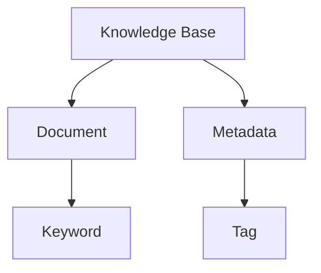
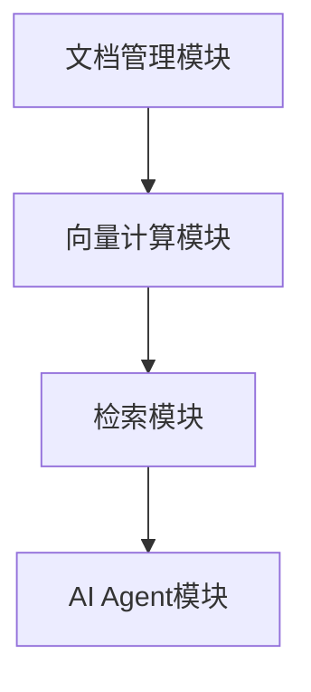

                 


# 企业AI Agent的知识库管理系统

> 关键词：企业AI Agent，知识库管理系统，向量数据库，相似度计算，系统架构设计

> 摘要：企业AI Agent的知识库管理系统是一种结合人工智能技术的知识管理解决方案。本文将从背景介绍、核心概念、算法原理、系统架构设计、项目实战等方面详细探讨该系统的构建与实现。通过本文，读者可以全面了解如何利用AI Agent技术优化企业知识库管理，提升企业智能化水平。

---

## 第一部分: 企业AI Agent的知识库管理系统的背景与概念

### 第1章: 问题背景与问题描述

#### 1.1 问题背景

企业知识管理在现代商业环境中扮演着至关重要的角色。随着数据量的爆炸式增长，企业需要一种高效的方式来组织、存储和检索知识。传统的知识库管理系统往往依赖于人工操作，效率低下且难以扩展。AI Agent的引入为企业知识管理带来了新的可能性，通过智能化的代理技术，可以实现知识的自动化处理和动态管理。

#### 1.2 问题描述

传统知识库管理存在以下问题：
1. **数据孤岛**：信息分散在不同的系统中，难以统一管理和利用。
2. **查询效率低**：复杂的查询操作耗时且效率低下。
3. **知识更新缓慢**：难以实时更新和维护知识库。
4. **缺乏智能性**：无法根据上下文提供智能推荐和自动化处理。

通过引入AI Agent，企业可以实现知识库的自动化管理，提升知识检索效率，增强知识利用的智能化水平。

---

## 第二部分: 核心概念与系统结构

### 第2章: 核心概念与原理

#### 2.1 核心概念

1. **知识库**：一个结构化的数据库，用于存储和组织企业中的各种知识资产。
2. **AI Agent**：一种智能代理，能够理解和执行任务，帮助用户完成复杂的知识管理任务。
3. **向量数据库**：一种基于向量空间模型的数据库，用于存储和检索高维向量表示的知识。

#### 2.2 实体关系图

以下是企业AI Agent知识库管理系统的实体关系图：



- **Knowledge Base**：知识库，存储所有知识资产。
- **Document**：文档，知识库中的基本单位。
- **Metadata**：元数据，描述文档的属性信息。
- **Tag**：标签，用于分类和标记文档。
- **Keyword**：关键词，用于快速检索文档。

---

## 第三部分: 算法原理与实现

### 第3章: 向量数据库与相似度计算

#### 3.1 向量数据库

向量数据库用于存储和检索高维向量表示的知识。通过将文档转换为向量表示，可以利用向量相似度计算来进行高效的检索。

#### 3.2 相似度计算

相似度计算是向量数据库的核心算法之一。常用的相似度计算方法包括余弦相似度和欧氏距离。

##### 余弦相似度

余弦相似度的计算公式为：

$$ \cos(\theta) = \frac{\vec{A} \cdot \vec{B}}{|\vec{A}| |\vec{B}|} $$

其中，$\vec{A}$ 和 $\vec{B}$ 分别是两个向量。

##### 欧氏距离

欧氏距离的计算公式为：

$$ d(A, B) = \sqrt{(A_1 - B_1)^2 + (A_2 - B_2)^2 + \dots + (A_n - B_n)^2} $$

---

### 第4章: 算法实现与优化

#### 4.1 算法实现步骤

1. **数据预处理**：对文档进行分词、去停用词等处理。
2. **向量表示**：使用BERT等预训练模型将文档转换为向量表示。
3. **相似度计算**：根据相似度计算方法，计算文档之间的相似度。
4. **检索与排序**：根据相似度值进行排序，并返回结果。

#### 4.2 算法优化

1. **向量压缩**：通过量化技术压缩向量维度，降低计算复杂度。
2. **索引优化**：构建索引结构，提高检索效率。
3. **分布式处理**：将计算任务分布到多个节点，提升处理能力。

---

## 第四部分: 系统架构设计

### 第5章: 系统功能设计

#### 5.1 功能模块

1. **文档管理模块**：负责文档的存储和管理。
2. **向量计算模块**：负责将文档转换为向量表示。
3. **检索模块**：负责基于相似度计算进行文档检索。
4. **AI Agent模块**：负责与用户的交互和任务执行。

#### 5.2 系统架构图

以下是系统架构图：



---

## 第五部分: 项目实战

### 第6章: 项目实现

#### 6.1 环境安装

1. **安装Python**：确保安装了Python 3.8以上版本。
2. **安装依赖库**：使用以下命令安装所需库：
   ```bash
   pip install numpy sklearn faiss-cpu
   ```

#### 6.2 核心代码实现

以下是向量计算模块的实现代码：

```python
import numpy as np
from sklearn.metrics.pairwise import cosine_similarity

def compute_similarity(vector1, vector2):
    # 计算余弦相似度
    cos_sim = cosine_similarity([vector1], [vector2])[0][0]
    return cos_sim

# 示例向量
vector_a = np.array([0.2, 0.3, 0.5])
vector_b = np.array([0.4, 0.6, 0.1])

similarity = compute_similarity(vector_a, vector_b)
print(f"余弦相似度为: {similarity}")
```

---

## 第六部分: 总结与展望

### 第7章: 总结

企业AI Agent的知识库管理系统通过结合人工智能技术，实现了知识库的智能化管理。本文详细探讨了系统的构建过程，包括背景介绍、核心概念、算法原理、系统架构设计和项目实战。

### 第8章: 最佳实践与注意事项

1. **数据质量**：确保输入数据的质量，避免噪声干扰。
2. **模型选择**：根据具体需求选择合适的向量表示模型。
3. **系统优化**：定期优化系统性能，提升检索效率。

### 第9章: 拓展阅读

1. **向量数据库**：深入学习向量数据库的工作原理和优化技巧。
2. **AI Agent**：研究AI Agent的其他应用场景和技术实现。
3. **知识图谱**：探索知识图谱在企业知识管理中的应用。

---

## 作者

**作者：AI天才研究院（AI Genius Institute） & 禅与计算机程序设计艺术（Zen And The Art of Computer Programming）**

---

通过本文，读者可以全面了解企业AI Agent的知识库管理系统的构建与实现。从理论到实践，结合具体的代码示例和系统架构设计，帮助读者掌握这一领域的核心技术与方法。

