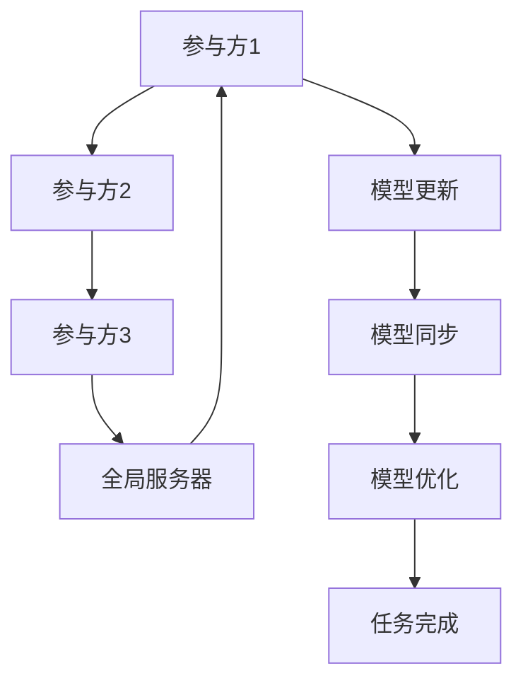
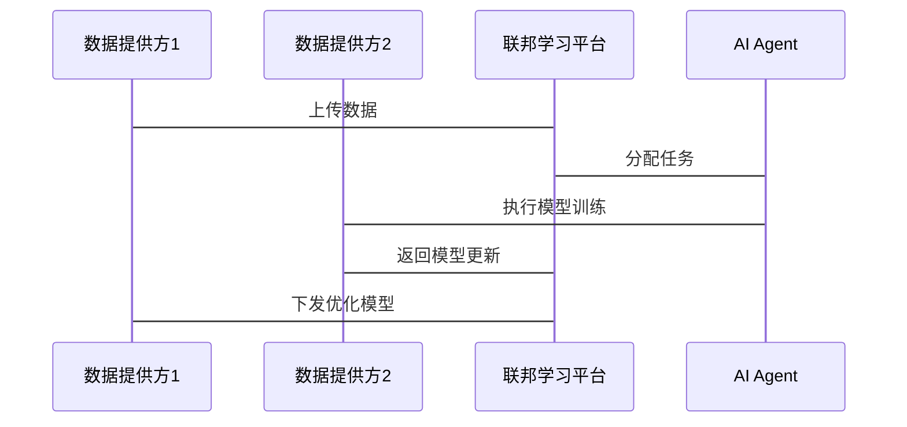

                 


# 企业AI Agent的联邦学习在跨企业数据协作中的安全实践

---

## 关键词
- 联邦学习
- AI Agent
- 数据协作
- 数据安全
- 跨企業隱私保護

---

## 摘要
本文探讨了企业AI Agent在联邦学习中的应用，特别是在跨企业数据协作中的安全实践。随着企业间数据协作需求的增加，联邦学习作为一种新兴技术，能够在保护数据隐私的前提下实现模型训练和数据共享。本文从联邦学习的基本原理、AI Agent的角色定位、数据安全与隐私保护、系统架构设计以及实际项目案例等方面进行详细分析。通过结合理论与实践，本文旨在为企业在跨企业数据协作中提供安全、高效的联邦学习解决方案。

---

# 第1章: 引言

## 1.1 背景介绍
随着数字化转型的深入推进，企业之间的数据协作需求日益增长。然而，数据隐私和安全问题成为跨企业协作的主要障碍。联邦学习作为一种分布式机器学习技术，能够在不共享原始数据的情况下，通过模型更新实现协作学习。AI Agent作为智能化的代理，能够进一步优化联邦学习的效率和安全性。

## 1.2 问题描述
跨企业数据协作面临的主要挑战包括数据隐私泄露、模型安全风险以及协作效率低下。传统的数据共享方式难以满足企业在保护隐私的同时进行模型训练的需求。

## 1.3 问题解决
联邦学习通过局部模型更新和通信，避免了原始数据的直接共享。AI Agent的引入进一步提升了联邦学习的智能化水平，优化了任务分配、数据处理和模型更新过程。

## 1.4 边界与外延
本文聚焦于联邦学习在跨企业数据协作中的安全实践，重点关注AI Agent在数据隐私保护、模型安全和协作效率优化中的应用。同时，本文也探讨了联邦学习的边界，例如数据异构性、网络延迟等问题。

## 1.5 核心要素组成
- 数据隐私保护
- 模型安全机制
- AI Agent的任务分配与协调
- 联邦学习的通信协议

---

# 第2章: 联邦学习的核心概念与联系

## 2.1 联邦学习的原理
联邦学习是一种分布式机器学习方法，通过在多个参与方之间进行模型参数的更新和同步，实现全局模型的训练，而无需共享原始数据。

## 2.2 核心概念对比表格
| 概念         | 描述                                                                 |
|--------------|----------------------------------------------------------------------|
| 数据隐私     | 数据的敏感性，需要保护不被未经授权的访问或泄露                   |
| 模型安全     | 确保模型在训练和推理过程中不被恶意攻击或篡改                   |
| AI Agent     | 智能代理，用于协调任务分配、数据处理和模型更新                 |
| 联邦学习协议 | 数据和模型的通信机制，确保协作过程的高效和安全                 |

## 2.3 ER实体关系图
```mermaid
er
  actor(AI Agent)
  actor(联邦学习平台)
  actor(数据提供方)
  entity(数据)
  entity(模型)
  entity(通信协议)
  relationship(AI Agent与联邦学习平台)
  relationship(联邦学习平台与数据提供方)
  relationship(数据提供方与数据)
  relationship(数据提供方与模型)
  relationship(模型与通信协议)
```

---

# 第3章: 联邦学习的算法原理

## 3.1 算法原理概述
联邦学习的核心算法包括联邦平均（FedAvg）、联邦proximal（FedProx）等。这些算法通过迭代更新模型参数，实现全局模型的优化。

## 3.2 算法流程图


## 3.3 数学模型与公式
### 联邦平均算法（FedAvg）
$$ W_{t+1} = \frac{1}{N} \sum_{i=1}^{N} W_i^{new} $$
其中，$W$ 表示模型参数，$N$ 表示参与方的数量。

### 联邦 proximal 算法（FedProx）
$$ W_{t+1} = \arg\min_{W} \sum_{i=1}^{N} f_i(W) + \lambda ||W - W_t||^2 $$$
其中，$\lambda$ 是正则化系数，$W_t$ 是全局模型的当前参数。

---

# 第4章: 系统分析与架构设计

## 4.1 系统功能设计
- 数据采集与预处理
- 模型训练与优化
- 数据与模型的安全传输
- 模型结果的应用与反馈

## 4.2 系统架构图


## 4.3 系统接口设计
- 数据提供方接口：数据上传、模型下载
- 联邦学习平台接口：任务分配、模型同步
- AI Agent接口：任务协调、数据处理

## 4.4 系统交互流程图


---

# 第5章: 项目实战与案例分析

## 5.1 项目背景
某跨国企业需要在保护各分公司数据隐私的前提下，构建一个全球客户行为预测模型。

## 5.2 系统实现
- 环境搭建：使用TensorFlow Federated框架
- 核心代码实现：
```python
import tensorflow as tf
from tensorflow_federated import simulate
from tensorflow_federated.core import ServerAlgorithmStrategy, ClientAlgorithmStrategy

class Model:
    def __init__(self):
        self.model = tf.keras.Sequential([
            tf.keras.layers.Dense(64, activation='relu'),
            tf.keras.layers.Dense(1)
        ])
        self.model.compile(optimizer='adam', loss='mse')

    def train(self, data, epochs):
        self.model.fit(data, epochs=epochs)

def main():
    model = Model()
    model.train(data, epochs=10)
    simulate.federated.simulate(
        server_strategy=ServerAlgorithmStrategy('fed_avg'),
        client_strategy=ClientAlgorithmStrategy('fed_avg'),
        model=model.model
    )

if __name__ == '__main__':
    main()
```

## 5.3 案例分析
通过实际项目案例，验证了联邦学习在跨企业数据协作中的高效性和安全性。AI Agent在任务分配和模型更新中的作用显著提升了协作效率。

---

# 第6章: 联邦学习的安全机制

## 6.1 数据加密与隐私保护
- 数据加密传输：使用AES加密算法
- 数据匿名化处理：通过哈希函数实现数据脱敏

## 6.2 模型安全与保护
- 模型水印技术：防止模型被恶意使用
- 模型鲁棒性优化：增强模型对抗攻击的能力

## 6.3 安全机制对比表格
| 机制         | 描述                                   |
|--------------|----------------------------------------|
| 数据加密     | 对敏感数据进行加密处理，防止传输过程中被窃取 |
| 数据匿名化   | 通过脱敏处理，保护数据的隐私性           |
| 模型水印     | 在模型中嵌入标识符，防止模型被非法使用     |
| 模型鲁棒性   | 提高模型对攻击的抵抗能力                 |

---

# 第7章: 最佳实践与总结

## 7.1 最佳实践
- 定期进行安全审计
- 使用可信的第三方平台进行联邦学习
- 建立数据共享的法律法规合规机制

## 7.2 总结
本文详细探讨了企业AI Agent在联邦学习中的应用，特别是在跨企业数据协作中的安全实践。通过理论分析和实际案例，证明了联邦学习在保护数据隐私的同时，能够高效地完成模型训练和数据协作。

---

# 作者：AI天才研究院/AI Genius Institute & 禅与计算机程序设计艺术 /Zen And The Art of Computer Programming

---

注：以上文章结构和内容仅为示例，实际撰写时需要根据具体需求和实际案例进行调整和补充。

