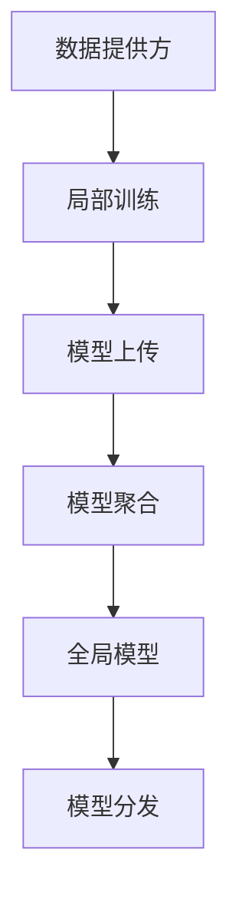
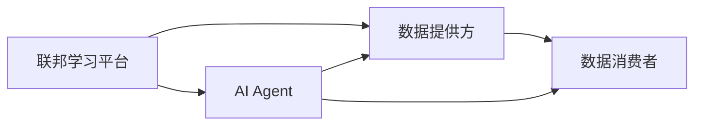
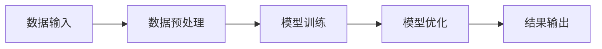
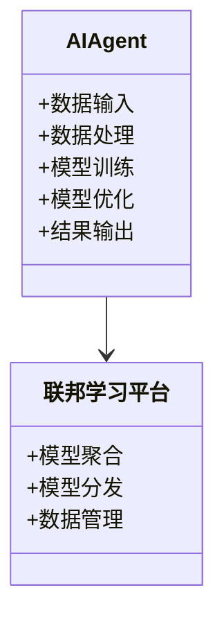
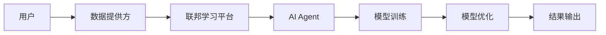

                 


# 《企业AI Agent的联邦学习在跨企业数据协作中的实践》

## 关键词：
- 联邦学习
- AI Agent
- 跨企业数据协作
- 联邦学习算法
- 联邦模型
- 数据隐私保护
- 跨企业协作

## 摘要：
本文深入探讨了联邦学习在企业AI Agent跨企业数据协作中的应用，详细分析了联邦学习的核心概念、算法原理、系统架构设计及实际应用场景。通过系统化的理论分析和实践案例，本文揭示了联邦学习如何赋能AI Agent，实现跨企业数据协作的高效与安全。文章内容涵盖联邦学习的数学模型、算法实现、系统设计及项目实战，为读者提供了全面的理论与实践指导。

---

# 第一部分: 背景介绍

## 第1章: 联邦学习与AI Agent概述

### 1.1 联邦学习的背景与意义
#### 1.1.1 数据孤岛问题的现状
在当今数字经济时代，企业之间的数据孤岛问题日益严重。数据孤岛指的是数据无法在不同企业之间共享和协作，导致数据资源无法充分发挥其潜力。联邦学习作为一种新兴的机器学习范式，通过在不共享原始数据的前提下，实现模型参数的协同优化，为解决数据孤岛问题提供了新的思路。

#### 1.1.2 联邦学习的定义与目标
联邦学习（Federated Learning）是一种分布式机器学习技术，旨在在多个参与方之间协作训练模型，同时保护各方的原始数据隐私。其核心目标是在不共享数据的前提下，通过模型参数的交换，实现全局模型的优化。

#### 1.1.3 跨企业数据协作的重要性
跨企业数据协作是联邦学习的重要应用场景。通过联邦学习，企业可以在不泄露自身数据的情况下，与其他企业共同训练模型，提升模型的泛化能力和实用性。这种协作模式不仅能够提高企业效率，还能够推动整个行业的技术进步。

### 1.2 AI Agent的核心概念
#### 1.2.1 AI Agent的基本定义
AI Agent（人工智能代理）是指能够感知环境、自主决策并执行任务的智能实体。AI Agent可以在企业中承担多种角色，如数据分析师、决策支持系统等。

#### 1.2.2 AI Agent的分类与特点
AI Agent可以根据功能、智能水平和应用场景进行分类。在联邦学习的背景下，AI Agent通常具有以下特点：
- **分布式**：AI Agent可以在多个节点上运行，实现跨企业的协作。
- **自主性**：AI Agent能够自主决策，无需人工干预。
- **协作性**：AI Agent能够与其他AI Agent或系统进行高效协作。

#### 1.2.3 AI Agent在企业中的应用场景
AI Agent在企业中的应用场景广泛，包括智能客服、供应链优化、风险控制等。在联邦学习的背景下，AI Agent可以作为数据协作的桥梁，促进跨企业的数据共享与模型训练。

### 1.3 联邦学习与AI Agent的结合
#### 1.3.1 联邦学习如何赋能AI Agent
联邦学习通过提供分布式模型训练的能力，赋予AI Agent跨企业协作的能力。AI Agent可以在不同企业之间协调模型训练，实现全局优化。

#### 1.3.2 联邦学习在跨企业协作中的优势
联邦学习在跨企业协作中的优势包括：
- **数据隐私保护**：联邦学习通过局部建模和模型聚合，保护各方的原始数据。
- **高效协作**：联邦学习通过分布式训练，减少数据传输量，提高协作效率。
- **灵活性**：联邦学习支持多种数据格式和模型架构，适用于不同企业的需求。

#### 1.3.3 联邦学习与AI Agent的协同机制
联邦学习与AI Agent的协同机制主要包括：
1. **数据预处理**：AI Agent对本地数据进行预处理，确保数据格式一致。
2. **模型训练**：AI Agent在本地数据上训练模型，并将模型参数上传至联邦学习平台。
3. **模型聚合**：联邦学习平台对各AI Agent上传的模型参数进行聚合，形成全局模型。
4. **模型分发**：全局模型分发给各AI Agent，供其进一步优化或应用。

---

## 第2章: 联邦学习的核心概念与联系

### 2.1 联邦学习的原理与数学模型
#### 2.1.1 联邦学习的原理
联邦学习的核心原理是通过分布式训练和模型聚合，实现全局模型的优化。具体流程包括：
1. **初始化**：各参与方下载全局模型的初始参数。
2. **局部训练**：各参与方在本地数据上训练模型，更新参数。
3. **模型聚合**：将各参与方的模型参数上传至中央服务器，进行模型聚合。
4. **模型更新**：中央服务器将聚合后的模型参数分发给各参与方，供其继续训练。

#### 2.1.2 联邦学习的数学模型与公式
联邦学习的数学模型通常包括损失函数和优化目标。以下是常见的数学表达式：

- **损失函数**：$L_i(x_i, y_i) = \text{损失函数}$，其中$x_i$表示第$i$个参与方的输入数据，$y_i$表示对应的标签。
- **优化目标**：$\min_{\theta} \sum_{i=1}^{n} L_i(x_i, y_i)$，其中$\theta$表示模型参数，$n$表示参与方的数量。

#### 2.1.3 联邦学习的算法流程


### 2.2 AI Agent的结构与功能
#### 2.2.1 AI Agent的实体关系图


### 2.3 联邦学习与AI Agent的协同流程


---

## 第3章: 联邦学习的算法原理与实现

### 3.1 联邦学习的算法原理
#### 3.1.1 数据异构性处理
联邦学习需要处理异构数据，即不同参与方的数据格式和分布可能不同。为了解决这一问题，联邦学习通常采用数据增强、数据预处理等方法，确保数据的一致性。

#### 3.1.2 模型同步机制
模型同步机制是联邦学习的核心之一。通过模型同步，各参与方可以将本地训练的模型参数上传至中央服务器，并下载全局模型进行优化。常见的模型同步机制包括参数平均、加权聚合等。

#### 3.1.3 联邦优化算法
联邦优化算法是联邦学习的算法基础。常用的优化算法包括随机梯度下降（SGD）、Adam优化器等。在联邦学习中，优化算法需要考虑各参与方的模型参数更新，确保全局模型的收敛。

### 3.2 联邦学习的数学模型与公式
#### 3.2.1 损失函数
$$L_i(x_i, y_i) = \text{损失函数}$$

#### 3.2.2 优化目标
$$\text{优化目标} = \min_{\theta} \sum_{i=1}^{n} L_i(x_i, y_i)$$

#### 3.2.3 模型聚合
$$\theta_{\text{global}} = \frac{1}{n} \sum_{i=1}^{n} \theta_i$$
其中，$\theta_{\text{global}}$表示全局模型参数，$\theta_i$表示第$i$个参与方的模型参数。

### 3.3 AI Agent的算法实现
#### 3.3.1 算法流程图


---

## 第4章: 系统分析与架构设计

### 4.1 系统功能设计
#### 4.1.1 领域模型设计


#### 4.1.2 系统架构设计


#### 4.1.3 接口设计
- **数据接口**：数据提供方通过API向联邦学习平台上传数据。
- **模型接口**：AI Agent通过API下载全局模型并进行优化。
- **结果接口**：AI Agent通过API将优化后的模型上传至联邦学习平台。

#### 4.1.4 交互流程图


---

## 第5章: 项目实战

### 5.1 环境安装
- **安装Python**：确保Python版本为3.6或以上。
- **安装依赖库**：安装PyTorch、TensorFlow、Flask等库。

### 5.2 核心代码实现
```python
import torch
from torch import nn

# 初始化模型参数
theta = torch.randn(1, 1)

# 模型训练函数
def train_step(theta, x, y):
    y_pred = theta * x
    loss = nn.MSELoss()(y_pred, y)
    loss.backward()
    return theta - learning_rate * theta.grad

# 模型聚合函数
def aggregate_thetas(thetas):
    return torch.mean(torch.stack(thetas), dim=0)

# 联邦学习循环
for _ in range(num_epochs):
    theta_local = theta.clone()
    theta_local = train_step(theta_local, x_local, y_local)
    thetas.append(theta_local)
    theta_global = aggregate_thetas(thetas)
    theta = theta_global
```

### 5.3 代码解读与分析
- **模型训练函数**：`train_step`函数用于在本地数据上训练模型，并更新模型参数。
- **模型聚合函数**：`aggregate_thetas`函数用于将各参与方的模型参数进行平均，形成全局模型。
- **联邦学习循环**：通过多次迭代，全局模型逐渐趋近于最优解。

### 5.4 实际案例分析
以跨企业供应链优化为例，通过联邦学习，各企业可以在不共享数据的前提下，共同训练供应链优化模型，提升供应链的整体效率。

### 5.5 项目小结
通过本项目，我们可以看到联邦学习在跨企业数据协作中的巨大潜力。AI Agent作为联邦学习的重要组成部分，能够有效促进企业之间的数据共享与模型训练。

---

## 第6章: 最佳实践与总结

### 6.1 最佳实践
- **数据预处理**：确保数据的一致性和质量。
- **模型优化**：选择合适的优化算法和参数设置。
- **安全性保障**：通过加密和访问控制，确保数据和模型的安全性。

### 6.2 小结
本文详细探讨了联邦学习在企业AI Agent跨企业数据协作中的应用，分析了联邦学习的核心概念、算法原理和系统架构设计。通过实际案例分析和项目实战，本文为读者提供了全面的理论与实践指导。

### 6.3 注意事项
- **数据隐私**：在实际应用中，必须严格遵守数据隐私保护法规。
- **模型收敛**：需要根据实际情况调整模型训练的参数，确保模型能够快速收敛。
- **性能优化**：通过并行计算和分布式训练，提高模型训练的效率。

### 6.4 拓展阅读
- 《Federated Learning: Challenges, Methods, and Future Directions》
- 《Distributed Machine Learning Through Collaborative Flipping》
- 《AI Agent: Principles and Applications》

---

# 作者：AI天才研究院/AI Genius Institute & 禅与计算机程序设计艺术 /Zen And The Art of Computer Programming

