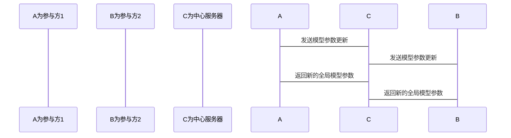

                 


# 企业AI Agent的联邦学习在跨部门数据协作中的实践

> 关键词：企业AI Agent，联邦学习，跨部门数据协作，数据隐私，AI系统架构

> 摘要：本文深入探讨了企业AI Agent在联邦学习中的应用，特别是在跨部门数据协作中的实践。文章从联邦学习的基本概念、核心原理、系统架构设计到实际项目实现进行了全面分析，并结合具体案例展示了如何在企业中实现高效、安全的跨部门数据协作。通过本文的阐述，读者可以全面理解联邦学习在企业AI Agent中的作用及其实际应用场景。

---

## 第一部分: 背景介绍

### 第1章: 联邦学习与跨部门数据协作概述

#### 1.1 联邦学习的基本概念
联邦学习（Federated Learning）是一种分布式机器学习技术，允许多个参与方在不共享原始数据的情况下，协同训练一个统一的模型。其核心思想是“数据不动，模型动”，即数据保留在本地，通过模型参数的交换进行协作学习。

- **数据隐私保护**：联邦学习通过数据本地化处理，确保数据不离开原始存储位置，从而保护数据隐私。
- **去中心化协作**：联邦学习不依赖于一个中心化服务器，而是通过去中心化的架构实现模型的联合训练。
- **跨部门协作**：在企业内部，不同部门的数据可以通过联邦学习技术进行协作，同时保持数据的独立性和隐私性。

#### 1.2 跨部门数据协作的背景与挑战
在企业中，数据往往分散在不同的部门，如市场营销、财务、人力资源等。这些部门的数据由于涉及不同的业务领域和隐私限制，难以进行有效的整合和共享。然而，跨部门数据协作对于企业整体业务优化和决策支持至关重要。

- **数据孤岛问题**：数据孤岛指的是数据无法在不同部门之间共享和利用，导致数据资源的浪费和业务效率的低下。
- **数据隐私与安全**：跨部门数据协作需要在保证数据隐私的前提下进行，这增加了技术实现的难度。
- **数据异构性**：不同部门的数据格式、分布和特征可能存在差异，这增加了跨部门协作的复杂性。

#### 1.3 企业AI Agent的定义与作用
企业AI Agent是一种智能实体，能够感知环境、自主决策并执行任务。在跨部门数据协作中，AI Agent可以作为数据协作的中间媒介，负责数据的安全传输、模型的协同训练以及结果的反馈。

- **数据协作中的AI Agent**：AI Agent能够协调不同部门的数据，确保数据的安全共享和模型的联合训练。
- **AI Agent的功能**：包括数据预处理、模型训练、结果分析和反馈优化等。
- **AI Agent的优势**：通过AI Agent，企业可以在不共享原始数据的情况下，实现跨部门的数据协作和模型优化。

---

## 第二部分: 联邦学习的核心概念与原理

### 第2章: 联邦学习的核心概念与原理

#### 2.1 联邦学习的原理
联邦学习通过分布式训练的方式，将模型的参数更新分发给各个参与方，每个参与方在本地数据上进行模型训练，并将更新的模型参数发送到中心服务器（或其他协调节点），从而实现模型的联合优化。

- **数据隐私保护**：联邦学习通过加密传输和差分隐私等技术，确保数据在传输和共享过程中的安全性。
- **通信机制**：联邦学习需要设计高效的通信机制，以减少数据传输的开销和延迟。
- **模型同步方法**：通过参数聚合、模型平均等方法，实现多个局部模型的联合优化。

#### 2.2 联邦学习的核心要素
- **数据分布**：联邦学习中的数据分布决定了模型训练的策略和效果。常见的数据分布包括横向分布、纵向分布和联邦分布。
- **模型更新策略**：模型更新策略决定了每个参与方在训练过程中如何更新模型参数，常见的策略包括同步更新和异步更新。
- **通信协议**：通信协议定义了参与方之间如何进行数据和模型的交互，常见的协议包括HTTP、gRPC等。

#### 2.3 联邦学习的架构分析
- **中心化联邦学习架构**：所有参与方通过一个中心服务器进行模型的同步和更新，适用于数据分布较为均匀的场景。
- **去中心化联邦学习架构**：没有中心服务器，参与方之间直接进行模型的交互和协作，适用于数据分布较为分散的场景。
- **混合式联邦学习架构**：结合中心化和去中心化的优点，适用于复杂的分布式场景。

---

## 第三部分: 联邦学习的算法原理

### 第3章: 联邦学习的算法原理

#### 3.1 联邦平均算法（FedAvg）
联邦平均算法（FedAvg）是一种经典的联邦学习算法，适用于横向数据分布的场景。其核心思想是每个参与方在本地数据上训练一个局部模型，然后将模型参数的更新量发送到中心服务器，服务器将所有参与方的更新进行平均，得到一个全局模型。

- **算法流程**：
  1. 中心服务器初始化全局模型参数。
  2. 每个参与方下载当前全局模型参数，并在本地数据上进行训练，得到模型参数的更新量。
  3. 中心服务器将所有参与方的更新量进行平均，得到新的全局模型参数。
  4. 重复上述过程，直到模型收敛或达到预设的训练轮数。

- **算法优缺点分析**：
  - **优点**：计算简单，易于实现，适用于大规模分布式场景。
  - **缺点**：可能存在参与方数据分布不均衡的问题，导致模型性能下降。

#### 3.2 联邦学习的数学模型
联邦学习的数学模型主要基于优化理论，目标是最小化全局损失函数，同时保证数据的隐私和安全。

- **损失函数**：全局损失函数可以表示为所有参与方损失函数的平均值。
  $$ L_{\text{global}} = \frac{1}{N}\sum_{i=1}^{N} L_i(\theta) $$
  其中，$N$ 是参与方的数量，$L_i(\theta)$ 是第 $i$ 个参与方的损失函数，$\theta$ 是模型参数。

- **优化器**：常见的优化器包括随机梯度下降（SGD）、Adam等。

- **模型更新公式**：
  $$ \theta_{\text{new}} = \theta_{\text{old}} - \eta \nabla L_{\text{global}} $$
  其中，$\eta$ 是学习率，$\nabla L_{\text{global}}$ 是全局损失函数的梯度。

---

## 第四部分: 联邦学习的系统分析与架构设计

### 第4章: 联邦学习的系统分析与架构设计

#### 4.1 系统功能设计
- **数据预处理模块**：负责对原始数据进行清洗、归一化等预处理操作，确保数据的可用性和一致性。
- **模型训练模块**：在本地数据上训练局部模型，并将模型参数的更新量发送到中心服务器。
- **数据安全与隐私保护模块**：通过加密、差分隐私等技术，确保数据的安全性和隐私性。

#### 4.2 系统架构设计
- **分层架构设计**：将系统划分为数据层、计算层和应用层，每层负责不同的功能。
- **组件交互流程**：
  1. 数据预处理模块对数据进行清洗和归一化。
  2. 模型训练模块在本地数据上训练局部模型，并将模型参数的更新量发送到中心服务器。
  3. 中心服务器将所有参与方的更新量进行聚合，得到新的全局模型参数。
  4. 应用层使用全局模型进行预测和决策支持。

#### 4.3 系统交互流程图


---

## 第五部分: 企业AI Agent的项目实战

### 第5章: 企业AI Agent的项目实战

#### 5.1 项目背景与目标
- **项目需求分析**：某企业需要在不同部门之间进行数据协作，优化整体业务流程。
- **项目目标设定**：通过联邦学习技术，实现跨部门数据协作，提升业务效率和决策能力。

#### 5.2 项目实战

##### 5.2.1 环境安装
```bash
pip install fedlearn
```

##### 5.2.2 核心代码实现
```python
import fedlearn

# 初始化全局模型
global_model = fedlearn.FedAvgModel()

# 参与方训练
for _ in range(num_rounds):
    for party in parties:
        # 下载全局模型
        party.download_model(global_model)
        # 在本地数据上训练
        party.train()
        # 上传模型更新
        party.upload_update(global_model)
    
    # 聚合模型更新
    global_model.aggregate()

# 返回最终模型
return global_model
```

##### 5.2.3 代码解读与分析
- **下载全局模型**：每个参与方下载当前的全局模型参数，并在本地数据上进行训练。
- **上传模型更新**：参与方将模型参数的更新量上传到中心服务器。
- **聚合模型更新**：中心服务器将所有参与方的更新量进行聚合，得到新的全局模型参数。

#### 5.3 实际案例分析
- **案例背景**：某企业希望通过联邦学习技术，实现市场营销和销售部门的数据协作，优化客户画像和精准营销。
- **案例实现**：
  1. 市场营销部门提供客户行为数据，销售部门提供销售数据。
  2. 通过联邦学习技术，联合训练客户画像模型。
  3. 使用训练好的模型进行精准营销，提升销售额。

#### 5.4 项目小结
- **项目成果**：通过联邦学习技术，实现了跨部门数据协作，提升了业务效率和决策能力。
- **经验总结**：在实际项目中，需要充分考虑数据分布、模型选择和通信机制等因素，以确保联邦学习的效果和效率。

---

## 第六部分: 最佳实践与未来展望

### 第6章: 最佳实践与未来展望

#### 6.1 数据隐私保护
- **数据加密**：通过对数据进行加密处理，确保数据在传输和存储过程中的安全性。
- **差分隐私**：通过在数据中添加噪声，保护个体数据的隐私。

#### 6.2 通信机制优化
- **减少数据传输量**：通过压缩技术，减少模型参数的传输量，降低通信开销。
- **异步更新**：允许参与方在不同的时间点进行模型更新，提高系统的灵活性和效率。

#### 6.3 模型评估与优化
- **模型评估**：通过准确率、召回率等指标，评估模型的性能。
- **模型优化**：根据评估结果，优化模型结构和训练策略，提升模型性能。

#### 6.4 未来展望
- **联邦学习的进一步发展**：随着技术的进步，联邦学习将在更多领域得到应用，尤其是在医疗、金融等对数据隐私要求较高的行业。
- **AI Agent的智能化提升**：通过AI Agent的智能化，进一步提升联邦学习的效率和效果。

---

## 结语

企业AI Agent的联邦学习在跨部门数据协作中的实践，不仅为企业提供了高效、安全的数据协作方式，还为企业AI系统的优化和创新提供了新的思路。通过本文的深入分析，读者可以全面理解联邦学习在企业中的应用及其未来发展方向。

---

## 作者信息

作者：AI天才研究院（AI Genius Institute）  
联系方式：[email protected]  
个人简介：专注于人工智能与企业级系统架构设计，致力于推动AI技术在企业中的创新应用。

--- 

如果需要进一步的技术支持或合作，请随时联系作者。

