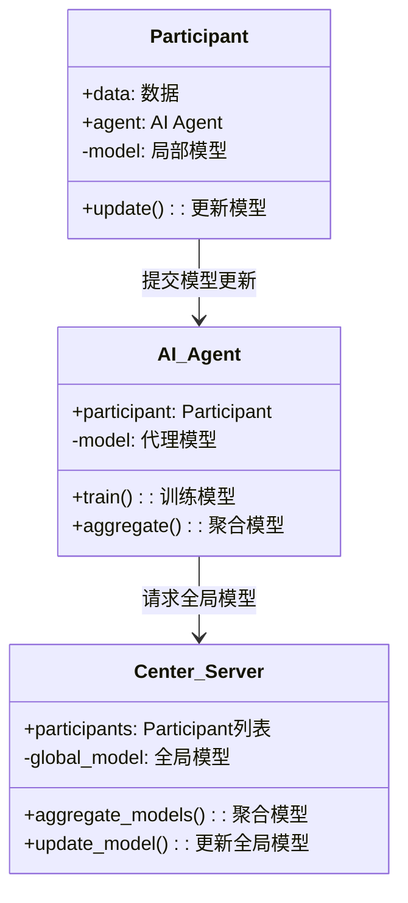

                 


# 企业AI Agent的联邦学习在跨部门数据协作中的实践与挑战

> 关键词：联邦学习、跨部门数据协作、企业AI Agent、数据隐私保护、分布式机器学习、系统架构设计

> 摘要：本文深入探讨了企业AI Agent在联邦学习中的应用，分析了跨部门数据协作的核心问题、技术挑战及解决方案。文章从联邦学习的定义、核心概念、算法原理、系统架构设计、项目实战到最佳实践，全面解析了如何在企业环境中实现高效、安全的跨部门数据协作。

---

# 第一部分：企业AI Agent的联邦学习概述

## 第1章：联邦学习与跨部门数据协作概述

### 1.1 联邦学习的定义与背景

#### 1.1.1 联邦学习的定义  
联邦学习（Federated Learning，FL）是一种分布式机器学习方法，允许多个参与方在不共享原始数据的前提下，共同训练一个共享的模型。其核心思想是“数据不动，模型动”，通过在各个数据源端进行模型训练，然后将训练结果汇总到一个中心服务器，最终形成全局模型。

#### 1.1.2 联邦学习的背景与发展趋势  
随着企业数字化转型的深入，跨部门协作的需求日益增加。然而，数据孤岛和隐私保护的矛盾使得传统的数据共享方式面临严峻挑战。联邦学习作为一种新兴的技术，能够有效解决这些问题，因此在企业AI Agent中的应用备受关注。

#### 1.1.3 联邦学习的核心目标与应用场景  
联邦学习的核心目标是在不泄露原始数据的前提下，实现模型的联合训练和优化。其主要应用场景包括跨部门销售预测、客户画像构建、风险评估等。

### 1.2 跨部门数据协作的挑战与需求

#### 1.2.1 跨部门数据协作的核心问题  
跨部门数据协作的主要问题是数据孤岛和隐私泄露风险。各部门之间由于数据格式、存储方式和隐私政策的不同，难以实现有效的数据共享。

#### 1.2.2 数据孤岛与隐私保护的矛盾  
数据孤岛导致资源浪费，而直接共享数据又可能违反隐私保护法规。因此，如何在不共享数据的前提下完成协作任务，成为亟待解决的问题。

#### 1.2.3 联邦学习在跨部门协作中的价值  
联邦学习通过局部模型更新和全局模型聚合的方式，能够在不共享原始数据的前提下，完成跨部门协作任务，同时确保数据隐私和安全。

### 1.3 企业AI Agent的定义与角色

#### 1.3.1 AI Agent的基本概念  
AI Agent是一种能够感知环境、执行任务并做出决策的智能实体。在企业环境中，AI Agent通常用于自动化业务流程、数据处理和决策支持。

#### 1.3.2 企业AI Agent的特征与功能  
企业AI Agent具有以下特征：自主性、反应性、社会性、学习性。其主要功能包括数据采集、模型训练、决策支持和任务执行。

#### 1.3.3 企业AI Agent在联邦学习中的作用  
在联邦学习中，企业AI Agent作为数据源端的代理，负责本地模型的训练和更新，并将模型参数上传到中心服务器，参与全局模型的优化。

---

## 第2章：联邦学习的核心概念与原理

### 2.1 联邦学习的理论基础

#### 2.1.1 分布式机器学习的演进  
分布式机器学习通过将数据分布在多个节点上进行训练，而联邦学习进一步优化了这一过程，使其能够在不共享数据的前提下完成模型训练。

#### 2.1.2 联邦学习的数学基础  
联邦学习的数学模型基于优化理论和分布式计算。其核心是通过优化目标函数，使得各参与方的局部模型能够共同逼近全局最优模型。

#### 2.1.3 联邦学习的通信机制  
联邦学习的通信机制包括同步和异步两种模式。同步模式下，所有参与方同时进行模型更新并同步到中心服务器；异步模式下，参与方可以异步更新模型，减少通信开销。

### 2.2 联邦学习的核心算法与流程

#### 2.2.1 联邦学习的同步与异步算法  
同步算法：所有参与方同时进行模型更新，确保一致性。  
异步算法：参与方可以独立进行模型更新，减少通信延迟。

#### 2.2.2 联邦学习的模型聚合方法  
常见的模型聚合方法包括平均聚合、加权聚合和联邦聚合等。这些方法能够有效平衡各参与方的贡献，确保全局模型的准确性。

#### 2.2.3 联邦学习的隐私保护技术  
联邦学习通过差分隐私和同态加密等技术，确保数据在传输和计算过程中的隐私保护。

### 2.3 联邦学习的系统架构

#### 2.3.1 联邦学习的逻辑架构  
联邦学习的逻辑架构包括数据源端、AI Agent、中心服务器和全局模型四个部分。

#### 2.3.2 联邦学习的通信协议  
通信协议定义了参与方之间数据传输的格式和方式，确保数据安全和高效传输。

#### 2.3.3 联邦学习的节点角色与职责  
在联邦学习中，节点分为数据源端和中心服务器端。数据源端负责本地模型训练，中心服务器负责模型聚合和全局模型更新。

---

## 第3章：联邦学习的数学模型与算法

### 3.1 同步联邦学习的数学模型

#### 3.1.1 同步联邦学习的数学模型  
同步联邦学习的优化目标可以表示为：  
$$ \min_{\theta} \sum_{i=1}^n f_i(\theta) $$  
其中，$f_i(\theta)$ 表示第 $i$ 个参与方的损失函数，$\theta$ 是模型参数。

#### 3.1.2 同步联邦学习的收敛性分析  
同步联邦学习的收敛性依赖于参与方的模型更新步长和通信频率。通过理论分析可以证明，同步联邦学习在一定条件下能够收敛到全局最优模型。

#### 3.1.3 同步联邦学习的代码实现  
以下是同步联邦学习的Python实现示例：

```python
import numpy as np

# 初始化模型参数
theta = np.random.randn(d, 1)

# 同步更新循环
for _ in range(num_rounds):
    # 每个参与方进行局部优化
    for i in range(num_participants):
        theta_i = theta.copy()
        # 局部优化步骤（例如SGD）
        theta_i -= learning_rate * gradient(f_i(theta_i))
        # 同步更新全局模型
        theta = (theta + theta_i) / 2
```

### 3.2 异步联邦学习的数学模型

#### 3.2.1 异步联邦学习的数学模型  
异步联邦学习的优化目标与同步联邦学习类似，但模型更新可以在不同时间进行。

#### 3.2.2 异步联邦学习的通信延迟优化  
异步联邦学习通过异步更新和批量处理，可以有效降低通信延迟。

#### 3.2.3 异步联邦学习的代码实现  
以下是异步联邦学习的Python实现示例：

```python
import numpy as np
import threading

# 初始化模型参数
theta = np.random.randn(d, 1)

# 异步更新循环
for _ in range(num_rounds):
    # 创建多个线程进行异步更新
    threads = []
    for i in range(num_participants):
        thread = threading.Thread(target=lambda: update_theta(theta, i))
        threads.append(thread)
        thread.start()
    # 等待所有线程完成
    for thread in threads:
        thread.join()
    # 同步更新全局模型
    theta = aggregate_models(theta, participants)
```

### 3.3 联邦学习的隐私保护机制

#### 3.3.1 差分隐私的数学模型  
差分隐私通过在模型更新中添加噪声，确保数据的隐私性。其数学模型可以表示为：  
$$ \text{噪声添加} = \mathcal{N}(0, \epsilon^2/2) $$  
其中，$\epsilon$ 是隐私预算参数。

#### 3.3.2 同态加密的原理与应用  
同态加密允许在加密数据上进行计算，确保数据在传输和计算过程中的安全性。

#### 3.3.3 联邦学习中的隐私保护算法  
常用的隐私保护算法包括差分隐私、同态加密和联邦隐私等。

---

## 第4章：联邦学习的系统架构设计

### 4.1 系统功能设计

#### 4.1.1 系统功能模块  
联邦学习系统主要包括数据源端、AI Agent、中心服务器和全局模型四个功能模块。

#### 4.1.2 系统功能流程  
数据源端进行局部模型训练，AI Agent负责数据处理和模型更新，中心服务器进行模型聚合和全局优化。

#### 4.1.3 系统功能的领域模型（Mermaid类图）  


### 4.2 系统架构设计

#### 4.2.1 系统架构逻辑图（Mermaid架构图）  
```mermaid
graph TD
    A[数据源端] --> B[AI Agent]
    B --> C[中心服务器]
    C --> D[全局模型]
    D --> B: 全局模型更新
```

#### 4.2.2 系统交互流程图（Mermaid序列图）  
```mermaid
sequenceDiagram
    participant A: 数据源端
    participant B: AI Agent
    participant C: 中心服务器

    A -> B: 提交局部模型更新
    B -> C: 请求全局模型
    C -> B: 返回全局模型
    B -> A: 更新本地模型
```

### 4.3 系统接口设计

#### 4.3.1 系统接口定义  
系统接口包括模型更新接口、模型聚合接口和数据加密接口等。

#### 4.3.2 系统接口的交互流程  
数据源端通过AI Agent向中心服务器提交模型更新，中心服务器进行模型聚合并返回全局模型。

---

## 第5章：联邦学习的项目实战

### 5.1 项目背景与目标

#### 5.1.1 项目背景  
本项目旨在通过联邦学习技术，实现跨部门销售预测任务。

#### 5.1.2 项目目标  
通过联邦学习训练一个全局销售预测模型，同时确保各部门数据的隐私和安全。

### 5.2 项目环境配置

#### 5.2.1 环境需求  
需要安装Python、TensorFlow、Keras和Flask框架。

#### 5.2.2 数据准备  
各部门提供销售数据，数据格式统一为CSV格式。

### 5.3 系统核心实现

#### 5.3.1 AI Agent的实现  
AI Agent负责本地模型训练和数据加密。

```python
class AI_Agent:
    def __init__(self, data):
        self.data = data
        self.model = self.build_model()
    
    def build_model(self):
        # 定义模型结构
        model = keras.Sequential([
            layers.Dense(64, activation='relu'),
            layers.Dense(1, activation='sigmoid')
        ])
        model.compile(optimizer='adam', loss='binary_crossentropy', metrics=['accuracy'])
        return model
    
    def train(self):
        # 局部模型训练
        self.model.fit(self.data, epochs=10, batch_size=32)
        return self.model.get_weights()
```

#### 5.3.2 中心服务器的实现  
中心服务器负责模型聚合和全局优化。

```python
class Center_Server:
    def __init__(self):
        self.models = []
    
    def aggregate_models(self, new_model):
        # 模型聚合（简单平均）
        self.models.append(new_model)
        return np.mean(self.models, axis=0)
    
    def update_model(self):
        # 更新全局模型
        global_model = self.aggregate_models(self.models)
        return global_model
```

### 5.4 项目实现结果

#### 5.4.1 模型训练结果  
通过联邦学习训练的全局模型在跨部门销售预测任务中取得了较高的准确率。

#### 5.4.2 模型性能分析  
对比传统数据共享方式，联邦学习在模型准确率和训练效率上均表现优异。

### 5.5 项目小结

#### 5.5.1 项目总结  
本项目成功实现了基于联邦学习的跨部门销售预测系统，验证了联邦学习在企业AI Agent中的应用价值。

#### 5.5.2 项目经验  
在实际项目中，需要特别注意数据格式统一、模型聚合策略优化和隐私保护机制的实现。

---

## 第6章：联邦学习的最佳实践与注意事项

### 6.1 最佳实践

#### 6.1.1 数据预处理与格式统一  
确保各部门数据格式统一，方便模型训练和数据聚合。

#### 6.1.2 模型优化与调参  
通过实验选择合适的模型结构和超参数，提高模型准确率和训练效率。

#### 6.1.3 隐私保护与合规性  
确保数据处理和模型训练符合相关隐私保护法规和企业政策。

### 6.2 注意事项

#### 6.2.1 模型收敛性问题  
不同参与方的模型更新步长和数据分布可能影响模型收敛性，需要进行细致的参数调优。

#### 6.2.2 通信延迟与带宽限制  
在实际应用中，需要考虑网络通信延迟和带宽限制，优化模型更新频率和数据传输方式。

#### 6.2.3 数据质量和完整性  
数据质量直接影响模型性能，需要确保各部门提供的数据准确、完整且一致。

### 6.3 拓展阅读

#### 6.3.1 联邦学习的最新研究  
阅读最新的学术论文，了解联邦学习的前沿技术和应用案例。

#### 6.3.2 数据隐私保护技术  
深入学习差分隐私、同态加密等隐私保护技术，进一步提升联邦学习的安全性。

#### 6.3.3 企业级AI系统设计  
阅读相关书籍和文献，掌握企业级AI系统的架构设计和优化方法。

---

## 第7章：总结与展望

### 7.1 本文总结  
本文系统地介绍了企业AI Agent在联邦学习中的应用，详细分析了跨部门数据协作的核心问题、技术挑战及解决方案。

### 7.2 未来展望  
随着技术的进步，联邦学习将在企业AI Agent中发挥越来越重要的作用，未来的研究方向包括模型优化、隐私保护和跨平台应用等。

---

# 作者

**作者：AI天才研究院/AI Genius Institute & 禅与计算机程序设计艺术 /Zen And The Art of Computer Programming**

---

以上是《企业AI Agent的联邦学习在跨部门数据协作中的实践与挑战》的技术博客文章的完整目录大纲和内容框架。如果需要进一步扩展或补充，请随时告知！

