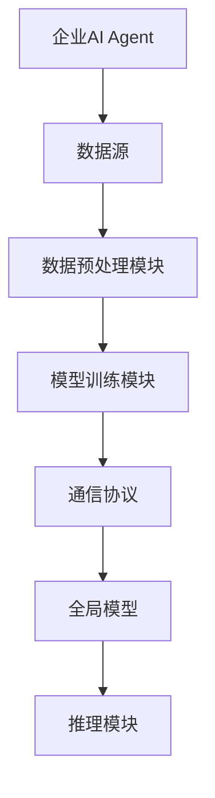
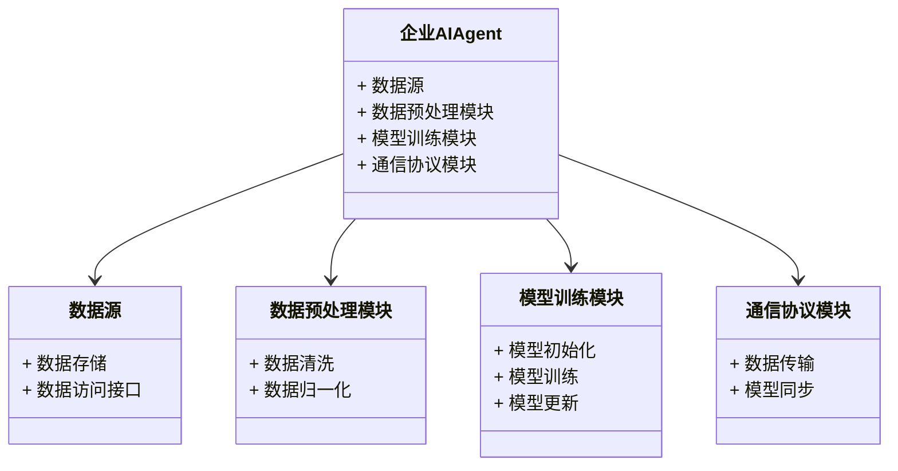

                 


# 企业AI Agent的联邦学习安全协议设计

> 关键词：联邦学习，企业AI Agent，安全协议，数据隐私，通信协议，AI架构

> 摘要：本文深入探讨了企业AI Agent在联邦学习环境下的安全协议设计。通过分析联邦学习的核心概念、企业AI Agent的需求特点，结合实际场景，提出了基于联邦学习的安全协议设计方案。文章从背景介绍、核心概念、算法原理、系统架构到项目实战，全面解析了企业AI Agent的联邦学习安全协议设计的理论与实践。通过实际案例分析和代码实现，为读者提供了一套完整的设计思路和实现方案。

---

# 第1章: 背景介绍

## 1.1 联邦学习的基本概念

### 1.1.1 联邦学习的定义

联邦学习（Federated Learning，FL）是一种分布式机器学习技术，旨在在不共享原始数据的情况下，通过数据分割和模型协作的方式，实现全局模型的训练。其核心思想是“数据不动，模型动”，即数据保留在原始设备或服务器中，仅通过模型参数或梯度进行通信。

### 1.1.2 联邦学习的核心特点

1. **数据隐私保护**：联邦学习通过局部建模和模型聚合的方式，避免了原始数据的共享，有效保护了数据隐私。
2. **分布式协作**：多个参与方（如企业、设备）共同参与模型训练，形成分布式协作网络。
3. **异构环境支持**：支持不同设备、不同数据格式的异构环境下的模型训练。

### 1.1.3 联邦学习与传统机器学习的对比

| 对比维度 | 联邦学习 | 传统机器学习 |
|----------|----------|---------------|
| 数据存储 | 数据不共享 | 数据集中存储 |
| 模型训练 | 分布式建模 | 集中式建模 |
| 隐私保护 | 强 | 弱或无 |

---

## 1.2 企业AI Agent的定义与特点

### 1.2.1 AI Agent的基本概念

AI Agent（智能代理）是指能够感知环境、自主决策并执行任务的智能实体。企业AI Agent是专门用于企业场景的智能代理，通常具备以下特点：

1. **任务导向性**：专注于特定的企业任务，如数据分析、决策支持、自动化操作等。
2. **智能化**：基于机器学习、自然语言处理等技术，具备自主决策能力。
3. **可扩展性**：能够与其他系统、服务或AI Agent协同工作，形成复杂的业务流程。

### 1.2.2 企业AI Agent的核心属性

| 属性 | 描述 |
|------|------|
| 智能性 | 基于AI技术实现自主决策 |
| 任务导向性 | 针对企业场景设计 |
| 可扩展性 | 支持与其他系统或AI Agent协作 |
| 安全性 | 数据和操作的安全性要求高 |

### 1.2.3 企业AI Agent与传统AI Agent的区别

| 对比维度 | 企业AI Agent | 传统AI Agent |
|----------|--------------|---------------|
| 场景定位 | 专注于企业内部任务 | 适用于通用场景 |
| 数据隐私 | 高要求 | 较低要求 |
| 协作性 | 强调跨系统协作 | 协作性较低 |

---

## 1.3 联邦学习与企业AI Agent的结合

### 1.3.1 联邦学习在企业AI Agent中的应用场景

1. **跨机构协作**：企业AI Agent可以在不同机构之间协作，例如在金融领域的信用评估模型训练中，多个金融机构可以通过联邦学习共享模型参数，而不共享客户数据。
2. **数据隐私保护**：企业AI Agent在处理敏感数据时，可以通过联邦学习技术保护数据隐私，例如医疗领域的患者数据协作分析。
3. **分布式决策支持**：企业AI Agent可以利用联邦学习技术，在分布式环境中提供决策支持，例如供应链优化。

### 1.3.2 联邦学习如何支持企业AI Agent的安全协作

1. **数据隐私保护**：通过联邦学习，企业AI Agent可以在不共享原始数据的情况下，完成模型训练和推理。
2. **模型协作机制**：联邦学习提供了一种安全的模型协作机制，确保各参与方的模型更新仅基于加密的梯度或参数，避免数据泄露。
3. **通信安全**：通过安全的通信协议，确保企业AI Agent之间的数据传输安全，防止中间人攻击或其他安全威胁。

### 1.3.3 联邦学习与企业AI Agent的未来发展趋势

1. **智能化协作**：企业AI Agent将更加智能化，能够自主决策协作模式和数据共享范围。
2. **隐私保护技术升级**：随着隐私计算技术的发展，企业AI Agent的联邦学习协议将更加注重隐私保护，例如结合同态加密、秘密共享等技术。
3. **行业标准化**：企业AI Agent的联邦学习协议将逐步形成行业标准，确保不同机构之间的协作更加高效和安全。

---

## 1.4 本章小结

本章从联邦学习的基本概念、企业AI Agent的核心属性出发，分析了两者结合的应用场景和协作机制。通过对比和实际案例分析，阐述了联邦学习在企业AI Agent中的重要性，以及未来的发展趋势。

---

# 第2章: 联邦学习安全协议的核心概念

## 2.1 联邦学习中的数据隐私保护

### 2.1.1 数据隐私保护的重要性

在企业AI Agent的联邦学习场景中，数据隐私保护是核心问题。企业AI Agent可能涉及敏感数据，如客户信息、业务数据等，这些数据的泄露可能导致严重的经济损失和声誉损害。

### 2.1.2 联邦学习中的数据分割与加密

1. **数据分割**：将数据集分割成多个部分，每个部分保留在不同的参与方中，仅在模型训练时共享部分信息。
2. **加密技术**：在数据传输和模型训练过程中，使用加密技术保护数据隐私，例如同态加密和差分隐私。

### 2.1.3 数据隐私保护的挑战与解决方案

| 挑战 | 解决方案 |
|------|----------|
| 数据泄露风险 | 使用加密技术和访问控制 |
| 数据分割复杂性 | 采用分布式数据管理技术 |
| 模型攻击 | 结合模型验证和鲁棒优化技术 |

---

## 2.2 联邦学习中的通信协议

### 2.2.1 联邦学习通信协议的定义

通信协议是联邦学习中各参与方之间进行数据交换和模型更新的规则。协议的核心目标是确保数据传输的安全性和高效性。

### 2.2.2 联邦学习通信协议的分类

1. **基于HTTP的通信协议**：如RESTful API，适用于简单的模型更新和参数同步。
2. **基于消息队列的通信协议**：如Kafka、RabbitMQ，适用于大规模分布式环境下的异步通信。
3. **基于区块链的通信协议**：通过区块链技术确保通信过程的透明性和不可篡改性。

### 2.2.3 通信协议的安全性与效率

| 通信协议 | 安全性 | 效率 |
|----------|--------|------|
| HTTP | 中等 | 较高 |
| 消息队列 | 高 | 中等 |
| 区块链 | 高 | 低 |

---

## 2.3 企业AI Agent中的联邦学习协议设计

### 2.3.1 企业AI Agent的联邦学习协议框架

1. **数据预处理**：对各参与方的数据进行清洗、归一化等预处理操作。
2. **模型初始化**：在各参与方初始化相同的模型参数。
3. **模型训练**：各参与方在本地数据上训练模型，并将梯度或参数更新上传到中心服务器。
4. **模型聚合**：中心服务器将各参与方的模型更新进行聚合，生成全局模型。
5. **模型分发**：将全局模型分发给各参与方，供其继续训练或进行推理。

### 2.3.2 协议设计的核心原则

1. **数据隐私保护**：确保数据在传输和存储过程中不被泄露。
2. **通信安全**：通过加密技术和访问控制，确保通信过程的安全性。
3. **模型安全**：防止恶意参与方通过模型攻击破坏全局模型的准确性。

### 2.3.3 协议设计的关键挑战

1. **数据异构性**：不同参与方的数据格式和分布可能不同，导致模型训练的难度增加。
2. **通信延迟**：大规模分布式环境下的通信延迟可能影响模型训练的效率。
3. **模型收敛性**：不同参与方的模型更新可能影响全局模型的收敛性。

---

## 2.4 核心概念对比表

| 概念 | 联邦学习 | 企业AI Agent |
|------|----------|--------------|
| 核心目标 | 数据协作与隐私保护 | 企业智能化与安全协作 |
| 主要挑战 | 数据隐私与通信效率 | 安全协议设计与跨机构协作 |
| 解决方案 | 加密技术、分布式计算 | 联邦学习协议、隐私保护技术 |

---

## 2.5 实体关系图（Mermaid）



---

## 2.6 本章小结

本章从联邦学习中的数据隐私保护和通信协议两个方面，详细阐述了企业AI Agent的联邦学习协议设计的核心概念。通过对比分析和实体关系图，明确了协议设计的关键点和挑战。

---

# 第3章: 算法原理

## 3.1 联邦学习算法的分类

### 3.1.1 基于模型聚合的联邦学习算法

1. **FedAvg（联邦平均）**：通过各参与方的模型权重进行平均，生成全局模型。
2. **FedProx（联邦 proximal）**：在FedAvg的基础上，增加正则化项，防止模型发散。

### 3.1.2 基于安全协议的联邦学习算法

1. **加权联邦学习**：根据参与方的数据量或模型贡献度进行加权聚合。
2. **隐私保护联邦学习**：结合加密技术，确保模型训练过程中的数据隐私。

---

## 3.2 算法实现与数学模型

### 3.2.1 FedAvg算法实现

```python
def fed_avg(global_model, local_models, weights):
    for param in global_model.parameters():
        param.grad = sum(weights[i] * local_models[i].parameters()[i].grad.data for i in range(len(local_models))) / sum(weights)
    optimizer.step()
    optimizer.zero_grad()
```

### 3.2.2 损失函数与优化器

| 损失函数 | 优化器 |
|----------|--------|
| 梯度下降 | Adam |
| 挖沟法 | SGD |

---

## 3.3 算法优缺点分析

| 算法 | 优点 | 缺点 |
|------|------|------|
| FedAvg | 实现简单，收敛快 | 对数据异构性敏感 |
| FedProx | 稳定性高 | 计算复杂度增加 |
| 加权联邦学习 | 公平性高 | 权重计算复杂 |
| 隐私保护联邦学习 | 数据隐私保护强 | 计算效率低 |

---

## 3.4 本章小结

本章从算法实现的角度，详细分析了联邦学习的核心算法及其优缺点。通过对FedAvg、FedProx等算法的实现和对比，明确了不同算法在企业AI Agent中的适用场景和限制。

---

# 第4章: 系统分析与架构设计

## 4.1 系统应用场景

### 4.1.1 跨机构数据协作

企业AI Agent在多个机构之间协作，例如金融领域的信用评估模型训练。

### 4.1.2 分布式环境下的决策支持

在分布式系统中，企业AI Agent通过联邦学习协议提供高效的决策支持。

---

## 4.2 系统功能设计

### 4.2.1 领域模型设计



---

## 4.3 系统架构设计

### 4.3.1 分层架构


---

## 4.4 本章小结

本章从系统应用场景出发，详细分析了企业AI Agent的联邦学习协议的系统功能设计和架构设计。通过领域模型和架构图的展示，明确了系统的各个组成部分及其协作关系。

---

# 第5章: 项目实战

## 5.1 环境安装

### 5.1.1 安装依赖

```bash
pip install tensorflow flask requests
```

---

## 5.2 核心代码实现

### 5.2.1 企业AI Agent的核心代码

```python
class FederatedAgent:
    def __init__(self, data_source, model):
        self.data_source = data_source
        self.model = model
        self.communication_protocol = CommunicationProtocol()

    def train(self, epochs):
        for epoch in range(epochs):
            # 数据预处理
            processed_data = self.data_source.preprocess()
            # 模型训练
            local_model = self.model.train_locally(processed_data)
            # 模型更新
            self.communication_protocol.send_update(local_model)
```

---

## 5.3 代码解读与分析

### 5.3.1 代码功能解读

1. **数据预处理**：对企业AI Agent的数据源进行清洗和归一化处理。
2. **本地训练**：在本地数据上训练模型，生成局部模型更新。
3. **模型同步**：通过通信协议将局部模型更新发送到中心服务器，参与全局模型的聚合。

---

## 5.4 实际案例分析

### 5.4.1 案例背景

假设我们有一个企业AI Agent用于预测客户 churn（客户流失），涉及多个金融机构的数据协作。

### 5.4.2 数据预处理

```python
def preprocess(data):
    # 数据清洗
    data = data.dropna()
    # 数据归一化
    data = (data - data.mean()) / data.std()
    return data
```

### 5.4.3 模型训练

```python
def train_locally(model, data):
    model.compile(optimizer='adam', loss='binary_crossentropy')
    model.fit(data.features, data.labels, epochs=10, batch_size=32)
    return model.get_weights()
```

### 5.4.4 模型同步

```python
def send_update(agent, weights):
    agent.communication_protocol.send(weights)
```

---

## 5.5 项目总结

通过实际案例分析，我们详细展示了企业AI Agent的联邦学习协议在项目中的具体实现。从环境安装、代码实现到案例分析，全面解析了协议设计的实践过程。

---

# 第6章: 最佳实践

## 6.1 小结

企业AI Agent的联邦学习协议设计是一个复杂而重要的任务，需要综合考虑数据隐私、通信安全、模型收敛性等多个方面。

---

## 6.2 注意事项

1. **数据隐私保护**：确保数据在传输和存储过程中不被泄露。
2. **通信协议选择**：根据实际场景选择合适的通信协议，平衡安全性和效率。
3. **模型验证**：在实际应用中，需要对模型的准确性和鲁棒性进行全面验证。

---

## 6.3 拓展阅读

1. **《Federated Learning: Challenges, Methods, and Future Directions》**
2. **《Privacy-Preserving Machine Learning Made Simple》**
3. **《Secure Multi-Party Computation for Machine Learning》**

---

# 作者

作者：AI天才研究院/AI Genius Institute & 禅与计算机程序设计艺术 /Zen And The Art of Computer Programming

