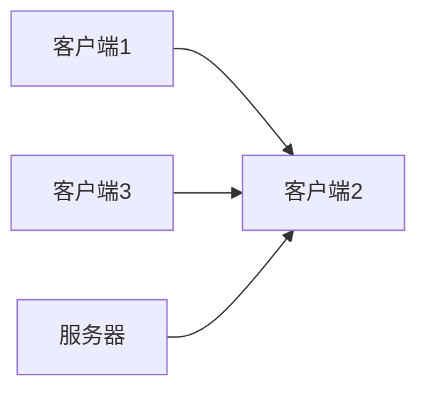
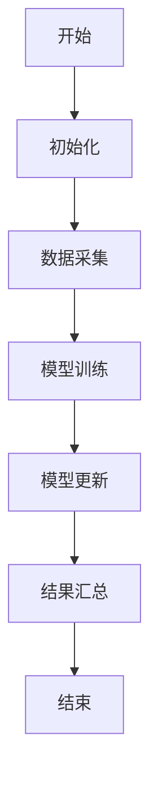
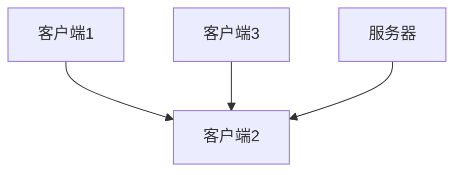
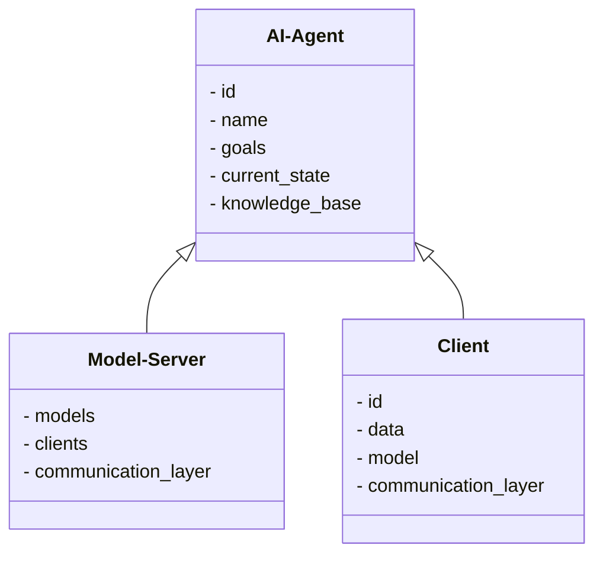
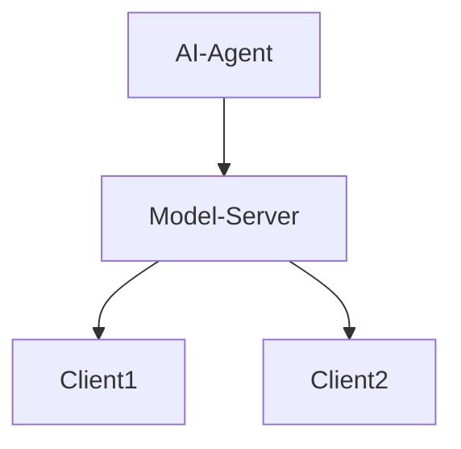
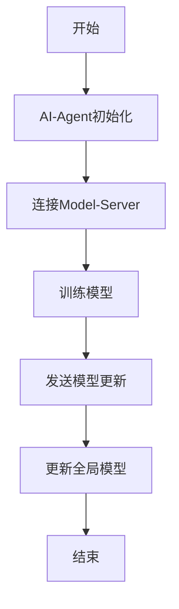

                 


# 企业AI Agent的联邦学习平台设计

> 关键词：联邦学习、企业AI Agent、数据隐私、分布式计算、机器学习平台、系统架构

> 摘要：本文详细探讨了企业AI Agent的联邦学习平台设计，涵盖背景、核心概念、算法原理、系统架构、项目实战和最佳实践。通过系统分析和具体案例，揭示了联邦学习在企业中的应用价值和实现方法。

---

# 1. 联邦学习平台的背景与概念

## 1.1 联邦学习的基本概念

### 1.1.1 联邦学习的定义
联邦学习是一种分布式机器学习方法，允许多个参与方在不共享原始数据的情况下，协作训练模型。其核心在于数据的局部存储和模型的全局优化。

### 1.1.2 联邦学习的核心特点
- **数据隐私**：数据不出域，保护隐私。
- **分布式计算**：计算资源分布在各参与方。
- **模型协作**：各参与方模型参数同步更新，共同优化。

### 1.1.3 联邦学习与传统分布式学习的区别
| 特性       | 联邦学习                | 传统分布式学习         |
|------------|------------------------|------------------------|
| 数据共享   | 不共享原始数据         | 共享数据               |
| 计算模式   | 分布式计算             | 集中式或分布式计算     |
| 隐私保护   | 强调隐私保护           | 隐私保护较弱           |

## 1.2 企业AI Agent的背景

### 1.2.1 企业AI Agent的定义
企业AI Agent是能够感知环境、自主决策并执行任务的智能体，用于优化企业流程和决策。

### 1.2.2 企业AI Agent的应用场景
- **客户行为分析**：预测客户行为，优化营销策略。
- **智能客服**：提供自动化支持，解决客户问题。
- **供应链优化**：协调供应链各环节，提高效率。

### 1.2.3 联邦学习与企业AI Agent的结合
联邦学习使企业AI Agent能够在不共享数据的情况下，协同训练更强大的模型，提升决策能力。

---

# 2. 联邦学习的核心概念与联系

## 2.1 联邦学习的核心原理

### 2.1.1 数据隐私保护机制
- 数据加密：传输和存储过程中加密，防止数据泄露。
- 差分隐私：通过添加噪声保护数据隐私。

### 2.1.2 模型更新与同步机制
- 模型参数更新：各参与方在本地数据上训练模型，更新参数。
- 参数同步：通过通信协议，将参数汇总到中央服务器，更新全局模型。

### 2.1.3 联邦学习的通信协议
- 数据格式：统一的数据交换格式，确保兼容性。
- 通信频率：定义模型更新的频率和方式，如周期性同步。

## 2.2 联邦学习的实体关系图



## 2.3 联邦学习的流程图



---

# 3. 联邦学习的算法原理

## 3.1 联邦平均算法（FedAvg）

### 3.1.1 算法原理
FedAvg通过聚合各客户端的模型更新，形成全局模型。具体步骤如下：

1. **初始化**：全局模型参数初始化。
2. **数据采集**：各客户端在本地数据上训练模型。
3. **模型更新**：客户端更新本地模型参数。
4. **参数同步**：客户端将更新后的参数上传到服务器。
5. **全局模型更新**：服务器聚合所有客户端的参数，更新全局模型。

### 3.1.2 算法流程图



### 3.1.3 代码实现示例

```python
import numpy as np

def fed_avg(global_model, client_models):
    # 全局模型参数初始化
    global_params = global_model.get_params()
    # 客户端模型参数平均
    for param in global_params:
        # 计算客户端参数平均值
        avg_param = np.mean([client.get_params()[i] for client in client_models], axis=0)
        global_model.set_params(global_params)
    return global_model
```

---

# 4. 企业AI Agent的系统架构设计

## 4.1 系统功能设计

### 4.1.1 领域模型类图



### 4.1.2 系统架构设计



### 4.1.3 系统交互流程图



---

# 5. 项目实战：企业AI Agent的联邦学习平台实现

## 5.1 环境安装

### 5.1.1 安装依赖
```bash
pip install numpy
pip install mermaid
```

## 5.2 核心代码实现

### 5.2.1 服务器端代码

```python
import socket

class Model_Server:
    def __init__(self, host='localhost', port=5000):
        self.host = host
        self.port = port
        self.clients = []

    def run(self):
        with socket.socket(socket.AF_INET, socket.SOCK_STREAM) as s:
            s.bind((self.host, self.port))
            s.listen()
            print(f"Server running on {self.host}:{self.port}")
            while True:
                conn, addr = s.accept()
                with conn:
                    data = conn.recv(1024)
                    if not data:
                        break
                    # 处理接收到的数据
                    # （此处省略具体处理逻辑）
```

### 5.2.2 客户端代码

```python
import socket

class Client:
    def __init__(self, host='localhost', port=5000):
        self.host = host
        self.port = port

    def send_data(self, data):
        with socket.socket(socket.AF_INET, socket.SOCK_STREAM) as s:
            s.connect((self.host, self.port))
            s.sendall(data)
```

## 5.3 案例分析与总结

### 5.3.1 案例分析
通过实现一个简单的联邦学习平台，展示了如何在不共享数据的情况下，协同训练模型。各客户端在本地训练模型，并将更新后的参数发送到服务器，服务器聚合参数更新全局模型。

### 5.3.2 总结
通过实际案例，验证了联邦学习在企业AI Agent中的可行性，展示了如何在保护数据隐私的前提下，提升模型性能。

---

# 6. 最佳实践与小结

## 6.1 最佳实践

### 6.1.1 数据隐私保护
- 使用加密技术保护数据传输。
- 采用差分隐私机制防止数据泄露。

### 6.1.2 模型更新策略
- 根据数据分布动态调整模型更新频率。
- 设置合理的同步间隔，平衡延迟和模型性能。

### 6.1.3 系统架构优化
- 使用高效的通信协议，降低数据传输开销。
- 优化服务器端的参数聚合算法，提升计算效率。

## 6.2 小结

企业AI Agent的联邦学习平台设计，不仅保护了数据隐私，还实现了模型的协作训练。通过系统化的架构设计和算法实现，企业在不共享数据的前提下，能够构建更强大的AI系统。

---

# 作者：AI天才研究院  
联系邮箱：info@aigeniushub.com  
官方网站：https://www.aigeniushub.com

