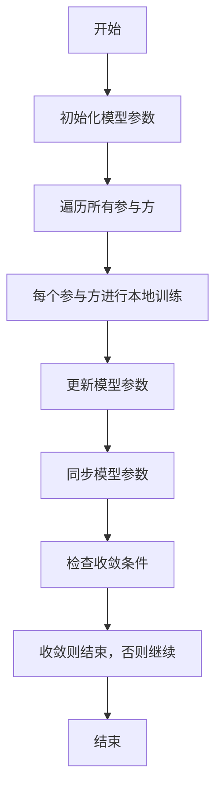
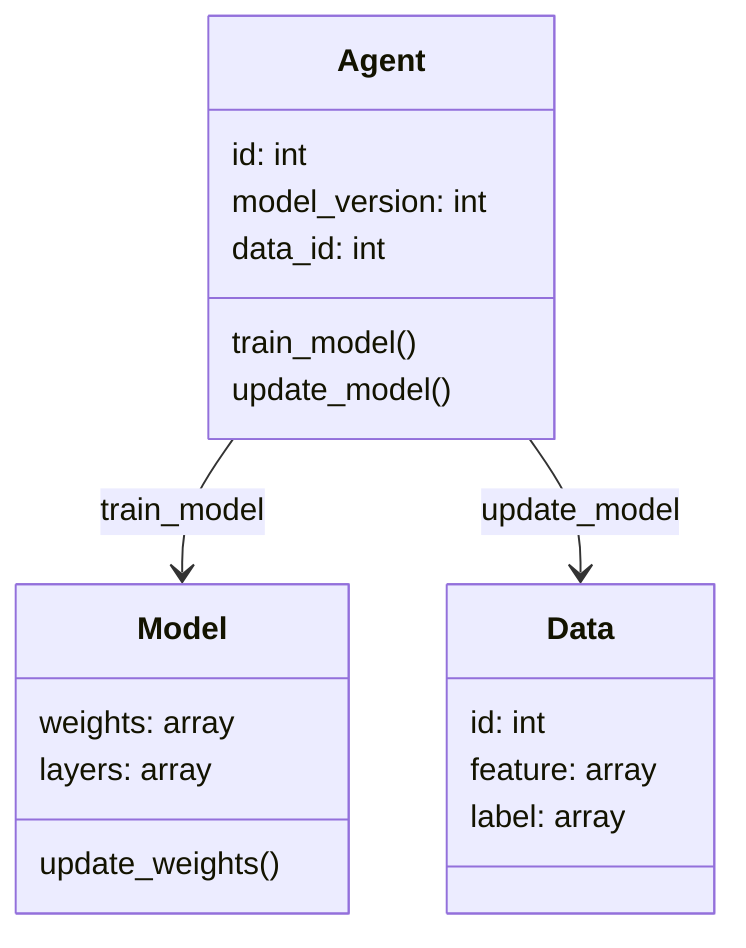
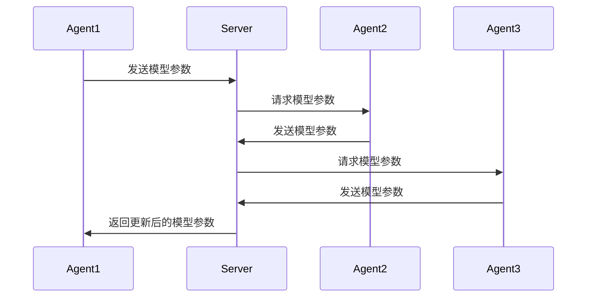

                 


# 企业AI Agent的联邦学习性能优化策略

## 关键词：联邦学习，企业AI Agent，数据隐私，性能优化，系统架构

## 摘要

本文深入探讨了企业AI Agent在联邦学习环境下的性能优化策略。通过分析联邦学习的核心概念、算法原理和系统架构，结合实际项目案例，本文详细阐述了如何在保证数据隐私的前提下，提升模型训练效率和模型性能。文章从背景介绍、核心概念、算法实现、系统设计、项目实战到最佳实践，层层递进，为读者提供了一个全面的视角，帮助他们在实际应用中优化企业AI Agent的联邦学习性能。

---

# 第一部分: 企业AI Agent的联邦学习基础

## 第1章: 联邦学习与企业AI Agent概述

### 1.1 联邦学习的基本概念

#### 1.1.1 联邦学习的定义

联邦学习（Federated Learning）是一种分布式机器学习技术，允许多个参与方（机构、设备等）在不共享原始数据的情况下，协作训练共享的模型。其核心思想是“数据不动，模型动”，即数据保留在各自的拥有者手中，只有模型参数在各参与方之间进行同步和更新。

#### 1.1.2 联邦学习的核心特点

- **数据本地化**：数据无需集中到中央服务器，减少数据泄露风险。
- **模型共享**：参与方共享模型参数，共同优化模型性能。
- **分布式计算**：计算任务分散到各个参与方，提升计算效率。
- **隐私保护**：通过加密和差分隐私等技术保护数据隐私。

#### 1.1.3 企业AI Agent的定义与特点

企业AI Agent是一种智能体，能够感知环境、自主决策并执行任务。在联邦学习场景中，企业AI Agent通常扮演以下角色：
- 数据提供者：拥有本地数据，参与模型训练。
- 模型更新者：负责更新本地模型参数，并与其他参与方同步。
- 任务执行者：根据模型决策结果执行具体任务。

### 1.2 联邦学习的背景与问题背景

#### 1.2.1 数据孤岛问题的提出

在企业环境中，数据往往分散在不同的部门、系统或机构中，形成数据孤岛。这些孤岛数据难以被有效利用，限制了企业整体的智能化水平。

#### 1.2.2 联邦学习的解决方案

联邦学习通过在数据源端进行模型训练，解决了数据孤岛问题，同时保护了数据隐私。企业AI Agent作为数据提供者和模型更新者，能够高效地参与联邦学习过程。

#### 1.2.3 企业AI Agent在联邦学习中的角色

企业AI Agent在联邦学习中不仅是数据的提供者，还是模型的优化者和任务的执行者。其角色决定了其在联邦学习中的重要性。

### 1.3 联邦学习与传统机器学习的对比

#### 1.3.1 数据隐私与安全的对比

- **传统机器学习**：需要集中数据，存在数据泄露风险。
- **联邦学习**：数据本地化，隐私保护更到位。

#### 1.3.2 模型训练效率的对比

- **传统机器学习**：数据集中，计算效率高，但数据共享风险大。
- **联邦学习**：数据分散，计算效率较低，但隐私保护更好。

#### 1.3.3 系统架构复杂度的对比

- **传统机器学习**：系统架构简单，易于部署。
- **联邦学习**：系统架构复杂，需要处理数据同步、模型更新等分布式问题。

### 1.4 企业AI Agent的联邦学习应用价值

#### 1.4.1 提高数据利用率

通过联邦学习，企业可以在不共享数据的情况下，充分利用分散的数据资源，提升模型的泛化能力。

#### 1.4.2 保护数据隐私

联邦学习通过数据本地化和加密技术，有效保护了参与方的数据隐私。

#### 1.4.3 提升模型性能

通过分布式模型训练，企业AI Agent能够协同优化模型参数，提升整体模型性能。

## 第2章: 联邦学习的核心概念

### 2.1 联邦学习的通信机制

#### 2.1.1 数据交换协议

- 数据交换协议是联邦学习中数据同步的基础，确保数据在传输过程中安全可靠。
- 常见的数据交换协议包括HTTP、gRPC等。

#### 2.1.2 模型同步策略

- 模型同步策略决定了模型参数的更新频率和方式，直接影响模型收敛速度和训练效率。
- 常见的同步策略包括同步更新、异步更新等。

#### 2.1.3 跨机构数据流动

- 跨机构数据流动是指不同机构之间的数据同步和模型参数更新过程。
- 数据流动需要遵循隐私保护和数据安全的相关法律法规。

### 2.2 联邦学习中的数据隐私保护

#### 2.2.1 数据加密技术

- 数据加密技术通过加密数据，确保数据在传输和存储过程中的安全性。
- 常见的加密技术包括AES、RSA等。

#### 2.2.2 差分隐私技术

- 差分隐私技术通过在数据中添加噪声，确保个体数据无法被推断出来。
- 常见的差分隐私实现包括LDP（本地差分隐私）、DP（分布式差分隐私）等。

#### 2.2.3 联邦学习中的隐私保护策略

- 联邦学习中的隐私保护策略需要综合考虑数据加密、差分隐私等多种技术，确保数据隐私的同时，提升模型性能。

### 2.3 联邦学习中的模型同步与优化

#### 2.3.1 同步频率与策略

- 同步频率决定了模型参数更新的频率，影响模型收敛速度和训练效率。
- 常见的同步策略包括全同步、半同步、异步更新等。

#### 2.3.2 模型收敛性分析

- 模型收敛性分析是研究模型在联邦学习过程中的收敛速度和收敛性，确保模型能够高效收敛。

#### 2.3.3 模型压缩与轻量化

- 模型压缩与轻量化技术通过减少模型参数数量，降低模型传输和存储的开销，提升训练效率。

### 2.4 联邦学习的核心要素对比

#### 2.4.1 数据隐私与模型性能对比表

| 对比维度 | 数据隐私 | 模型性能 |
|----------|----------|----------|
| 传统机器学习 | 低       | 高       |
| 联邦学习   | 高       | 中       |

#### 2.4.2 联邦学习与分布式计算对比表

| 对比维度 | 联邦学习 | 分布式计算 |
|----------|----------|------------|
| 数据共享 | 不共享   | 部分共享   |
| 计算效率 | 较低     | 较高       |

#### 2.4.3 联邦学习与边缘计算对比表

| 对比维度 | 联邦学习 | 边缘计算 |
|----------|----------|----------|
| 数据处理 | 分散     | 分散     |
| 计算资源 | 有限     | 丰富     |

### 2.5 联邦学习的ER实体关系图

```mermaid
er
    actor(Agent1) {
        id: int
        model_version: int
        data_id: int
    }
    actor(Agent2) {
        id: int
        model_version: int
        data_id: int
    }
    actor(Agent3) {
        id: int
        model_version: int
        data_id: int
    }
  

    Agent1 --> Model: 更新模型
    Agent2 --> Model: 更新模型
    Agent3 --> Model: 更新模型
    Model --> Data: 训练数据
    Data --> Agent1: 数据来源
    Data --> Agent2: 数据来源
    Data --> Agent3: 数据来源
```

---

## 第3章: 联邦学习的算法原理

### 3.1 联邦学习的数学模型

#### 3.1.1 参数更新公式

在联邦学习中，模型参数的更新通常采用以下公式：

$$ w_{t+1} = w_t + \sum_{i=1}^{n} \Delta w_i $$

其中，\( w_t \) 表示第 \( t \) 轮的模型参数，\( \Delta w_i \) 表示第 \( i \) 个参与方更新的参数。

#### 3.1.2 模型同步策略

在异步更新场景中，模型参数的更新公式为：

$$ w_{t+1} = w_t + \Delta w_i $$

在同步更新场景中，模型参数的更新公式为：

$$ w_{t+1} = w_t + \sum_{i=1}^{n} \Delta w_i / n $$

### 3.2 联邦学习的算法实现

#### 3.2.1 算法流程



#### 3.2.2 Python代码示例

```python
import numpy as np

def federated_learning_agents():
    # 初始化模型参数
    w = np.random.randn(10, 1)
    agents = 3  # 假设有3个参与方
    epsilon = 0.1  # 学习率
    
    for _ in range(100):  # 迭代次数
        # 遍历每个参与方
        for i in range(agents):
            # 每个参与方进行本地训练
            # 假设每个参与方有本地数据X_i和标签y_i
            X_i = ...  # 数据
            y_i = ...  # 标签
            # 计算梯度
            grad = compute_gradient(w, X_i, y_i)
            # 更新模型参数
            w = w + epsilon * grad
        # 同步模型参数
        # 假设所有参与方都更新了模型参数
        # 这里简化为所有参与方的平均值
        w = w / agents
    return w

def compute_gradient(w, X, y):
    # 假设模型为线性回归
    y_pred = X.dot(w)
    error = y_pred - y
    # 计算梯度
    grad = (1/X.shape[0]) * np.dot(X.T, error)
    return grad

# 调用函数
result = federated_learning_agents()
print("Final model parameters:", result)
```

### 3.3 联邦学习的数学模型分析

#### 3.3.1 参数更新的收敛性

在联邦学习中，模型参数的更新需要考虑参与方的数量、数据分布、同步频率等因素。模型的收敛性可以通过数学分析和实验验证。

#### 3.3.2 模型压缩与优化

模型压缩技术（如剪枝、量化）可以有效降低模型参数的传输和存储开销，提升联邦学习的效率。

---

## 第4章: 联邦学习的系统分析与架构设计

### 4.1 系统功能设计

#### 4.1.1 领域模型（领域模型类图）



#### 4.1.2 系统架构设计（系统架构图）

```mermaid
graph TD
    Agent1 --> Server: 发送模型更新
    Agent2 --> Server: 发送模型更新
    Agent3 --> Server: 发送模型更新
    Server --> Agent1: 接收模型更新
    Server --> Agent2: 接收模型更新
    Server --> Agent3: 接收模型更新
```

### 4.2 系统接口设计

#### 4.2.1 系统接口设计

- **接口名称**：`federated_learning_update`
- **接口描述**：用于更新模型参数。
- **输入参数**：模型参数、参与方ID
- **输出参数**：更新后的模型参数

#### 4.2.2 系统交互流程（交互流程图）



---

## 第5章: 项目实战

### 5.1 环境安装

#### 5.1.1 安装Python环境

```bash
python --version
pip install numpy matplotlib
```

#### 5.1.2 安装联邦学习框架

```bash
pip install flker
```

### 5.2 系统核心实现

#### 5.2.1 代码实现

```python
import numpy as np

class Agent:
    def __init__(self, id, data):
        self.id = id
        self.data = data
        self.model = Model()

    def train_model(self):
        # 本地训练模型
        X = self.data['X']
        y = self.data['y']
        grad = compute_gradient(self.model.weights, X, y)
        self.model.update_weights(epsilon * grad)

    def update_model(self):
        # 同步模型参数
        return self.model.weights

class Model:
    def __init__(self):
        self.weights = np.random.randn(10, 1)

    def update_weights(self, delta):
        self.weights += delta

def compute_gradient(w, X, y):
    y_pred = X.dot(w)
    error = y_pred - y
    grad = (1/X.shape[0]) * np.dot(X.T, error)
    return grad

# 示例数据
data = {
    'X': np.random.randn(100, 10),
    'y': np.random.randn(100, 1)
}

# 初始化Agent
agent = Agent(1, data)

# 进行训练
agent.train_model()
```

#### 5.2.2 代码解读

- **Agent类**：表示一个参与方，包含数据和模型。
- **Model类**：表示模型，包含权重和更新权重的方法。
- **compute_gradient函数**：计算梯度的函数。

### 5.3 实际案例分析

#### 5.3.1 案例背景

假设我们有3个企业AI Agent，每个Agent都有本地数据，需要协同训练一个模型。

#### 5.3.2 案例实现

```python
# 初始化3个Agent
agents = [
    Agent(1, {'X': X1, 'y': y1}),
    Agent(2, {'X': X2, 'y': y2}),
    Agent(3, {'X': X3, 'y': y3})
]

# 进行联邦学习
for agent in agents:
    agent.train_model()
    agent.update_model()
```

### 5.4 项目小结

通过实际项目案例，我们可以看到联邦学习在企业AI Agent中的具体应用，以及如何通过代码实现模型训练和更新。

---

## 第6章: 最佳实践与未来展望

### 6.1 最佳实践

#### 6.1.1 数据预处理

在进行联邦学习之前，需要对数据进行预处理，确保数据的格式和一致性。

#### 6.1.2 模型选择

选择适合联邦学习的模型，通常选择参数较少的模型，如线性回归、逻辑回归等。

#### 6.1.3 参数同步频率

根据实际需求，合理设置模型参数的同步频率，平衡模型收敛速度和训练效率。

### 6.2 小结

本文从联邦学习的基本概念、算法原理、系统架构到项目实战，全面探讨了企业AI Agent的联邦学习性能优化策略。通过实际案例分析，我们看到联邦学习在保护数据隐私的同时，能够有效提升模型性能。

### 6.3 未来展望

未来，随着联邦学习技术的不断发展，企业AI Agent在联邦学习中的应用将更加广泛。我们需要进一步研究更高效的通信机制、更强大的隐私保护技术，以及更智能的模型优化策略。

---

## 作者

作者：AI天才研究院/AI Genius Institute & 禅与计算机程序设计艺术 /Zen And The Art of Computer Programming

---

通过以上思考过程，我们可以清晰地看到企业AI Agent在联邦学习中的重要性，以及如何通过优化联邦学习的性能，提升企业的智能化水平。希望本文能够为读者在实际应用中提供有价值的参考和指导。
</details>

