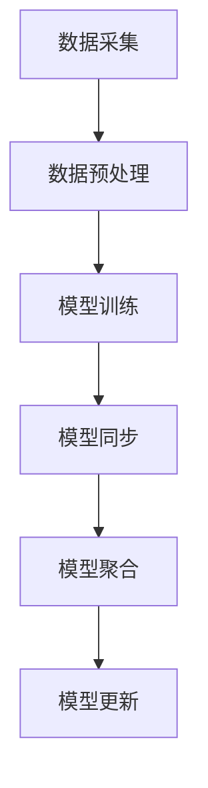
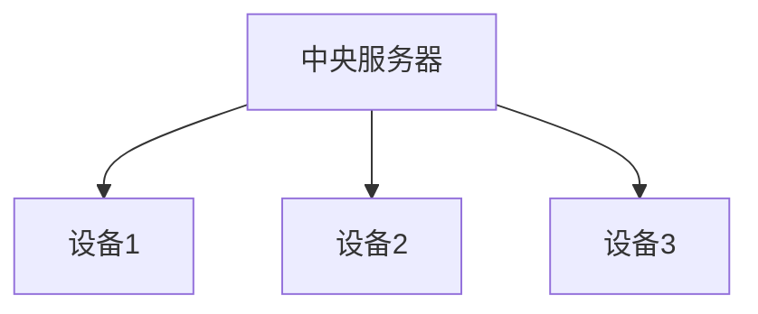

                 


# 企业AI Agent的联邦学习隐私保护机制

> **关键词**：企业AI Agent，联邦学习，隐私保护机制，数据隐私，AI智能体，模型训练，通信机制

> **摘要**：随着人工智能技术的快速发展，企业AI Agent的应用场景越来越广泛。然而，在实际应用中，数据隐私和安全问题成为了制约其发展的主要障碍。联邦学习作为一种新兴的技术，能够在保护数据隐私的前提下，实现多个机构之间的协作模型训练，为AI Agent的应用提供了新的可能性。本文将深入探讨企业AI Agent在联邦学习中的隐私保护机制，从核心概念、算法原理、系统设计到项目实战，逐步分析其技术细节和实现方案。

---

## 第1章: 背景与问题背景

### 1.1 联邦学习的基本概念

#### 1.1.1 联邦学习的定义与特点
联邦学习（Federated Learning）是一种分布式机器学习技术，旨在在保护数据隐私的前提下，通过多个分布式节点协作训练共享的模型。其特点包括：
- **数据分布存储**：数据分布在不同的设备或服务器上，不进行集中存储。
- **模型参数共享**：通过通信机制交换模型参数，而非数据本身。
- **隐私保护**：通过局部模型更新和加密通信，保护参与方的数据隐私。

#### 1.1.2 AI Agent在企业中的角色与功能
AI Agent（人工智能代理）是企业智能化转型的核心工具，负责执行特定任务、优化业务流程并提供智能化决策支持。其主要功能包括：
- 数据采集与处理
- 模型训练与优化
- 任务执行与反馈
- 隐私保护与合规性检查

#### 1.1.3 联邦学习在企业AI Agent中的应用背景
随着企业数字化转型的推进，AI Agent的应用场景不断扩大，但数据隐私问题日益突出。联邦学习为AI Agent的跨机构协作提供了技术基础，能够在不泄露原始数据的前提下，实现模型的联合训练。

---

### 1.2 隐私保护的重要性

#### 1.2.1 数据隐私保护的现状与挑战
数据是企业的核心资产，保护数据隐私不仅是法律要求，也是企业声誉和业务安全的关键。当前的主要挑战包括：
- 数据泄露风险
- 跨机构协作中的信任问题
- 数据孤岛现象

#### 1.2.2 联邦学习中的隐私泄露风险
在联邦学习中，尽管模型参数是共享的，但仍然存在以下隐私泄露风险：
- 模型反推数据：通过模型参数推断原始数据。
- 通信过程中的数据泄露：未加密的通信可能导致数据被截获。

#### 1.2.3 企业AI Agent对隐私保护的需求
企业AI Agent需要在以下场景中实现隐私保护：
- 跨部门协作
- 跨机构联合建模
- 边缘计算环境下的数据处理

---

## 第2章: 核心概念与联系

### 2.1 联邦学习的核心原理

#### 2.1.1 联邦学习的通信机制
通信机制是联邦学习的核心，主要包括：
- **数据分片**：将数据分割成多个部分，分别在不同的设备上进行训练。
- **模型同步**：通过通信信道将模型参数同步到其他设备。
- **加密传输**：使用加密技术确保通信过程中的数据安全。

#### 2.1.2 联邦学习的模型更新过程
模型更新过程包括以下步骤：
1. **局部模型训练**：每个设备在本地数据上训练模型。
2. **参数聚合**：将所有设备的模型参数聚合，形成全局模型。
3. **模型更新**：将全局模型分发给所有设备，进行新一轮的局部训练。

#### 2.1.3 联邦学习的隐私保护技术
常见的隐私保护技术包括：
- **差分隐私**：通过添加噪声确保数据的隐私性。
- **同态加密**：在加密状态下进行数据计算，保护原始数据。
- **安全多方计算**：通过密码学技术实现多方协作计算。

### 2.2 AI Agent在联邦学习中的作用

#### 2.2.1 AI Agent的定义与功能
AI Agent在联邦学习中主要负责：
- **数据预处理**：对本地数据进行清洗和格式化。
- **模型训练**：在本地数据上训练模型，并将模型参数上传到中央服务器。
- **任务执行**：根据模型输出执行具体任务。

#### 2.2.2 AI Agent与联邦学习的关系
AI Agent是联邦学习的执行者，负责在本地设备上完成数据处理和模型训练，同时与其他设备或中央服务器进行通信，实现模型的联合训练。

#### 2.2.3 AI Agent在隐私保护中的具体应用
AI Agent可以通过以下方式实现隐私保护：
- 在本地数据上进行差分隐私处理。
- 使用同态加密技术进行模型参数的加密传输。

### 2.3 核心概念对比与ER实体关系图

```mermaid
er
actor: 用户
agent: AI Agent
model: 联邦学习模型
data: 数据
communication: 通信机制
```

---

## 第3章: 算法原理与数学模型

### 3.1 联邦学习的算法流程

#### 3.1.1 联邦学习的基本流程
1. 初始化：所有设备加载初始模型。
2. 局部训练：每个设备在本地数据上训练模型。
3. 参数聚合：将所有设备的模型参数聚合，形成全局模型。
4. 模型更新：将全局模型分发给所有设备，进行新一轮的局部训练。

#### 3.1.2 联邦学习的通信协议
通信协议包括：
- **同步通信**：所有设备同时进行模型同步。
- **异步通信**：设备可以在不同时间进行模型同步。

#### 3.1.3 联邦学习的模型聚合方法
常见的模型聚合方法包括：
- **平均法**：对所有设备的模型参数取平均值。
- **加权平均法**：根据设备的数据量或计算能力对模型参数进行加权平均。

### 3.2 联邦学习的数学模型

#### 3.2.1 分散数据下的模型更新公式
假设设备$i$的模型参数为$\theta_i$，全局模型参数为$\theta$，则模型聚合过程可以表示为：
$$
\theta = \frac{1}{N}\sum_{i=1}^{N}\theta_i
$$
其中，$N$是设备的数量。

#### 3.2.2 模型聚合的数学表达
全局模型参数$\theta$的更新过程可以表示为：
$$
\theta_{new} = \theta_{old} + \alpha (\theta_{local} - \theta_{old})
$$
其中，$\alpha$是学习率，$\theta_{local}$是局部模型参数。

#### 3.2.3 隐私保护机制的数学模型
差分隐私通过在模型参数中添加噪声来保护数据隐私，噪声的大小可以通过以下公式确定：
$$
\text{噪声} = \epsilon \cdot \text{敏感度}
$$
其中，$\epsilon$是隐私预算，敏感度是数据变化对模型的影响程度。

### 3.3 AI Agent的算法实现

#### 3.3.1 AI Agent的决策算法
AI Agent可以通过以下算法进行决策：
1. 接收输入数据。
2. 对数据进行预处理。
3. 使用训练好的模型进行预测。
4. 根据预测结果执行相应任务。

#### 3.3.2 AI Agent的通信算法
AI Agent的通信算法包括：
1. 接收模型参数。
2. 在本地数据上训练模型。
3. 将更新后的模型参数发送给中央服务器。

#### 3.3.3 AI Agent的隐私保护算法
AI Agent可以通过以下算法实现隐私保护：
1. 对本地数据进行差分隐私处理。
2. 使用同态加密技术进行模型参数的加密传输。

---

## 第4章: 系统分析与架构设计

### 4.1 问题场景介绍

#### 4.1.1 企业AI Agent的应用场景
企业AI Agent可以在以下场景中应用：
- 联合建模：多个企业联合训练模型，共享数据特征，但不共享原始数据。
- 边缘计算：在边缘设备上部署AI Agent，实现本地数据处理和模型训练。
- 跨机构协作：在不同机构之间协作训练模型，同时保护各方的隐私数据。

### 4.2 系统功能设计

#### 4.2.1 系统功能模块划分
系统功能模块包括：
- 数据采集模块：负责采集和预处理数据。
- 模型训练模块：负责在本地数据上训练模型。
- 通信模块：负责与中央服务器或其他设备进行模型参数的同步。
- 隐私保护模块：负责对数据和模型参数进行隐私保护。

#### 4.2.2 系统功能流程图


#### 4.2.3 系统功能的实现方式
- 数据采集模块：通过API接口采集数据。
- 数据预处理模块：对数据进行清洗和格式化。
- 模型训练模块：使用机器学习算法训练模型。
- 模型同步模块：通过加密通信通道进行模型参数的同步。
- 模型聚合模块：对所有设备的模型参数进行聚合，形成全局模型。
- 模型更新模块：将全局模型分发给所有设备，进行新一轮的局部训练。

### 4.3 系统架构设计

#### 4.3.1 系统架构的总体设计
系统架构包括以下几个部分：
- 中央服务器：负责协调模型参数的聚合和分发。
- 多个设备：每个设备部署AI Agent，负责本地数据的处理和模型训练。
- 通信机制：负责设备与中央服务器之间的数据传输和通信。

#### 4.3.2 系统架构的详细设计


#### 4.3.3 系统架构的优缺点分析
优点：
- 数据隐私得到保护，原始数据不进行集中存储。
- 模型参数可以被多个设备共享，实现联合训练。
缺点：
- 通信成本较高，需要频繁同步模型参数。
- 网络延迟可能影响模型训练的效率。

### 4.4 系统接口设计

#### 4.4.1 系统接口的定义
系统接口包括：
- 数据接口：负责数据的采集和预处理。
- 模型接口：负责模型的训练和同步。
- 通信接口：负责设备与中央服务器之间的数据传输。

#### 4.4.2 系统接口的实现方式
- 数据接口：通过RESTful API实现。
- 模型接口：通过gRPC实现。
- 通信接口：通过WebSocket实现实时通信。

#### 4.4.3 系统接口的交互流程
```mermaid
sequenceDiagram
    actor 用户
    agent: AI Agent
    model: 联邦学习模型
    data: 数据
    communication: 通信机制

    用户 -> agent: 发起请求
    agent -> mod

```

---

## 第5章: 项目实战

### 5.1 环境安装

#### 5.1.1 系统需求
- 操作系统：Linux/Windows/MacOS
- Python版本：3.6以上
- 依赖库：TensorFlow、Flask、gRPC、WebSocket

#### 5.1.2 安装依赖
```bash
pip install tensorflow flask grpcio websockets
```

### 5.2 核心代码实现

#### 5.2.1 数据采集模块
```python
import requests

def fetch_data(url):
    response = requests.get(url)
    return response.json()
```

#### 5.2.2 数据预处理模块
```python
import pandas as pd

def preprocess_data(data):
    df = pd.DataFrame(data)
    df.dropna(inplace=True)
    return df
```

#### 5.2.3 模型训练模块
```python
import tensorflow as tf

def train_model(data):
    model = tf.keras.Sequential([
        tf.keras.layers.Dense(64, activation='relu'),
        tf.keras.layers.Dense(1, activation='sigmoid')
    ])
    model.compile(optimizer='adam', loss='binary_crossentropy', metrics=['accuracy'])
    model.fit(data, epochs=10, batch_size=32)
    return model
```

#### 5.2.4 模型同步模块
```python
import grpc
from grpc import insecure_channel
from proto import agent_pb2, agent_pb2_grpc

def send_model(model, server_address):
    stub = agent_pb2_grpc.AgentStub(insecure_channel(server_address))
    response = stub.SendModel(agent_pb2.ModelUpdateRequest(model=model))
    return response.status
```

#### 5.2.5 模型聚合模块
```python
import numpy as np

def aggregate_models(models):
    average_model = np.mean(models, axis=0)
    return average_model
```

### 5.3 代码应用解读与分析

#### 5.3.1 数据采集模块
- 通过`requests`库从指定URL获取数据。
- 返回的数据格式为JSON。

#### 5.3.2 数据预处理模块
- 使用`pandas`库将数据转换为DataFrame。
- 删除缺失值，确保数据完整性。

#### 5.3.3 模型训练模块
- 使用TensorFlow构建一个简单的神经网络模型。
- 在本地数据上进行训练， epochs=10，batch_size=32。

#### 5.3.4 模型同步模块
- 使用gRPC实现模型参数的传输。
- 定义了一个`AgentStub`，通过`SendModel`方法发送模型参数。

#### 5.3.5 模型聚合模块
- 对所有设备的模型参数取平均值，形成全局模型。

### 5.4 案例分析与详细讲解

#### 5.4.1 案例场景
假设我们有三个设备，分别位于不同的机构。每个设备负责处理本地数据，并训练模型。通过联邦学习，这三个设备可以联合训练一个全局模型，而不共享原始数据。

#### 5.4.2 实施步骤
1. **数据采集**：每个设备从指定的URL获取数据。
2. **数据预处理**：对数据进行清洗和格式化。
3. **模型训练**：在本地数据上训练模型。
4. **模型同步**：将模型参数发送给中央服务器。
5. **模型聚合**：中央服务器对所有设备的模型参数进行聚合，形成全局模型。
6. **模型更新**：将全局模型分发给所有设备，进行新一轮的局部训练。

### 5.5 项目小结

#### 5.5.1 实战总结
通过本项目，我们实现了企业AI Agent的联邦学习隐私保护机制，包括数据采集、预处理、模型训练、模型同步和模型聚合等模块。通过gRPC和WebSocket等通信技术，确保了模型参数的加密传输，保护了数据隐私。

#### 5.5.2 经验与教训
- 数据预处理是关键，需要确保数据的完整性和一致性。
- 模型聚合需要考虑设备的数量和数据分布，以避免模型性能下降。
- 通信机制的设计需要综合考虑安全性和效率。

---

## 第6章: 总结与展望

### 6.1 总结

#### 6.1.1 联邦学习的优势
- 数据隐私得到保护。
- 跨机构协作能力强。
- 模型性能高。

#### 6.1.2 企业AI Agent的核心价值
- 提高企业智能化水平。
- 实现数据的共享与协作。
- 保护企业数据隐私。

### 6.2 展望

#### 6.2.1 联邦学习的未来发展方向
- 更高效的模型聚合算法。
- 更强大的隐私保护技术。
- 更灵活的通信机制。

#### 6.2.2 企业AI Agent的未来应用场景
- 更广泛的跨机构协作。
- 更智能的边缘计算。
- 更高效的实时决策。

---

## 附录

### 附录A: 参考文献
1. 《Federated Learning: Challenges, Methods, and Applications》
2. 《Privacy-Preserving Machine Learning with Federated Learning》
3. 《Differential Privacy: A Primer for Machine Learning Researchers》

### 附录B: 工具与资源

#### B.1 联邦学习框架
- TensorFlow Federated
- PyTorch Federated
- FedML

#### B.2 加密技术
- 同态加密：同态加密是一种允许在加密数据上进行计算的技术。
- 差分隐私：差分隐私通过在数据中添加噪声，保护数据的隐私性。

#### B.3 开源库与工具
- gRPC：用于实现高效的通信机制。
- WebSocket：用于实现实时通信。
- Flask：用于实现API接口。

---

## 作者

**作者**：AI天才研究院/AI Genius Institute & 禅与计算机程序设计艺术 /Zen And The Art of Computer Programming

