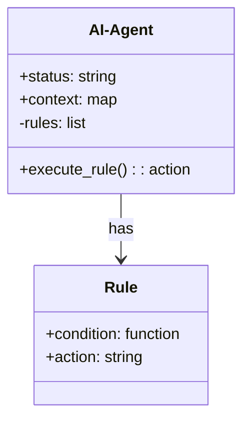
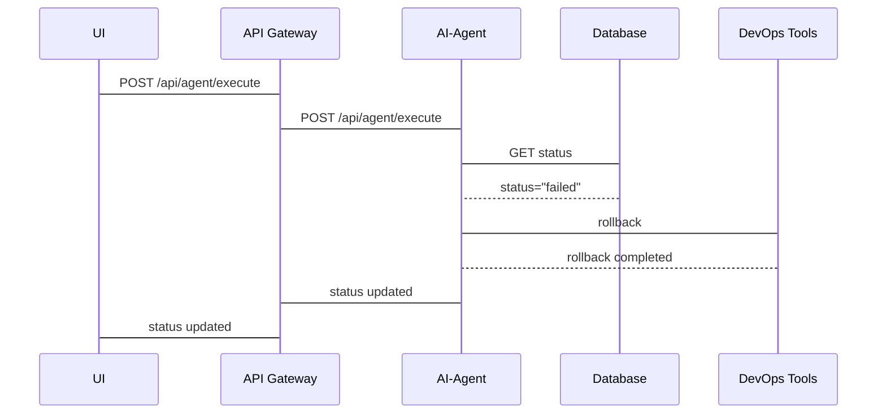

                 


```markdown
# 《企业AI Agent的自动化DevOps实践》

> 关键词：企业AI Agent, 自动化DevOps, AI算法, 系统架构, DevOps工具链

> 摘要：本文详细探讨了企业AI Agent在自动化DevOps中的应用实践。首先介绍了企业AI Agent的概念、核心原理及与自动化DevOps的关系。接着分析了基于规则的AI推理算法及其在自动化任务中的应用，详细讲解了系统的架构设计和接口交互机制。最后通过项目实战展示了企业AI Agent的实际应用，并总结了最佳实践和未来的发展方向。

---

# 第4章: 企业AI Agent的算法原理

## 4.1 基于规则的AI推理算法
### 4.1.1 算法原理概述
基于规则的推理是一种通过预定义规则和条件来生成决策的算法。其核心思想是根据输入数据匹配预设规则，从而得出相应的操作或结果。

### 4.1.2 算法实现步骤
1. **规则库的构建**：定义一系列规则，每个规则包含条件和动作。
2. **输入数据处理**：将输入数据与规则库中的条件进行匹配。
3. **规则匹配与推理**：根据匹配的条件，执行相应的动作。
4. **结果输出**：将推理结果返回给系统。

### 4.1.3 算法优缺点
#### 优点
- **简单易懂**：规则清晰，易于理解和维护。
- **可解释性强**：推理过程直观，便于调试和优化。
#### 缺点
- **规则复杂度高**：随着规则数量增加，维护成本上升。
- **灵活性有限**：难以处理动态变化或非结构化的数据。

### 4.1.4 算法实现的数学模型
我们可以将基于规则的推理表示为一个条件-动作对（Condition-Action）的集合。每个规则可以表示为：
$$
\text{if } C \text{ then } A
$$
其中，$C$ 是条件，$A$ 是动作。

## 4.2 基于机器学习的AI推理算法
### 4.2.1 算法原理概述
基于机器学习的推理算法通过训练模型来自动学习数据中的模式和特征，从而生成决策。常用的算法包括决策树、随机森林、支持向量机（SVM）等。

### 4.2.2 算法实现步骤
1. **数据收集与预处理**：收集相关数据并进行清洗、特征提取等预处理步骤。
2. **模型训练**：使用训练数据训练机器学习模型。
3. **模型预测**：利用训练好的模型对新的输入数据进行预测。
4. **结果优化**：通过调整模型参数或尝试不同的算法来优化预测结果。

### 4.2.3 算法优缺点
#### 优点
- **灵活性高**：能够处理复杂的数据模式和非结构化数据。
- **可扩展性强**：适用于各种复杂场景。
#### 缺点
- **训练成本高**：需要大量的数据和计算资源。
- **可解释性差**：黑箱模型难以解释具体决策过程。

### 4.2.4 算法实现的数学模型
以决策树为例，其数学模型可以表示为：
$$
\text{决策树} = \bigcup_{i=1}^{n} \text{决策规则}_i
$$
其中，$\text{决策规则}_i$ 是第 $i$ 条决策规则。

## 4.3 算法选择与实现
### 4.3.1 算法选择策略
选择算法时需考虑以下因素：
1. **数据类型与规模**：结构化数据适合基于规则的算法，非结构化数据适合机器学习算法。
2. **计算资源**：机器学习算法通常需要较高的计算资源。
3. **可解释性要求**：对可解释性要求高的场景更适合基于规则的算法。

### 4.3.2 算法实现示例
以下是一个基于规则的简单实现示例：

```python
# 定义规则库
rules = [
    {'condition': lambda x: x['status'] == 'failed', 'action': 'rollback'},
    {'condition': lambda x: x['priority'] == 'high', 'action': 'prioritize'}
]

# 规则匹配与执行
def execute_rule(data):
    for rule in rules:
        if rule['condition'](data):
            return rule['action']
    return None

# 示例数据
data = {'status': 'failed', 'priority': 'high'}
result = execute_rule(data)
print(result)  # 输出: rollback
```

---

# 第5章: 企业AI Agent的系统分析与架构设计

## 5.1 系统问题场景
假设我们有一个企业级的应用系统，需要通过AI Agent实现自动化运维和故障处理。

## 5.2 系统功能设计
### 5.2.1 领域模型设计
以下是领域模型的类图：



### 5.2.2 系统架构设计
以下是系统的总体架构图：

```mermaid
graph TD
    UI --> API Gateway
    API Gateway --> AI-Agent
    AI-Agent --> Database
    AI-Agent --> DevOps Tools
```

## 5.3 系统接口设计
### 5.3.1 API接口定义
- `/api/agent/status`：获取AI Agent的状态
- `/api/agent/execute`：执行指定的AI推理任务

### 5.3.2 API交互流程
以下是API交互的序列图：



---

# 第6章: 项目实战

## 6.1 环境安装
### 6.1.1 安装Python环境
```bash
python -m pip install --upgrade pip
pip install requests
pip install mermaid
```

## 6.2 系统核心实现

### 6.2.1 AI Agent实现
```python
class AI-Agent:
    def __init__(self):
        self.rules = []
    
    def add_rule(self, condition, action):
        self.rules.append({'condition': condition, 'action': action})
    
    def execute_rule(self, data):
        for rule in self.rules:
            if rule['condition'](data):
                return rule['action']
        return None
```

### 6.2.2 DevOps工具集成
```python
import subprocess

def rollback():
    subprocess.run('git reset --hard HEAD^', shell=True)
```

## 6.3 代码解读与分析
### 6.3.1 核心代码解读
- `AI-Agent` 类管理规则和执行推理。
- `execute_rule` 方法遍历规则，匹配并执行相应动作。

## 6.4 实际案例分析
假设我们有一个CI/CD pipeline，AI Agent会在检测到构建失败时触发回滚。

## 6.5 项目小结
### 6.5.1 核心实现总结
- 实现了基于规则的AI推理。
- 集成了DevOps工具链。

### 6.5.2 项目经验总结
- 规则设计需清晰简洁。
- 工具集成需充分考虑兼容性和稳定性。

---

# 第7章: 最佳实践与未来展望

## 7.1 最佳实践
### 7.1.1 算法选择
- 根据场景选择合适的算法。
- 保持规则的简洁性和可维护性。

### 7.1.2 系统设计
- 确保系统的可扩展性和可维护性。
- 定期监控和优化系统性能。

## 7.2 小结
企业AI Agent的自动化DevOps实践为企业提供了高效、智能的运维解决方案。通过合理选择算法和优化系统架构，可以显著提升企业的运维效率和响应速度。

## 7.3 注意事项
- 规则设计需谨慎，避免误判。
- 数据质量和完整性直接影响算法效果。

## 7.4 拓展阅读
- 《机器学习实战》
- 《软件架构设计》
- 《DevOps手册》

---

# 作者

作者：AI天才研究院/AI Genius Institute & 禅与计算机程序设计艺术 /Zen And The Art of Computer Programming
```

