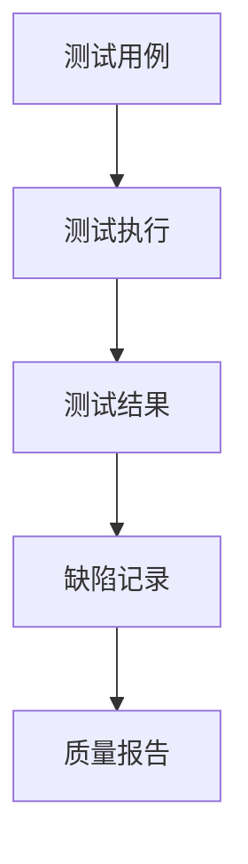
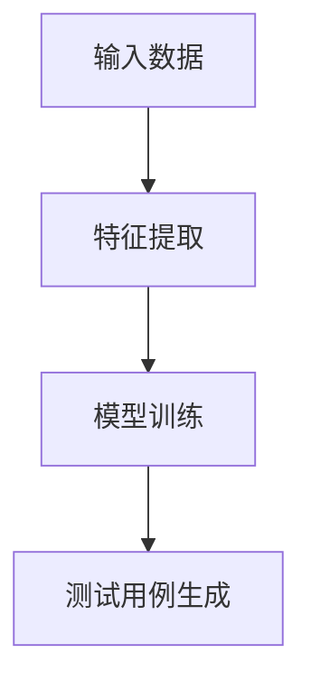
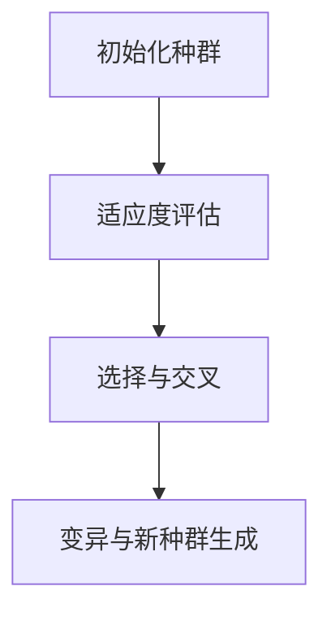

                 

# 《企业AI Agent的自动化测试与质量保证系统》

---

## 关键词：
- 企业AI Agent
- 自动化测试
- 质量保证系统
- 测试用例生成
- 缺陷检测
- 系统架构设计

---

## 摘要：
本文详细探讨了企业AI Agent的自动化测试与质量保证系统的设计与实现。首先，介绍了企业AI Agent的背景与挑战，分析了其自动化测试的必要性与特殊性。接着，从核心概念与系统架构的角度，深入探讨了测试用例生成、缺陷检测与分类、测试覆盖率分析等关键问题。随后，通过具体案例，展示了如何基于机器学习算法构建自动化测试系统，并详细讲解了系统的实现过程。最后，总结了企业在实际应用中需要注意的最佳实践，并展望了未来的发展方向。

---

# 第一部分: 企业AI Agent的背景与挑战

# 第1章: 企业AI Agent的背景与问题背景

## 1.1 企业AI Agent的定义与特点

### 1.1.1 AI Agent的基本概念

AI Agent（人工智能代理）是一种能够感知环境、自主决策并执行任务的智能体。在企业场景中，AI Agent通常用于自动化业务流程、数据处理、客户交互等场景。与传统程序相比，AI Agent具有以下特点：

- **自主性**：能够自主决策，无需人工干预。
- **反应性**：能够实时感知环境并做出响应。
- **学习能力**：能够通过数据学习和优化自身行为。
- **可扩展性**：能够处理多种任务，并且易于扩展。

### 1.1.2 企业AI Agent的核心特点

在企业环境中，AI Agent通常需要具备以下核心特点：

- **高效性**：能够快速处理大量数据，提高业务效率。
- **准确性**：能够在复杂场景中做出准确的决策。
- **可解释性**：能够提供决策的依据，便于人类理解和信任。
- **安全性**：能够在安全的前提下执行任务，避免数据泄露或操作失误。

### 1.1.3 企业AI Agent的应用场景

企业AI Agent的应用场景非常广泛，主要包括以下几个方面：

- **自动化业务流程**：例如，自动处理订单、生成报表等。
- **智能客服**：通过自然语言处理技术为用户提供智能咨询服务。
- **数据分析与预测**：利用AI技术对企业数据进行分析和预测，辅助决策。
- **智能监控**：实时监控企业系统运行状态，发现异常并自动处理。

## 1.2 企业AI Agent的自动化测试需求

### 1.2.1 自动化测试的定义与作用

自动化测试是指通过工具或脚本自动执行测试用例，验证系统功能是否符合预期。与手动测试相比，自动化测试具有以下优势：

- **效率高**：能够快速执行大量测试用例。
- **准确性高**：减少了人为错误的可能性。
- **可重复性**：可以重复执行相同的测试用例，确保系统稳定性。

### 1.2.2 企业AI Agent测试的特殊性

与传统系统测试相比，企业AI Agent的测试具有以下特殊性：

- **复杂性高**：AI Agent的行为依赖于机器学习模型，测试用例需要覆盖多种可能的输入场景。
- **动态性**：AI Agent的行为可能会根据新的数据输入动态变化，测试用例需要能够适应这种动态性。
- **可解释性要求高**：测试不仅需要验证结果是否正确，还需要验证AI Agent的决策过程是否透明和可解释。

### 1.2.3 企业AI Agent测试的挑战

在实际测试过程中，企业AI Agent面临以下主要挑战：

- **测试用例设计难度大**：由于AI Agent的行为具有不确定性，传统的基于输入输出的测试用例设计方法难以覆盖所有可能的场景。
- **测试效率低**：由于AI Agent的行为复杂，测试用例执行时间长，且需要频繁调整测试策略。
- **测试覆盖率低**：由于AI Agent的行为具有动态性，传统的测试方法难以确保测试覆盖率。

## 1.3 企业AI Agent质量保证的重要性

### 1.3.1 质量保证的基本概念

质量保证是指通过一系列过程和方法，确保产品或服务的质量符合预期。在企业AI Agent的开发过程中，质量保证尤为重要，因为AI Agent的行为直接影响企业的业务流程和决策。

### 1.3.2 企业AI Agent质量保证的关键点

在企业AI Agent的开发过程中，质量保证需要重点关注以下几个方面：

- **模型准确性**：确保AI Agent的决策模型准确无误。
- **系统稳定性**：确保AI Agent在各种场景下都能稳定运行。
- **可解释性**：确保AI Agent的决策过程能够被人类理解和信任。
- **安全性**：确保AI Agent的操作不会对企业造成安全风险。

### 1.3.3 质量保证对企业的价值

高质量的AI Agent能够为企业带来以下价值：

- **提高效率**：通过自动化流程提高业务效率。
- **降低风险**：通过准确的决策减少企业风险。
- **增强客户满意度**：通过智能化的服务提高客户满意度。
- **提升竞争力**：通过技术创新提升企业的市场竞争力。

## 1.4 本章小结

本章从企业AI Agent的背景出发，分析了其自动化测试的必要性与特殊性，讨论了企业AI Agent质量保证的重要性及其对企业的价值。通过本章的分析，我们明确了企业AI Agent测试与质量保证的核心问题，为后续章节的深入探讨奠定了基础。

---

# 第二部分: 企业AI Agent的自动化测试与质量保证的核心概念

# 第2章: 企业AI Agent的自动化测试系统架构

## 2.1 测试系统的核心概念

### 2.1.1 测试用例生成

测试用例生成是自动化测试系统的核心环节之一。传统的测试用例生成方法通常基于输入输出的等价类划分，但对于企业AI Agent而言，由于其行为的动态性和不确定性，传统的测试用例生成方法难以满足需求。

### 2.1.2 测试执行与监控

测试执行与监控是自动化测试系统的关键环节。测试执行需要通过工具或脚本自动执行测试用例，并实时监控系统运行状态，记录测试结果。

### 2.1.3 测试结果分析

测试结果分析是自动化测试系统的重要组成部分。通过对测试结果的分析，可以发现系统中存在的缺陷，并生成缺陷报告。

## 2.2 质量保证系统的功能模块

### 2.2.1 缺陷检测与分类

缺陷检测与分类是质量保证系统的核心功能之一。通过分析测试结果，系统能够自动识别缺陷，并将其分类，以便开发人员快速定位和修复问题。

### 2.2.2 测试覆盖率分析

测试覆盖率分析是质量保证系统的重要功能之一。通过对测试用例的执行情况的分析，可以评估测试覆盖率，确保系统的关键功能得到了充分测试。

### 2.2.3 质量报告生成

质量报告生成是质量保证系统的重要功能之一。通过整合测试结果和覆盖率分析，系统能够生成质量报告，为企业的质量保证工作提供决策支持。

## 2.3 核心概念的ER实体关系图

以下是企业AI Agent自动化测试系统的核心概念的ER实体关系图：

## 2.4 本章小结

本章从企业AI Agent的自动化测试系统架构出发，详细介绍了测试系统的核心概念和质量保证系统的功能模块，并通过ER实体关系图展示了各模块之间的关系。通过本章的分析，我们明确了企业AI Agent自动化测试系统的整体架构，为后续章节的深入探讨奠定了基础。

---

# 第三部分: 企业AI Agent自动化测试的算法原理

# 第3章: 自动化测试用例生成

## 3.1 测试用例生成的算法原理

### 3.1.1 基于机器学习的测试用例生成

通过机器学习算法，我们可以从历史测试数据中学习测试用例生成的模式，并自动生成新的测试用例。以下是基于机器学习的测试用例生成算法的流程图：

### 3.1.2 基于遗传算法的测试用例生成

遗传算法是一种模拟自然选择和遗传机制的优化算法，可以用于测试用例生成。以下是基于遗传算法的测试用例生成算法的流程图：

### 3.1.3 算法的数学模型

以下是一个简单的基于机器学习的测试用例生成模型的数学表达式：

$$
y = f(x) + \epsilon
$$

其中，$x$ 是输入数据，$y$ 是输出结果，$f(x)$ 是模型的预测函数，$\epsilon$ 是随机噪声。

---

通过上述分析，我们明确了企业AI Agent自动化测试系统的核心算法原理，并为后续章节的系统设计和项目实现奠定了基础。

---

**作者：AI天才研究院/AI Genius Institute & 禅与计算机程序设计艺术 /Zen And The Art of Computer Programming**

