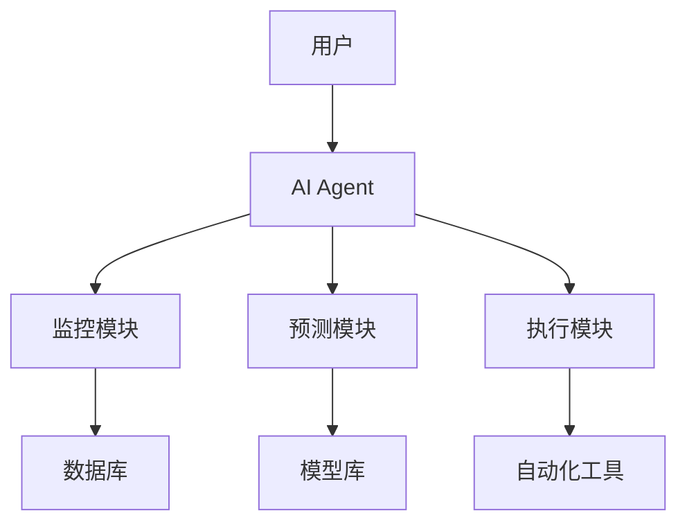

                 


# 企业AI Agent的自动化运维与故障预测

## 关键词：
企业AI Agent，自动化运维，故障预测，机器学习，系统架构，Python实现

## 摘要：
本文系统地探讨了企业AI Agent在自动化运维与故障预测中的应用，从核心概念、算法原理、系统架构到项目实战，全面解析了AI Agent如何通过智能化手段提升企业运维效率和故障预测准确性。通过详细的算法流程、系统设计和实际案例分析，为读者提供了一套完整的解决方案和实施指南。

---

# 第1章: 企业AI Agent的背景介绍

## 1.1 企业AI Agent的基本概念
### 1.1.1 AI Agent的定义
AI Agent（人工智能代理）是指能够感知环境、自主决策并执行任务的智能实体。在企业中，AI Agent通常用于自动化运维、故障预测和优化决策。

### 1.1.2 企业AI Agent的核心要素
- **感知能力**：通过数据采集和分析感知系统状态。
- **决策能力**：基于历史数据和模型预测未来趋势。
- **执行能力**：通过自动化工具执行运维任务。

### 1.1.3 企业AI Agent的分类
- **基于规则的AI Agent**：通过预定义规则进行决策。
- **基于模型的AI Agent**：利用机器学习模型进行预测和决策。
- **混合型AI Agent**：结合规则和模型的双重决策机制。

## 1.2 企业AI Agent的技术背景
### 1.2.1 人工智能与自动化运维的结合
AI技术的引入极大地提升了运维效率，尤其是在处理复杂系统时，AI Agent能够快速识别问题并采取最优解决方案。

### 1.2.2 大数据分析在故障预测中的作用
通过分析历史数据和实时数据，AI Agent能够预测系统故障，从而提前采取预防措施。

### 1.2.3 企业AI Agent的应用场景
- **服务器监控**：实时监控服务器状态，预测潜在故障。
- **日志分析**：通过日志数据识别系统异常。
- **容量规划**：根据历史数据预测资源需求。

## 1.3 企业AI Agent的应用价值
### 1.3.1 提高运维效率
AI Agent能够自动执行重复性任务，减少人工干预，提升运维效率。

### 1.3.2 减少人为错误
通过自动化决策和执行，降低人为操作失误的风险。

### 1.3.3 提升故障预测的准确性
基于机器学习模型的预测能力，AI Agent能够更准确地识别潜在故障。

## 1.4 企业AI Agent的演进历程
### 1.4.1 传统运维模式的局限性
传统运维依赖人工操作，效率低下且容易出错。

### 1.4.2 AI技术对企业运维的影响
AI技术的引入使得运维更加智能化和自动化。

### 1.4.3 企业AI Agent的未来发展
随着AI技术的不断进步，企业AI Agent将在更多领域发挥重要作用。

---

# 第2章: 企业AI Agent的核心概念与联系

## 2.1 AI Agent的核心原理
### 2.1.1 感知机制
AI Agent通过传感器或数据采集工具感知环境状态。

### 2.1.2 决策机制
基于感知数据，AI Agent利用算法进行决策。

### 2.1.3 执行机制
根据决策结果，AI Agent通过执行工具完成任务。

## 2.2 不同类型AI Agent的对比分析
### 2.2.1 基于规则的AI Agent
- 优点：简单易懂，适用于规则明确的场景。
- 缺点：难以应对复杂和动态变化的环境。

### 2.2.2 基于模型的AI Agent
- 优点：能够处理复杂问题，适应性更强。
- 缺点：需要大量数据和计算资源。

### 2.2.3 混合型AI Agent
- 优点：结合了规则和模型的优势，灵活性高。
- 缺点：实现复杂，需要协调两种机制。

## 2.3 AI Agent的核心要素对比
| 核心要素 | 基于规则的AI Agent | 基于模型的AI Agent | 混合型AI Agent |
|----------|---------------------|---------------------|----------------|
| 决策方式 | 预定义规则           | 机器学习模型         | 综合规则和模型   |
| 灵活性    | 低                  | 高                  | 较高            |
| 复杂性    | 低                  | 高                  | 较高            |
| 适用场景  | 简单场景             | 复杂场景             | 综合场景         |

## 2.4 AI Agent的实体关系图
```mermaid
er
actor: 用户
agent: AI Agent
system: 企业系统
rule: 规则库
model: 机器学习模型

actor --> agent: 请求服务
agent --> system: 执行任务
agent --> rule: 获取规则
agent --> model: 获取预测结果
```

---

# 第3章: 企业AI Agent的算法原理

## 3.1 常见算法介绍
### 3.1.1 监督学习
- **线性回归**：用于预测连续型变量。
- **决策树**：用于分类和回归问题。

### 3.1.2 强化学习
- **Q-learning**：通过奖励机制优化决策。

### 3.1.3 无监督学习
- **聚类分析**：发现数据中的自然分组。

## 3.2 算法实现流程
### 3.2.1 监督学习流程
1. 数据预处理：清洗和归一化数据。
2. 模型训练：使用训练数据训练模型。
3. 模型评估：通过测试数据评估模型性能。
4. 模型优化：调整参数以提高准确性。

### 3.2.2 强化学习流程
1. 状态识别：定义状态空间。
2. 动作选择：基于当前状态选择动作。
3. 奖励机制：定义奖励函数。
4. 策略优化：通过迭代优化策略。

## 3.3 算法实现代码
### 3.3.1 线性回归实现
```python
import numpy as np

def linear_regression(X, y, learning_rate=0.01, iterations=1000):
    m = len(X)
    theta = np.zeros(X.shape[1])
    for _ in range(iterations):
        hypothesis = np.dot(X, theta)
        cost = (1/(2*m)) * np.sum(np.square(hypothesis - y))
        gradient = (1/m) * np.dot(X.T, (hypothesis - y))
        theta = theta - learning_rate * gradient
    return theta

# 示例数据
X = np.array([[1, 2], [2, 3], [3, 4]], dtype=float)
y = np.array([5, 6, 7], dtype=float)
theta = linear_regression(X, y)
print(theta)
```

### 3.3.2 决策树实现
```python
from sklearn.tree import DecisionTreeRegressor

# 示例数据
X = np.array([[1, 2], [2, 3], [3, 4]])
y = np.array([5, 6, 7])

model = DecisionTreeRegressor()
model.fit(X, y)
print(model.predict([[4,5]]))
```

## 3.4 数学公式
### 3.4.1 线性回归公式
$$ y = \theta_0 + \theta_1 x $$

### 3.4.2 决策树公式
决策树中的每个节点表示一个特征，分支表示特征的取值范围，叶子节点表示预测结果。

---

# 第4章: 企业AI Agent的系统分析与架构设计

## 4.1 系统功能设计
### 4.1.1 问题场景
- 服务器资源耗尽
- 网络延迟增加
- 应用程序崩溃

### 4.1.2 功能需求
- 实时监控系统状态
- 预测潜在故障
- 自动化修复问题

## 4.2 系统架构设计


## 4.3 系统接口设计
### 4.3.1 API接口
- GET /status：获取系统状态
- POST /predict：提交预测请求
- POST /action：执行操作

### 4.3.2 数据流
1. 用户请求服务
2. AI Agent调用监控模块获取数据
3. 预测模块基于模型生成预测结果
4. 执行模块根据预测结果采取行动

## 4.4 系统交互流程
```mermaid
sequenceDiagram
    actor 用户
    agent AI Agent
    system 系统
    用户 -> AI Agent: 请求服务
    AI Agent -> 系统: 获取数据
    AI Agent -> 系统: 运行模型
    AI Agent -> 用户: 返回结果
```

---

# 第5章: 企业AI Agent的项目实战

## 5.1 环境安装
### 5.1.1 安装Python
- 使用Anaconda或Miniconda安装Python 3.8+

### 5.1.2 安装依赖库
```bash
pip install numpy scikit-learn matplotlib
```

## 5.2 核心代码实现
### 5.2.1 数据预处理
```python
import pandas as pd
from sklearn.model_selection import train_test_split
from sklearn.preprocessing import StandardScaler

# 加载数据
data = pd.read_csv('data.csv')
X = data.drop('target', axis=1)
y = data['target']

# 数据分割
X_train, X_test, y_train, y_test = train_test_split(X, y, test_size=0.2)

# 标准化
scaler = StandardScaler()
X_train_scaled = scaler.fit_transform(X_train)
X_test_scaled = scaler.transform(X_test)
```

### 5.2.2 模型训练
```python
from sklearn.linear_model import LinearRegression
from sklearn.metrics import mean_squared_error

model = LinearRegression()
model.fit(X_train_scaled, y_train)

# 预测
y_pred = model.predict(X_test_scaled)
print(mean_squared_error(y_test, y_pred))
```

## 5.3 实际案例分析
### 5.3.1 案例背景
某企业服务器资源耗尽，希望通过AI Agent预测并解决。

### 5.3.2 案例实现
```python
import numpy as np
import pandas as pd
from sklearn.tree import DecisionTreeClassifier

# 加载数据
data = pd.read_csv('fault_data.csv')
X = data.drop('fault', axis=1)
y = data['fault']

# 数据分割
X_train, X_test, y_train, y_test = train_test_split(X, y, test_size=0.2)

# 模型训练
model = DecisionTreeClassifier()
model.fit(X_train, y_train)

# 预测
y_pred = model.predict(X_test)
print(accuracy_score(y_test, y_pred))
```

---

# 第6章: 企业AI Agent的最佳实践与总结

## 6.1 最佳实践
### 6.1.1 数据质量
确保数据准确性和完整性。

### 6.1.2 模型选择
根据具体场景选择合适的算法。

### 6.1.3 系统监控
持续监控系统状态，及时调整模型。

## 6.2 项目小结
通过本文的系统介绍和实战分析，读者可以掌握企业AI Agent的基本概念、算法原理和系统设计方法。

## 6.3 注意事项
- 数据隐私和安全问题
- 系统的可扩展性和可维护性
- 模型的可解释性和透明度

## 6.4 拓展阅读
- 《机器学习实战》
- 《深入理解AI Agent》
- 相关技术博客和论文

---

# 作者：AI天才研究院/AI Genius Institute & 禅与计算机程序设计艺术 /Zen And The Art of Computer Programming

