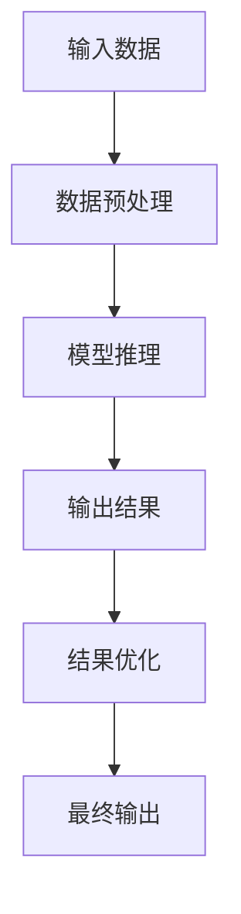
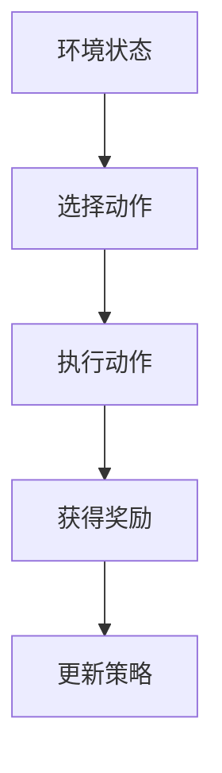
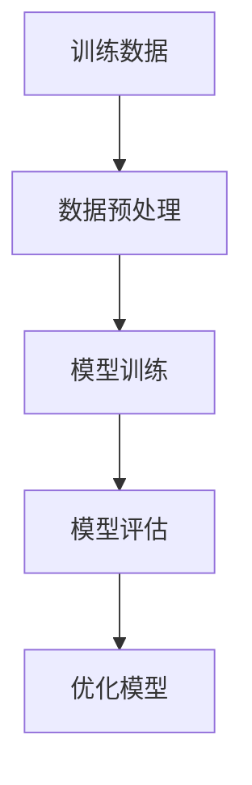
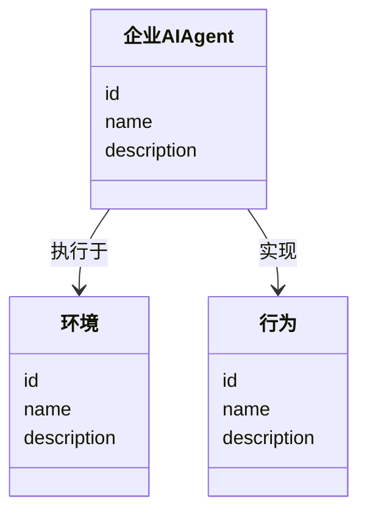
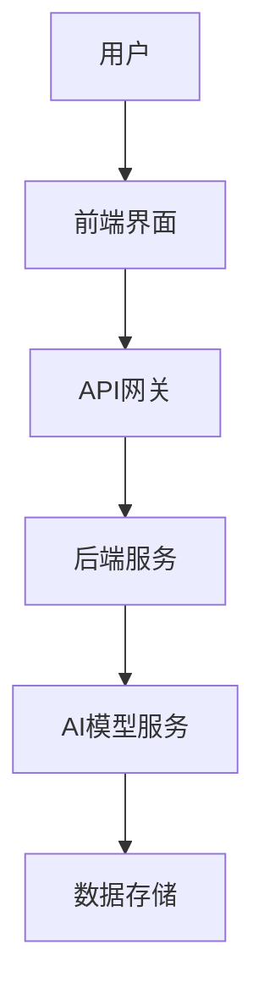
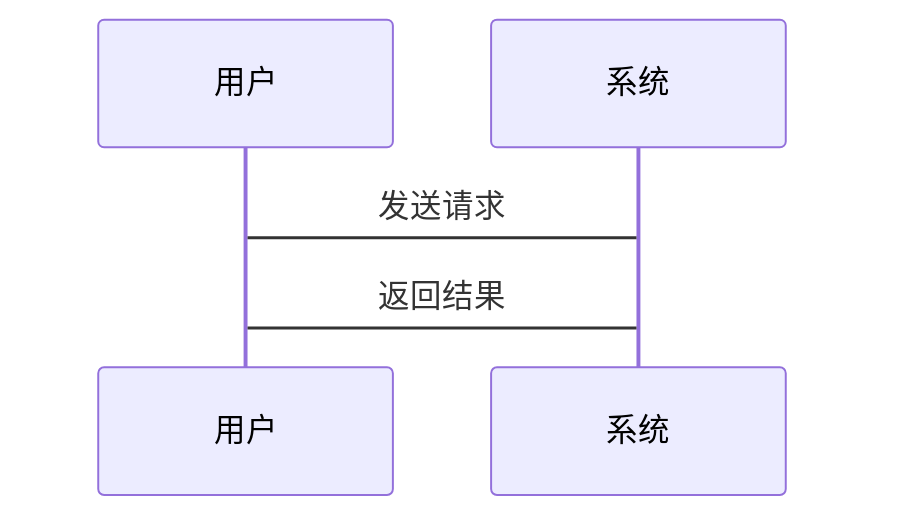

                 


# 企业AI Agent的自动化运维系统

> **关键词**: 企业AI Agent，自动化运维，人工智能，系统架构，算法原理

> **摘要**: 本文详细探讨了企业AI Agent在自动化运维系统中的应用，从背景、核心概念、算法原理到系统架构、项目实战及最佳实践，系统性地分析了企业AI Agent的特点、优势及未来发展趋势，为读者提供全面的技术指导和实践参考。

---

## 第1章: 企业AI Agent的背景与现状

### 1.1 企业AI Agent的定义与特点

#### 1.1.1 什么是企业AI Agent
企业AI Agent（Artificial Intelligence Agent）是一种能够感知环境、自主决策并执行任务的智能体。它通过数据输入、模型推理和行动输出，实现对企业运维系统的自动化管理。与传统运维工具相比，企业AI Agent具有更强的智能化和自主性。

#### 1.1.2 企业AI Agent的核心特点
- **智能性**: 基于AI技术，能够理解上下文并做出决策。
- **自主性**: 可以独立执行任务，无需人工干预。
- **适应性**: 能够根据环境变化动态调整策略。
- **可扩展性**: 支持多种场景和复杂任务。

#### 1.1.3 企业AI Agent与传统运维的区别
| **特性**       | **传统运维**                | **企业AI Agent**            |
|----------------|-----------------------------|-----------------------------|
| 决策方式       | 依赖人工规则和脚本          | 基于AI模型进行自主决策      |
| 执行效率       | 手动或半自动化              | 全自动化，效率显著提升      |
| 灵活性          | 固定流程，难以快速调整      | 可动态调整，适应新需求      |

### 1.2 企业AI Agent的应用场景

#### 1.2.1 自动化运维的典型场景
- **故障排查**: 自动检测并修复系统故障。
- **资源调度**: 根据负载动态分配资源。
- **日志分析**: 自动解析和分类日志数据。
- **安全监控**: 实时监控并防御安全威胁。

#### 1.2.2 企业AI Agent在不同业务中的应用
- **IT运维**: 自动化系统监控和故障处理。
- **DevOps**: 自动化CI/CD流程和代码部署。
- **客户服务**: 智能客服机器人处理客户请求。

#### 1.2.3 企业AI Agent的边界与外延
企业AI Agent的边界在于其智能化决策能力，而外延则涉及与企业现有系统的集成，如ERP、CRM等。

### 1.3 企业AI Agent的现状与趋势

#### 1.3.1 当前企业AI Agent的发展现状
- **技术成熟度**: 生成式AI和大语言模型的崛起推动了AI Agent的发展。
- **应用范围**: 从简单的任务执行到复杂的决策支持。
- **市场接受度**: 逐步被企业接受并应用于关键业务场景。

#### 1.3.2 企业AI Agent的未来趋势
- **多模态能力**: 集成视觉、语音等多种感知能力。
- **边缘计算**: AI Agent向边缘部署，实现低延迟和高实时性。
- **人机协作**: 更加注重人与AI Agent的协作体验。

#### 1.3.3 技术驱动与市场驱动的双轮效应
技术进步推动企业AI Agent的能力提升，市场需求则推动其应用场景的扩展。

### 1.4 本章小结
本章从定义、特点、应用场景和趋势四个方面介绍了企业AI Agent的背景，为后续章节奠定了基础。

---

## 第2章: 企业AI Agent的核心概念与联系

### 2.1 核心概念原理

#### 2.1.1 AI Agent的基本原理
AI Agent通过感知环境、构建知识图谱、进行推理和规划，最终执行行动。其核心流程包括数据输入、模型推理和行动输出。

#### 2.1.2 企业AI Agent的决策机制
- **监督学习**: 基于标注数据进行分类和预测。
- **强化学习**: 通过试错优化策略。
- **生成式AI**: 基于大语言模型生成解决方案。

#### 2.1.3 企业AI Agent的执行流程
1. **数据采集**: 从日志、数据库等来源获取数据。
2. **模型推理**: 使用AI模型进行分析和预测。
3. **行动执行**: 根据推理结果执行相应操作。

### 2.2 核心概念属性特征对比

#### 2.2.1 不同类型AI Agent的对比分析
| **类型**       | **特点**                     | **适用场景**               |
|----------------|------------------------------|---------------------------|
| 监督式AI Agent | 基于标注数据进行预测         | 数据标注任务               |
| 强化式AI Agent | 通过试错优化策略           | 环境交互任务               |
| 生成式AI Agent | 基于生成模型输出新内容     | 文本生成和创造性任务       |

#### 2.2.2 企业AI Agent与个人AI Agent的对比
- **目标**: 企业AI Agent以企业目标为导向，而个人AI Agent更注重用户体验。
- **规模**: 企业AI Agent处理的数据量更大，复杂性更高。
- **决策权限**: 企业AI Agent具有更高的决策权限和责任。

#### 2.2.3 企业AI Agent与传统自动化工具的对比
- **智能化**: 企业AI Agent具备AI推理能力，而传统工具依赖固定规则。
- **灵活性**: 企业AI Agent能够动态调整策略，传统工具难以快速响应变化。

### 2.3 ER实体关系图架构

#### 2.3.1 实体关系图的定义
ER图（Entity-Relationship Diagram）用于描述系统中的实体及其关系。

#### 2.3.2 企业AI Agent系统的ER图设计
```mermaid
erd
    entity 企业AI Agent {
        id: string
        name: string
        description: string
    }
    
    entity 环境 {
        id: string
        name: string
        description: string
    }
    
    entity 行为 {
        id: string
        name: string
        description: string
    }
    
    系统环境 --> 企业AI Agent: 执行于
    企业AI Agent <-- 关联 --> 行为
```

#### 2.3.3 ER图与系统架构的关系
ER图用于设计系统的数据模型，而系统架构图则展示系统的模块划分和交互关系。

---

## 第3章: 企业AI Agent的算法原理

### 3.1 算法原理概述

#### 3.1.1 基于生成式AI的算法
生成式AI（Generative AI）基于大语言模型，能够生成新的文本内容。其核心算法包括：
1. **输入处理**: 将输入数据转化为模型可处理的格式。
2. **模型推理**: 通过生成模型生成输出结果。
3. **结果优化**: 对生成结果进行优化和校正。

#### 3.1.2 基于强化学习的算法
强化学习（Reinforcement Learning）通过试错优化策略。其核心步骤包括：
1. **环境建模**: 构建模拟环境。
2. **策略选择**: 选择动作并执行。
3. **奖励机制**: 根据结果调整策略。

#### 3.1.3 基于监督学习的算法
监督学习（Supervised Learning）基于标注数据进行分类或回归。其流程包括：
1. **数据预处理**: 清洗和标注数据。
2. **模型训练**: 使用训练数据优化模型。
3. **模型评估**: 评估模型性能。

### 3.2 算法流程图

#### 3.2.1 生成式AI算法流程图


#### 3.2.2 强化学习算法流程图


#### 3.2.3 监督学习算法流程图


### 3.3 算法实现与优化

#### 3.3.1 生成式AI的实现代码
```python
def generate_text(prompt):
    # 数据预处理
    inputs = tokenizer(prompt, return_tensors="np")
    # 模型推理
    outputs = model.generate(**inputs)
    # 解码输出
    return tokenizer.decode(outputs[0], skip_special_tokens=True)
```

#### 3.3.2 强化学习的实现代码
```python
def train_reinforcement_learning(env):
    # 初始化策略
    policy = Policy()
    # 训练循环
    for episode in range(num_episodes):
        state = env.reset()
        while not done:
            action = policy.act(state)
            next_state, reward, done = env.step(action)
            policy.update(state, action, reward)
    return policy
```

#### 3.3.3 监督学习的实现代码
```python
def train_supervised_learning(X_train, y_train):
    # 模型训练
    model.fit(X_train, y_train)
    # 模型评估
    print(f"训练准确率: {model.score(X_train, y_train)}")
    return model
```

### 3.4 算法的数学模型与公式

#### 3.4.1 生成式AI的损失函数
$$ \text{loss} = -\sum_{i=1}^{n} \log P(x_i|y_i) $$

#### 3.4.2 强化学习的奖励机制
$$ R = \sum_{t=1}^{T} r_t(s_t, a_t) $$

#### 3.4.3 监督学习的优化目标
$$ \text{minimize} \quad \sum_{i=1}^{n} (y_i - \hat{y}_i)^2 $$

---

## 第4章: 企业AI Agent的系统分析与架构设计

### 4.1 系统分析

#### 4.1.1 系统需求分析
企业AI Agent系统需要满足以下需求：
- **高可用性**: 系统必须稳定运行。
- **可扩展性**: 支持扩展新的功能模块。
- **安全性**: 确保数据和系统的安全性。

#### 4.1.2 项目介绍
本章以一个企业AI Agent系统为例，介绍其设计和实现过程。

### 4.2 系统功能设计

#### 4.2.1 领域模型设计


#### 4.2.2 系统架构设计


#### 4.2.3 接口设计
系统主要接口包括：
- **API接口**: 提供RESTful API供前端调用。
- **数据接口**: 与数据库和第三方服务交互。

#### 4.2.4 交互设计


### 4.3 系统实现

#### 4.3.1 环境搭建
需要安装以下工具：
- Python 3.8+
- PyTorch
- Hugging Face Transformers

#### 4.3.2 核心代码实现
```python
# 初始化AI Agent
class AI-Agent:
    def __init__(self):
        self.model = load_model()
    
    def process_request(self, request):
        # 数据预处理
        inputs = preprocess(request)
        # 模型推理
        output = self.model.generate(inputs)
        return output
```

---

## 第5章: 企业AI Agent的项目实战

### 5.1 环境搭建

#### 5.1.1 安装依赖
```bash
pip install torch transformers
```

### 5.2 核心代码实现

#### 5.2.1 数据预处理
```python
def preprocess(text):
    return tokenizer(text, return_tensors="np")
```

#### 5.2.2 模型训练
```python
def train_model(train_dataset):
    model = load_model()
    model.train(train_dataset)
    return model
```

#### 5.2.3 模型部署
```python
def deploy_model(model):
    model.deploy()
```

### 5.3 功能实现与案例分析

#### 5.3.1 功能实现
```python
def main():
    request = input("请输入请求：")
    agent = AI-Agent()
    response = agent.process_request(request)
    print(response)
```

#### 5.3.2 案例分析
以故障排查为例，展示企业AI Agent如何自动检测并修复系统故障。

### 5.4 本章小结
本章通过实际项目展示了企业AI Agent的实现过程，从环境搭建到模型部署，帮助读者理解如何将理论应用于实践。

---

## 第6章: 企业AI Agent的最佳实践

### 6.1 开发规范与注意事项

#### 6.1.1 开发规范
- **代码风格**: 遵循PEP 8编码规范。
- **文档编写**: 提供详细的API文档和使用说明。
- **版本控制**: 使用Git进行代码管理。

#### 6.1.2 注意事项
- **数据隐私**: 确保数据的隐私和安全。
- **性能优化**: 优化模型推理速度和资源消耗。
- **错误处理**: 提供完善的错误捕捉和日志记录机制。

### 6.2 性能优化与扩展性

#### 6.2.1 性能优化
- **模型压缩**: 使用模型剪枝和量化技术。
- **并行计算**: 利用多线程和分布式训练提升性能。

#### 6.2.2 系统扩展性
- **模块化设计**: 将系统划分为独立模块，便于扩展。
- **容器化部署**: 使用Docker容器化部署，提升系统的灵活性和可扩展性。

### 6.3 安全性与可靠性

#### 6.3.1 数据安全性
- **数据加密**: 对敏感数据进行加密处理。
- **访问控制**: 实施严格的权限管理。

#### 6.3.2 系统可靠性
- **容错设计**: 实现故障容错和自动恢复机制。
- **备份与恢复**: 定期备份数据，确保系统能够快速恢复。

### 6.4 本章小结
本章从开发规范、性能优化、安全性等多个方面提供了企业AI Agent系统的最佳实践建议，帮助读者在实际项目中避免常见问题。

---

## 第7章: 总结与展望

### 7.1 全文总结
本文从背景、核心概念、算法原理到系统架构和项目实战，全面介绍了企业AI Agent的自动化运维系统。通过理论分析和实践案例，展示了企业AI Agent的强大功能和广泛应用。

### 7.2 未来展望
随着AI技术的不断进步，企业AI Agent将在以下几个方面进一步发展：
- **多模态能力**: 集成更多感知方式，如视觉和语音。
- **边缘计算**: AI Agent向边缘部署，实现低延迟和高实时性。
- **人机协作**: 更加注重人与AI Agent的协作体验，提升用户体验。

---

## 作者信息

**作者**: AI天才研究院/AI Genius Institute & 禅与计算机程序设计艺术/Zen And The Art of Computer Programming

---

**感谢您的阅读！**

