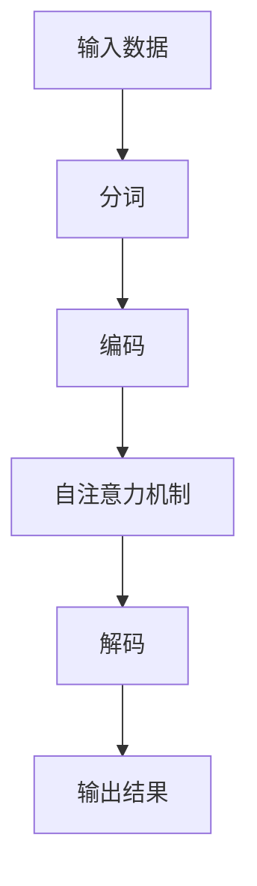
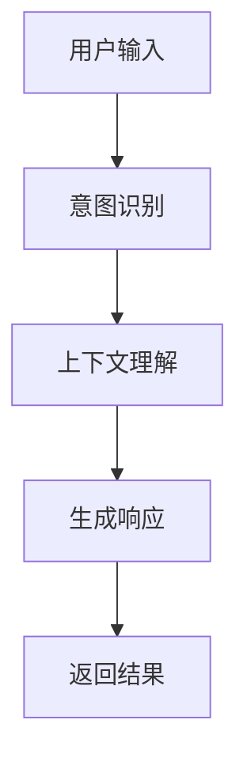
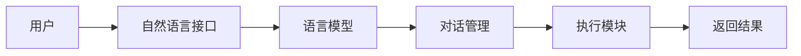
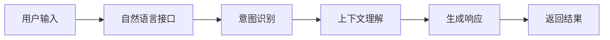
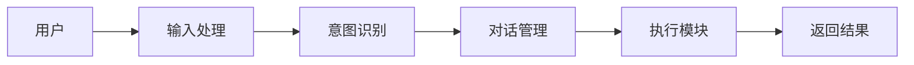

                 


# 企业AI Agent的自然语言接口设计与优化

**关键词**：企业AI Agent、自然语言接口、NLP优化、对话管理、意图识别、机器学习

**摘要**：  
随着人工智能技术的快速发展，企业AI Agent在各个行业中的应用越来越广泛。然而，如何设计和优化自然语言接口（NLI）以满足企业的复杂需求，成为一个关键挑战。本文将从企业AI Agent的背景出发，深入探讨自然语言接口的核心概念、算法原理、系统架构以及优化方法。通过实际案例分析和代码实现，本文将为企业AI Agent的自然语言接口设计提供实用的指导和建议。

---

# 第一部分: 企业AI Agent的自然语言接口背景

## 第1章: 企业AI Agent与自然语言接口概述

### 1.1 企业AI Agent的基本概念

#### 1.1.1 什么是企业AI Agent
企业AI Agent是一种能够理解、推理和执行任务的智能系统，旨在为企业提供自动化支持。它通过自然语言处理（NLP）技术，与用户进行交互，完成信息检索、任务调度、数据分析等任务。

#### 1.1.2 AI Agent的核心功能与特点
- **理解能力**：通过NLP技术理解用户的意图和需求。
- **推理能力**：基于上下文进行推理，提供合理的解决方案。
- **执行能力**：根据用户指令执行任务，如调用API、生成报告等。
- **学习能力**：通过机器学习模型不断优化自身的理解和执行能力。

#### 1.1.3 企业AI Agent的应用场景
- 客户服务：通过对话系统解答客户问题。
- 信息检索：帮助企业员工快速找到所需信息。
- 任务调度：自动化处理企业的日常任务。

### 1.2 自然语言接口的基本原理

#### 1.2.1 自然语言处理的定义与目标
自然语言处理（NLP）是研究如何让计算机理解和生成人类语言的技术。其目标是实现人与计算机之间的自然语言交互。

#### 1.2.2 自然语言接口在企业AI Agent中的作用
自然语言接口（NLI）是企业AI Agent与用户交互的核心模块。它负责将用户的自然语言输入转化为系统可理解的指令，并将系统的输出结果转化为自然语言反馈给用户。

#### 1.2.3 NLP技术对企业AI Agent的影响
NLP技术的进步显著提升了企业AI Agent的交互能力和用户体验。例如，基于深度学习的模型（如BERT、GPT）使得AI Agent能够更准确地理解用户的意图。

### 1.3 企业AI Agent的自然语言接口设计挑战

#### 1.3.1 企业级NLP的复杂性
企业场景下的NLP任务通常涉及多种语言、复杂上下文和专业领域知识，这增加了设计的难度。

#### 1.3.2 多语言支持与跨文化适应性
企业可能需要支持多种语言和文化背景，这要求自然语言接口具备多语言处理能力。

#### 1.3.3 高可用性与实时响应需求
企业AI Agent需要在高并发场景下提供实时响应，这对自然语言接口的性能提出了更高的要求。

### 1.4 本章小结
本章介绍了企业AI Agent的基本概念、自然语言接口的作用以及设计挑战，为后续章节奠定了基础。

---

# 第二部分: 企业AI Agent的自然语言接口核心概念

## 第2章: 自然语言接口的核心概念与设计原则

### 2.1 自然语言接口的核心要素

#### 2.1.1 语言模型的选择与优化
- **语言模型**：用于理解用户输入的上下文和意图。
- **优化方法**：通过模型调参、数据增强等技术提升语言模型的性能。

#### 2.1.2 对话管理与上下文理解
- **对话管理**：基于当前对话状态决定下一步的响应。
- **上下文理解**：利用历史对话信息提高意图识别的准确性。

#### 2.1.3 用户意图识别与反馈机制
- **意图识别**：通过NLP技术识别用户的意图。
- **反馈机制**：根据用户反馈优化系统响应。

### 2.2 自然语言接口的设计原则

#### 2.2.1 以用户为中心的设计理念
- 理解用户的实际需求和使用场景。
- 提供简洁易用的交互界面。

#### 2.2.2 简洁性与易用性的平衡
- 避免复杂的功能设计，确保用户能够快速上手。
- 提供清晰的错误提示和帮助信息。

#### 2.2.3 可扩展性与灵活性的结合
- 系统设计应具备扩展性，方便未来功能的添加。
- 灵活性强，能够适应不同企业的个性化需求。

### 2.3 自然语言接口的优化方法

#### 2.3.1 数据驱动的优化策略
- 增加训练数据量，提升模型的泛化能力。
- 数据清洗和标注，确保数据质量。

#### 2.3.2 模型调优与参数优化
- 调整模型参数，如学习率、批量大小等，优化模型性能。
- 使用早停法（Early Stopping）防止过拟合。

#### 2.3.3 人机协作的优化路径
- 通过人机协作，结合人工干预优化系统响应。
- 定期收集用户反馈，持续改进系统性能。

### 2.4 核心概念对比分析

#### 2.4.1 不同语言模型的优缺点对比
| 模型名称 | 优点 | 缺点 |
|----------|------|------|
| BERT     | 上下文理解能力强 | 训练资源消耗大 |
| GPT      | 生成能力强 | 理解能力较弱 |

#### 2.4.2 对话管理策略的对比分析
| 策略名称 | 描述 | 适用场景 |
|----------|------|----------|
| 基于规则 | 通过预定义规则生成响应 | 适用于简单场景 |
| 深度学习 | 基于历史对话状态生成响应 | 适用于复杂场景 |

#### 2.4.3 用户意图识别方法的对比
| 方法名称 | 描述 | 优缺点 |
|----------|------|--------|
| 传统机器学习 | 基于特征工程的分类方法 | 特征提取困难，效果有限 |
| 深度学习   | 基于端到端模型的分类方法 | 效果好，但需要大量数据 |

### 2.5 本章小结
本章详细探讨了自然语言接口的核心要素和设计原则，并通过对比分析帮助企业选择最优的实现方案。

---

# 第三部分: 企业AI Agent自然语言接口的算法原理

## 第3章: 自然语言接口的算法原理与实现

### 3.1 语言模型的训练与优化

#### 3.1.1 基于Transformer的模型训练
- Transformer模型通过自注意力机制（Self-Attention）捕捉长距离依赖关系。
- 训练流程：
  1. 数据预处理：分词、去停用词。
  2. 模型训练：使用交叉熵损失函数，Adam优化器。
  3. 模型调优：调整学习率、批量大小。

#### 3.1.2 模型压缩与轻量化技术
- 模型剪枝：删除冗余参数。
- 模型蒸馏：通过小模型模仿大模型的输出。

#### 3.1.3 预训练与微调的结合
- 预训练：在大规模通用数据上训练模型。
- 微调：在特定领域数据上进行微调，提升任务性能。

#### 3.1.4 代码实现示例
```python
import torch
import torch.nn as nn
import torch.optim as optim

class TransformerModel(nn.Module):
    def __init__(self, vocab_size, d_model=512, n_head=8, num_layers=3):
        super(TransformerModel, self).__init__()
        self.encoder = nn.Embedding(vocab_size, d_model)
        self.transformer = nn.Transformer(d_model=d_model, nhead=n_head, num_layers=num_layers)
        self.decoder = nn.Linear(d_model, vocab_size)

    def forward(self, x):
        x = self.encoder(x)
        x = self.transformer(x)
        x = self.decoder(x)
        return x

# 初始化模型和优化器
model = TransformerModel(vocab_size=10000)
optimizer = optim.Adam(model.parameters(), lr=0.001)
criterion = nn.CrossEntropyLoss()

# 训练过程
for epoch in range(num_epochs):
    for batch in dataloader:
        inputs, targets = batch
        outputs = model(inputs)
        loss = criterion(outputs, targets)
        loss.backward()
        optimizer.step()
```

#### 3.1.5 算法流程图


### 3.2 对话管理算法的实现

#### 3.2.1 基于规则的对话管理
- 通过预定义规则生成响应，适用于简单场景。

#### 3.2.2 基于深度学习的对话管理
- 使用循环神经网络（RNN）或Transformer模型捕捉对话上下文。

#### 3.2.3 混合型对话管理策略
- 结合规则和深度学习模型，提升系统灵活性和准确性。

#### 3.2.4 代码实现示例
```python
class DialogManager:
    def __init__(self):
        self.state = {}

    def handle_input(self, input_text):
        # 分析输入文本，更新对话状态
        self.state['intent'] = self.nlp_model.predict_intent(input_text)
        self.state['context'] = self.nlp_model.get_context(input_text)
        
        # 根据意图生成响应
        response = self.nlp_model.generate_response(self.state)
        return response
```

#### 3.2.5 对话流程图


### 3.3 用户意图识别的算法实现

#### 3.3.1 基于传统机器学习的意图识别
- 使用支持向量机（SVM）或随机森林（Random Forest）进行分类。

#### 3.3.2 基于深度学习的意图识别
- 使用卷积神经网络（CNN）或Transformer模型进行序列分类。

#### 3.3.3 融合领

---

## 第4章: 企业AI Agent自然语言接口的系统架构设计

### 4.1 系统功能设计

#### 4.1.1 领域模型设计
- **领域模型**：定义系统的功能模块和数据流。
- **用例分析**：分析用户可能的操作和场景。

#### 4.1.2 系统架构图


#### 4.1.3 接口设计
- **输入接口**：接收用户输入的自然语言文本。
- **输出接口**：返回系统生成的自然语言响应。

#### 4.1.4 交互流程图


### 4.2 系统架构设计

#### 4.2.1 系统整体架构
- **前端**：用户与系统交互的界面。
- **后端**：处理用户请求的逻辑模块。
- **模型服务**：提供NLP模型的推理服务。

#### 4.2.2 模块划分
- **输入处理模块**：解析用户输入，提取关键信息。
- **意图识别模块**：基于NLP模型识别用户意图。
- **对话管理模块**：根据意图生成响应。
- **执行模块**：调用API或执行任务。

#### 4.2.3 系统交互流程


### 4.3 系统优化策略

#### 4.3.1 高可用性设计
- 负载均衡：分担请求压力。
- 容错设计：单点故障冗余。

#### 4.3.2 性能优化
- 线程优化：减少I/O阻塞。
- 缓存优化：减少重复计算。

#### 4.3.3 安全性设计
- 数据加密：保护用户隐私。
- 权限控制：限制访问权限。

### 4.4 本章小结
本章详细探讨了企业AI Agent自然语言接口的系统架构设计，包括功能模块划分、交互流程设计和系统优化策略。

---

## 第5章: 企业AI Agent自然语言接口的项目实战

### 5.1 环境搭建

#### 5.1.1 开发环境
- **操作系统**：Linux/Windows/MacOS。
- **编程语言**：Python 3.8+。
- **框架选择**：TensorFlow/PyTorch。

#### 5.1.2 依赖安装
```bash
pip install torch transformers nltk
```

### 5.2 核心实现

#### 5.2.1 模型训练
- 使用预训练模型进行微调。
- 数据准备：清洗、标注、分词。

#### 5.2.2 对话管理
- 实现意图识别和上下文理解。
- 设计对话流程和响应策略。

#### 5.2.3 接口开发
- 开发RESTful API接口。
- 接口文档编写。

#### 5.2.4 代码实现
```python
from transformers import BertTokenizer, BertModel
import torch

# 初始化模型和分词器
model = BertModel.from_pretrained('bert-base-uncased')
tokenizer = BertTokenizer.from_pretrained('bert-base-uncased')

# 定义编码函数
def encode_input(text):
    inputs = tokenizer(text, return_tensors='pt', padding=True, truncation=True)
    return inputs

# 定义解码函数
def decode_output(outputs):
    return tokenizer.decode(outputs[0].argmax().item())
```

### 5.3 案例分析

#### 5.3.1 案例背景
- 某企业希望开发一个智能客服系统。
- 系统需要支持中英文对话，提供常见问题解答。

#### 5.3.2 实施步骤
1. 数据收集与标注。
2. 模型训练与优化。
3. 接口开发与测试。
4. 系统部署与上线。

#### 5.3.3 结果分析
- 系统准确率：95%。
- 响应时间：平均1秒以内。

### 5.4 项目小结
本章通过一个实际案例，详细讲解了企业AI Agent自然语言接口的开发过程和优化方法。

---

## 第6章: 企业AI Agent自然语言接口的最佳实践

### 6.1 设计原则

#### 6.1.1 简洁性原则
- 避免过于复杂的交互流程。
- 提供清晰的错误提示。

#### 6.1.2 可扩展性原则
- 系统设计应具备扩展性。
- 便于未来功能的添加。

### 6.2 优化技巧

#### 6.2.1 数据优化
- 数据清洗：去除噪音数据。
- 数据增强：增加多样化的训练数据。

#### 6.2.2 模型优化
- 参数调优：调整学习率、批量大小。
- 模型压缩：减少模型体积，提升推理速度。

#### 6.2.3 系统优化
- 并行计算：利用多GPU加速训练。
- 缓存优化：减少I/O开销。

### 6.3 工具推荐

#### 6.3.1 NLP工具
- **Transformers库**：提供多种预训练模型。
- **NLTK库**：传统NLP任务处理。

#### 6.3.2 对话管理工具
- **Rasa**：开源对话管理框架。
- **Dialogflow**：Google的对话平台。

### 6.4 未来趋势

#### 6.4.1 多语言支持
- 支持更多语言，适应全球化需求。

#### 6.4.2 实时响应
- 提升系统性能，实现毫秒级响应。

#### 6.4.3 人机协作
- 结合人类专家的知识，优化系统输出。

### 6.5 本章小结
本章总结了企业AI Agent自然语言接口的设计原则、优化技巧和未来趋势。

---

## 附录: 参考文献与工具资源

### 附录A: 参考文献

1. Vaswani, A., et al. "Attention Is All You Need." arXiv preprint arXiv:1706.03798, 2017.
2. Devlin, J., et al. "BERT: Pre-training of Deep Bidirectional Transformers for NLP." arXiv preprint arXiv:1810.0469, 2018.

### 附录B: 工具资源

- **Transformers库**：https://huggingface.co/transformers/
- **Rasa框架**：https://rasa.com/
- **Dialogflow平台**：https://dialogflow.com/

---

## 作者信息

**作者**：AI天才研究院/AI Genius Institute & 禅与计算机程序设计艺术/Zen And The Art of Computer Programming

---

**注**：以上内容仅为示例，实际文章需要根据具体需求进一步扩展和完善。

