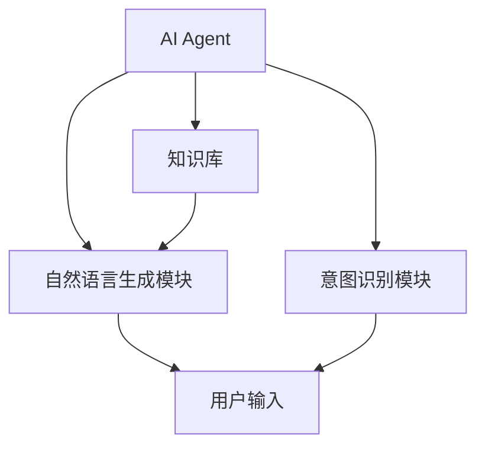
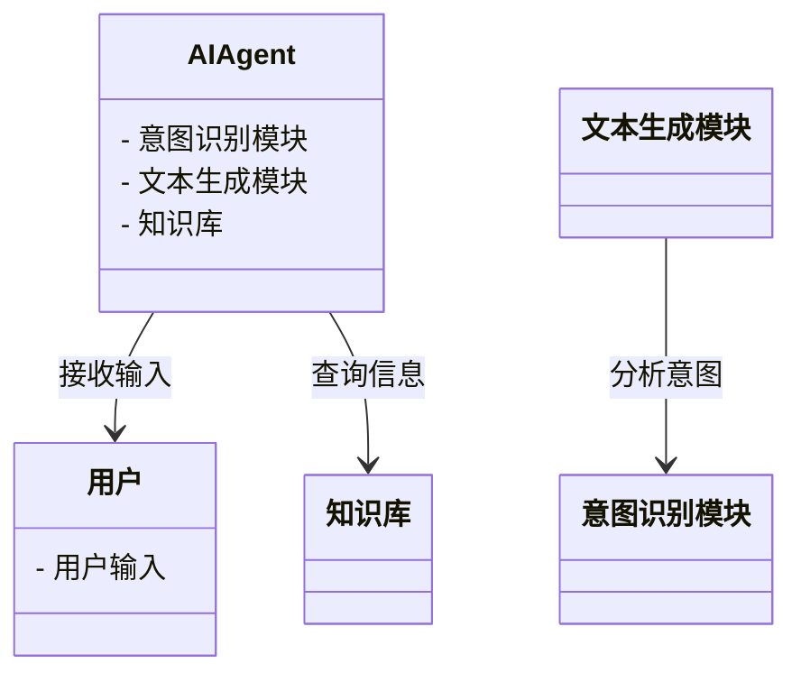
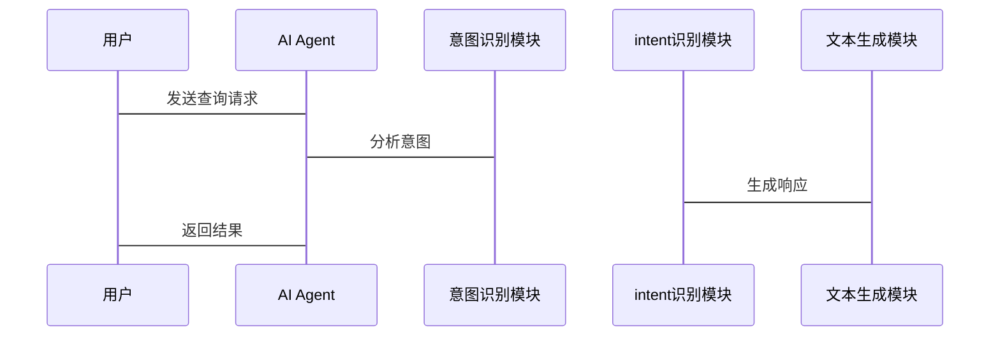

                 


# 企业AI Agent的自然语言生成(NLG)技术应用

> 关键词：AI Agent, 自然语言生成, 企业应用, 智能代理, NLG技术

> 摘要：本文深入探讨了企业AI Agent在自然语言生成（NLG）技术中的应用，分析了AI Agent与NLG技术的核心概念、算法原理、系统架构，并通过实际案例展示了如何在企业中实现和应用这些技术。

---

# 第一部分: 企业AI Agent的自然语言生成技术背景

## 第1章: 企业AI Agent与自然语言生成技术概述

### 1.1 问题背景与问题描述
#### 1.1.1 企业智能化转型的挑战
企业在数字化转型过程中，面临着提高效率、降低成本和提升客户体验的多重压力。传统的自动化系统难以处理复杂的人机交互任务，而AI Agent（智能代理）的引入为企业提供了一种智能化解决方案。

#### 1.1.2 自然语言生成技术的兴起
自然语言生成（NLG）技术的进步使得机器能够生成接近人类语言的文本。这项技术在企业中的应用潜力巨大，尤其是在客服、营销和内部管理等领域。

#### 1.1.3 AI Agent在企业中的角色与价值
AI Agent作为企业的虚拟助手，能够通过NLG技术与用户进行自然交互，为企业提供智能化的服务和支持。

### 1.2 问题解决与技术边界
#### 1.2.1 AI Agent如何实现自然语言生成
AI Agent通过整合NLG技术，能够理解和生成自然语言，从而实现与用户的有效交互。

#### 1.2.2 技术边界与应用场景
AI Agent的NLG技术目前主要应用于对话系统、内容生成和自动化报告等领域，但也存在数据依赖性和生成质量的挑战。

#### 1.2.3 核心概念的结构化分析
通过结构化分析，AI Agent与NLG技术的结合为企业提供了高效、智能的交互方式。

## 1.3 核心要素与概念组成
#### 1.3.1 AI Agent的构成要素
AI Agent通常包括感知模块、决策模块和执行模块。

#### 1.3.2 自然语言生成的关键环节
NLG技术包括文本规划、文本生成和文本优化三个主要环节。

#### 1.3.3 技术架构的核心组成
AI Agent的架构通常包括数据层、算法层和应用层。

---

## 第2章: 核心概念与原理分析

### 2.1 AI Agent与自然语言生成的关系
#### 2.1.1 AI Agent的基本原理
AI Agent通过感知环境、分析任务并执行操作来实现目标。

#### 2.1.2 自然语言生成的核心机制
NLG技术通过生成符合语法规则的文本，实现与用户的自然交互。

#### 2.1.3 两者结合的技术路径
AI Agent通过整合NLG技术，实现从理解到生成的完整流程。

### 2.2 核心概念对比分析
#### 2.2.1 AI Agent与传统程序的区别
AI Agent具有自主性、反应性和社会性，而传统程序不具备这些特征。

#### 2.2.2 自然语言生成与传统文本生成的对比
NLG技术能够生成多样化的文本，而传统文本生成缺乏灵活性。

#### 2.2.3 关键技术的对比表格
| 技术 | AI Agent | NLG技术 |
|------|-----------|---------|
| 核心能力 | 任务执行 | 文本生成 |
| 应用场景 | 智能助手 | 对话系统 |

### 2.3 实体关系与架构分析
#### 2.3.1 ER实体关系图


---

## 第3章: 自然语言生成算法原理

### 3.1 基于大模型的自然语言生成流程
#### 3.1.1 预训练阶段
通过大规模数据训练模型，使其具备语言理解能力。

#### 3.1.2 微调阶段
根据具体任务对模型进行优化，提升生成效果。

#### 3.1.3 生成阶段
基于输入生成目标文本，通常采用贪心算法或采样方法。

### 3.2 算法原理与实现
#### 3.2.1 Transformer模型结构
Transformer模型由编码器和解码器组成，常用于NLG任务。

#### 3.2.2 注意力机制
注意力机制通过计算词与词之间的相关性，生成更合理的文本。

#### 3.2.3 梯度下降优化
通过优化损失函数，提升模型的生成能力。

### 3.3 数学模型与公式
#### 3.3.1 交叉熵损失函数
$$ \text{Loss} = -\sum_{i=1}^{n} \text{log}p(y_i|x_i) $$

#### 3.3.2 注意力权重计算
$$
\alpha_{i,j} = \frac{\text{exp}(q_i^T k_j)}{\sum_{k} \text{exp}(q_i^T k_j)}
$$

---

## 第4章: 系统分析与架构设计方案

### 4.1 问题场景介绍
#### 4.1.1 项目背景
某企业希望通过AI Agent实现智能化客服系统。

### 4.2 系统功能设计
#### 4.2.1 功能模块
包括用户输入、意图识别、文本生成和反馈优化。

#### 4.2.2 领域模型图


### 4.3 系统架构设计
#### 4.3.1 架构图
```mermaid
graph TD
A[AI Agent] --> B[前端界面]
A --> C[后端服务]
C --> D[知识库]
B --> C: 用户输入
C --> B: 生成文本
```

### 4.4 系统接口设计
#### 4.4.1 API接口
提供RESTful API，支持文本生成和意图识别功能。

### 4.5 系统交互设计
#### 4.5.1 序列图


---

## 第5章: 项目实战

### 5.1 环境安装
安装Python、TensorFlow和Keras等依赖库。

### 5.2 核心代码实现
#### 5.2.1 文本生成模块
```python
import tensorflow as tf
from tensorflow.keras import layers

# 定义模型
model = tf.keras.Sequential([
    layers.Embedding(input_dim=1000, output_dim=64),
    layers.LSTM(64, return_sequences=True),
    layers.Dense(50, activation='softmax')
])
```

#### 5.2.2 意图识别模块
```python
import numpy as np
from sklearn.model_selection import train_test_split

# 数据预处理
X_train, X_test, y_train, y_test = train_test_split(X, y, test_size=0.2)
```

### 5.3 代码应用解读与分析
解释代码的功能和实现逻辑，分析模型的性能。

### 5.4 实际案例分析
通过具体案例分析AI Agent在企业中的实际应用效果。

### 5.5 项目小结
总结项目实施的经验和教训。

---

## 第6章: 最佳实践与小结

### 6.1 最佳实践 tips
#### 6.1.1 技巧与经验分享
定期优化模型，确保数据质量。

#### 6.1.2 注意事项
关注模型的可解释性和生成文本的质量。

### 6.2 小结
本文详细介绍了企业AI Agent的自然语言生成技术的应用，从理论到实践，为读者提供了全面的指导。

### 6.3 注意事项
在实际应用中，需注意数据隐私和模型的可解释性问题。

### 6.4 拓展阅读
推荐阅读相关领域的最新论文和技术报告。

---

## 作者：AI天才研究院/AI Genius Institute & 禅与计算机程序设计艺术 /Zen And The Art of Computer Programming

---

以上是关于《企业AI Agent的自然语言生成(NLG)技术应用》的技术博客文章大纲和部分内容。希望对您有所帮助！

