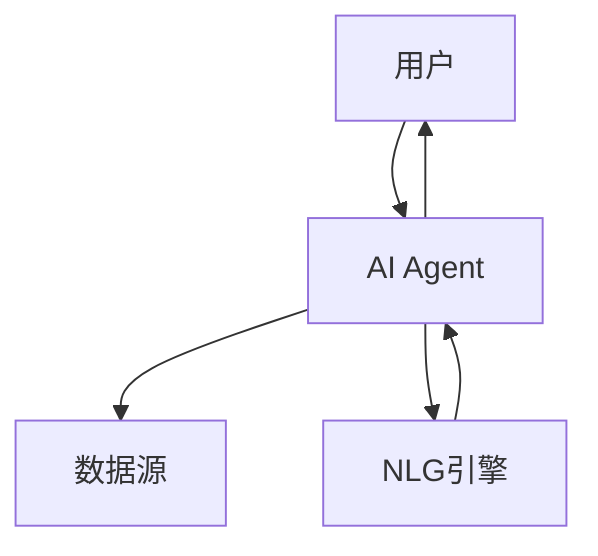
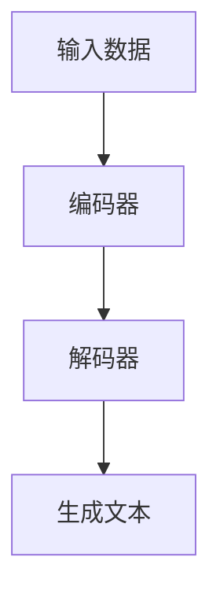
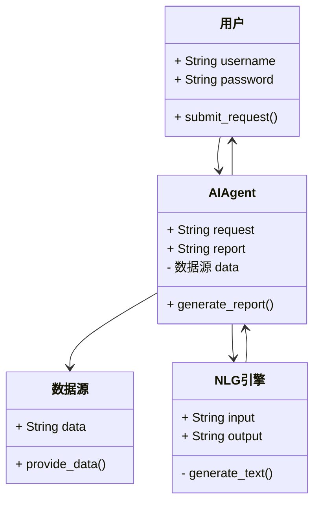
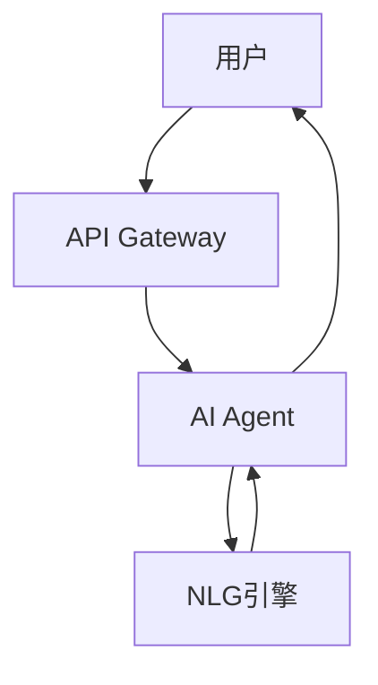
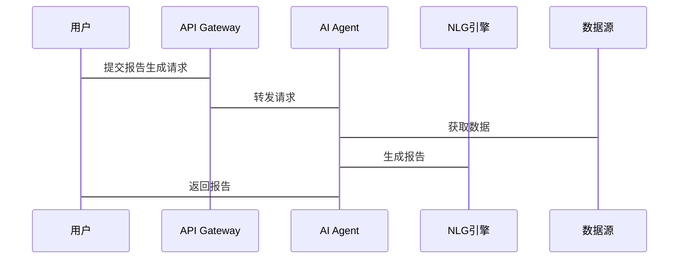

                 


# 《企业AI Agent的自然语言生成(NLG)报告系统》

> 关键词：AI Agent, 自然语言生成, NLG, 企业报告系统, 技术实现, 系统架构

> 摘要：本文详细探讨了企业AI Agent的自然语言生成(NLG)报告系统的构建与应用。从背景介绍到核心概念，从算法原理到系统架构，从项目实战到最佳实践，全面解析了如何利用AI Agent和NLG技术提升企业报告生成的效率和质量。通过具体的技术分析和案例演示，为读者提供了深入的理论支持和实践指导。

---

# 第1章 问题背景与描述

## 1.1 问题背景

### 1.1.1 企业自动化报告的需求

随着企业规模的不断扩大，数据量的激增，传统的手动报告生成方式已经无法满足企业的需求。企业需要快速生成准确、专业的报告，以支持决策和业务优化。自动化报告生成成为企业提高效率的重要手段。

### 1.1.2 自然语言生成技术的发展

自然语言生成（NLG）技术近年来取得了显著进展，尤其是生成式AI的应用，使得计算机能够生成接近人类写作水平的文本。这为企业的自动化报告生成提供了技术基础。

### 1.1.3 AI Agent在企业中的应用趋势

AI Agent（智能代理）作为企业自动化的核心技术之一，能够根据企业的需求自主执行任务。结合NLG技术，AI Agent能够生成高质量的报告，帮助企业实现智能化管理。

## 1.2 问题描述

### 1.2.1 传统报告生成的痛点

传统报告生成过程耗时长、效率低，且容易出错。人工撰写报告不仅成本高，还难以保证一致性。此外，不同部门的需求差异也增加了报告生成的复杂性。

### 1.2.2 企业对自动化报告的需求

企业亟需一种高效、智能的报告生成方式，能够快速响应数据变化，满足不同部门的需求。自动化报告生成成为企业数字化转型的重要环节。

### 1.2.3 AI Agent在NLG中的作用

AI Agent能够整合NLG技术，自动分析数据并生成报告。其自主性和智能性使其成为企业报告生成的理想选择。

## 1.3 问题解决

### 1.3.1 AI Agent如何辅助报告生成

AI Agent通过数据采集、分析和生成，能够自动化完成报告的整个生命周期。其核心在于理解和执行用户的请求，并通过NLG技术生成符合需求的文本。

### 1.3.2 自然语言生成技术的应用场景

NLG技术广泛应用于企业报告、市场分析、客户服务等领域。其灵活性和可定制性使其能够适应多种场景。

### 1.3.3 企业级NLG系统的构建

企业级NLG系统需要具备高可用性、可扩展性和安全性。其构建需要综合考虑数据源、模型选择和用户需求。

## 1.4 边界与外延

### 1.4.1 系统边界

企业AI Agent的NLG报告系统专注于数据生成和报告输出，不涉及数据源的采集和外部系统的集成。

### 1.4.2 相关技术的外延

NLG技术涉及文本生成、语义理解等多个领域，其应用范围远超企业报告生成。

### 1.4.3 应用范围与限制

企业级NLG系统主要用于内部报告生成，受限于数据隐私和系统集成的复杂性。

## 1.5 核心要素组成

### 1.5.1 AI Agent的基本构成

AI Agent由感知模块、决策模块和执行模块组成，能够自主完成任务。

### 1.5.2 NLG系统的组成部分

NLG系统包括数据处理、模型训练和生成引擎三个部分，确保生成文本的准确性和流畅性。

### 1.5.3 企业级系统的特征

企业级系统具备高可靠性和可扩展性，能够支持大规模数据处理和多用户同时访问。

---

# 第2章 核心概念与联系

## 2.1 AI Agent的基本原理

### 2.1.1 AI Agent的定义

AI Agent是一种智能代理，能够感知环境并自主执行任务。它通过数据输入和任务请求，生成相应的输出。

### 2.1.2 AI Agent的核心功能

AI Agent具备感知、决策和执行功能，能够根据输入数据生成相应的报告。

### 2.1.3 AI Agent与传统软件的区别

AI Agent具备智能性和自主性，能够根据变化调整行为，而传统软件依赖于固定的逻辑。

## 2.2 自然语言生成技术

### 2.2.1 NLG的定义

NLG是一种将数据转化为自然语言文本的技术，广泛应用于报告生成、对话系统等领域。

### 2.2.2 NLG的主要技术

NLG技术包括文本规划、文本生成和文本优化三个阶段，确保生成文本的质量。

### 2.2.3 NLG的应用场景

NLG技术应用于企业报告、新闻生成、客服对话等领域，提升自动化水平。

## 2.3 AI Agent与NLG的关系

### 2.3.1 AI Agent如何利用NLG技术

AI Agent通过NLG技术将数据分析结果转化为自然语言文本，生成报告。

### 2.3.2 NLG在AI Agent中的作用

NLG是AI Agent生成输出的核心模块，决定了报告的质量和可读性。

### 2.3.3 两者结合的优势

AI Agent与NLG的结合实现了自动化报告生成，提升了企业的效率和准确性。

---

## 2.4 属性特征对比

### 2.4.1 AI Agent的属性

| 属性 | 描述 |
|------|------|
| 智能性 | 能够理解数据并生成相应输出 |
| 自主性 | 能够自主执行任务，无需人工干预 |
| 适应性 | 能够根据环境变化调整行为 |

### 2.4.2 NLG系统的属性

| 属性 | 描述 |
|------|------|
| 生成能力 | 能够将数据转化为自然语言文本 |
| 理解能力 | 能够理解上下文并生成相关文本 |
| 可定制性 | 能够根据用户需求调整生成内容 |

### 2.4.3 对比分析

AI Agent与NLG系统的结合，使得企业能够高效生成高质量的报告。AI Agent的智能性和自主性与NLG的生成能力和理解能力相结合，提升了系统的整体性能。

---

## 2.5 ER实体关系图

### 2.5.1 系统核心实体

- 用户：请求报告生成的用户
- 数据源：生成报告所需的数据来源
- AI Agent：执行报告生成的智能代理
- NLG引擎：生成自然语言文本的核心模块

### 2.5.2 实体关系

- 用户向AI Agent提交报告生成请求
- AI Agent从数据源获取数据
- AI Agent调用NLG引擎生成报告
- NLG引擎将生成的报告返回给AI Agent
- AI Agent将报告发送给用户

### 2.5.3 Mermaid流程图



---

# 第3章 算法原理讲解

## 3.1 生成式AI的数学模型

### 3.1.1 概率分布

生成式AI基于概率模型，通过计算每个词的概率分布来生成文本。常用的模型包括马尔可夫链和贝叶斯网络。

### 3.1.2 损失函数

生成式AI通常使用交叉熵损失函数来衡量生成文本与真实文本的差异。损失函数的最小化是模型优化的目标。

### 3.1.3 优化算法

Adam优化算法是一种常用的优化算法，结合了动量和自适应学习率的优点，能够快速收敛。

## 3.2 Mermaid流程图



## 3.3 Python代码实现

### 3.3.1 生成式AI模型实现

```python
import torch
import torch.nn as nn

class Generator(nn.Module):
    def __init__(self, input_dim, hidden_dim, output_dim):
        super(Generator, self).__init__()
        self.fc1 = nn.Linear(input_dim, hidden_dim)
        self.fc2 = nn.Linear(hidden_dim, output_dim)
        self.dropout = nn.Dropout(0.5)
    
    def forward(self, x):
        x = torch.relu(self.fc1(x))
        x = self.dropout(x)
        x = torch.sigmoid(self.fc2(x))
        return x

# 初始化模型
input_dim = 100
hidden_dim = 256
output_dim = 128
generator = Generator(input_dim, hidden_dim, output_dim)
```

### 3.3.2 训练过程

```python
# 定义损失函数和优化器
criterion = nn.BCELoss()
optimizer = torch.optim.Adam(generator.parameters(), lr=0.001)

# 训练循环
for epoch in range(num_epochs):
    for i, (real_data, _) in enumerate(dataloader):
        # 生成假数据
        noise = torch.randn(batch_size, input_dim)
        fake_data = generator(noise)
        
        # 计算损失
        loss = criterion(fake_data, real_data)
        
        # 反向传播和优化
        optimizer.zero_grad()
        loss.backward()
        optimizer.step()
```

---

# 第4章 系统分析与架构设计方案

## 4.1 问题场景介绍

### 4.1.1 系统设计背景

企业需要一个高效、智能的报告生成系统，能够自动化完成数据采集、分析和报告生成。

### 4.1.2 项目介绍

本项目旨在构建一个基于AI Agent和NLG技术的企业报告生成系统，提升企业的效率和准确性。

## 4.2 领域模型类图



## 4.3 系统架构图



## 4.4 系统接口设计

### 4.4.1 接口1：用户请求报告生成

```json
{
    "request_id": "123",
    "data": {
        "metric": "revenue",
        "time_range": "2023-Q1"
    }
}
```

### 4.4.2 接口2：数据源提供数据

```json
{
    "data": {
        "revenue": 100000,
        "sales": 50000
    }
}
```

### 4.4.3 接口3：生成报告

```json
{
    "report": "在2023年第一季度，公司收入为10万元，销售业绩为5万元。"
}
```

## 4.5 系统交互流程图



---

# 第5章 项目实战

## 5.1 环境安装

### 5.1.1 安装Python

```bash
# 安装Python 3.8及以上版本
sudo apt-get install python3.8
```

### 5.1.2 安装必要的库

```bash
pip install torch numpy matplotlib
```

## 5.2 核心代码实现

### 5.2.1 数据预处理

```python
import pandas as pd

# 读取数据
data = pd.read_csv('data.csv')
# 数据清洗
data.dropna(inplace=True)
```

### 5.2.2 训练模型

```python
# 定义模型
class NLGModel(nn.Module):
    def __init__(self, input_size, hidden_size, output_size):
        super(NLGModel, self).__init__()
        self.fc1 = nn.Linear(input_size, hidden_size)
        self.fc2 = nn.Linear(hidden_size, output_size)
    
    def forward(self, x):
        x = torch.relu(self.fc1(x))
        x = torch.sigmoid(self.fc2(x))
        return x

# 初始化模型
input_size = 100
hidden_size = 256
output_size = 128
model = NLGModel(input_size, hidden_size, output_size)

# 定义损失函数和优化器
criterion = nn.MSELoss()
optimizer = torch.optim.Adam(model.parameters(), lr=0.001)

# 训练循环
for epoch in range(100):
    for i, (inputs, labels) in enumerate(train_loader):
        outputs = model(inputs)
        loss = criterion(outputs, labels)
        optimizer.zero_grad()
        loss.backward()
        optimizer.step()
```

### 5.2.3 生成报告

```python
# 生成报告
def generate_report(data):
    # 数据分析
    analysis = analyze_data(data)
    # 调用NLG引擎
    report = nlg_engine.generate(analysis)
    return report

# 示例
data = load_data('report_data.csv')
report = generate_report(data)
print(report)
```

## 5.3 案例分析

### 5.3.1 案例1：销售报告生成

输入数据：2023年第一季度的销售数据。

生成报告：详细分析各产品的销售情况，生成销售报告。

### 5.3.2 案例2：财务报告生成

输入数据：2023年第一季度的财务数据。

生成报告：生成财务状况分析报告。

## 5.4 项目小结

通过本项目的实施，企业能够快速生成高质量的报告，显著提升效率和准确性。系统的可扩展性和可定制性使其能够适应不同企业的需求。

---

# 第6章 最佳实践

## 6.1 小结

企业AI Agent的NLG报告系统是一种高效、智能的解决方案，能够显著提升企业的报告生成效率和质量。

## 6.2 注意事项

- 数据质量和完整性直接影响生成报告的准确性。
- 模型的选择和调优对生成效果至关重要。
- 系统的安全性和稳定性需要严格保障。

## 6.3 拓展阅读

- 《生成式AI：原理与应用》
- 《自然语言处理：从基础到进阶》
- 《AI Agent在企业中的应用》

---

# 作者

作者：AI天才研究院/AI Genius Institute & 禅与计算机程序设计艺术 /Zen And The Art of Computer Programming

