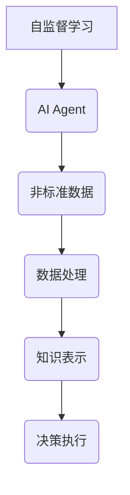
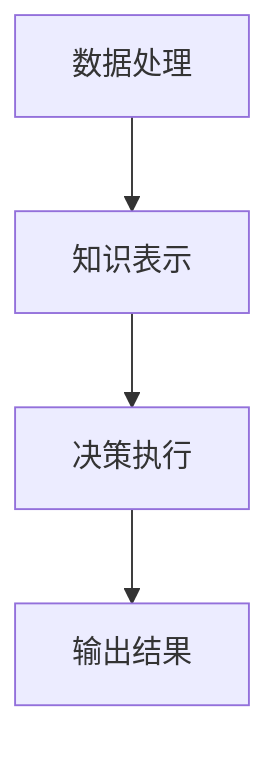
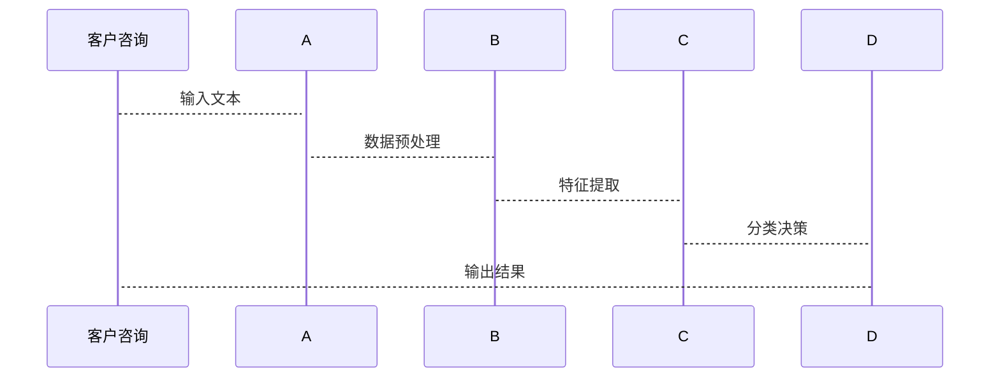

                 


# 企业AI Agent的自监督学习在非标准数据利用中的创新实践

## 关键词
企业AI Agent, 自监督学习, 非标准数据, 生成对抗网络, 对比散度, 图神经网络

## 摘要
随着企业智能化转型的推进，非标准数据的利用成为关键挑战。自监督学习作为一种新兴的人工智能技术，能够有效处理非结构化数据，提升企业AI Agent的智能化水平。本文系统探讨自监督学习在企业AI Agent中的应用，从算法原理到系统架构，再到实际案例，全面解析如何创新性地利用非标准数据，为企业智能化提供新思路。

---

## 第一部分：背景介绍

### 第1章：企业AI Agent与自监督学习的背景

#### 1.1 问题背景
企业智能化转型的核心是数据的利用，而大量存在的非结构化数据（如文本、图像、视频）难以直接用于传统监督学习。自监督学习作为一种无需大量标注数据的无监督学习方法，为企业AI Agent的开发提供了新的可能性。

- **数据驱动的企业智能化转型**：企业希望通过数据驱动决策，但非结构化数据的处理成为瓶颈。
- **非标准数据的挑战与价值**：非结构化数据占比高，难以直接使用，但蕴含大量潜在价值。
- **自监督学习的引入与意义**：通过自监督学习，企业可以更高效地利用非标准数据，提升AI Agent的智能水平。

#### 1.2 问题描述
- **非结构化数据的处理难题**：文本、图像等数据难以直接提取特征。
- **传统监督学习的局限性**：需要大量标注数据，成本高且耗时。
- **自监督学习的适用场景**：适用于数据量大、标注成本高的场景。

#### 1.3 问题解决
- **自监督学习的核心思想**：通过对比学习，利用数据本身构造监督信号。
- **企业AI Agent的目标与任务**：通过处理非标准数据，实现智能化决策和执行。
- **非标准数据的创新利用方式**：结合自监督学习，提取隐含特征，提升AI Agent的理解能力。

#### 1.4 边界与外延
- **自监督学习的边界条件**：适用于无标注或少量标注数据的情况。
- **企业AI Agent的应用边界**：主要应用于数据处理、决策支持等领域。
- **非标准数据的定义与外延**：包括文本、图像、音频等多种形式。

#### 1.5 概念结构与核心要素
- **自监督学习的核心要素**：对比学习、生成模型。
- **企业AI Agent的组成结构**：感知层、知识层、行为层。
- **非标准数据的分类与特征**：结构化、半结构化、非结构化，特征包括多样性、复杂性。

---

## 第二部分：核心概念与联系

### 第2章：自监督学习与AI Agent的关系

#### 2.1 自监督学习的核心原理
自监督学习通过构造伪标签或对比任务，利用数据本身的结构进行学习。其核心思想是通过最大化样本的相似性，最小化不相似样本的差异性。

- **对比散度（Contrastive Divergence）**：一种用于训练受限玻尔兹曼机的方法，通过调整权重，使生成的数据与真实数据尽可能接近。
- **生成对抗网络（GAN）**：通过生成器和判别器的对抗训练，生成高质量的数据样本。
- **图神经网络（GNN）**：在图结构数据上进行自监督学习，利用节点之间的关系提取特征。

#### 2.2 AI Agent的体系结构
AI Agent由感知层、知识层和行为层组成，分别负责数据处理、知识表示和决策执行。

- **感知层**：负责接收和处理输入数据，如文本、图像等。
- **知识层**：通过自监督学习提取数据特征，构建知识表示。
- **行为层**：基于知识层的推理结果，做出决策和执行。

#### 2.3 核心概念对比分析
| 概念 | 自监督学习 | 监督学习 | 无监督学习 |
|------|------------|----------|------------|
| 数据需求 | 少量或无标注 | 需要标注 | 少量或无标注 |
| 学习目标 | 对比或生成 | 分类或回归 | 聚类或降维 |
| 适用场景 | 非标准数据处理 | 标注数据充足 | 数据探索 |

#### 2.4 ER实体关系图


---

## 第三部分：算法原理讲解

### 第3章：自监督学习的算法原理

#### 3.1 对比散度（Contrastive Divergence）
对比散度是一种用于训练受限玻尔兹曼机的方法，通过调整权重，使生成的数据与真实数据尽可能接近。

- **数学模型**：受限玻尔兹曼机的目标函数为：
  $$ L = -\sum_{i=1}^n \log p(x_i) $$
- **算法步骤**：
  1. 生成一批样本 $x$。
  2. 计算概率 $p(x)$。
  3. 调整权重，使生成样本与真实样本分布一致。

#### 3.2 生成对抗网络（GAN）
GAN通过生成器和判别器的对抗训练，生成高质量的数据样本。

- **生成器**：通过优化目标函数：
  $$ \min_G \mathbb{E}_{z \sim p_z}[\log D(G(z))] $$
- **判别器**：通过优化目标函数：
  $$ \min_D \mathbb{E}_{x \sim p_x}[\log D(x)] + \mathbb{E}_{z \sim p_z}[\log (1 - D(G(z)))] $$
- **mermaid流程图**：
  ```mermaid
  graph TD
  G[生成器] --> D[判别器]
  D --> G
  ```

#### 3.3 图神经网络（GNN）
GNN在图结构数据上进行自监督学习，利用节点之间的关系提取特征。

- **图结构数据**：节点之间的关系通过边表示。
- **节点表示**：通过聚合邻居特征，生成节点表示。
- **数学公式**：节点表示更新公式为：
  $$ h_i^{(l+1)} = \sigma(\sum_{j \in N(i)} h_j^{(l)}) $$
  其中，$\sigma$ 是激活函数。

---

## 第四部分：系统分析与架构设计

### 第4章：系统分析与架构设计

#### 4.1 项目场景介绍
假设我们开发一个企业级AI Agent，用于处理客户咨询的非结构化文本数据。

- **问题场景**：客户咨询文本需要分类和理解。
- **目标**：通过自监督学习，提升分类准确率和理解能力。

#### 4.2 系统功能设计
- **数据处理模块**：接收文本数据，进行预处理。
- **知识表示模块**：通过自监督学习提取特征。
- **决策执行模块**：基于特征进行分类和决策。

#### 4.3 系统架构设计


#### 4.4 系统接口设计
- **输入接口**：接收客户咨询文本。
- **输出接口**：输出分类结果和决策建议。

#### 4.5 系统交互设计


---

## 第五部分：项目实战

### 第5章：项目实战

#### 5.1 环境安装
安装必要的库：
```bash
pip install numpy torch matplotlib
```

#### 5.2 核心代码实现
以下是自监督学习的实现代码：
```python
import torch
import torch.nn as nn
import torch.optim as optim

class Generator(nn.Module):
    def __init__(self, input_dim, hidden_dim):
        super(Generator, self).__init__()
        self.fc = nn.Linear(input_dim, hidden_dim)
        self.relu = nn.ReLU()

    def forward(self, x):
        return self.relu(self.fc(x))

class Discriminator(nn.Module):
    def __init__(self, hidden_dim, output_dim):
        super(Discriminator, self).__init__()
        self.fc = nn.Linear(hidden_dim, output_dim)
        self.sigmoid = nn.Sigmoid()

    def forward(self, x):
        return self.sigmoid(self.fc(x))

def train_gan(generator, discriminator, optimizer_g, optimizer_d, criterion, data):
    optimizer_g.zero_grad()
    optimizer_d.zero_grad()

    # 生成样本
    gen_output = generator(data)
    # 判别器判断真实样本
    real_output = discriminator(data)
    # 判别器判断生成样本
    fake_output = discriminator(gen_output)

    # 计算损失
    loss_g = criterion(fake_output, torch.ones_like(fake_output) * 0.9)
    loss_d = criterion(real_output, torch.ones_like(real_output)) + criterion(fake_output, torch.zeros_like(fake_output))

    loss_g.backward()
    loss_d.backward()

    optimizer_g.step()
    optimizer_d.step()

    return loss_g.item(), loss_d.item()
```

#### 5.3 案例分析
以客户咨询文本分类为例，通过自监督学习提升分类准确率。具体步骤包括数据预处理、特征提取、模型训练和结果输出。

---

## 第六部分：最佳实践

### 第6章：最佳实践

#### 6.1 小结
自监督学习为企业AI Agent的非标准数据利用提供了新思路，通过对比学习和生成对抗网络，可以有效提取数据特征，提升智能化水平。

#### 6.2 注意事项
- 数据质量：确保数据来源可靠，避免噪声干扰。
- 模型调参：合理选择超参数，确保模型性能。
- 安全性：注意数据隐私保护，避免泄露风险。

#### 6.3 拓展阅读
建议阅读以下资料：
- Goodfellow的《生成对抗网络》。
- 深入理解对比学习的最新研究。

---

## 结语

企业AI Agent的自监督学习在非标准数据利用中的创新实践为企业智能化转型提供了新的方向。通过自监督学习，企业可以更高效地利用非结构化数据，提升AI Agent的智能化水平。未来，随着技术的不断发展，自监督学习将在更多领域发挥重要作用。

---

## 作者：AI天才研究院（AI Genius Institute） & 禅与计算机程序设计艺术（Zen And The Art of Computer Programming）

---

**本文由AI天才研究院（AI Genius Institute）倾心打造，转载请注明出处。**

