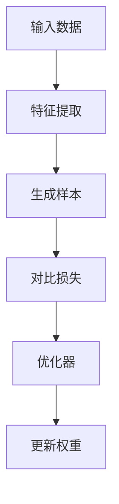
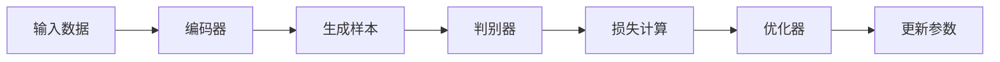
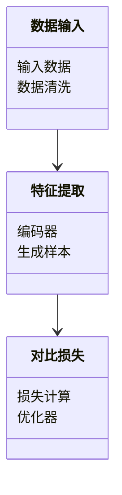
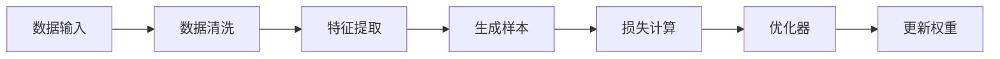
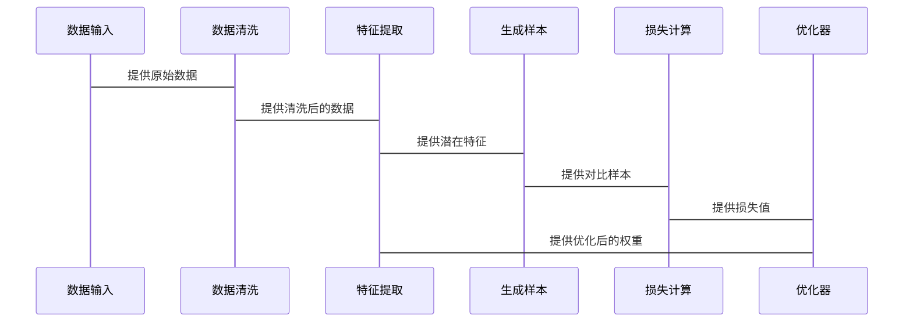

                 


# 企业AI Agent的自监督学习在非标准数据利用中的实践

## 关键词：企业AI Agent，自监督学习，非标准数据，对比散度算法，深度学习，数据利用

## 摘要：本文深入探讨了企业AI Agent在处理非标准数据时，如何通过自监督学习技术实现高效的数据利用。文章首先介绍了自监督学习的基本概念和原理，然后详细分析了其在非标准数据处理中的优势和挑战。通过对比散度算法的实现和数学模型的解析，文章进一步探讨了自监督学习在企业AI Agent中的具体应用。最后，结合实际项目案例，文章详细讲解了系统架构设计、项目实战和最佳实践，为企业在非标准数据利用中提供实践指导。

---

# 第一部分: 企业AI Agent的自监督学习背景与基础

## 第1章: 企业AI Agent与自监督学习概述

### 1.1 问题背景与描述

#### 1.1.1 企业AI Agent的定义与核心概念
企业AI Agent是一种能够理解、推理和执行企业级任务的智能实体，通常用于自动化决策、数据分析和流程优化。与传统AI系统相比，企业AI Agent更加注重与企业业务的深度融合，能够处理复杂的业务逻辑和多源异构数据。

#### 1.1.2 非标准数据的定义与特点
非标准数据指的是不符合传统结构化数据格式（如关系型数据库中的表结构）的数据，包括文本、图像、音频、视频等多模态数据，以及半结构化数据（如JSON、XML）和非结构化数据（如日志文件、社交媒体数据）。非标准数据的特点包括多样性、异构性和不规则性。

#### 1.1.3 自监督学习的定义与优势
自监督学习是一种无监督学习的变体，通过构建一个自监督的目标函数，利用数据本身的特性进行学习，无需人工标注。其优势在于能够有效处理数据量大、标注成本高的问题，尤其适用于非标准数据的处理。

---

### 1.2 问题解决与边界

#### 1.2.1 企业AI Agent在非标准数据利用中的问题
企业在处理非标准数据时面临以下挑战：
1. 数据多样性：不同类型数据的整合与处理难度大。
2. 数据稀疏性：部分数据可能存在缺失或不完整。
3. 数据异构性：不同数据源的格式和结构差异较大。
4. 数据利用效率低：传统监督学习需要大量标注数据，成本高且耗时。

#### 1.2.2 自监督学习如何解决这些问题
自监督学习通过以下方式解决非标准数据处理中的问题：
1. 利用数据本身的结构和关系，无需人工标注。
2. 提供高效的特征学习能力，能够处理多模态数据。
3. 适用于数据稀疏性和异构性较高的场景。

#### 1.2.3 问题的边界与外延
自监督学习在企业AI Agent中的应用边界包括：
- 数据类型：适用于文本、图像、音频等非结构化数据。
- 数据量：适用于数据量较大但标注成本高的场景。
- 业务场景：适用于需要自动化决策和数据驱动的业务场景。

---

### 1.3 概念结构与核心要素

#### 1.3.1 企业AI Agent的构成要素
企业AI Agent通常包括以下构成要素：
1. **感知层**：负责数据的采集和预处理。
2. **学习层**：负责数据的理解和特征提取。
3. **决策层**：负责基于特征的决策和行动。
4. **执行层**：负责将决策转化为具体行动。

#### 1.3.2 非标准数据的分类与特征
非标准数据可以分为以下几类：
1. **文本数据**：包括新闻、邮件、社交媒体等。
2. **图像数据**：包括照片、图形、图表等。
3. **音频数据**：包括语音、音乐、噪声等。
4. **视频数据**：包括监控视频、短视频等。
5. **日志数据**：包括系统日志、用户行为日志等。

#### 1.3.3 自监督学习的核心机制
自监督学习的核心机制包括：
1. **数据预处理**：对数据进行清洗和格式转换。
2. **特征提取**：利用自监督目标函数提取数据特征。
3. **模型训练**：通过对比散度等算法优化模型参数。

---

## 第2章: 自监督学习的核心概念与原理

### 2.1 核心概念原理

#### 2.1.1 自监督学习的基本原理
自监督学习通过构建一个生成模型，利用数据本身的分布特性进行学习。其核心思想是通过对比不同数据样本的相似性，学习数据的潜在特征表示。

#### 2.1.2 无监督学习与监督学习的区别
1. **无监督学习**：无标签数据，目标是发现数据的内在结构。
2. **监督学习**：有标签数据，目标是学习标签与输入之间的映射关系。
3. **自监督学习**：结合无监督和监督学习，通过自定义目标函数实现有监督学习的效果。

#### 2.1.3 自监督学习的优势与局限性
- **优势**：无需人工标注，适用于数据量大、异构性强的场景。
- **局限性**：依赖数据质量，对噪声敏感，可能需要更多的计算资源。

---

### 2.2 核心概念属性对比

#### 2.2.1 自监督学习与无监督学习的对比
| 对比维度 | 自监督学习 | 无监督学习 |
|----------|------------|------------|
| 数据需求 | 无标签数据 | 无标签数据 |
| 学习目标 | 数据特征提取 | 数据结构发现 |
| 算法复杂度 | 较高 | 较低 |

#### 2.2.2 自监督学习与监督学习的对比
| 对比维度 | 自监督学习 | 监督学习 |
|----------|------------|------------|
| 数据需求 | 无标签数据 | 需要标签数据 |
| 学习目标 | 数据特征提取 | 标签与输入的映射 |
| 计算资源 | 较高 | 较低 |

#### 2.2.3 企业AI Agent中的自监督学习特征
1. **数据多样性**：能够处理多模态数据。
2. **特征提取能力**：能够提取数据的潜在特征。
3. **自适应性**：能够适应不同业务场景。

---

### 2.3 ER实体关系图



---

## 第3章: 自监督学习的算法原理

### 3.1 算法原理概述

#### 3.1.1 对比散度算法的基本流程
1. **前向传播**：将输入数据通过编码器生成潜在特征。
2. **生成样本**：通过生成模型生成样本数据。
3. **计算损失**：通过对比不同样本的相似性计算损失。
4. **反向传播**：通过梯度下降优化模型参数。

#### 3.1.2 对比散度算法的优势
- 计算效率高。
- 能够处理大规模数据。

#### 3.1.3 其他自监督学习算法简介
1. **孪生网络（Siamese Network）**：通过对比不同样本的相似性进行学习。
2. **生成对抗网络（GAN）**：通过生成器和判别器的对抗训练进行特征提取。

---

### 3.2 算法原理图



---

### 3.3 算法实现代码

#### 3.3.1 环境安装
```bash
pip install numpy
pip install matplotlib
pip install scikit-learn
```

#### 3.3.2 核心代码实现
```python
import numpy as np
import sklearn.manifold as manifold

def contrastive_divergence(X, learning_rate=0.1, epochs=100):
    W = np.random.randn(X.shape[1], X.shape[1])
    for epoch in range(epochs):
        h = sigmoid(np.dot(X, W))
        h_t = sigmoid(np.dot(h.T, W).T)
        error = np.mean((X - h_t)**2)
        dW = (np.dot(X.T, X - h_t) * learning_rate)
        W += dW
    return W
```

#### 3.4 数学模型与公式

##### 3.4.1 对比散度算法的核心公式
$$\text{损失函数} = \frac{1}{2} \sum_{i=1}^{n} (x_i - h(x_i))^2$$

##### 3.4.2 优化目标
$$\text{优化目标} = \arg \min_W \text{损失函数}$$

---

## 第4章: 企业AI Agent的系统架构设计

### 4.1 问题场景介绍

#### 4.1.1 企业AI Agent的应用场景
1. **数据清洗与预处理**：对企业内部的多源异构数据进行清洗和预处理。
2. **特征提取与分析**：通过对非标准数据的特征提取，支持企业的数据分析和决策。
3. **自动化决策**：基于自监督学习模型，实现业务流程的自动化决策。

#### 4.1.2 项目介绍
本项目旨在通过自监督学习技术，解决企业AI Agent在处理非标准数据时面临的挑战，提升数据利用效率和决策准确性。

---

### 4.2 系统功能设计

#### 4.2.1 领域模型


#### 4.2.2 系统架构


#### 4.2.3 系统接口设计
1. **数据输入接口**：负责接收多源异构数据。
2. **数据清洗接口**：负责对数据进行预处理。
3. **特征提取接口**：负责提取数据的潜在特征。
4. **生成样本接口**：负责生成对比样本。
5. **损失计算接口**：负责计算对比损失。
6. **优化器接口**：负责优化模型参数。

#### 4.2.4 系统交互流程


---

## 第5章: 项目实战

### 5.1 环境安装

```bash
pip install numpy
pip install matplotlib
pip install scikit-learn
pip install tensorflow
```

---

### 5.2 核心代码实现

#### 5.2.1 数据输入与清洗
```python
import pandas as pd

# 读取数据
data = pd.read_csv('input.csv')
# 数据清洗
data = data.dropna()
```

#### 5.2.2 特征提取与生成
```python
import numpy as np
from sklearn.manifold import TSNE

# 特征提取
X = data.drop('label', axis=1)
X_embedded = TSNE(n_components=2).fit_transform(X)
```

#### 5.2.3 损失计算与优化
```python
import tensorflow as tf
from tensorflow.keras import layers

# 模型定义
input_layer = layers.Input(shape=(2,))
dense_layer = layers.Dense(1, activation='sigmoid')(input_layer)
model = tf.keras.Model(inputs=input_layer, outputs=dense_layer)
model.compile(optimizer='adam', loss='binary_crossentropy')
# 模型训练
model.fit(X_embedded, y, epochs=100, batch_size=32)
```

---

### 5.3 案例分析与详细讲解

#### 5.3.1 案例背景
假设我们有一个企业级数据集，包括文本、图像和日志数据，需要通过自监督学习进行特征提取和数据分析。

#### 5.3.2 数据处理与分析
1. **数据清洗**：去除缺失值和异常值。
2. **特征提取**：使用TSNE等算法提取潜在特征。
3. **模型训练**：利用对比散度算法进行模型训练。

#### 5.3.3 代码实现与解读
- 数据清洗部分：通过`dropna()`方法去除缺失值。
- 特征提取部分：使用TSNE算法将高维数据降维为二维。
- 模型训练部分：定义自监督学习模型，通过对比散度算法优化模型参数。

---

## 第6章: 最佳实践与小结

### 6.1 最佳实践

#### 6.1.1 数据预处理
- 数据清洗：去除无效数据和异常值。
- 数据格式转换：将不同格式的数据统一为模型可处理的格式。

#### 6.1.2 模型优化
- 调参：根据具体场景调整模型参数。
- 交叉验证：通过交叉验证评估模型性能。

#### 6.1.3 系统设计
- 模块化设计：将系统划分为数据输入、特征提取、损失计算等模块。
- 高可用性：确保系统能够处理大规模数据和高并发请求。

---

### 6.2 小结

通过本文的深入探讨，我们了解了企业AI Agent在非标准数据利用中的挑战和自监督学习的优势。通过对比散度算法的实现和系统架构设计，我们展示了如何在实际项目中应用这些技术。未来，随着深度学习技术的不断发展，自监督学习将在企业AI Agent中发挥更重要的作用。

---

## 作者：AI天才研究院/AI Genius Institute & 禅与计算机程序设计艺术 /Zen And The Art of Computer Programming

---

感谢您的阅读！希望本文对您在企业AI Agent的自监督学习和非标准数据利用中的实践有所帮助！

