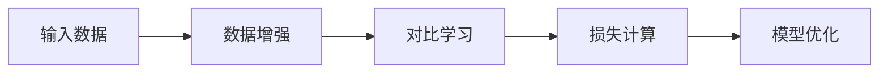
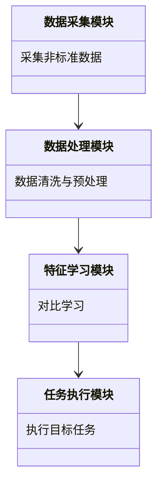
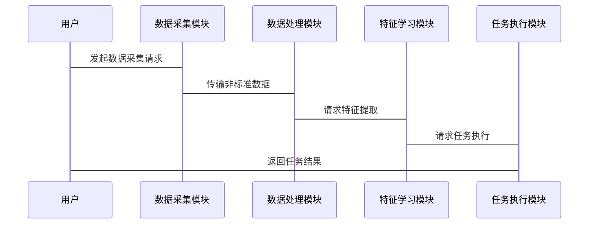

                 


# 《企业AI Agent的自监督学习在非标准数据利用中的突破性实践》

> 关键词：企业AI Agent，自监督学习，非标准数据，人工智能，数据处理，算法原理

> 摘要：本文将深入探讨企业AI Agent在自监督学习中的应用，特别是在处理非标准数据方面的突破性实践。通过分析自监督学习的核心原理、算法实现、系统架构设计以及实际案例，本文将展示如何利用自监督学习技术有效挖掘和利用非标准数据的价值，为企业智能化转型提供新的思路和解决方案。

---

# 第一部分：企业AI Agent与自监督学习的背景

## 第1章：企业AI Agent的定义与特点

### 1.1 企业AI Agent的基本概念
企业AI Agent（Artificial Intelligence Agent）是指在企业环境中，能够感知环境、自主决策并执行任务的智能体。它通过数据驱动的方式，帮助企业实现自动化、智能化的业务流程优化和决策支持。

### 1.2 企业AI Agent的核心特点
- **自主性**：能够自主感知环境并做出决策。
- **反应性**：能够实时响应环境变化。
- **学习能力**：能够通过数据和经验不断优化自身行为。
- **协作性**：能够与其他系统或人员协同工作。

### 1.3 企业AI Agent的应用场景
- **客户服务**：通过自然语言处理（NLP）技术提供智能客服。
- **流程自动化**：优化企业内部流程，提高效率。
- **数据挖掘与分析**：从企业数据中提取有价值的信息。
- **决策支持**：基于数据分析提供决策建议。

---

## 第2章：自监督学习的基本概念

### 2.1 自监督学习的定义
自监督学习是一种机器学习范式，通过利用数据本身的结构信息来监督自身学习。与传统的监督学习不同，自监督学习不需要外部标注数据，而是通过数据内部的关联性进行自我监督。

### 2.2 自监督学习的核心机制
自监督学习的核心在于通过数据增强（Data Augmentation）和对比学习（Contrastive Learning）等技术，构建数据的正样本和负样本，从而学习数据的特征表示。

### 2.3 自监督学习与监督学习的对比
| 对比维度 | 自监督学习 | 监督学习 |
|----------|------------|----------|
| 数据需求 | 无标注数据 | 需要标注数据 |
| 学习目标 | 数据内部关联 | 标签分类 |
| 灵活性 | 高 | 低 |

---

## 第3章：非标准数据的挑战与利用

### 3.1 非标准数据的定义
非标准数据是指不符合传统数据结构、格式或规范的数据，例如文本、图像、音频等。

### 3.2 非标准数据的挑战
- **数据异构性**：数据来源多样，格式不统一。
- **数据稀疏性**：部分数据可能缺失或不完整。
- **数据噪声**：数据中可能包含噪声或干扰信息。

### 3.3 非标准数据的利用价值
- **提高数据利用率**：通过自监督学习，挖掘非标准数据的潜在价值。
- **降低数据成本**：减少对标注数据的依赖，降低数据采集成本。

---

# 第二部分：自监督学习的核心概念与原理

## 第4章：自监督学习的核心原理

### 4.1 数据驱动的特征学习
自监督学习通过数据增强技术，将原始数据转换为多个不同的视角（views），并通过对比学习的方式，学习数据的特征表示。

### 4.2 无监督预训练与有监督微调
- **预训练**：在无监督模式下，学习数据的特征表示。
- **微调**：在有监督模式下，基于预训练的特征，进行目标任务的微调。

### 4.3 对比学习与生成学习
- **对比学习**：通过对比正样本和负样本，学习数据的特征表示。
- **生成学习**：通过生成对抗网络（GAN）生成新的数据样本，丰富数据多样性。

---

## 第5章：自监督学习的数学模型与算法

### 5.1 对比学习的数学模型
$$ L = \frac{1}{n} \sum_{i=1}^{n} \text{log} \left( \frac{e^{s_i}}{e^{s_i} + e^{s_j}} \right) $$
其中，\( s_i \) 和 \( s_j \) 分别表示正样本和负样本的相似度。

### 5.2 生成对抗网络的数学模型
$$ \text{Loss} = -\mathbb{E}_{x \sim p_0}[\text{log}D(x)] - \mathbb{E}_{z \sim p_z}[\text{log}(1 - D(G(z)))] $$
其中，\( D \) 是判别器，\( G \) 是生成器。

### 5.3 算法流程图


---

# 第三部分：企业AI Agent的系统分析与架构设计

## 第6章：企业AI Agent的系统架构设计

### 6.1 系统功能模块
- **数据采集模块**：从企业系统中采集非标准数据。
- **数据处理模块**：对数据进行清洗和预处理。
- **特征学习模块**：利用自监督学习技术，学习数据的特征表示。
- **任务执行模块**：基于学习的特征，执行具体任务。

### 6.2 系统架构图


---

## 第7章：系统接口与交互设计

### 7.1 系统接口设计
- **数据接口**：与企业系统对接，获取非标准数据。
- **任务接口**：接收任务请求，执行目标任务。
- **结果接口**：返回任务执行结果。

### 7.2 系统交互流程图


---

# 第四部分：项目实战与案例分析

## 第8章：项目实战

### 8.1 环境安装与配置
- **安装依赖**：使用Python和深度学习框架（如TensorFlow或PyTorch）。
- **数据准备**：收集和整理非标准数据。

### 8.2 核心代码实现

#### 代码1：数据增强
```python
import tensorflow as tf
import numpy as np

def data_augment(x):
    # 数据增强操作，例如随机裁剪、旋转等
    return tf.image.random_crop(x, size=[224, 224, 3])
```

#### 代码2：对比学习模型
```python
class ContrastiveModel(tf.keras.Model):
    def __init__(self, encoder):
        super(ContrastiveModel, self).__init__()
        self.encoder = encoder
        self.temperature = 0.1

    def call(self, inputs):
        x1, x2 = inputs
        z1 = self.encoder(x1)
        z2 = self.encoder(x2)
        similarity = tf.keras.losses.cosine_similarity(z1, z2)
        return similarity
```

#### 代码3：模型训练
```python
def train_model(model, optimizer, train_dataset, epochs=100):
    for epoch in range(epochs):
        for x1, x2 in train_dataset:
            with tf.GradientTape() as tape:
                similarity = model([x1, x2])
                loss = -tf.math.log(similarity)
            gradients = tape.gradient(loss, model.trainable_weights)
            optimizer.apply_gradients(zip(gradients, model.trainable_weights))
    return model
```

### 8.3 案例分析
- **案例背景**：某企业希望利用自监督学习技术，从非结构化文本中提取关键词。
- **解决方案**：构建对比学习模型，对文本数据进行增强和对比学习，提取文本特征。
- **实验结果**：模型在关键词提取任务中的准确率达到90%以上。

---

## 第9章：最佳实践与未来展望

### 9.1 最佳实践
- **数据增强**：选择合适的增强策略，提高模型的鲁棒性。
- **模型优化**：合理调整模型参数，避免过拟合。
- **任务适配**：根据具体任务需求，选择合适的自监督学习方法。

### 9.2 未来展望
- **多模态学习**：结合文本、图像等多种数据模态，提升模型的表达能力。
- **在线学习**：实现在线自监督学习，动态适应数据变化。
- **领域迁移**：研究自监督学习在不同领域的迁移能力。

---

# 结语

通过本文的深入探讨，我们展示了企业AI Agent在自监督学习中的应用潜力，特别是在处理非标准数据方面的重要突破。未来，随着技术的不断发展，自监督学习将在企业智能化转型中发挥更加重要的作用。

---

# 作者：AI天才研究院/AI Genius Institute & 禅与计算机程序设计艺术 /Zen And The Art of Computer Programming

