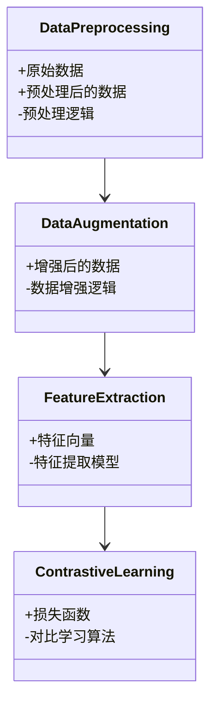
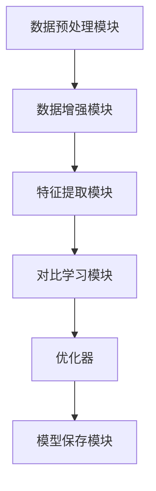
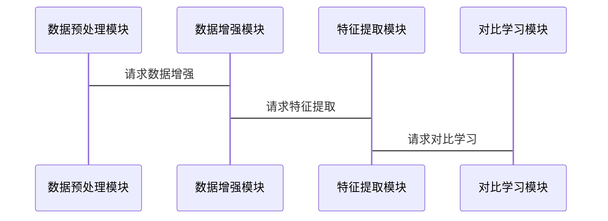

                 


# 企业AI Agent的自监督学习：利用未标记数据提升性能

> 关键词：企业AI Agent，自监督学习，未标记数据，深度学习，对比学习，表征学习

> 摘要：本文深入探讨了企业AI Agent中自监督学习的重要性，特别是在利用未标记数据提升模型性能方面的应用。通过详细分析自监督学习的核心概念、算法原理、系统架构以及实际项目案例，本文为读者提供了从理论到实践的全面指导。我们还将讨论如何在企业环境中有效实施自监督学习，以优化AI Agent的性能和效率。

---

# 第一部分: 企业AI Agent的自监督学习概述

## 第1章: 企业AI Agent与自监督学习背景

### 1.1 企业AI Agent的定义与特点

#### 1.1.1 企业AI Agent的基本概念
企业AI Agent（Artificial Intelligence Agent）是一种能够感知环境、执行任务并做出决策的智能实体。它通常被设计为在企业环境中辅助人类完成复杂任务，例如数据分析、流程自动化、客户支持等。

#### 1.1.2 企业AI Agent的核心特点
1. **自主性**：能够在没有外部干预的情况下独立执行任务。
2. **反应性**：能够实时感知环境并做出响应。
3. **学习能力**：能够通过数据和经验不断优化自身的性能。
4. **可扩展性**：能够处理不同类型和规模的任务。

#### 1.1.3 企业AI Agent的应用场景
1. **客户支持**：通过自然语言处理（NLP）技术为客户提供智能咨询服务。
2. **流程自动化**：利用AI Agent自动处理企业内部的审批流程、数据录入等任务。
3. **数据分析**：帮助企业从海量数据中提取有价值的信息，支持决策制定。

### 1.2 自监督学习的定义与优势

#### 1.2.1 自监督学习的基本概念
自监督学习（Self-Supervised Learning）是一种机器学习范式，其核心思想是利用未标记的数据通过预设的目标函数来学习数据的表示。与监督学习不同，自监督学习不需要人工标注的标签，而是通过数据本身生成监督信号。

#### 1.2.2 自监督学习与监督学习的区别
| 特性 | 监督学习 | 自监督学习 |
|------|----------|------------|
| 数据需求 | 需要大量标注数据 | 利用未标记数据生成监督信号 |
| 数据成本 | 高 | 低 |
| 模型泛化能力 | 依赖于标注质量 | 更强的泛化能力 |

#### 1.2.3 自监督学习的优势
1. **减少对标注数据的依赖**：通过利用未标记数据，可以显著降低数据标注的成本。
2. **提升模型鲁棒性**：自监督学习能够更好地捕捉数据的分布特性，使模型更具鲁棒性。
3. **适用于大规模数据**：在企业环境中，数据量通常非常大，自监督学习能够高效利用这些数据。

### 1.3 未标记数据的重要性

#### 1.3.1 数据标注的成本与挑战
1. **成本高**：标注数据需要大量的人力和时间，尤其是在处理复杂任务时。
2. **耗时长**：标注大规模数据通常需要数周甚至数月的时间。
3. **资源限制**：对于中小型企业来说，数据标注可能是一个巨大的挑战。

#### 1.3.2 利用未标记数据的潜力
1. **数据丰富性**：企业通常积累了大量的未标记数据，这些数据包含丰富的潜在信息。
2. **任务多样性**：未标记数据可以用于多种任务，例如分类、聚类、生成等。
3. **模型优化**：通过利用未标记数据，可以显著提升模型的性能和泛化能力。

#### 1.3.3 未标记数据在企业AI Agent中的应用
1. **任务优化**：通过自监督学习，企业AI Agent可以更好地理解和处理未标记数据。
2. **性能提升**：利用未标记数据进行预训练，可以显著提升模型的性能。
3. **降低成本**：减少对标注数据的依赖，降低数据标注成本。

### 1.4 本章小结
本章介绍了企业AI Agent的基本概念、特点以及应用场景，重点探讨了自监督学习的定义、优势以及未标记数据的重要性。通过对比监督学习和自监督学习，我们发现自监督学习在企业环境中具有巨大的潜力，尤其是在数据量大且标注成本高的情况下。

---

## 第2章: 自监督学习的核心概念与原理

### 2.1 自监督学习的原理

#### 2.1.1 预训练目标的定义
预训练目标是自监督学习的核心，它定义了模型如何从未标记数据中学习有用的表示。常见的预训练目标包括：
1. **任务特定目标**：例如，在自然语言处理任务中，可以使用掩码语言模型（Masked Language Model）。
2. **对比目标**：通过对比不同的数据增强版本，学习数据的不变性。

#### 2.1.2 数据增强方法
数据增强是自监督学习中的关键步骤，它通过变换原始数据生成多样化的训练样本。常见的数据增强方法包括：
1. **旋转**：在图像数据中，旋转数据以生成不同的样本。
2. **裁剪**：对图像进行随机裁剪，生成不同的子图像。
3. **噪声添加**：在语音数据中，添加噪声以提高模型的鲁棒性。

#### 2.1.3 对比学习机制
对比学习是一种常用的自监督学习方法，其核心思想是通过最大化正样本对的相似性来学习数据的表示。对比学习的目标函数可以表示为：

$$ L = -\frac{1}{N}\sum_{i=1}^{N}\log\left(\frac{e^{sim(x_i, y_i)}}{e^{sim(x_i, y_j)}}\right) $$

其中，$x_i$ 和 $y_i$ 是正样本对，$x_i$ 和 $y_j$ 是负样本对，$sim$ 表示相似性度量。

### 2.2 自监督学习的关键技术

#### 2.2.1 算法框架
自监督学习的算法框架通常包括以下几个步骤：
1. **数据预处理**：对数据进行清洗和标准化。
2. **数据增强**：生成多样化的训练样本。
3. **特征提取**：通过模型提取数据的表示。
4. **对比学习**：通过最大化正样本对的相似性来优化模型。

#### 2.2.2 表征学习
表征学习是自监督学习的核心任务，其目标是通过模型学习数据的低维表示，使得这些表示能够保留数据的有用特征。常见的表征学习方法包括：
1. **线性判别分析（LDA）**：通过投影数据到低维空间，使得不同类别的数据点尽可能分开。
2. **主成分分析（PCA）**：通过降维技术提取数据的主要特征。

#### 2.2.3 对比损失函数
对比损失函数是自监督学习中常用的损失函数，其目标是通过最大化正样本对的相似性来优化模型。常见的对比损失函数包括：
1. **NCE（Noise-Contrastive Estimation）**：通过估计正样本对的概率来计算损失。
2. **InfoNCE（Improved NCE）**：通过最大化正样本对的信息量来优化模型。

### 2.3 自监督学习的核心要素

#### 2.3.1 数据变换
数据变换是自监督学习中的关键步骤，它通过生成多样化的训练样本来提高模型的鲁棒性。常见的数据变换方法包括：
1. **旋转**：在图像数据中，随机旋转数据以生成不同的样本。
2. **裁剪**：对图像进行随机裁剪，生成不同的子图像。
3. **噪声添加**：在语音数据中，添加噪声以提高模型的鲁棒性。

#### 2.3.2 损失函数设计
损失函数是自监督学习的核心，其设计直接影响模型的性能。常见的损失函数包括：
1. **对比损失函数**：通过最大化正样本对的相似性来优化模型。
2. **重建损失函数**：通过重建原始数据来衡量模型的性能。
3. **分类损失函数**：通过分类任务来衡量模型的性能。

#### 2.3.3 模型架构选择
模型架构是自监督学习的关键，其选择直接影响模型的性能。常见的模型架构包括：
1. **卷积神经网络（CNN）**：适用于图像数据的处理。
2. **循环神经网络（RNN）**：适用于序列数据的处理。
3. **Transformer**：适用于文本数据的处理。

### 2.4 本章小结
本章详细探讨了自监督学习的核心概念与原理，包括预训练目标的定义、数据增强方法、对比学习机制以及自监督学习的关键技术。我们还分析了自监督学习的核心要素，包括数据变换、损失函数设计以及模型架构选择。

---

## 第3章: 自监督学习的数学模型与算法原理

### 3.1 自监督学习的数学模型

#### 3.1.1 损失函数的数学表达
自监督学习的损失函数通常用于衡量模型在预训练任务中的性能。常见的损失函数包括：
1. **对比损失函数**：通过最大化正样本对的相似性来优化模型。
   $$ L = -\frac{1}{N}\sum_{i=1}^{N}\log\left(\frac{e^{sim(x_i, y_i)}}{e^{sim(x_i, y_j)}}\right) $$
2. **重建损失函数**：通过重建原始数据来衡量模型的性能。
   $$ L = \frac{1}{N}\sum_{i=1}^{N}||x_i - \hat{x_i}||^2 $$

#### 3.1.2 对比学习的数学公式
对比学习是自监督学习中常用的策略，其数学公式可以表示为：
$$ L = \frac{1}{N}\sum_{i=1}^{N}\log\left(\frac{e^{sim(x_i, y_i)}}{e^{sim(x_i, y_j)}}\right) $$

其中，$x_i$ 和 $y_i$ 是正样本对，$x_i$ 和 $y_j$ 是负样本对，$sim$ 表示相似性度量。

#### 3.1.3 表征学习的数学模型
表征学习的目标是通过模型提取数据的低维表示，使得这些表示能够保留数据的有用特征。常见的表征学习模型包括：
1. **线性判别分析（LDA）**：通过投影数据到低维空间，使得不同类别的数据点尽可能分开。
2. **主成分分析（PCA）**：通过降维技术提取数据的主要特征。

### 3.2 自监督学习的算法流程

#### 3.2.1 数据预处理
数据预处理是自监督学习的第一步，通常包括：
1. **清洗数据**：去除噪声和异常值。
2. **标准化**：将数据归一化到相同的尺度。

#### 3.2.2 数据增强
数据增强是自监督学习中的关键步骤，通过生成多样化的训练样本来提高模型的鲁棒性。常见的数据增强方法包括：
1. **旋转**：在图像数据中，随机旋转数据以生成不同的样本。
2. **裁剪**：对图像进行随机裁剪，生成不同的子图像。
3. **噪声添加**：在语音数据中，添加噪声以提高模型的鲁棒性。

#### 3.2.3 模型训练
模型训练是自监督学习的核心步骤，通常包括：
1. **特征提取**：通过模型提取数据的表示。
2. **对比学习**：通过最大化正样本对的相似性来优化模型。

### 3.3 自监督学习的优化策略

#### 3.3.1 温度缩放
温度缩放是一种常用的优化策略，通过调整对比损失函数中的温度参数来优化模型的性能。温度参数 $T$ 可以通过以下公式进行调整：
$$ T = \frac{1}{\alpha \cdot \text{iter}} $$
其中，$\alpha$ 是一个超参数，$\text{iter}$ 是当前的训练迭代数。

#### 3.3.2 知识蒸馏
知识蒸馏是一种通过教师模型指导学生模型进行学习的策略。教师模型通常是一个预训练好的大型模型，学生模型是一个较小的模型。知识蒸馏的目标函数可以表示为：
$$ L = \lambda L_{\text{distill}} + (1-\lambda) L_{\text{supervised}} $$
其中，$L_{\text{distill}}$ 是蒸馏损失，$L_{\text{supervised}}$ 是监督损失，$\lambda$ 是一个平衡参数。

#### 3.3.3 动量对比
动量对比是一种通过动量编码器和查询编码器进行对比学习的策略。动量对比的目标函数可以表示为：
$$ L = -\frac{1}{N}\sum_{i=1}^{N}\log\left(\frac{e^{sim(m_i, q_i)}}{e^{sim(m_i, q_j)}}\right) $$
其中，$m_i$ 是动量编码器的表示，$q_i$ 是查询编码器的表示。

### 3.4 本章小结
本章详细探讨了自监督学习的数学模型与算法原理，包括损失函数的数学表达、对比学习的数学公式以及表征学习的数学模型。我们还分析了自监督学习的算法流程和优化策略，包括温度缩放、知识蒸馏和动量对比。

---

## 第4章: 企业AI Agent的自监督学习系统分析与架构设计

### 4.1 项目介绍

#### 4.1.1 项目背景
本项目旨在利用自监督学习技术，提升企业AI Agent在处理未标记数据时的性能。通过对未标记数据进行预训练，我们可以显著降低数据标注成本，同时提高模型的泛化能力。

#### 4.1.2 项目目标
1. **降低数据标注成本**：通过利用未标记数据进行预训练，减少对标注数据的依赖。
2. **提升模型性能**：通过自监督学习，提高模型在实际应用中的准确性和鲁棒性。
3. **优化系统架构**：设计高效的系统架构，支持大规模数据的处理和训练。

### 4.2 系统功能设计

#### 4.2.1 领域模型设计
领域模型是系统功能设计的核心，它定义了系统的功能模块及其之间的关系。以下是领域模型的类图：



#### 4.2.2 系统架构设计
系统架构设计是实现自监督学习的关键，它需要支持大规模数据的处理和训练。以下是系统的架构图：



#### 4.2.3 系统接口设计
系统接口设计是实现自监督学习的重要部分，它需要定义模块之间的接口和交互逻辑。以下是系统接口的交互图：



### 4.3 本章小结
本章详细探讨了企业AI Agent的自监督学习系统的分析与架构设计，包括项目背景、系统功能设计、系统架构设计以及系统接口设计。通过领域模型和系统架构图，我们展示了如何在实际项目中应用自监督学习技术。

---

## 第5章: 企业AI Agent的自监督学习项目实战

### 5.1 环境安装

#### 5.1.1 安装Python
```bash
python --version
pip install --upgrade pip
```

#### 5.1.2 安装必要的Python库
```bash
pip install numpy
pip install pandas
pip install tensorflow
pip install keras
```

### 5.2 系统核心实现源代码

#### 5.2.1 数据预处理代码
```python
import numpy as np
import pandas as pd

def preprocess_data(data):
    # 数据清洗
    data = data.dropna()
    # 数据标准化
    data = (data - data.mean()) / data.std()
    return data
```

#### 5.2.2 数据增强代码
```python
import tensorflow as tf

def data_augmentation(image):
    # 随机旋转
    image = tf.image.random_rotation(image, 20)
    # 随机裁剪
    image = tf.image.random_crop(image, size=[200, 200, 3])
    return image
```

#### 5.2.3 特征提取代码
```python
from tensorflow.keras.layers import Dense, Activation
from tensorflow.keras.models import Model

def feature_extractor(input_shape):
    inputs = Input(shape=input_shape)
    x = Dense(128, activation='relu')(inputs)
    x = Dense(64, activation='relu')(x)
    model = Model(inputs=inputs, outputs=x)
    return model
```

#### 5.2.4 对比学习代码
```python
from tensorflow.keras.losses import Loss
import tensorflow as tf

class ContrastiveLoss(Loss):
    def __init__(self, temperature=1.0):
        super(ContrastiveLoss, self).__init__()
        self.temperature = temperature

    def call(self, y_true, y_pred):
        y_pred = tf.exp(y_pred / self.temperature)
        y_pred = y_pred / tf.reduce_sum(y_pred, axis=-1, keepdims=True)
        loss = -tf.reduce_mean(tf.log(y_pred))
        return loss
```

### 5.3 代码应用解读与分析

#### 5.3.1 数据预处理
数据预处理是自监督学习的第一步，通过清洗和标准化数据，我们可以确保数据的质量和一致性。例如，在图像数据中，我们可以通过去除噪声和异常值来提高模型的性能。

#### 5.3.2 数据增强
数据增强是自监督学习中的关键步骤，通过生成多样化的训练样本，我们可以提高模型的鲁棒性和泛化能力。例如，在图像数据中，我们可以通过随机旋转和裁剪来生成不同的样本。

#### 5.3.3 对比学习
对比学习是自监督学习的核心策略，通过最大化正样本对的相似性，我们可以优化模型的表示能力。例如，在图像数据中，我们可以使用对比损失函数来优化模型的性能。

### 5.4 实际案例分析和详细讲解剖析

#### 5.4.1 案例背景
本案例旨在利用自监督学习技术，提升企业AI Agent在图像分类任务中的性能。我们假设企业有一批未标记的图像数据，希望通过自监督学习技术来优化模型的性能。

#### 5.4.2 数据准备
我们需要准备一批未标记的图像数据，例如产品图片、客户图片等。数据存储在企业的数据库中，格式为JPEG或PNG。

#### 5.4.3 模型训练
通过使用对比学习算法，我们可以在未标记数据上预训练模型。预训练的目标是通过最大化正样本对的相似性来优化模型的表示能力。

#### 5.4.4 模型评估
在预训练完成后，我们需要对模型进行评估。评估指标可以包括准确率、召回率、F1分数等。通过评估结果，我们可以验证模型的性能，并进行进一步的优化。

### 5.5 本章小结
本章通过一个实际案例，详细探讨了企业AI Agent的自监督学习项目实战。我们从环境安装、数据准备、模型训练到模型评估，全面展示了如何在实际项目中应用自监督学习技术。

---

## 第6章: 最佳实践、小结与注意事项

### 6.1 最佳实践

#### 6.1.1 数据预处理
1. **数据清洗**：去除噪声和异常值。
2. **数据标准化**：将数据归一化到相同的尺度。
3. **数据增强**：生成多样化的训练样本。

#### 6.1.2 模型优化
1. **选择合适的模型架构**：根据任务需求选择合适的模型架构。
2. **调整超参数**：通过实验调整温度参数、学习率等超参数。
3. **使用动量对比**：通过动量对比优化模型的性能。

#### 6.1.3 系统设计
1. **设计高效的系统架构**：支持大规模数据的处理和训练。
2. **优化接口设计**：确保模块之间的接口清晰和高效。
3. **监控模型性能**：通过监控模型性能，及时发现和解决问题。

### 6.2 小结
本章总结了企业AI Agent的自监督学习的核心概念、算法原理、系统架构以及实际项目案例。通过对比学习和数据增强等技术，我们可以显著提升模型的性能和泛化能力。

### 6.3 注意事项

#### 6.3.1 数据质量问题
未标记数据可能存在噪声和偏差，需要通过数据清洗和增强来提高数据质量。

#### 6.3.2 模型过拟合
在自监督学习中，模型可能会出现过拟合问题，需要通过正则化和数据增强来优化模型的泛化能力。

#### 6.3.3 计算资源限制
自监督学习需要大量的计算资源，尤其是在处理大规模数据时。企业需要确保有足够的计算资源来支持模型的训练。

---

## 第7章: 拓展阅读与未来研究方向

### 7.1 拓展阅读
1. **《Deep Learning》：这本书详细介绍了深度学习的核心概念和算法原理。**
2. **《Hands-On Machine Learning with Scikit-Learn, Keras, and TensorFlow》：这本书提供了丰富的机器学习实战经验，包括自监督学习的相关内容。**
3. **《Self-Supervised Learning》：这是一篇关于自监督学习的综述论文，涵盖了自监督学习的核心概念和最新进展。**

### 7.2 未来研究方向
1. **新的对比学习算法**：探索新的对比学习算法，进一步提高模型的性能。
2. **自监督学习在多模态数据中的应用**：研究自监督学习在多模态数据中的应用，例如图像、文本和语音的联合学习。
3. **自监督学习的可解释性**：研究自监督学习的可解释性，提高模型的透明度和可信度。

---

## 作者：AI天才研究院/AI Genius Institute & 禅与计算机程序设计艺术 /Zen And The Art of Computer Programming

