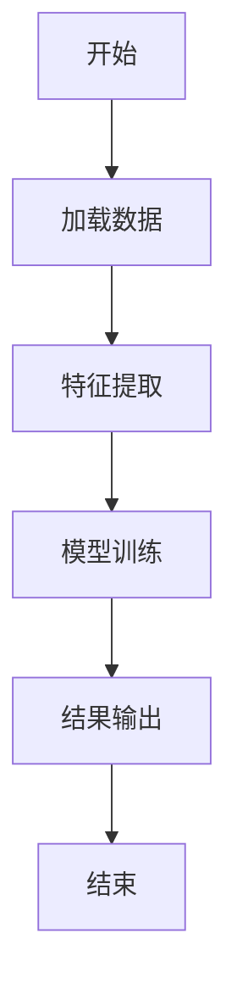
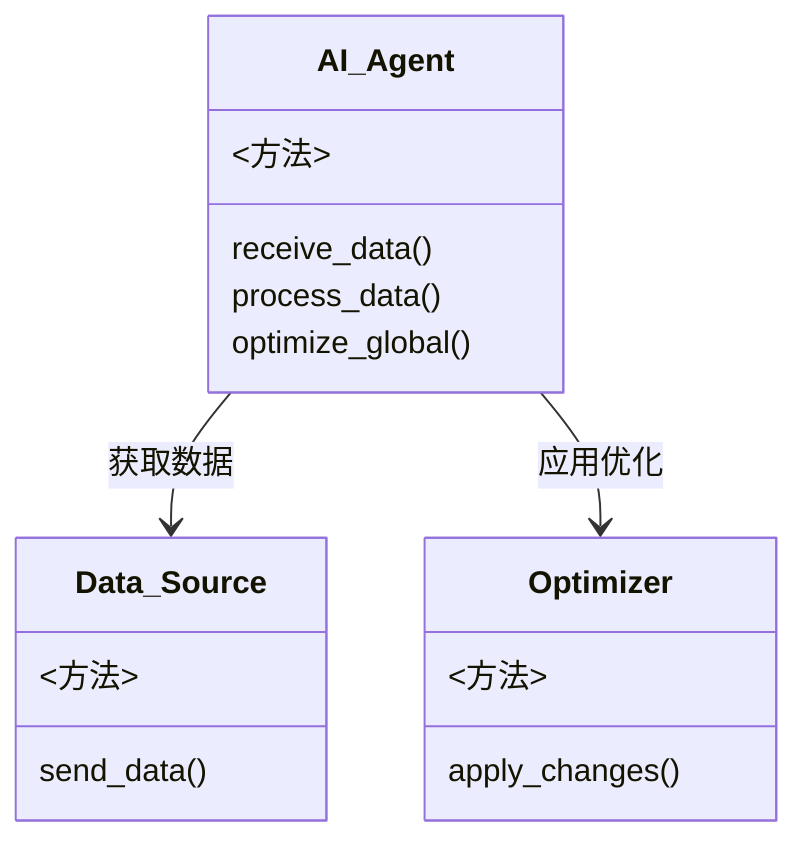
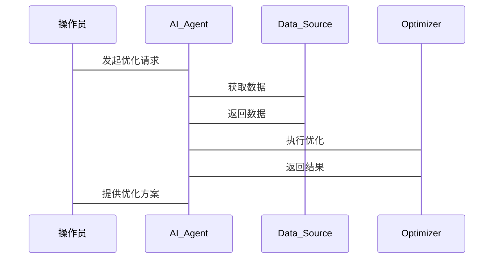

                 


# 《企业AI Agent的跨域学习：打破数据孤岛，实现全局优化》

## 关键词：
企业AI Agent、跨域学习、数据孤岛、全局优化、系统架构、机器学习

## 摘要：
本文深入探讨企业AI Agent如何通过跨域学习打破数据孤岛，实现全局优化。文章从问题背景、核心概念、算法原理、系统架构、项目实战到最佳实践，全面解析AI Agent在企业中的应用，帮助读者理解并掌握跨域学习的核心技术与实际应用。

---

## 第1章：企业AI Agent的背景与挑战

### 1.1 问题背景
- 1.1.1 企业数据孤岛的现状与挑战
- 1.1.2 数据孤岛对企业效率的影响
- 1.1.3 全球化背景下企业数据整合的需求

### 1.2 问题描述
- 1.2.1 数据孤岛的具体表现形式
- 1.2.2 跨域学习的必要性
- 1.2.3 全局优化的目标与意义

### 1.3 问题解决
- 1.3.1 AI Agent的核心作用
- 1.3.2 跨域学习如何打破数据孤岛
- 1.3.3 全局优化的具体实现方式

### 1.4 边界与外延
- 1.4.1 AI Agent的应用边界
- 1.4.2 跨域学习的适用范围
- 1.4.3 全局优化的实现范围

### 1.5 核心要素与概念结构
- 1.5.1 AI Agent的构成要素
- 1.5.2 跨域学习的关键特征
- 1.5.3 全局优化的系统架构

---

## 第2章：AI Agent与跨域学习的核心概念

### 2.1 核心概念原理
- 2.1.1 AI Agent的基本原理
- 2.1.2 跨域学习的定义与特点
- 2.1.3 全局优化的数学模型

### 2.2 概念属性对比表
| 概念 | 属性1 | 属性2 | 属性3 |
|------|-------|-------|-------|
| AI Agent | 智能性 | 自主性 | 适应性 |
| 跨域学习 | 跨界性 | 整合性 | 协调性 |
| 全局优化 | 综合性 | 最优性 | 动态性 |

### 2.3 ER实体关系图
```mermaid
erDiagram
    customer[客户] {
        <属性>
        id : int
        name : string
    }
    order[订单] {
        <属性>
        id : int
        date : date
    }
    product[产品] {
        <属性>
        id : int
        name : string
    }
    customer --> order : 下单
    order --> product : 订单包含产品
```

---

## 第3章：算法原理讲解

### 3.1 跨域学习算法的核心思想
- 跨域学习通过共享多个领域之间的共同特征，提升模型在不同领域的泛化能力

### 3.2 跨域学习的数学模型
$$ \text{损失函数} = \sum_{i=1}^n \text{损失}_i + \lambda \text{正则化项} $$

### 3.3 实现步骤


### 3.4 代码实现
```python
import numpy as np
from sklearn.model_selection import train_test_split

# 加载数据
X = np.array([[1, 2], [3, 4], [5, 6], [7, 8]])
y = np.array([0, 1, 0, 1])

# 划分训练集和测试集
X_train, X_test, y_train, y_test = train_test_split(X, y, test_size=0.2)

# 特征提取
from sklearn.decomposition import PCA
pca = PCA(n_components=2)
X_train_pca = pca.fit_transform(X_train)

# 模型训练
from sklearn.svm import SVC
model = SVC()
model.fit(X_train_pca, y_train)

# 预测与评估
y_pred = model.predict(pca.transform(X_test))
print("准确率:", np.mean(y_pred == y_test))
```

---

## 第4章：系统架构设计

### 4.1 项目场景介绍
- 企业内部多个系统产生的数据需要整合，以实现全局优化

### 4.2 系统功能设计


### 4.3 接口设计与交互流程


---

## 第5章：项目实战

### 5.1 环境安装
- 安装必要的库：`pip install numpy scikit-learn`

### 5.2 核心代码实现
```python
from sklearn.datasets import make_classification
from sklearn.ensemble import RandomForestClassifier
from sklearn.metrics import accuracy_score

# 生成数据
X, y = make_classification(n_samples=100, n_features=20, n_classes=2)

# 训练模型
model = RandomForestClassifier()
model.fit(X, y)

# 预测
y_pred = model.predict(X)

# 评估
print("准确率:", accuracy_score(y, y_pred))
```

### 5.3 案例分析与解读
- 通过具体案例展示AI Agent如何实现跨域学习和全局优化

### 5.4 项目总结
- 总结项目成果，分析可能遇到的问题及解决方案

---

## 第6章：最佳实践与注意事项

### 6.1 最佳实践
- 数据预处理的重要性
- 模型调优的技巧
- 系统架构的优化建议

### 6.2 小结
- 本文的核心内容回顾

### 6.3 注意事项
- 数据隐私与安全
- 模型的可解释性
- 系统的可扩展性

### 6.4 拓展阅读
- 推荐相关书籍和论文

---

## 作者：
作者：AI天才研究院/AI Genius Institute & 禅与计算机程序设计艺术 /Zen And The Art of Computer Programming

