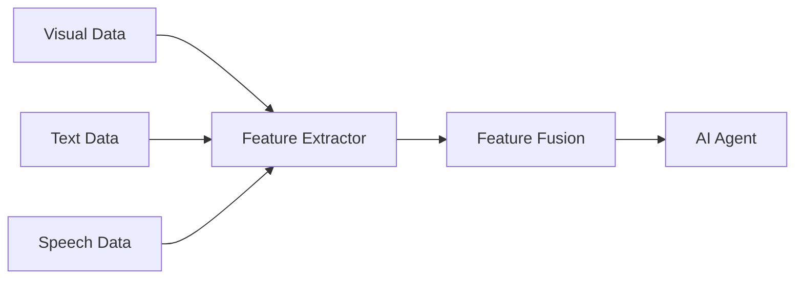
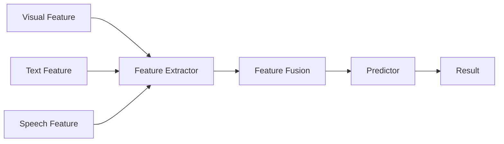
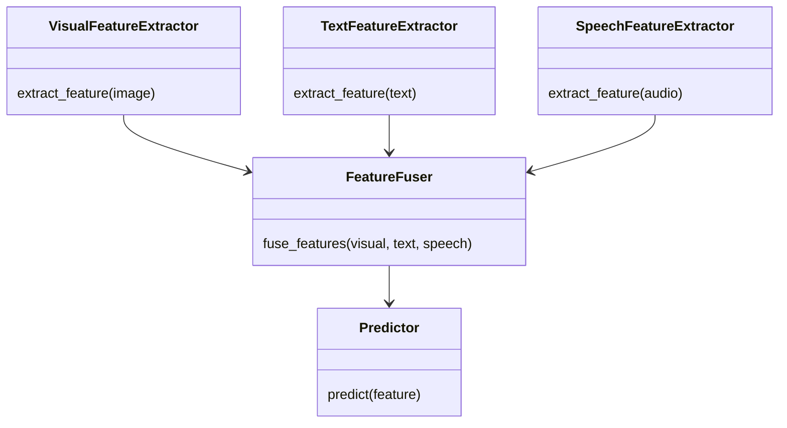
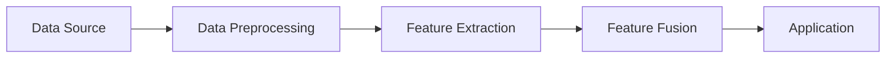
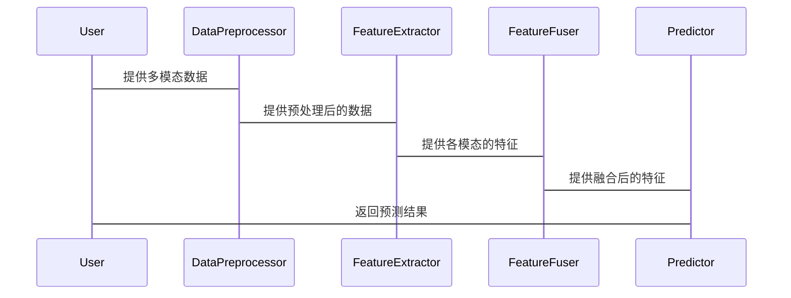

                 


# 《企业AI Agent的跨模态学习：整合视觉、文本与语音数据》

## 关键词：
企业AI Agent，跨模态学习，视觉数据，文本数据，语音数据，多模态融合，对比学习

## 摘要：
本文深入探讨了企业AI Agent在跨模态学习中的应用，重点分析了视觉、文本与语音数据的整合方法。通过详细讲解跨模态学习的核心概念、算法原理、系统架构设计及项目实战，本文为读者提供了从理论到实践的全面指导。文章还包括了丰富的图表和代码示例，帮助读者更好地理解和应用跨模态学习技术。

---

# 第一部分: 背景介绍

## 第1章: AI Agent与跨模态学习概述

### 1.1 AI Agent的基本概念
- **1.1.1 AI Agent的定义与特点**
  - AI Agent是一种智能体，能够感知环境、自主决策并执行任务。
  - 具有自主性、反应性、目标导向性和社会性等特点。
  - 在企业中，AI Agent常用于自动化决策、数据分析和客户交互等场景。

- **1.1.2 AI Agent的核心功能与应用场景**
  - 核心功能包括数据处理、决策优化、任务执行和人机交互。
  - 应用场景涵盖智能客服、智能制造、智能监控和智能推荐等领域。

- **1.1.3 企业级AI Agent的特殊需求**
  - 高可用性：确保在复杂环境中的稳定运行。
  - 多模态处理能力：整合多种数据源以提高决策精度。
  - 高效性：快速处理和分析大量数据以支持实时决策。

### 1.2 跨模态学习的背景与意义
- **1.2.1 跨模态学习的基本概念**
  - 跨模态学习是指在同一学习任务中整合来自不同感知模态（如视觉、文本、语音）的数据。
  - 通过跨模态数据的互补性，提升模型的泛化能力和鲁棒性。

- **1.2.2 跨模态学习在企业AI Agent中的重要性**
  - 跨模态学习能够整合企业中的多源数据，提高AI Agent的决策能力。
  - 在客户交互中，结合文本和语音数据可以提升用户体验。
  - 在数据分析中，整合视觉和文本数据能够提供更全面的洞察。

- **1.2.3 跨模态学习的挑战与机遇**
  - 挑战：数据异构性、模态间语义对齐、计算资源需求高。
  - 机遇：通过跨模态学习，企业能够构建更智能、更高效的AI系统。

### 1.3 企业AI Agent的跨模态应用场景
- **1.3.1 视觉、文本与语音数据的整合**
  - 视觉数据：图像识别、视频分析。
  - 文本数据：自然语言处理、文档分析。
  - 语音数据：语音识别、情感分析。

- **1.3.2 跨模态数据在企业决策中的作用**
  - 提供更全面的数据支持，增强决策的准确性。
  - 通过多模态数据融合，优化业务流程和用户体验。

- **1.3.3 跨模态学习在企业AI Agent中的具体应用案例**
  - 智能客服：结合语音和文本数据，提供更精准的客户支持。
  - 智能监控：整合视觉和文本数据，实现智能安防。

---

## 第2章: 跨模态学习的核心概念与联系

### 2.1 跨模态学习的原理与机制
- **2.1.1 跨模态学习的基本原理**
  - 跨模态学习通过多模态数据的互补性，提升模型的表达能力。
  - 核心思想是通过模态间的关联性，构建统一的语义空间。

- **2.1.2 跨模态数据的特征提取与融合方法**
  - 特征提取：利用深度学习模型（如CNN、RNN）提取各模态的特征。
  - 特征融合：通过加法、拼接、注意力机制等方式融合多模态特征。

- **2.1.3 跨模态学习的数学模型与算法框架**
  - 多模态融合模型：如多模态Transformer。
  - 对比学习框架：通过对比不同模态的特征，学习跨模态的相似性。

### 2.2 跨模态数据的特征对比
- **2.2.1 视觉数据的特征分析**
  - 视觉数据通常具有空间和语义特征。
  - 例如，图像中的物体类别、位置信息。

- **2.2.2 文本数据的特征分析**
  - 文本数据具有语义和语法特征。
  - 例如，词语的词性、句法结构。

- **2.2.3 语音数据的特征分析**
  - 语音数据具有音调、节奏、情感特征。
  - 例如，语音的情感分类、说话人识别。

- **2.2.4 跨模态数据特征对比表**
  | 数据模态 | 特征类型 | 示例 |
  |----------|----------|------|
  | 视觉     | 空间     | 物体位置 |
  | 文本     | 语义     | 词语含义 |
  | 语音     | 情感     | 情感分类 |

### 2.3 跨模态学习的实体关系图
- **2.3.1 实体关系图的构建**
  - 使用Mermaid工具绘制实体关系图，展示各模态之间的关联。
  - 例如，视觉数据中的物体与文本描述的关系。

- **2.3.2 实体关系图的分析**
  - 通过图分析，理解各模态之间的语义关联。
  - 例如，同一物体在不同模态中的表示方式。

- **2.3.3 实体关系图在企業AI Agent中的应用**
  - 帮助AI Agent理解多模态数据的语义关联。
  - 提供跨模态数据融合的参考框架。



---

## 第3章: 跨模态数据的融合方法

### 3.1 跨模态数据的预处理
- **3.1.1 数据清洗与标准化**
  - 去除噪声数据，确保数据质量。
  - 标准化处理，如归一化。

- **3.1.2 数据增强与特征提取**
  - 使用数据增强技术（如旋转、裁剪）提高数据多样性。
  - 提取各模态的特征向量。

- **3.1.3 跨模态数据的对齐与预处理**
  - 通过模态间的对齐，消除数据异构性。
  - 例如，将视觉数据和文本描述对齐到同一时间轴。

### 3.2 多模态数据融合方法
- **3.2.1 晚期融合（Late Fusion）**
  - 分别处理各模态数据，最后进行融合。
  - 优点：处理简单，易于实现。
  - 缺点：可能忽略模态间的语义关联。

- **3.2.2 早期融合（Early Fusion）**
  - 在特征提取阶段进行多模态融合。
  - 优点：能够捕捉模态间的互补信息。
  - 缺点：计算复杂度较高。

- **3.2.3 融合策略对比**
  | 策略     | 优缺点 |
  |----------|--------|
  | 晚期融合 | 简单，但可能忽略语义关联 |
  | 早期融合 | 复杂，但能够捕捉互补信息 |

### 3.3 跨模态融合的算法流程
- **3.3.1 多模态数据的特征提取**
  - 使用CNN提取视觉特征。
  - 使用BERT提取文本特征。
  - 使用Mel-Frequency Cepstral Coefficients (MFCC)提取语音特征。

- **3.3.2 跨模态特征的融合与对齐**
  - 使用注意力机制对齐不同模态的特征。
  - 例如，视觉特征与文本描述的对齐。

- **3.3.3 融合后的分类与预测**
  - 使用多模态融合后的特征进行分类或预测。
  - 例如，通过多模态Transformer进行文本分类。



### 3.4 跨模态数据融合的Python代码实现
```python
import numpy as np
import tensorflow as tf

# 假设我们有视觉、文本和语音特征向量
visual_feature = np.random.randn(100, 128)
text_feature = np.random.randn(100, 128)
speech_feature = np.random.randn(100, 128)

# 使用晚期融合方法
merged_feature = tf.keras.layers.Concatenate()([visual_feature, text_feature, speech_feature])

# 构建融合模型
model = tf.keras.Sequential()
model.add(tf.keras.layers.Dense(64, activation='relu')(merged_feature))
model.add(tf.keras.layers.Dense(10, activation='softmax'))
model.compile(optimizer='adam', loss='sparse_categorical_crossentropy', metrics=['accuracy'])

# 训练模型
model.fit(merged_feature, labels, epochs=10, batch_size=32)
```

---

## 第4章: 系统分析与架构设计

### 4.1 问题场景介绍
- 企业AI Agent需要整合多模态数据，实现智能决策。
- 需要考虑数据异构性、计算效率和模型可解释性等问题。

### 4.2 系统功能设计
- **领域模型设计**：
  - 使用Mermaid类图展示系统功能模块。
  - 包括数据预处理模块、特征提取模块、融合模块和预测模块。



- **系统架构设计**：
  - 使用Mermaid架构图展示系统架构。
  - 包括数据源、数据预处理层、特征提取层、融合层和应用层。



### 4.3 系统接口设计
- 数据预处理接口：负责数据清洗和标准化。
- 特征提取接口：分别提取各模态的特征。
- 融合接口：将各模态特征融合并进行预测。

### 4.4 系统交互流程
- 使用Mermaid序列图展示系统交互流程。
  - 用户请求处理流程：
    1. 用户输入多模态数据。
    2. 数据预处理模块进行数据清洗。
    3. 各特征提取模块提取特征。
    4. 融合模块进行特征融合。
    5. 预测模块输出结果。



---

## 第5章: 项目实战

### 5.1 环境安装
- 安装必要的库：
  - Python 3.8+
  - TensorFlow 2.5+
  - Keras 2.4+
  - Mermaid CLI工具

### 5.2 核心代码实现
- **数据预处理代码**：
```python
import pandas as pd
from sklearn.preprocessing import StandardScaler

# 加载数据
data = pd.read_csv('multimodal_data.csv')

# 数据清洗
data = data.dropna()

# 标准化处理
scaler = StandardScaler()
data_normalized = scaler.fit_transform(data)
```

- **特征提取代码**：
```python
import tensorflow as tf
from tensorflow.keras.layers import Input, Dense, Concatenate
from tensorflow.keras.models import Model

# 视觉特征输入
visual_input = Input(shape=(128,))
# 文本特征输入
text_input = Input(shape=(128,))
# 语音特征输入
speech_input = Input(shape=(128,))

# 特征融合
merged = Concatenate()([visual_input, text_input, speech_input])
dense = Dense(64, activation='relu')(merged)
output = Dense(10, activation='softmax')(dense)

# 定义模型
model = Model(inputs=[visual_input, text_input, speech_input], outputs=output)
model.compile(optimizer='adam', loss='sparse_categorical_crossentropy', metrics=['accuracy'])
```

- **模型训练代码**：
```python
# 准备训练数据
visual_features = np.random.randn(100, 128)
text_features = np.random.randn(100, 128)
speech_features = np.random.randn(100, 128)
labels = np.random.randint(0, 10, 100)

# 训练模型
model.fit([visual_features, text_features, speech_features], labels, epochs=10, batch_size=32)
```

### 5.3 案例分析与项目总结
- **案例分析**：
  - 使用实际企业数据，展示跨模态学习在客户交互中的应用。
  - 例如，结合客户的视觉、文本和语音数据，实现精准的客户意图识别。

- **项目总结**：
  - 项目实现了企业AI Agent的跨模态学习功能。
  - 提供了从数据预处理到模型训练的完整流程。

---

## 第6章: 最佳实践与小结

### 6.1 最佳实践
- 数据预处理阶段，确保数据质量。
- 在特征提取阶段，选择合适的深度学习模型。
- 在融合阶段，根据具体场景选择合适的融合策略。
- 在模型训练阶段，合理设置超参数。

### 6.2 注意事项
- 注意数据异构性，确保各模态数据的对齐。
- 选择合适的计算资源，避免计算瓶颈。
- 定期监控模型性能，及时优化模型。

### 6.3 拓展阅读
- 阅读相关论文，如“Contrastive Learning of Visual and Textual Modalities”。
- 关注最新的跨模态学习技术，如多模态Transformer。

---

## 第7章: 小结

本文系统地介绍了企业AI Agent在跨模态学习中的应用，详细讲解了视觉、文本和语音数据的整合方法。通过理论分析和实践案例，读者可以掌握跨模态学习的核心概念和实现方法。未来，随着多模态数据的不断丰富和技术的进步，跨模态学习将在企业AI Agent中发挥更大的作用。

---

## 作者：AI天才研究院/AI Genius Institute & 禅与计算机程序设计艺术 /Zen And The Art of Computer Programming

