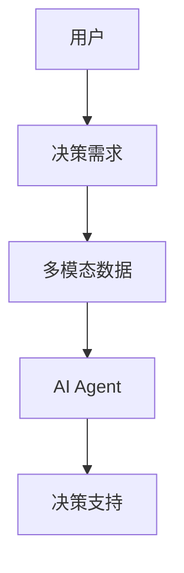
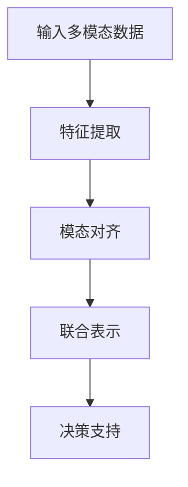
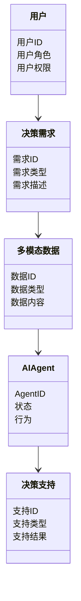
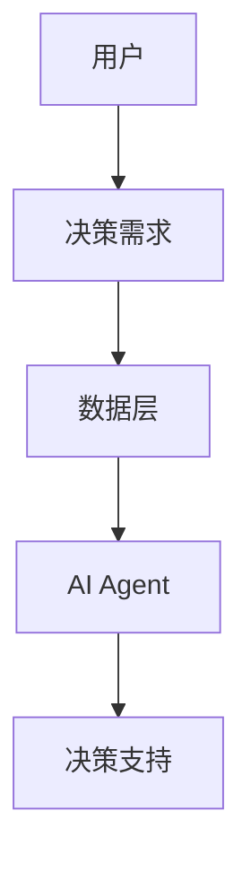

                 


# 企业AI Agent的跨模态学习：融合非结构化数据的决策支持

## 目录大纲

### 第一部分：企业AI Agent的背景与跨模态学习概述

#### 第1章：企业AI Agent的背景与概念

##### 1.1 问题背景
- 1.1.1 企业决策中的数据挑战
- 1.1.2 非结构化数据的处理难点
- 1.1.3 AI Agent在企业决策中的作用

##### 1.2 问题描述
- 1.2.1 非结构化数据的多样性和复杂性
- 1.2.2 传统决策支持系统的局限性
- 1.2.3 跨模态学习的需求与目标

##### 1.3 问题解决
- 1.3.1 跨模态学习的解决方案
- 1.3.2 AI Agent在跨模态学习中的角色
- 1.3.3 企业级应用的实现路径

##### 1.4 边界与外延
- 1.4.1 跨模态学习的边界
- 1.4.2 AI Agent的应用范围
- 1.4.3 与其他技术的区分与联系

##### 1.5 概念结构与核心要素
- 1.5.1 跨模态学习的核心要素
- 1.5.2 AI Agent的构成部分
- 1.5.3 企业决策支持的系统架构

### 第二部分：跨模态学习的核心概念与联系

#### 第2章：跨模态学习的原理与方法

##### 2.1 跨模态学习的原理
- 2.1.1 多模态数据的融合机制
- 2.1.2 跨模态编码器的原理
- 2.1.3 注意力机制在跨模态学习中的应用

##### 2.2 跨模态学习的属性特征对比
- 2.2.1 各种模态数据的特征分析
- 2.2.2 不同模态数据的处理方式对比
- 2.2.3 跨模态学习的性能指标

##### 2.3 跨模态学习的ER实体关系图


### 第三部分：跨模态学习的算法原理

#### 第3章：跨模态学习的算法实现

##### 3.1 跨模态学习的算法流程


##### 3.2 跨模态编码器
- 3.2.1 多模态编码器的结构
- 3.2.2 模态对齐方法
- 3.2.3 联合表示的生成

##### 3.3 注意力机制
- 3.3.1 自注意力机制
- 3.3.2 跨模态注意力机制
- 3.3.3 注意力权重的计算与应用

##### 3.4 跨模态学习的数学模型
- 3.4.1 损失函数
  $$ L = \alpha L_{\text{recon}} + \beta L_{\text{class}} $$
- 3.4.2 优化目标
  $$ \min_{\theta} L $$

### 第四部分：系统分析与架构设计

#### 第4章：系统分析与架构设计

##### 4.1 项目背景
- 4.1.1 项目目标
- 4.1.2 项目范围
- 4.1.3 项目关键成功因素

##### 4.2 系统功能设计
- 4.2.1 领域模型设计


##### 4.3 系统架构设计


### 第五部分：项目实战

#### 第5章：项目实战

##### 5.1 环境安装
- 5.1.1 安装Python
- 5.1.2 安装必要的库（如TensorFlow, Keras等）
- 5.1.3 安装Mermaid工具

##### 5.2 核心代码实现
```python
import tensorflow as tf
from tensorflow.keras import layers

class MultiModalEncoder:
    def __init__(self, input_dims):
        self.modals = []
        for dim in input_dims:
            encoder = layers.Dense(64, activation='relu')
            self.modals.append(encoder)
    
    def call(self, inputs):
        encoded = []
        for i, input in enumerate(inputs):
            encoded.append(self.modals[i](input))
        return encoded

class Attention(tf.keras.layers.Layer):
    def __init__(self, units=64):
        super(Attention, self).__init__()
        self.W = tf.keras.layers.Dense(units, activation='tanh')
        self.V = tf.keras.layers.Dense(1)
    
    def call(self, inputs):
        attention = self.V(self.W(inputs)) 
        attention = tf.nn.softmax(attention, axis=1)
        return attention

# 使用示例
encoder = MultiModalEncoder([128, 256])
attention = Attention()
```

##### 5.3 案例分析
- 5.3.1 数据预处理
- 5.3.2 模型训练
- 5.3.3 模型评估

##### 5.4 项目小结
- 5.4.1 项目成果
- 5.4.2 经验总结
- 5.4.3 改进建议

### 第六部分：最佳实践与总结

#### 第6章：最佳实践与总结

##### 6.1 最佳实践
- 6.1.1 数据预处理的注意事项
- 6.1.2 模型选择的建议
- 6.1.3 系统优化的技巧

##### 6.2 小结
- 6.2.1 企业AI Agent的重要性
- 6.2.2 跨模态学习的前景
- 6.2.3 技术发展的趋势

##### 6.3 注意事项
- 6.3.1 数据隐私保护
- 6.3.2 系统稳定性的维护
- 6.3.3 模型的可解释性

##### 6.4 拓展阅读
- 6.4.1 推荐的相关书籍
- 6.4.2 建议的研究方向
- 6.4.3 参考资料来源

### 作者：AI天才研究院/AI Genius Institute & 禅与计算机程序设计艺术 /Zen And The Art of Computer Programming

