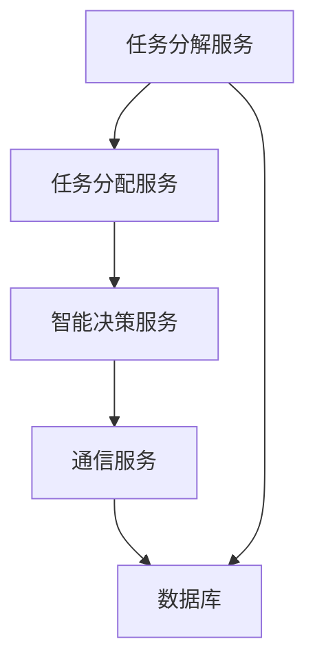
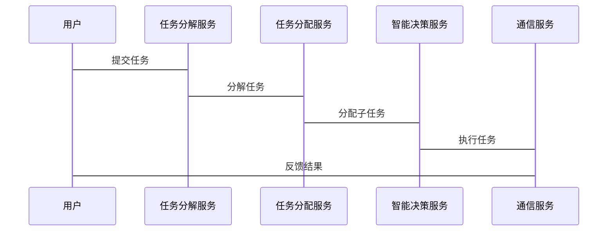

                 


# 《企业AI Agent的跨部门协作功能设计与实现》

## 关键词：AI Agent，跨部门协作，企业智能化，任务分解，智能决策，通信协议

## 摘要：  
本文深入探讨了企业AI Agent的跨部门协作功能设计与实现。首先介绍了AI Agent的基本概念、核心特点及其在企业协作中的重要作用。接着从任务分解、智能决策和通信协议三个方面详细阐述了AI Agent的核心算法原理，并通过数学模型和流程图进行了直观展示。随后，基于企业协作场景，设计了一个完整的AI Agent系统架构，并通过实际案例分析了系统实现的过程与效果。最后，总结了AI Agent在企业协作中的最佳实践和未来发展趋势，为企业的智能化转型提供了理论和实践指导。

---

## 第一部分: 企业AI Agent的背景与概念

### 第1章: AI Agent的基本概念与背景

#### 1.1 AI Agent的定义与特点

**1.1.1 AI Agent的定义**  
AI Agent（人工智能代理）是指能够感知环境、自主决策并执行任务的智能体。它能够根据输入的信息（如数据、用户指令或上下文）采取相应行动，以实现特定目标。

**1.1.2 AI Agent的核心特点**  
AI Agent具有以下核心特点：  
1. **自主性**：能够在没有外部干预的情况下自主决策。  
2. **反应性**：能够实时感知环境并做出快速反应。  
3. **智能性**：通过学习和推理能力，能够解决复杂问题。  
4. **协作性**：能够与其他AI Agent或系统协同工作，完成跨部门任务。  

**1.1.3 AI Agent与传统软件的区别**  
与传统软件相比，AI Agent具有以下区别：  
- **智能性**：AI Agent具备学习和推理能力，能够处理复杂问题。  
- **自主性**：AI Agent能够自主决策，而传统软件通常需要人工干预。  
- **适应性**：AI Agent能够根据环境变化自适应调整行为。  

#### 1.2 企业协作中的问题与挑战

**1.2.1 企业协作的主要问题**  
企业在跨部门协作中通常面临以下问题：  
1. **信息孤岛**：各部门之间数据分散，难以共享和整合。  
2. **沟通不畅**：部门间沟通效率低下，导致任务延误。  
3. **协同困难**：缺乏统一的协作机制，难以高效完成跨部门任务。  

**1.2.2 跨部门协作的复杂性**  
跨部门协作的复杂性主要体现在以下方面：  
- **职责划分**：各部门职责不明确，导致任务推诿。  
- **流程不畅**：跨部门协作流程复杂，容易出现瓶颈。  
- **信任问题**：部门间缺乏信任，导致协作阻力。  

**1.2.3 AI Agent在企业协作中的作用**  
AI Agent能够通过以下方式解决企业协作问题：  
1. **信息共享**：AI Agent可以整合各部门数据，消除信息孤岛。  
2. **自动化协作**：AI Agent能够自动协调各部门任务，提高协作效率。  
3. **智能决策**：AI Agent能够基于数据和规则，做出最优决策。  

#### 1.3 AI Agent的背景与发展趋势

**1.3.1 AI技术的发展现状**  
近年来，AI技术取得了飞速发展，尤其是在自然语言处理、计算机视觉和机器学习领域。这些技术的进步为AI Agent的实现提供了坚实基础。

**1.3.2 企业智能化转型的背景**  
随着数字化转型的深入推进，企业对智能化协作的需求日益增长。AI Agent作为智能化协作的核心技术，正在成为企业转型的关键驱动力。

**1.3.3 AI Agent的未来发展趋势**  
AI Agent的未来发展趋势包括：  
1. **智能化**：通过强化学习和深度学习，提升AI Agent的智能水平。  
2. **人机协作**：AI Agent与人类协同工作的能力将不断增强。  
3. **多模态交互**：支持语音、文本、图像等多种交互方式。  

---

## 第二部分: AI Agent的核心概念与原理

### 第2章: AI Agent的核心概念与联系

#### 2.1 AI Agent的核心概念

**2.1.1 任务分解与分配**  
任务分解是AI Agent协作的基础，即将复杂任务分解为多个子任务，并分配给不同的AI Agent或系统组件。  
- **任务分解方法**：基于任务优先级、依赖关系和资源约束进行分解。  
- **任务分配策略**：根据AI Agent的能力和负载进行动态分配。  

**2.1.2 智能决策与执行**  
智能决策是AI Agent的核心功能，通过分析环境信息和上下文，做出最优决策并执行任务。  
- **决策模型**：基于规则、逻辑推理或概率模型进行决策。  
- **执行机制**：通过API或消息队列与其他系统或AI Agent通信，执行具体操作。  

**2.1.3 通信与协作协议**  
通信与协作协议是AI Agent跨部门协作的关键，确保各组件之间的高效通信和协同工作。  
- **通信协议**：如RESTful API、WebSocket等，用于实时通信。  
- **协作协议**：如分布式一致性协议（如RAFT）、任务协同协议（如Choreography）。  

#### 2.2 AI Agent的核心算法原理

**2.2.1 任务分解算法**  
任务分解算法用于将复杂任务分解为多个子任务。常见的任务分解算法包括：  
- **基于规则的分解**：根据预定义规则将任务分解。  
- **基于图论的分解**：将任务建模为图结构，通过图分解方法进行划分。  

**2.2.2 智能决策算法**  
智能决策算法基于环境信息和上下文，做出最优决策。常见的算法包括：  
- **基于规则的决策**：根据预定义规则进行决策。  
- **基于概率的决策**：如贝叶斯网络，用于不确定性环境下的决策。  
- **强化学习决策**：通过奖励机制优化决策策略。  

**2.2.3 通信协议实现**  
通信协议的实现确保AI Agent之间能够高效协作。常见的通信协议包括：  
- **点对点通信**：如WebSocket，适用于实时通信。  
- **消息队列**：如Kafka、RabbitMQ，适用于异步通信。  
- **分布式服务发现**：如RAFT、Etcd，用于服务发现和负载均衡。  

---

## 第三部分: AI Agent的系统设计与实现

### 第3章: 系统分析与架构设计

#### 3.1 问题场景介绍

**3.1.1 背景**  
假设某企业需要实现跨部门协作的AI Agent系统，涉及研发、市场、客服等多个部门。

**3.1.2 问题描述**  
企业希望AI Agent能够自动分配任务、协调各部门协作，并实时反馈任务进度。

#### 3.2 系统功能设计

**3.2.1 领域模型设计**  
领域模型基于以下核心实体：  
- **任务实体**：包括任务ID、任务描述、优先级、完成状态等属性。  
- **部门实体**：包括部门ID、部门名称、负责人等属性。  
- **通信实体**：包括消息ID、发送方、接收方、消息内容等属性。  

**3.2.2 系统架构设计**  
系统架构采用分层设计，包括：  
- **数据层**：负责数据存储和管理。  
- **服务层**：负责任务分解、决策和通信。  
- **表现层**：负责用户交互和任务展示。  

**3.2.3 系统架构图**  
以下是系统架构的Mermaid图：  


#### 3.3 接口设计与交互流程

**3.3.1 系统接口设计**  
- **任务分解接口**：`POST /api/task/decompose`  
- **任务分配接口**：`POST /api/task/assign`  
- **智能决策接口**：`POST /api/task/decide`  
- **通信接口**：`POST /api/communication/send`  

**3.3.2 交互流程图**  
以下是交互流程的Mermaid图：  


---

## 第四部分: 项目实战与案例分析

### 第4章: 项目实战

#### 4.1 环境安装与配置

**4.1.1 安装Python环境**  
- 安装Python 3.8及以上版本。  
- 安装必要的Python库：`numpy`, `pandas`, `scikit-learn`, `flask`。

**4.1.2 安装依赖库**  
```bash
pip install numpy pandas scikit-learn flask
```

#### 4.2 系统核心代码实现

**4.2.1 任务分解模块**  
```python
import numpy as np

def decompose_task(tasks):
    # 任务分解逻辑
    task_matrix = np.array(tasks)
    # 使用图论方法分解任务
    subtasks = np.split(task_matrix, np.where(task_matrix[:, 1] == 'boundary')[0])
    return subtasks
```

**4.2.2 智能决策模块**  
```python
from sklearn.naive_bayes import GaussianNB

def make_prediction(X, y):
    # 使用贝叶斯算法进行预测
    model = GaussianNB()
    model.fit(X, y)
    return model.predict(X)
```

**4.2.3 通信模块**  
```python
from flask import Flask, request, jsonify

app = Flask(__name__)

@app.route('/api/communication/send', methods=['POST'])
def send_message():
    data = request.json
    # 处理消息并返回结果
    return jsonify({'status': 'success', 'message': 'Message processed'})

if __name__ == '__main__':
    app.run(debug=True)
```

#### 4.3 案例分析与实现

**4.3.1 案例分析**  
假设企业需要完成一个跨部门协作的任务：从市场部门获取客户数据，分析并生成销售报告。AI Agent需要协调市场、数据分析和销售部门完成任务。

**4.3.2 代码实现与分析**  
1. **任务分解**：将整个任务分解为数据收集、数据分析和报告生成三个子任务。  
2. **任务分配**：根据各部门的能力，将子任务分配给对应的AI Agent。  
3. **智能决策**：基于数据分析结果，生成最优销售策略。  
4. **通信与反馈**：AI Agent通过通信模块实时反馈任务进度和结果。  

---

## 第五部分: 总结与展望

### 第5章: 总结与展望

#### 5.1 最佳实践与注意事项

**5.1.1 设计原则**  
1. **模块化设计**：确保系统模块化，便于扩展和维护。  
2. **容错设计**：设计容错机制，确保系统健壮性。  
3. **性能优化**：通过缓存、并行计算等技术优化系统性能。  

**5.1.2 实施注意事项**  
1. **数据安全**：确保数据在传输和存储过程中的安全性。  
2. **权限管理**：根据角色分配权限，确保系统安全性。  
3. **日志记录**：记录系统运行日志，便于故障排查。  

#### 5.2 未来展望与发展趋势

**5.2.1 未来趋势**  
1. **智能化增强**：通过强化学习和深度学习，进一步提升AI Agent的智能水平。  
2. **多模态交互**：支持更多交互方式，如语音、图像等，提升用户体验。  
3. **边缘计算**：结合边缘计算技术，提升AI Agent的实时性和响应速度。  

**5.2.2 结语**  
AI Agent作为企业智能化协作的核心技术，正在深刻改变企业的协作方式。随着技术的不断进步，AI Agent将在企业中发挥越来越重要的作用，帮助企业实现更高效、更智能的协作。

---

## 作者：AI天才研究院/AI Genius Institute & 禅与计算机程序设计艺术 /Zen And The Art of Computer Programming

