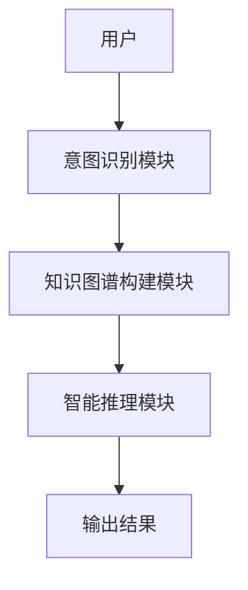

                 


# 《企业AI Agent的跨部门协作功能：打破信息孤岛》

---

## 关键词：企业AI Agent，跨部门协作，信息孤岛，知识图谱，自然语言处理，机器学习

---

## 摘要：

企业AI Agent通过跨部门协作功能，打破了传统企业中信息孤岛的桎梏。本文从AI Agent的核心概念、算法原理、系统架构到项目实战，全面解析其如何通过智能化协作机制实现企业内部信息的高效流通，提升企业协作效率。文章详细探讨了AI Agent在自然语言处理、机器学习等技术上的应用，并结合实际案例，展示了如何在企业中落地AI Agent的跨部门协作功能。

---

## 第1章: 企业AI Agent的背景与意义

### 1.1 信息孤岛的定义与表现

信息孤岛是指企业内部数据分散在不同的部门或系统中，缺乏有效的信息共享机制，导致信息无法有效流通和利用。以下是信息孤岛的具体表现：

- **数据分散**：各部门使用不同的系统，数据无法统一整合。
- **沟通不畅**：部门间缺乏有效的沟通渠道，信息传递滞后。
- **决策延迟**：由于信息不全，决策过程缓慢，影响企业效率。

信息孤岛不仅浪费资源，还可能导致决策失误，严重影响企业竞争力。

### 1.2 跨部门协作的重要性

跨部门协作是指不同部门之间协同工作，共同完成任务。其重要性体现在：

- **提升效率**：通过协作，减少重复劳动，提高整体效率。
- **优化决策**：整合各部门信息，做出更明智的决策。
- **促进创新**：跨部门协作能够激发新的想法和解决方案。

### 1.3 AI Agent的定义与特点

AI Agent是一种能够理解、推理和执行任务的智能系统，具有以下特点：

- **智能性**：能够自主学习和适应新环境。
- **协作性**：能够与其他系统或人进行有效协作。
- **实时性**：能够实时处理信息并做出响应。

### 1.4 企业AI Agent的目标与价值

AI Agent的目标是通过智能化手段，打破信息孤岛，实现跨部门协作。其价值体现在：

- **提升协作效率**：通过自动化处理，减少人为错误。
- **增强决策能力**：基于数据和知识图谱，提供更准确的决策支持。
- **降低成本**：通过自动化流程，减少人力投入。

---

## 第2章: 企业AI Agent的核心概念与原理

### 2.1 AI Agent的核心概念

AI Agent的核心概念包括：

- **知识表示**：通过知识图谱表示企业中的信息和关系。
- **意图识别**：通过自然语言处理技术识别用户的意图。
- **智能推理**：基于知识图谱进行推理，提供解决方案。

### 2.2 协作机制

AI Agent的协作机制基于知识图谱，通过以下步骤实现：

1. **信息抽取**：从各部门获取数据。
2. **知识建模**：构建企业知识图谱。
3. **意图识别**：理解用户的请求。
4. **智能推理**：基于知识图谱提供解决方案。

### 2.3 智能决策能力

AI Agent的智能决策能力依赖于机器学习算法，包括：

- **监督学习**：基于标注数据进行训练。
- **无监督学习**：从无标签数据中发现模式。
- **强化学习**：通过奖励机制优化决策。

---

## 第3章: AI Agent的算法原理与实现

### 3.1 自然语言处理（NLP）在AI Agent中的应用

NLP在AI Agent中的应用包括意图识别和信息抽取：

1. **意图识别**：使用词袋模型或TF-IDF算法识别用户意图。
2. **信息抽取**：通过实体识别技术提取关键信息。

示例代码：
```python
from sklearn.feature_extraction.text import TfidfVectorizer

vectorizer = TfidfVectorizer()
tfidf = vectorizer.fit_transform(text)
```

2. **机器学习模型**：使用支持向量机（SVM）或随机森林进行分类。

### 3.2 基于机器学习的决策算法

机器学习算法用于智能决策，包括：

1. **监督学习**：训练分类器进行预测。
2. **无监督学习**：发现数据中的潜在模式。

示例代码：
```python
from sklearn.svm import SVC

model = SVC()
model.fit(X_train, y_train)
```

3. **知识图谱构建**：通过实体识别和关系抽取构建知识图谱。

---

## 第4章: 系统架构设计

### 4.1 系统功能模块

AI Agent系统功能模块包括：

- **数据采集模块**：从各部门采集数据。
- **知识图谱构建模块**：构建企业知识图谱。
- **意图识别模块**：识别用户意图。
- **智能推理模块**：基于知识图谱提供解决方案。

### 4.2 系统架构图

使用mermaid绘制系统架构图：



### 4.3 接口设计与交互流程

接口设计包括：

- **API接口**：提供RESTful API供各部门调用。
- **交互流程**：用户请求，系统处理，返回结果。

---

## 第5章: 项目实战

### 5.1 环境安装

安装必要的库：

```bash
pip install numpy pandas scikit-learn spacy
```

### 5.2 核心代码实现

实现意图识别和知识图谱构建的代码：

```python
import spacy

nlp = spacy.load("en_core_web_sm")
doc = nlp("Increase sales in Q3")
```

### 5.3 案例分析

分析一个具体案例，展示AI Agent如何打破信息孤岛。

---

## 第6章: 总结与展望

### 6.1 总结

AI Agent通过智能化协作机制，打破了信息孤岛，提升了企业协作效率。

### 6.2 未来展望

未来，AI Agent将更加智能化，实现更复杂的协作任务。

---

## 作者：AI天才研究院/AI Genius Institute & 禅与计算机程序设计艺术 /Zen And The Art of Computer Programming

