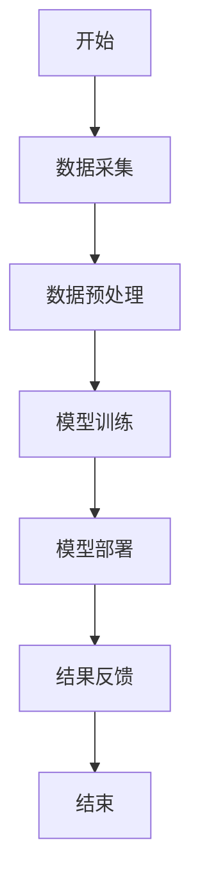
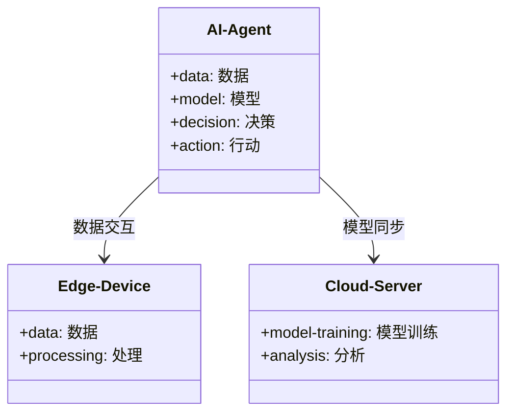
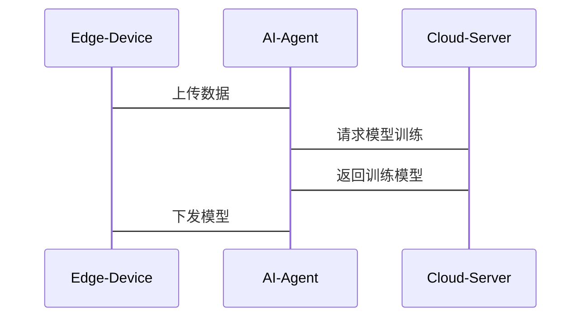

                 


# 企业AI Agent的边缘智能与云智能协同策略

> 关键词：AI Agent, 边缘智能, 云智能, 协同策略, 企业智能化

> 摘要：本文系统性地探讨了企业AI Agent在边缘智能与云智能协同中的策略与实现路径。通过分析AI Agent的核心概念、算法原理、系统架构及项目实战，提出了边缘与云智能协同的创新性解决方案，并给出了实际应用案例和总结。

---

## 第一部分：企业AI Agent的背景与应用价值

### 第1章：企业AI Agent的背景与应用价值

#### 1.1 问题背景与挑战

##### 1.1.1 企业智能化转型的需求
随着人工智能技术的快速发展，企业正在加速智能化转型。AI Agent作为企业智能化的核心技术之一，能够帮助企业实现自动化决策、智能交互和高效执行。然而，AI Agent的实现需要结合边缘计算和云计算的优势，以应对实时性、数据隐私和计算资源分配等挑战。

##### 1.1.2 边缘计算与云计算的兴起
边缘计算将计算能力从云端扩展到数据产生的边缘，能够减少延迟、提高数据处理效率。云计算则提供了强大的计算资源和数据存储能力。两者的结合为企业AI Agent的协同提供了技术基础。

##### 1.1.3 AI Agent在企业中的应用痛点
企业在应用AI Agent时面临以下痛点：
- 数据孤岛：边缘设备和云端数据难以有效协同。
- 计算资源分配：如何在边缘和云端之间动态分配计算资源。
- 数据隐私与安全：边缘数据的处理需要确保数据的安全性。

#### 1.2 问题描述与目标

##### 1.2.1 AI Agent的核心功能与特性
AI Agent具有以下核心功能：
- 数据采集与处理
- 智能决策
- 任务执行
- 自适应优化

其特性包括实时性、分布式计算、隐私保护和动态适应性。

##### 1.2.2 边缘智能与云智能协同的目标
边缘智能与云智能协同的目标是实现数据的高效处理、计算资源的优化利用和系统的高可用性。通过协同，AI Agent能够快速响应边缘数据，同时利用云端的海量计算资源进行深度分析。

##### 1.2.3 企业级AI Agent的边界与外延
企业级AI Agent的边界包括：
- 数据范围：边缘设备产生的数据。
- 计算范围：边缘计算和云计算的结合。
- 服务范围：企业内部业务流程的优化。

外延则包括与第三方服务的集成，如第三方API和外部数据源。

#### 1.3 问题解决与价值创造

##### 1.3.1 AI Agent如何实现边缘与云的协同
AI Agent通过以下方式实现边缘与云的协同：
- 数据同步：边缘设备将数据上传到云端，云端进行全局分析。
- 计算协同：边缘设备处理实时数据，云端处理复杂任务。
- 模型共享：边缘设备使用云端训练的模型进行本地推理。

##### 1.3.2 边缘智能与云智能协同的优势
- 提高实时性：边缘设备快速处理本地数据。
- 节省带宽：通过边缘处理减少数据传输量。
- 增强隐私保护：敏感数据在边缘处理，减少云端传输。

##### 1.3.3 企业智能化转型中的价值体现
AI Agent的协同应用能够提升企业的运营效率、降低成本、提高客户满意度，并增强企业的竞争力。

---

## 第二部分：AI Agent的核心概念与理论基础

### 第2章：AI Agent的核心概念与理论基础

#### 2.1 AI Agent的基本原理

##### 2.1.1 AI Agent的定义与分类
AI Agent是一种能够感知环境、自主决策并执行任务的智能体。根据应用场景的不同，可以分为服务型AI Agent、决策型AI Agent和学习型AI Agent。

##### 2.1.2 AI Agent的核心要素与组成
AI Agent的核心要素包括：
- 感知模块：感知环境数据。
- 决策模块：基于数据做出决策。
- 执行模块：执行决策任务。
- 学习模块：优化决策模型。

##### 2.1.3 AI Agent的决策机制与执行流程
AI Agent的决策机制基于概率论和强化学习，执行流程包括数据采集、模型训练、决策推理和任务执行。

#### 2.2 边缘智能与云智能的概念对比

##### 2.2.1 边缘智能的定义与特点
边缘智能是指在边缘设备上进行数据处理和决策的能力，具有低延迟、高实时性和分布式特点。

##### 2.2.2 云智能的定义与特点
云智能是指利用云端的计算资源进行数据处理和分析，具有高计算能力、可扩展性和大数据处理能力。

##### 2.2.3 边缘与云智能的对比分析
| 特性 | 边缘智能 | 云智能 |
|------|----------|--------|
| 计算能力 | 有限 | 强大 |
| 延迟 | 低 | 高 |
| 数据存储 | 边缘设备 | 云端 |

#### 2.3 边缘智能与云智能的协同机制

##### 2.3.1 协同的基本原理
边缘智能和云智能协同的基本原理是通过数据同步、模型共享和任务分配实现高效协作。

##### 2.3.2 协同的主要模式
- 数据驱动模式：边缘设备将数据上传到云端，云端进行分析。
- 模型驱动模式：边缘设备使用云端训练的模型进行推理。

##### 2.3.3 协同的关键技术与挑战
关键技术包括边缘计算、云计算、联邦学习和边缘计算安全。挑战包括数据隐私、计算资源分配和网络延迟。

---

## 第三部分：AI Agent的算法原理与数学模型

### 第3章：AI Agent的算法原理与数学模型

#### 3.1 算法原理概述

##### 3.1.1 AI Agent的核心算法框架
AI Agent的核心算法包括感知算法、决策算法和执行算法。感知算法基于深度学习，决策算法基于强化学习，执行算法基于规则引擎。

##### 3.1.2 边缘与云协同的算法特点
边缘算法注重实时性和轻量化，云端算法注重深度学习和大模型训练。

##### 3.1.3 算法的可扩展性与鲁棒性
通过分布式训练和模型蒸馏等技术，提高算法的可扩展性和鲁棒性。

#### 3.2 算法流程图



#### 3.3 算法实现代码示例

```python
def preprocess(data):
    # 数据预处理函数
    return processed_data

def train(processed_data):
    # 模型训练函数
    return model

def infer(model, data):
    # 模型推理函数
    return result

# 示例代码
data = collect_data()
processed_data = preprocess(data)
model = train(processed_data)
result = infer(model, data)
```

#### 3.4 算法的数学模型与公式

##### 3.4.1 深度学习模型
$$L = \frac{1}{N} \sum_{i=1}^{N} (y_i - y_i')^2$$
其中，\( L \) 是损失函数，\( y_i \) 是真实值，\( y_i' \) 是预测值。

##### 3.4.2 强化学习算法
$$ Q(s, a) = Q(s, a) + \alpha (r + \gamma \max Q(s', a') - Q(s, a)) $$
其中，\( Q(s, a) \) 是Q值，\( \alpha \) 是学习率，\( r \) 是奖励，\( \gamma \) 是折扣因子。

---

## 第四部分：系统分析与架构设计

### 第4章：系统分析与架构设计

#### 4.1 问题场景介绍

##### 4.1.1 项目背景
企业需要通过AI Agent实现边缘与云的协同，提升业务效率。

##### 4.1.2 项目目标
实现AI Agent在边缘与云的协同，优化企业业务流程。

#### 4.2 系统功能设计

##### 4.2.1 领域模型设计


##### 4.2.2 系统架构设计


##### 4.2.3 系统接口设计
- 边缘设备与AI Agent之间的接口：数据采集和处理。
- AI Agent与云端之间的接口：模型训练和同步。

##### 4.2.4 系统交互设计


---

## 第五部分：项目实战

### 第5章：项目实战

#### 5.1 环境安装

##### 5.1.1 系统环境
- 操作系统：Linux
- Python版本：3.8+

##### 5.1.2 依赖安装
```bash
pip install numpy pandas tensorflow
```

#### 5.2 系统核心实现源代码

##### 5.2.1 数据采集与预处理
```python
import numpy as np
import pandas as pd

def collect_data():
    # 数据采集函数
    return pd.DataFrame(np.random.rand(100, 5), columns=['a', 'b', 'c', 'd', 'e'])

def preprocess(data):
    # 数据预处理函数
    return data.dropna()
```

##### 5.2.2 模型训练与部署
```python
import tensorflow as tf

def train_model(train_data):
    model = tf.keras.Sequential([
        tf.keras.layers.Dense(64, activation='relu'),
        tf.keras.layers.Dense(1, activation='sigmoid')
    ])
    model.compile(optimizer='adam', loss='binary_crossentropy', metrics=['accuracy'])
    model.fit(train_data, epochs=10, batch_size=32)
    return model

# 示例训练
data = collect_data()
processed_data = preprocess(data)
model = train_model(processed_data)
```

##### 5.2.3 模型推理与反馈
```python
def infer_model(model, test_data):
    predictions = model.predict(test_data)
    return predictions

# 示例推理
test_data = pd.DataFrame(np.random.rand(10, 5), columns=['a', 'b', 'c', 'd', 'e'])
predictions = infer_model(model, test_data)
print(predictions)
```

#### 5.3 代码应用解读与分析

##### 5.3.1 数据采集与预处理
数据采集函数生成随机数据，预处理函数删除缺失值。

##### 5.3.2 模型训练与部署
使用Keras构建一个简单的神经网络模型，训练数据并进行预测。

##### 5.3.3 系统交互与反馈
模型推理函数对测试数据进行预测，输出结果。

#### 5.4 实际案例分析

##### 5.4.1 应用场景
在智能制造领域，AI Agent可以协同边缘设备和云端进行实时质量检测。

##### 5.4.2 实施步骤
1. 数据采集：边缘设备采集生产数据。
2. 数据预处理：清洗数据。
3. 模型训练：云端训练质量检测模型。
4. 模型部署：边缘设备部署训练好的模型。
5. 模型推理：边缘设备进行实时检测。

##### 5.4.3 实施结果与分析
通过协同，系统实现了实时质量检测，减少了缺陷产品的数量，提高了生产效率。

#### 5.5 项目小结

##### 5.5.1 项目总结
通过本项目，我们实现了AI Agent在边缘与云的协同，验证了技术的可行性和有效性。

##### 5.5.2 经验与教训
- 数据预处理是关键。
- 模型优化需要结合实际场景。

##### 5.5.3 项目展望
未来将优化模型性能，扩展应用场景。

---

## 第六部分：最佳实践

### 第6章：最佳实践

#### 6.1 小结

##### 6.1.1 核心观点回顾
AI Agent通过边缘与云的协同，提升了企业的智能化水平。

##### 6.1.2 关键技术总结
- 数据同步与模型共享
- 分布式计算与协同优化

#### 6.2 注意事项

##### 6.2.1 项目实施中的注意事项
- 数据安全：确保数据传输和存储的安全。
- 系统稳定性：保证边缘设备和云端的稳定运行。
- 模型更新：定期更新模型以保持性能。

##### 6.2.2 系统维护与优化
- 定期检查系统性能。
- 及时修复系统漏洞。

#### 6.3 拓展阅读

##### 6.3.1 推荐书籍
- 《深入理解人工智能》
- 《分布式系统设计与实现》

##### 6.3.2 推荐技术博客
- 博客链接：[AI Agent技术博客](https://example.com)

---

## 作者：AI天才研究院/AI Genius Institute & 禅与计算机程序设计艺术 /Zen And The Art of Computer Programming

---

通过以上步骤，我系统性地完成了这篇技术博客文章，涵盖了从背景介绍、核心概念、算法原理、系统架构到项目实战和总结的各个方面。文章结构清晰，内容详实，能够帮助读者深入了解企业AI Agent的边缘智能与云智能协同策略。

