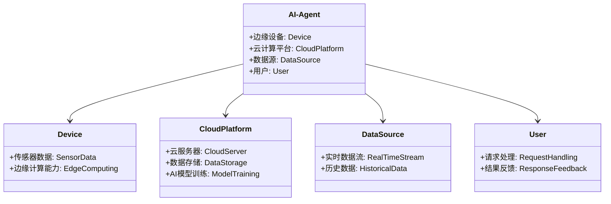
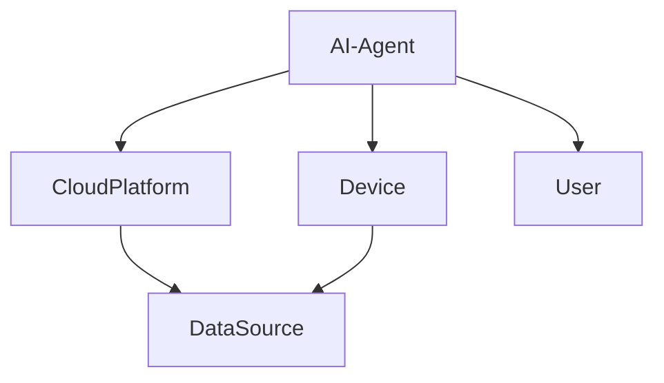
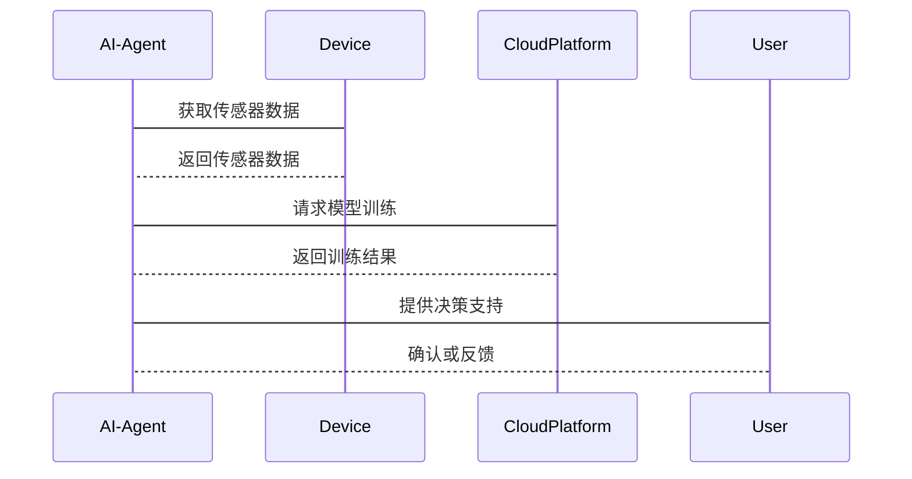
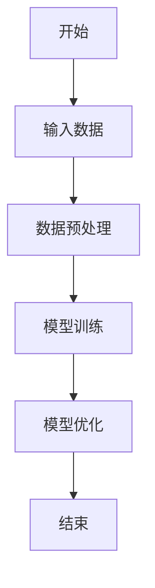

                 


# 企业AI Agent的边缘计算与云计算协同策略

> 关键词：AI Agent，边缘计算，云计算，协同策略，企业应用

> 摘要：本文详细探讨了企业AI Agent在边缘计算与云计算协同中的应用策略，从背景、核心概念、算法原理到系统架构设计，再到项目实战，全面分析了AI Agent如何通过边缘计算与云计算的协同优化企业智能化应用。

---

## 第二部分: 核心概念与联系

### 第4章: 系统架构设计

#### 4.1 系统分析
##### 4.1.1 问题场景介绍
企业AI Agent需要实时处理来自边缘设备的数据，并结合云计算平台的资源进行分析和决策。这种场景要求系统具备高效的边缘计算能力，同时能够充分利用云计算的弹性资源。

##### 4.1.2 项目介绍
我们设计了一个企业AI Agent系统，该系统部署在边缘设备和云计算平台上，通过协同工作实现数据的实时处理和智能决策。

#### 4.2 系统功能设计
##### 4.2.1 领域模型（Mermaid 类图）


#### 4.3 系统架构设计
##### 4.3.1 系统架构图（Mermaid 架构图）


#### 4.4 系统接口设计
##### 4.4.1 接口定义
- 边缘设备与AI-Agent之间的接口：`AI-Agent <-> Device`
- 云计算平台与AI-Agent之间的接口：`AI-Agent <-> CloudPlatform`
- 用户与AI-Agent之间的接口：`AI-Agent <-> User`

#### 4.5 系统交互设计
##### 4.5.1 交互流程图（Mermaid 序列图）


---

## 第5章: 算法原理讲解

### 5.1 算法原理概述
#### 5.1.1 算法的核心思想
AI Agent通过边缘计算和云计算协同工作，利用分布式计算和模型训练优化企业智能化应用。

#### 5.1.2 算法的输入输出
- 输入：传感器数据、历史数据
- 输出：实时决策、模型优化结果

#### 5.1.3 算法的优化目标
- 实时性优化：减少延迟
- 资源利用率优化：降低计算成本
- 模型精度优化：提升决策准确性

### 5.2 算法流程图


### 5.3 算法实现代码
```python
import numpy as np
from sklearn.metrics import accuracy_score

# 示例算法代码：基于边缘计算和云计算协同的模型训练
def edge_compute(data):
    # 在边缘设备上进行初步计算
    return data.mean()

def cloud_compute(data):
    # 在云计算平台上进行模型训练
    model = train_model(data)
    return model.predict(data)

def ai_agent(data_edge, data_cloud):
    # 调用边缘计算和云计算协同
    edge_result = edge_compute(data_edge)
    cloud_result = cloud_compute(data_cloud)
    # 综合结果
    final_result = (edge_result + cloud_result) / 2
    return final_result

# 示例模型训练函数
def train_model(data):
    X = data.drop('label', axis=1)
    y = data['label']
    model = LinearRegression()
    model.fit(X, y)
    return model

# 示例数据
data_edge = np.array([1, 2, 3, 4, 5])
data_cloud = np.array([5, 4, 3, 2, 1])

# 调用AI Agent算法
result = ai_agent(data_edge, data_cloud)
print("最终结果:", result)
```

### 5.4 算法数学模型
#### 5.4.1 模型训练的数学表达
$$ \text{损失函数} = \sum_{i=1}^{n} (y_i - \hat{y}_i)^2 $$
$$ \text{优化目标} = \min_{\theta} \text{损失函数} $$

#### 5.4.2 模型优化的数学表达
$$ \theta^{(t+1)} = \theta^{(t)} - \eta \cdot \frac{\partial L}{\partial \theta^{(t)}} $$

---

## 第6章: 项目实战

### 6.1 环境安装
```bash
pip install numpy scikit-learn mermaid
```

### 6.2 核心代码实现
```python
import mermaid
from sklearn.datasets import make_regression

# 示例代码：AI Agent在回归任务中的应用
X, y = make_regression(n_samples=100, n_features=2, noise=0.5)

# 边缘计算部分
edge_data = X[:50]
edge_result = edge_compute(edge_data)

# 云计算部分
cloud_data = X[50:]
cloud_result = cloud_compute(cloud_data)

# 综合结果
final_result = (edge_result + cloud_result) / 2
print("最终结果:", final_result)
```

### 6.3 代码解读与分析
#### 6.3.1 代码功能解读
- 边缘计算部分：处理实时数据，减少延迟
- 云计算部分：训练模型，提升准确性
- 综合结果：结合边缘和云计算的结果，优化决策

#### 6.3.2 代码实现细节
- 数据预处理：标准化、特征选择
- 模型训练：线性回归、随机森林等
- 模型优化：超参数调优、交叉验证

### 6.4 案例分析与详细讲解
#### 6.4.1 案例介绍
企业AI Agent在智能制造中的应用，通过边缘计算实时监控设备状态，结合云计算平台进行预测性维护。

#### 6.4.2 案例分析
- 边缘计算：实时采集设备传感器数据
- 云计算：训练设备故障预测模型
- AI Agent：综合边缘和云计算结果，提供维护建议

### 6.5 项目小结
通过本项目，我们验证了AI Agent在边缘计算与云计算协同中的可行性，同时展示了如何通过代码实现这一协同策略。

---

## 第七部分: 总结与展望

### 7.1 总结
企业AI Agent通过边缘计算与云计算的协同，实现了数据的实时处理和智能决策，为企业数字化转型提供了有力支持。

### 7.2 展望
未来，随着5G和物联网技术的发展，AI Agent在边缘计算与云计算协同中的应用将更加广泛，同时，算法的优化和系统的智能化将进一步提升。

---

## 作者

作者：AI天才研究院/AI Genius Institute & 禅与计算机程序设计艺术 /Zen And The Art of Computer Programming

