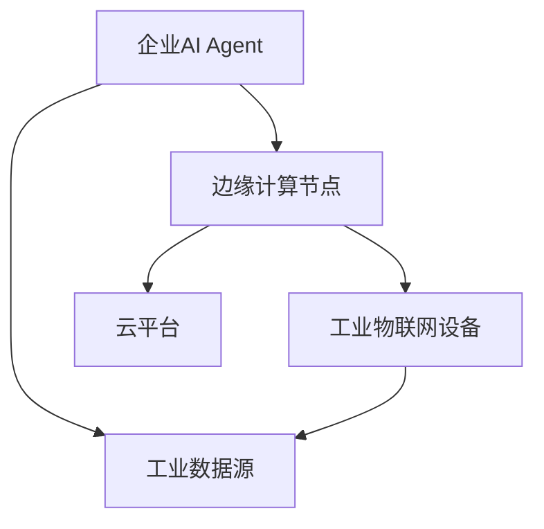
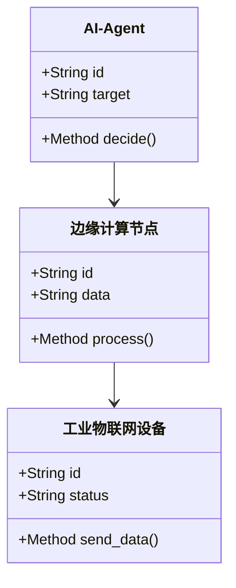

                 


# 企业AI Agent的边缘计算在工业物联网中的实践

## 关键词：企业AI Agent，边缘计算，工业物联网，算法原理，系统架构，项目实战

## 摘要

本文详细探讨了企业AI Agent在边缘计算环境下的工业物联网中的实践应用。通过分析AI Agent与边缘计算的结合背景、核心概念、算法原理、系统架构，以及实际项目案例，本文为企业在工业智能化转型中提供了理论支持和实践指导。

---

# 第一部分：企业AI Agent与边缘计算的结合背景

## 第1章：企业AI Agent与边缘计算概述

### 1.1 企业AI Agent的基本概念

#### 1.1.1 AI Agent的定义与特点
AI Agent（人工智能代理）是指能够感知环境、自主决策并执行任务的智能实体。其特点包括：
1. **自主性**：能够独立决策和行动。
2. **反应性**：能够实时感知环境并做出反应。
3. **目标导向**：以实现特定目标为导向。

#### 1.1.2 企业AI Agent的核心功能
1. **数据处理**：从环境中获取数据并进行分析。
2. **决策制定**：基于数据做出最优决策。
3. **任务执行**：通过执行器完成任务。

#### 1.1.3 AI Agent与传统自动化系统的区别
AI Agent具备学习和适应能力，能够处理复杂和不确定的环境，而传统自动化系统通常基于固定的规则运行。

---

### 1.2 边缘计算的基本概念

#### 1.2.1 边缘计算的定义与特点
边缘计算是指在靠近数据源的地方进行数据处理和分析，其特点包括：
1. **低延迟**：减少数据传输到云端的时间。
2. **高实时性**：能够快速响应实时事件。
3. **分布式架构**：数据处理分布在多个边缘节点。

#### 1.2.2 边缘计算的优势与应用场景
1. **优势**：
   - 降低带宽消耗。
   - 提高数据处理速度。
   - 提高系统的容错性。
2. **应用场景**：
   - 工业自动化控制。
   - 智慧城市。
   - 智能家居。

#### 1.2.3 边缘计算与云计算的关系
边缘计算与云计算相辅相成，边缘计算处理实时性和局部性问题，而云计算处理大规模数据存储和计算。

---

### 1.3 工业物联网的基本概念

#### 1.3.1 工业物联网的定义与特点
工业物联网（IIoT）是指将传感器、设备和系统连接到互联网，实现数据的实时采集、传输和分析。其特点包括：
1. **数据驱动**：依赖数据进行决策。
2. **互联互通**：设备之间的互联和数据共享。
3. **智能化**：通过数据分析实现智能化控制。

#### 1.3.2 工业物联网的核心组成部分
1. **传感器**：数据采集。
2. **边缘计算节点**：数据处理和分析。
3. **云平台**：数据存储和应用服务。

#### 1.3.3 工业物联网的应用场景
1. **设备监控与维护**：实时监控设备状态，预测性维护。
2. **生产优化**：优化生产流程，提高效率。
3. **质量控制**：实时监控产品质量。

---

## 第2章：企业AI Agent与边缘计算的结合背景

### 2.1 工业智能化的驱动因素

#### 2.1.1 工业智能化的定义与目标
工业智能化是指通过人工智能、大数据等技术，实现工业生产的智能化和自动化。其目标是提高生产效率、降低成本、优化资源利用。

#### 2.1.2 数字化转型对企业的影响
数字化转型推动企业从传统模式向智能化、数据驱动的模式转变，提升企业的竞争力。

#### 2.1.3 AI技术在工业领域的应用趋势
AI技术在工业领域的应用趋势包括：
1. **智能化监控**：实时监控设备状态。
2. **预测性维护**：基于历史数据预测设备故障。
3. **优化决策**：基于数据分析优化生产流程。

---

### 2.2 边缘计算在工业物联网中的作用

#### 2.2.1 边缘计算在工业实时性中的优势
边缘计算能够快速响应实时事件，减少延迟，提高系统的实时性。

#### 2.2.2 边缘计算在工业数据处理中的作用
边缘计算能够处理海量数据，减少数据传输到云端的带宽消耗。

#### 2.2.3 边缘计算对工业智能化的推动
边缘计算提供了实时数据处理能力，为工业智能化提供了技术支持。

---

### 2.3 企业AI Agent在工业物联网中的应用价值

#### 2.3.1 AI Agent在工业自动化中的应用
AI Agent能够自动监控和控制工业设备，实现自动化生产。

#### 2.3.2 AI Agent在工业预测性维护中的作用
AI Agent能够基于历史数据预测设备故障，提前进行维护，避免生产中断。

#### 2.3.3 AI Agent在工业优化决策中的价值
AI Agent能够基于数据分析优化生产流程，降低成本，提高效率。

---

## 第3章：企业AI Agent与边缘计算的核心概念与联系

### 3.1 核心概念原理

#### 3.1.1 AI Agent的决策机制
AI Agent通过感知环境、分析数据、制定决策并执行任务。

#### 3.1.2 边缘计算的数据处理流程
边缘计算节点接收数据，进行处理和分析，将结果反馈给设备或云端。

#### 3.1.3 工业物联网的系统架构
工业物联网的系统架构包括设备层、边缘层和云端，各层协同工作。

---

### 3.2 核心概念对比分析

#### 3.2.1 AI Agent与边缘计算的功能对比
| 功能 | AI Agent | 边缘计算 |
|------|-----------|----------|
| 数据处理 | 数据分析和决策 | 数据采集、处理和存储 |
| 任务执行 | 自动执行任务 | 执行数据处理和反馈 |

#### 3.2.2 边缘计算与工业物联网的协同关系
边缘计算为工业物联网提供数据处理能力，工业物联网为边缘计算提供数据源。

#### 3.2.3 企业AI Agent在不同场景中的应用对比
| 场景 | AI Agent | 边缘计算 |
|------|-----------|----------|
| 设备监控 | 数据分析和监控 | 数据采集和处理 |
| 预测性维护 | 故障预测和决策 | 数据处理和反馈 |

---

### 3.3 ER实体关系图



---

## 第4章：企业AI Agent与边缘计算的算法原理

### 4.1 强化学习算法在AI Agent中的应用

#### 4.1.1 强化学习的基本原理
强化学习是一种通过试错机制，学习最优策略的算法。其基本原理包括：
1. **状态（State）**：环境的当前情况。
2. **动作（Action）**：AI Agent采取的动作。
3. **奖励（Reward）**：动作的结果反馈。

#### 4.1.2 强化学习在AI Agent中的应用
AI Agent通过强化学习不断优化决策策略，提高任务执行效率。

#### 4.1.3 强化学习的数学模型
$$ V(s) = \max_{a} [ r + V(s') ] $$
其中，$V(s)$ 表示状态 $s$ 的价值函数，$r$ 是奖励，$s'$ 是下一个状态。

---

### 4.2 边缘计算中的分布式算法

#### 4.2.1 分布式算法的基本原理
分布式算法是指在多个节点之间协调工作，完成特定任务的算法。其基本原理包括：
1. **通信**：节点之间通过消息传递进行协调。
2. **一致性**：确保所有节点的数据一致。

#### 4.2.2 分布式算法在边缘计算中的应用
边缘计算节点通过分布式算法实现数据同步和协调，提高系统的可靠性和性能。

#### 4.2.3 分布式算法的数学模型
$$ \text{一致性约束}：\forall i, j, V(i) = V(j) $$

---

## 第5章：企业AI Agent与边缘计算的系统架构设计

### 5.1 工业物联网的场景介绍

#### 5.1.1 工业生产场景
在工业生产中，AI Agent通过边缘计算节点实时监控设备状态，优化生产流程。

#### 5.1.2 设备维护场景
AI Agent通过边缘计算节点预测设备故障，提前进行维护，避免生产中断。

#### 5.1.3 生产优化场景
AI Agent通过边缘计算节点分析生产数据，优化资源分配，降低成本。

---

### 5.2 系统功能设计

#### 5.2.1 系统功能模块
1. **数据采集模块**：采集设备数据。
2. **数据处理模块**：对数据进行清洗和分析。
3. **决策模块**：基于数据分析结果制定决策。
4. **执行模块**：执行决策任务。

#### 5.2.2 系统功能设计的ER类图


---

## 第6章：企业AI Agent与边缘计算的项目实战

### 6.1 环境安装

#### 6.1.1 系统需求
1. **操作系统**：Linux或Windows。
2. **编程语言**：Python 3.8以上。
3. **框架**：TensorFlow、Keras。

#### 6.1.2 工具安装
1. **Python环境**：安装Anaconda。
2. **深度学习框架**：安装TensorFlow或PyTorch。

---

### 6.2 核心代码实现

#### 6.2.1 AI Agent的核心代码
```python
class AI-Agent:
    def __init__(self, id, target):
        self.id = id
        self.target = target
        self.data = None
    def decide(self):
        # 假设数据已经获取
        if self.data['status'] == 'normal':
            return 'continue'
        else:
            return 'stop'
```

#### 6.2.2 边缘计算节点的核心代码
```python
class Edge-Node:
    def __init__(self, id):
        self.id = id
        self.data = None
    def process(self):
        # 假设数据已经获取
        if self.data['value'] > threshold:
            return 'alarm'
        else:
            return 'normal'
```

---

### 6.3 案例分析与代码解读

#### 6.3.1 案例分析
在工业生产中，AI Agent通过边缘计算节点实时监控设备状态，预测设备故障，优化生产流程。

#### 6.3.2 代码解读
AI Agent和边缘计算节点通过通信模块进行数据交互，AI Agent基于数据做出决策，边缘计算节点执行决策任务。

---

## 第7章：总结与展望

### 7.1 总结
本文详细探讨了企业AI Agent在边缘计算环境下的工业物联网中的实践应用，分析了核心概念、算法原理和系统架构，并通过实际案例展示了技术的实现和应用价值。

### 7.2 展望
未来，随着AI技术的不断发展，企业AI Agent与边缘计算的结合将在工业物联网中发挥更大的作用，推动工业智能化的进一步发展。

---

## 作者：AI天才研究院/AI Genius Institute & 禅与计算机程序设计艺术 /Zen And The Art of Computer Programming

