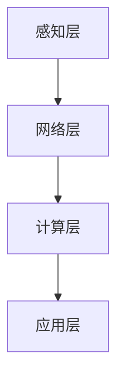
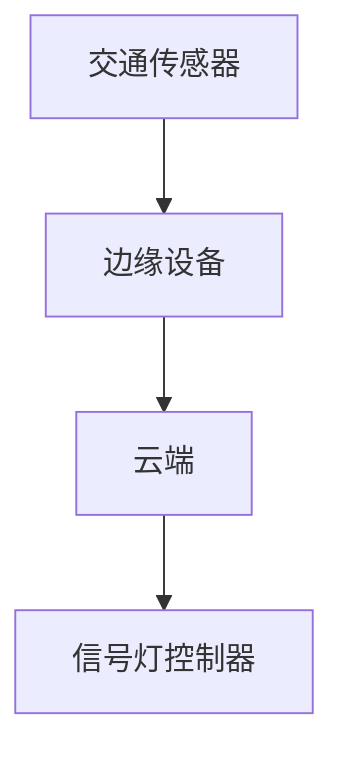

                 


# 企业AI Agent的边缘计算在物联网场景中的低延迟决策实践

## 关键词：企业AI Agent，边缘计算，物联网，低延迟决策，算法优化

## 摘要

随着物联网技术的快速发展，企业AI Agent与边缘计算的结合成为实现低延迟决策的关键。本文详细探讨了企业AI Agent的核心概念、算法原理及其在边缘计算中的应用，通过实际案例展示了如何在物联网场景中实现高效的低延迟决策。文章从理论到实践，系统分析了相关技术，并提供了最佳实践和未来发展方向。

---

## 第1章: 企业AI Agent的背景与概念

### 1.1 什么是企业AI Agent

企业AI Agent是一种智能实体，能够感知环境、自主决策并执行任务。它结合了人工智能和自动化技术，广泛应用于企业资源管理、数据分析和智能决策等领域。企业AI Agent的核心功能包括感知、推理、规划和执行，能够适应动态变化的环境。

### 1.2 边缘计算的基本概念

边缘计算是一种分布式计算范式，将数据处理和存储功能从云端转移到靠近数据源的边缘设备。它通过减少数据传输延迟，提高了系统的实时性和响应速度。边缘计算在物联网中的应用尤为广泛，因为它能够直接处理传感器数据，减少对云端的依赖。

### 1.3 企业AI Agent与边缘计算的结合

企业AI Agent与边缘计算的结合实现了数据的实时处理和快速决策。边缘计算为AI Agent提供了低延迟的环境，使其能够在边缘设备上直接执行决策任务，而无需依赖云端。这种结合不仅提高了系统的效率，还增强了数据隐私和安全性。

---

## 第2章: 企业AI Agent的核心原理

### 2.1 AI Agent的决策机制

AI Agent的决策机制分为基于规则、基于模型和基于强化学习三种类型。基于规则的方法简单直接，适用于规则明确的场景；基于模型的方法通过构建模型进行推理，适用于复杂场景；基于强化学习的方法通过试错优化决策，适用于动态环境。

### 2.2 边缘计算中的低延迟优化

边缘计算通过本地数据处理和分布式计算，显著降低了延迟。低延迟优化技术包括数据压缩、本地缓存和任务卸载，能够有效减少数据传输和处理时间。

### 2.3 企业AI Agent与边缘计算的协同优化

企业AI Agent与边缘计算的协同优化通过资源分配、任务调度和数据共享实现。协同优化能够提高系统的整体性能，确保AI Agent在边缘设备上高效运行。

---

## 第3章: 企业AI Agent的算法原理

### 3.1 基于强化学习的决策算法

强化学习通过试错优化决策，适用于动态环境。算法通过状态、动作和奖励的循环，逐步优化决策策略。以下是一个简单的强化学习算法示例：

```python
class Agent:
    def __init__(self, state_space, action_space):
        self.state_space = state_space
        self.action_space = action_space
        # 初始化策略参数
        self.theta = np.random.randn(...)
    
    def act(self, state):
        # 根据策略选择动作
        return np.argmax(self.policy(state))
    
    def policy(self, state):
        # 策略函数
        return softmax(...)
```

### 3.2 轻量级模型在边缘计算中的应用

轻量级模型适合边缘设备的资源限制，通常采用简化神经网络结构。例如，使用MobileNet进行图像分类，能够在边缘设备上高效运行。

### 3.3 算法优化与性能提升

算法优化包括剪枝、量化和模型蒸馏，能够减少计算量和资源消耗。优化后的模型在边缘设备上运行效率更高，能够处理更多的数据和任务。

---

## 第4章: 系统分析与架构设计

### 4.1 系统架构设计

系统架构包括感知层、网络层、计算层和应用层。感知层负责数据采集，网络层进行数据传输，计算层处理数据，应用层执行决策。以下是系统架构图：



### 4.2 系统组件之间的关系

系统组件包括传感器、边缘设备、云端和用户终端。它们通过网络进行交互，实现数据的采集、处理和决策。

---

## 第5章: 项目实战

### 5.1 环境安装

需要安装Python、TensorFlow和Keras等工具。以下是安装命令：

```bash
pip install tensorflow==2.5.0 keras==2.5.0 numpy==1.21.0
```

### 5.2 代码实现

以下是基于强化学习的AI Agent代码示例：

```python
import numpy as np
import tensorflow as tf

# 定义状态空间和动作空间
state_space = 10
action_space = 4

# 定义策略网络
model = tf.keras.Sequential([
    tf.keras.layers.Dense(16, activation='relu', input_shape=(state_space,)),
    tf.keras.layers.Dense(action_space, activation='softmax')
])

# 定义强化学习算法
def reinforce(env, model, episodes=1000):
    optimizer = tf.keras.optimizers.Adam(learning_rate=0.001)
    for episode in range(episodes):
        state = env.reset()
        done = False
        while not done:
            # 选择动作
            action_probs = model.predict(np.array([state]))[0]
            action = np.random.choice(action_space, p=action_probs)
            
            # 执行动作
            next_state, reward, done, _ = env.step(action)
            
            # 计算损失并更新模型
            target = np.zeros(action_space)
            target[action] = reward
            loss = tf.keras.losses.sparse_categorical_crossentropy(target, action_probs)
            model.trainable_weights[0].assign(model.trainable_weights[0] - optimizer.lr * tf.gradients(loss, model.trainable_weights)[0])
            
            state = next_state
```

### 5.3 案例分析

以智能交通系统为例，AI Agent可以在边缘设备上实时处理交通数据，优化信号灯控制，提高交通效率。以下是系统架构图：



---

## 第6章: 总结与展望

### 6.1 总结

企业AI Agent与边缘计算的结合在物联网场景中实现了低延迟决策，提高了系统的效率和性能。通过强化学习算法和轻量级模型的应用，能够在边缘设备上高效处理数据，满足实时决策的需求。

### 6.2 展望

未来，随着边缘计算和AI技术的进一步发展，企业AI Agent将在更多领域得到应用，如智能制造、智慧城市和医疗健康。同时，算法优化和系统架构的创新将推动低延迟决策技术的进一步提升。

---

## 作者：AI天才研究院/AI Genius Institute & 禅与计算机程序设计艺术 /Zen And The Art of Computer Programming

