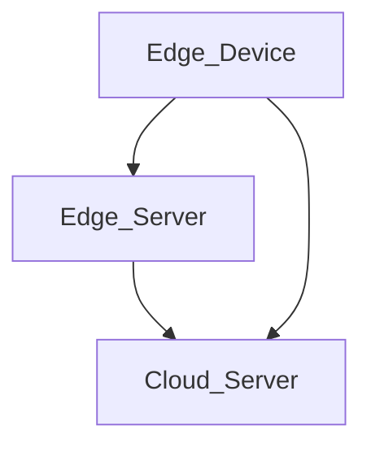
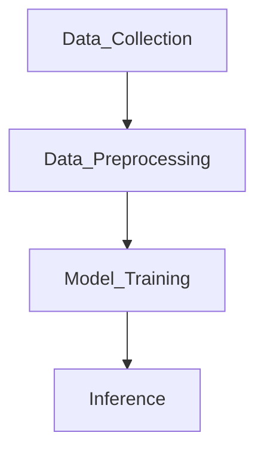

                 


# 企业AI Agent的边缘计算在物联网场景中的实践

> 关键词：AI Agent、边缘计算、物联网、系统架构、智能制造

> 摘要：本文深入探讨了企业AI Agent在边缘计算中的应用，结合物联网场景，分析了其核心原理、系统架构、算法实现及实际案例，为读者提供全面的技术指导。

---

## 第1章: 企业AI Agent的概述

### 1.1 AI Agent的基本概念

#### 1.1.1 AI Agent的定义与特点

AI Agent（人工智能代理）是一种能够感知环境、自主决策并执行任务的智能实体。它具备以下特点：

- **自主性**：能够在没有外部干预的情况下独立运行。
- **反应性**：能够实时感知环境变化并做出反应。
- **目标导向性**：基于目标驱动行为，优化决策过程。
- **学习能力**：通过数据和经验不断优化自身性能。

#### 1.1.2 AI Agent的核心功能与作用

AI Agent的核心功能包括数据采集、分析、决策和执行。它在企业中的主要作用是优化业务流程、提升决策效率、降低运营成本。

#### 1.1.3 企业级AI Agent的应用场景

AI Agent在企业中的应用场景广泛，包括智能制造、智慧城市、医疗健康和农业物联网等领域。例如，在智能制造中，AI Agent可以用于设备监控和预测性维护。

---

### 1.2 边缘计算的基本概念

#### 1.2.1 边缘计算的定义与特点

边缘计算是在靠近数据源的地方进行数据处理和分析，具有低延迟、高实时性和资源受限的特点。它通常在边缘设备上运行，如传感器、摄像头等。

#### 1.2.2 边缘计算与物联网的关系

边缘计算为物联网提供了高效的数据处理方式，能够减少云端依赖，提升数据传输效率和安全性。

---

## 第2章: 边缘计算的架构与AI Agent的核心原理

### 2.1 边缘计算的体系结构

边缘计算的体系结构包括边缘设备、边缘服务器和云端。数据在边缘设备上进行初步处理，然后传输到边缘服务器或云端进行进一步分析。

### 2.2 AI Agent在边缘计算中的核心原理

AI Agent在边缘计算中的核心原理包括数据采集、预处理、模型训练和推理。边缘设备采集数据后，通过AI Agent进行分析和决策。

---

## 第3章: AI Agent在物联网中的应用场景

### 3.1 智能制造中的应用

在智能制造中，AI Agent可以用于设备监控、预测性维护和生产优化。例如，通过传感器数据实时监控生产线状态，预测设备故障并及时维护。

### 3.2 智慧城市中的应用

在智慧城市中，AI Agent可以用于交通管理、环境监测和公共安全。例如，通过实时监测交通流量，优化信号灯控制，减少拥堵。

### 3.3 智能家居中的应用

在智能家居中，AI Agent可以用于设备联动和场景切换。例如，通过语音指令控制家庭设备，实现智能场景切换。

---

## 第4章: 系统设计与实现

### 4.1 系统架构设计

系统架构设计包括边缘设备、边缘服务器和云端的交互流程。使用Mermaid图展示系统架构。



### 4.2 功能模块设计

功能模块包括数据采集、数据预处理、模型训练和推理。使用Mermaid图展示功能模块。



### 4.3 算法实现

在智能制造场景中，使用机器学习模型进行设备状态预测。数学模型如下：

$$ y = \beta_0 + \beta_1x_1 + \beta_2x_2 + \epsilon $$

其中，$y$ 表示设备状态，$x_1$ 和 $x_2$ 是输入特征，$\epsilon$ 是误差项。

### 4.4 系统实现步骤

1. 环境搭建：安装Python、TensorFlow等工具。
2. 数据采集：使用传感器采集设备数据。
3. 数据预处理：清洗和归一化数据。
4. 模型训练：训练机器学习模型。
5. 模型推理：部署模型到边缘设备。

---

## 第5章: 项目实战

### 5.1 项目介绍

以智能制造场景为例，设计一个AI Agent系统，用于设备状态监测和预测性维护。

### 5.2 环境搭建

安装必要的库：

```bash
pip install numpy pandas tensorflow scikit-learn
```

### 5.3 系统核心实现源代码

以下是Python代码示例：

```python
import numpy as np
from sklearn.model_selection import train_test_split
from tensorflow.keras.models import Sequential
from tensorflow.keras.layers import Dense

# 数据预处理
data = np.random.randn(100, 2)
labels = np.random.randint(0, 2, 100)

X_train, X_test, y_train, y_test = train_test_split(data, labels, test_size=0.2)

# 模型训练
model = Sequential()
model.add(Dense(4, input_dim=2, activation='relu'))
model.add(Dense(1, activation='sigmoid'))
model.compile(loss='binary_crossentropy', optimizer='adam', metrics=['accuracy'])
model.fit(X_train, y_train, epochs=10, batch_size=10)

# 模型推理
y_pred = model.predict(X_test)
```

### 5.4 实际案例分析

通过训练好的模型，预测设备状态。例如，输入特征向量，模型输出设备状态。

### 5.5 项目小结

本项目展示了如何在智能制造场景中应用AI Agent进行设备状态监测和预测性维护。

---

## 第6章: 总结与展望

### 6.1 全文总结

本文深入探讨了企业AI Agent在边缘计算中的应用，分析了其核心原理和系统架构，并通过实际案例展示了其在智能制造中的应用。

### 6.2 未来展望

未来，AI Agent在边缘计算中的应用将更加广泛，特别是在实时性和资源优化方面。

---

## 作者：AI天才研究院 & 禅与计算机程序设计艺术

---

**本文内容仅供参考，具体实现需根据实际情况调整。**

