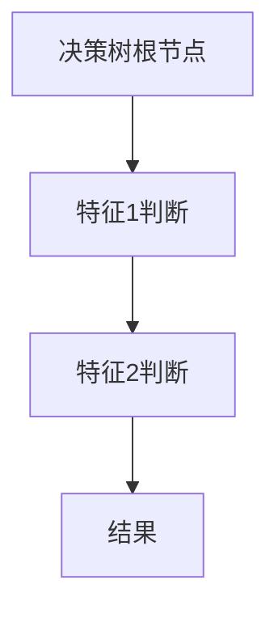
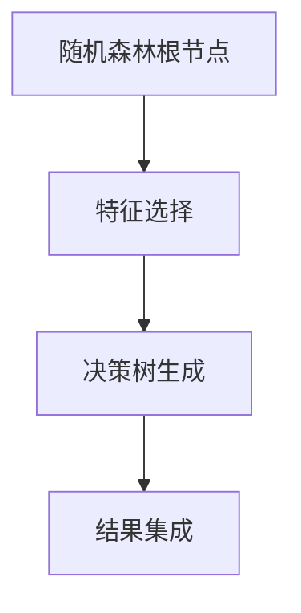
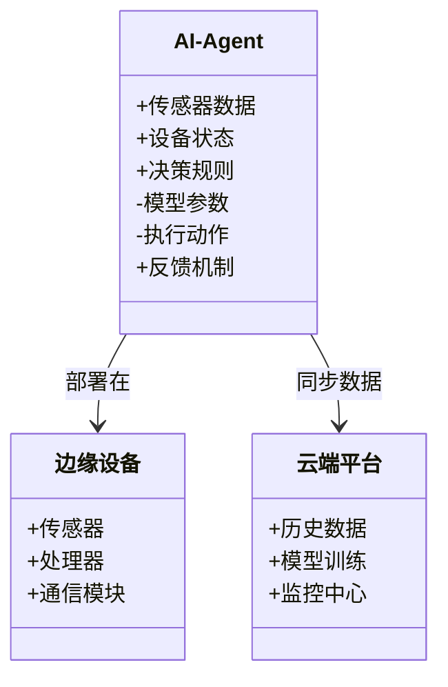
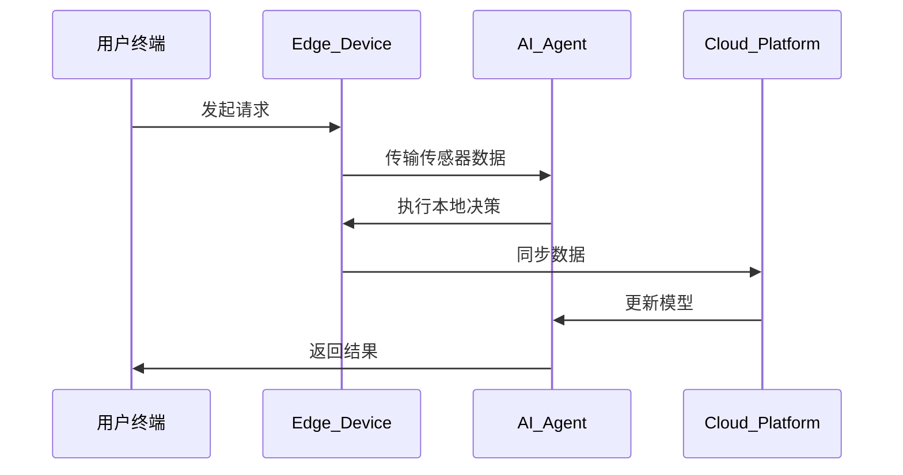

                 


# 企业AI Agent的边缘计算在物联网实时决策中的实践

## 关键词：企业AI Agent，边缘计算，物联网，实时决策，分布式系统，AI算法

## 摘要：  
本文深入探讨了企业AI Agent在边缘计算环境下的实时决策应用，重点分析了AI Agent、边缘计算和物联网的核心概念及其相互关系。通过详细讲解决策树、随机森林等算法原理，结合实际案例，展示了如何在边缘计算环境下实现高效的物联网实时决策。文章还提供了系统架构设计和项目实战指南，帮助读者全面理解并掌握相关技术。

---

# 第1章: 企业AI Agent的边缘计算与物联网概述

## 1.1 问题背景与描述  
### 1.1.1 物联网实时决策的挑战  
物联网系统面临海量数据实时处理的挑战，传统的云端集中式决策模式存在延迟高、带宽消耗大等问题。边缘计算通过将计算能力推送到靠近数据源的边缘设备，显著降低了延迟和带宽消耗。AI Agent作为智能决策的核心，能够在边缘设备上实时分析数据并做出决策。  

### 1.1.2 边缘计算在物联网中的作用  
边缘计算通过在边缘设备上进行数据预处理、模型推理和决策，减少了对云端的依赖，提高了系统的实时性和可靠性。在工业物联网、智慧城市等领域，边缘计算能够实现本地化的快速响应，例如设备故障预测、环境监测等。  

### 1.1.3 AI Agent在实时决策中的价值  
AI Agent（智能体）是一种能够感知环境、自主决策并采取行动的智能系统。在物联网实时决策中，AI Agent能够通过边缘计算能力，快速处理传感器数据，结合上下文信息，做出最优决策，并通过反馈机制不断优化自身行为。  

## 1.2 问题解决与边界  
### 1.2.1 边缘计算如何解决实时性问题  
边缘计算将数据处理和决策能力从云端推向边缘，显著降低了数据传输的延迟，使得实时决策成为可能。例如，在自动驾驶汽车中，边缘计算可以在毫秒级别完成环境感知和路径规划，而无需依赖云端。  

### 1.2.2 AI Agent在边缘计算中的应用边界  
AI Agent的应用边界包括：  
1. 数据处理范围：AI Agent只能处理边缘设备产生的数据，无法直接处理云端数据。  
2. 决策权限：AI Agent的决策权限受限于系统设计，例如设备级或局部区域的决策。  
3. 系统复杂性：AI Agent在边缘计算中的应用需要考虑设备资源限制、网络条件等外部因素。  

### 1.2.3 物联网实时决策的场景外延  
物联网实时决策的应用场景包括：工业自动化、智能交通、智能电网、智能家居等。通过边缘计算和AI Agent的结合，这些场景可以实现更高效的实时决策。  

## 1.3 核心概念与结构  
### 1.3.1 AI Agent的基本概念  
AI Agent是一种能够感知环境、自主决策并采取行动的智能实体。在物联网实时决策中，AI Agent通常部署在边缘设备上，负责数据处理、模型推理和决策执行。  

### 1.3.2 边缘计算的核心要素  
边缘计算的核心要素包括：  
1. 边缘设备：传感器、网关等硬件设备。  
2. 边缘计算平台：提供计算资源和算法支持。  
3. 边缘与云端协同：边缘计算与云端数据和模型的交互。  

### 1.3.3 物联网实时决策的系统架构  
物联网实时决策的系统架构通常包括：传感器、边缘设备、云端平台和用户终端。AI Agent在边缘设备上运行，负责实时数据处理和决策，与云端平台协同工作。  

## 1.4 本章小结  
本章介绍了企业AI Agent在边缘计算和物联网中的应用背景，分析了边缘计算在物联网实时决策中的作用，以及AI Agent的核心价值。通过定义问题解决边界，明确了AI Agent在边缘计算中的应用范围和场景。

---

# 第2章: AI Agent、边缘计算与物联网的关系

## 2.1 核心概念原理  
### 2.1.1 AI Agent的决策机制  
AI Agent通过感知环境、分析数据、制定策略和执行行动来实现决策。在边缘计算环境中，AI Agent能够快速响应本地数据，减少对云端的依赖。  

### 2.1.2 边缘计算的分布式架构  
边缘计算采用分布式架构，将计算能力推送到靠近数据源的位置。这种架构使得AI Agent能够高效地处理实时数据，并在本地做出决策。  

### 2.1.3 物联网实时决策的数据流模型  
物联网实时决策的数据流模型包括数据采集、预处理、模型推理、决策执行和反馈优化五个阶段。AI Agent在边缘设备上负责数据处理和决策，与云端平台协同工作。  

## 2.2 概念属性特征对比  
以下是AI Agent、边缘计算和物联网的核心属性特征对比：  

| **概念** | **核心属性**       | **特征描述**                                                                 |
|----------|--------------------|-----------------------------------------------------------------------------|
| AI Agent | 智能决策能力       | 能够自主感知环境、分析数据并做出决策。                                       |
| 边缘计算 | 分布式架构         | 计算能力分布在靠近数据源的位置，减少延迟和带宽消耗。                         |
| 物联网   | 实时数据流         | 数据采集、传输、处理和决策的实时性要求。                                     |

## 2.3 ER实体关系图  
以下是AI Agent、边缘计算和物联网的实体关系图：  

```mermaid
er
    actor: 用户
    agent: AI Agent
    device: 物联网设备
    edge: 边缘计算节点
    cloud: 云端服务
    actor --> agent: 请求处理
    agent --> device: 设备控制
    device --> edge: 数据上传
    edge --> cloud: 数据同步
```

## 2.4 本章小结  
本章分析了AI Agent、边缘计算和物联网的核心概念及其相互关系，通过对比和实体关系图，明确了它们在实时决策中的协同作用。

---

# 第3章: AI Agent的决策算法原理

## 3.1 算法原理讲解  
### 3.1.1 决策树算法  
决策树是一种常用的分类和回归算法，适用于物联网实时决策中的分类任务。以下是决策树算法的流程图：  



以下是决策树算法的Python实现示例：  

```python
from sklearn.tree import DecisionTreeClassifier
import numpy as np

# 示例数据
X = np.array([[2, 3], [5, 7], [6, 8], [1, 2]])
y = np.array([0, 1, 1, 0])

# 训练模型
model = DecisionTreeClassifier()
model.fit(X, y)

# 预测
new_data = np.array([[4, 5]])
print(model.predict(new_data))
```

### 3.1.2 随机森林算法  
随机森林是一种基于决策树的集成算法，适用于物联网实时决策中的复杂场景。以下是随机森林算法的流程图：  



以下是随机森林算法的Python实现示例：  

```python
from sklearn.ensemble import RandomForestClassifier
import numpy as np

# 示例数据
X = np.array([[2, 3], [5, 7], [6, 8], [1, 2]])
y = np.array([0, 1, 1, 0])

# 训练模型
model = RandomForestClassifier(n_estimators=10, random_state=42)
model.fit(X, y)

# 预测
new_data = np.array([[4, 5]])
print(model.predict(new_data))
```

### 3.1.3 算法数学模型  
以下是决策树和随机森林算法的数学模型：  

#### 决策树算法  
决策树的分裂标准通常采用信息增益（ID3/C4.5）或基尼指数（CART）：  

$$ \text{信息增益} = H(y) - H(y|x) $$  

$$ \text{基尼指数} = \sum_{k=1}^{K} p_k(1 - p_k) $$  

#### 随机森林算法  
随机森林通过随机采样特征和样本，生成多个决策树，并通过投票或平均的方式得出最终结果。其数学表达式如下：  

$$ y_{\text{pred}} = \text{多数投票}(\{y_1, y_2, \dots, y_n\}) $$  

## 3.2 本章小结  
本章详细讲解了AI Agent在边缘计算中的决策算法原理，包括决策树和随机森林算法的实现和数学模型，帮助读者理解AI Agent如何在物联网实时决策中做出最优选择。

---

# 第4章: 系统分析与架构设计方案

## 4.1 问题场景介绍  
以工业物联网为例，假设一家制造企业希望通过边缘计算实现设备实时监控和故障预测。系统需要实时采集设备传感器数据，并通过AI Agent在边缘设备上进行分析和决策。  

## 4.2 系统功能设计  
以下是系统功能设计的领域模型类图：  



## 4.3 系统架构设计  
以下是系统架构设计的架构图：  

```mermaid
graph TD
    Edge_Device[边缘设备] --> AI_Agent[AI Agent]
    AI_Agent --> Cloud_Platform[云端平台]
    Edge_Device --> Cloud_Platform: 数据同步
    Cloud_Platform --> AI_Agent: 模型更新
```

## 4.4 系统接口设计  
系统接口设计包括：  
1. 边缘设备与AI Agent的通信接口。  
2. AI Agent与云端平台的数据同步接口。  
3. 用户终端与云端平台的监控接口。  

## 4.5 系统交互流程  
以下是系统交互流程的序列图：  



## 4.6 本章小结  
本章通过工业物联网的案例，详细分析了系统功能设计、架构设计和交互流程，展示了AI Agent在边缘计算中的实际应用。

---

# 第5章: 项目实战

## 5.1 环境安装与配置  
以下是项目实战的环境安装步骤：  
1. 安装Python和相关库：`pip install numpy scikit-learn`。  
2. 安装边缘计算框架：例如，使用Kaa IoT框架。  
3. 配置物联网设备：例如，使用Raspberry Pi和传感器模块。  

## 5.2 系统核心实现  
以下是AI Agent的核心代码实现：  

```python
from sklearn.ensemble import RandomForestClassifier
import paho.mqtt.client as mqtt

# 示例代码：AI Agent订阅传感器数据并进行预测
class AI_Agent:
    def __init__(self):
        self.model = RandomForestClassifier(n_estimators=10, random_state=42)
        self.model.fit(X_train, y_train)
    
    def on_message(self, client, userdata, message):
        data = message.payload.decode()
        prediction = self.model.predict(data)
        print(f"预测结果: {prediction}")
    
    def start(self):
        self.mqtt_client = mqtt.Client()
        self.mqtt_client.on_message = self.on_message
        self.mqtt_client.connect("localhost", 1883)
        self.mqtt_client.subscribe("sensor/data")
        self.mqtt_client.loop_start()

if __name__ == "__main__":
    agent = AI_Agent()
    agent.start()
```

## 5.3 代码解读与分析  
以上代码实现了AI Agent在边缘设备上订阅传感器数据、进行预测并输出结果。代码的关键部分包括：  
1. 模型训练与加载。  
2. MQTT协议的通信接口。  
3. 数据处理与预测逻辑。  

## 5.4 实际案例分析  
以智能家居为例，AI Agent可以通过边缘设备实时监测室内温度、湿度等参数，并根据预设的决策规则自动调节空调或加湿器。以下是具体实现步骤：  
1. 数据采集：传感器采集环境数据并通过MQTT协议传输到边缘设备。  
2. 数据处理：AI Agent在边缘设备上接收数据并进行预处理。  
3. 模型推理：AI Agent调用随机森林模型进行预测，得出是否需要调节设备的结论。  
4. 执行动作：AI Agent通过设备API发送指令，调节空调或加湿器。  

## 5.5 本章小结  
本章通过实际案例，展示了AI Agent在边缘计算环境下的实现过程，包括环境配置、代码实现和案例分析。

---

# 第6章: 最佳实践、小结与展望

## 6.1 最佳实践  
1. **模型优化**：在边缘设备上部署轻量化模型，减少计算资源消耗。  
2. **数据隐私**：在边缘设备上处理敏感数据，保护数据隐私。  
3. **系统容错**：设计容错机制，确保AI Agent在边缘设备上的稳定运行。  

## 6.2 小结  
本文详细探讨了企业AI Agent在边缘计算环境下的实时决策应用，分析了AI Agent、边缘计算和物联网的核心概念及其相互关系。通过具体案例，展示了AI Agent在边缘计算中的实现过程和最佳实践。

## 6.3 展望  
未来，随着边缘计算和AI技术的不断发展，AI Agent在物联网实时决策中的应用将更加广泛。结合5G、区块链等新兴技术，AI Agent有望实现更高效的实时决策和更智能的系统管理。

---

# 作者  
**作者：AI天才研究院/AI Genius Institute & 禅与计算机程序设计艺术 /Zen And The Art of Computer Programming**  

---

本文通过系统性的分析和实际案例，深入探讨了企业AI Agent在边缘计算环境下的实时决策应用。希望本文能够为相关领域的技术人员和研究人员提供有价值的参考和启示。

